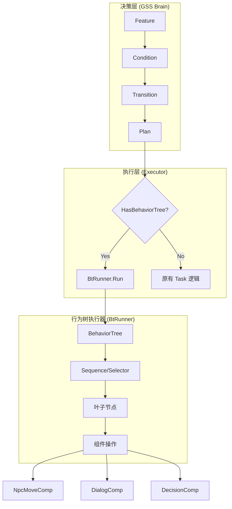
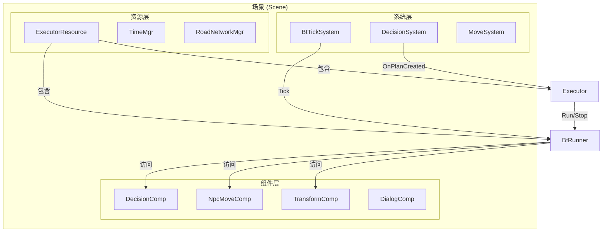
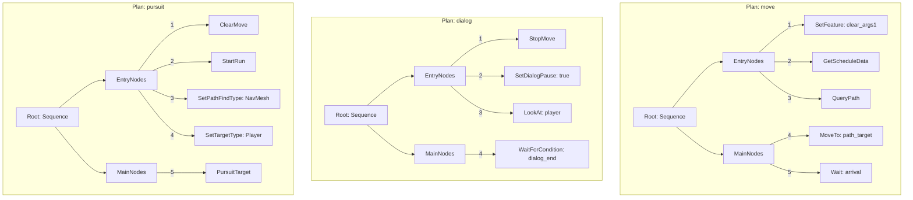
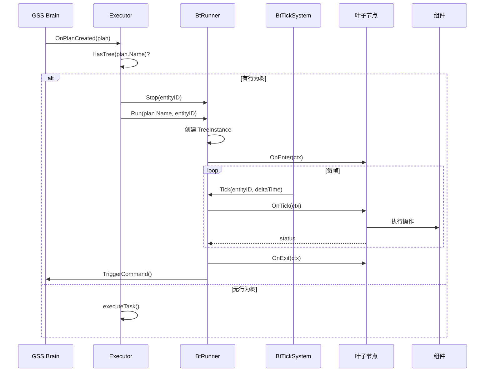
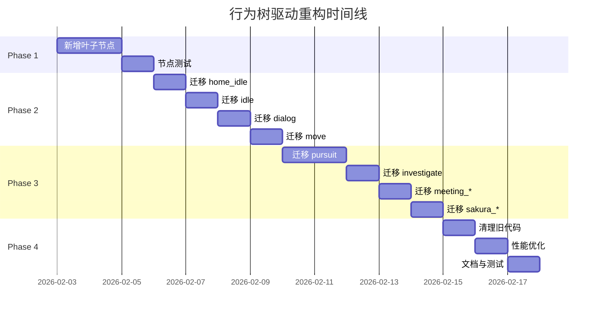
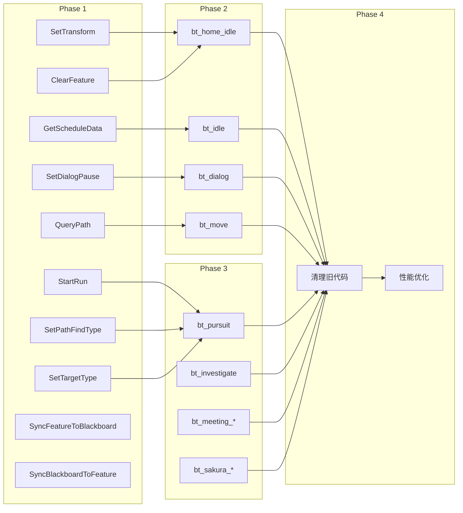

# 行为树驱动重构完整计划

## 一、背景与目标

### 1.1 当前问题

当前 AI 决策执行系统 (`executor.go`) 中存在大量硬编码逻辑：

| 类型 | 数量 | 说明 |
|------|------|------|
| Plan 类型 | 9 种 | idle, home_idle, move, dialog, meeting_idle, meeting_move, pursuit, investigate, sakura_npc_control |
| Task 类型 | 4 种 | Transition, GSSEnter, GSSExit, GSSMain |
| Feature 键 | 17 个 | feature_args1, feature_start_point, feature_end_point 等 |
| Handler 函数 | 24 个 | handleXxxEntryTask, handleXxxExitTask, handleXxxMainTask 等 |

**问题本质**：
1. 每个 Plan 的执行逻辑都是硬编码的 Go 函数
2. 复杂行为序列需要写大量代码
3. 行为调整需要改代码、重新编译
4. 难以扩展和维护

### 1.2 目标架构

### 1.3 重构目标

1. **渐进式迁移**：不破坏现有逻辑，可以选择性地将 Plan 迁移到行为树
2. **配置驱动**：复杂行为可通过 JSON 配置定义
3. **可扩展性**：新增节点类型简单，行为组合灵活
4. **可维护性**：行为逻辑集中、清晰、易于调试

---

## 二、目标架构详图

### 2.1 系统架构图

### 2.2 行为树结构图

### 2.3 数据流图

---

## 三、分阶段实施计划

### Phase 1: 新增叶子节点 (1-2 天)

**目标**：实现支持 executor.go 中所有操作的行为树节点

#### 任务清单

| 序号 | 任务 | 文件 | 优先级 | 依赖 |
|------|------|------|--------|------|
| 1.1 | SetTransform 节点 | `bt/nodes/set_transform.go` | P0 | - |
| 1.2 | ClearFeature 节点 | `bt/nodes/clear_feature.go` | P0 | - |
| 1.3 | StartRun 节点 | `bt/nodes/start_run.go` | P0 | - |
| 1.4 | SetPathFindType 节点 | `bt/nodes/set_pathfind_type.go` | P0 | - |
| 1.5 | SetTargetType 节点 | `bt/nodes/set_target_type.go` | P0 | - |
| 1.6 | QueryPath 节点 | `bt/nodes/query_path.go` | P1 | - |
| 1.7 | SetDialogPause 节点 | `bt/nodes/set_dialog_pause.go` | P1 | - |
| 1.8 | GetScheduleData 节点 | `bt/nodes/get_schedule_data.go` | P1 | - |
| 1.9 | SyncFeatureToBlackboard 节点 | `bt/nodes/sync_feature_bb.go` | P1 | - |
| 1.10 | SyncBlackboardToFeature 节点 | `bt/nodes/sync_bb_feature.go` | P1 | - |

#### 验收标准

- [ ] 所有节点实现 `IBtNode` 接口
- [ ] 所有节点有单元测试
- [ ] 节点工厂注册所有新节点
- [ ] `make build APPS='scene_server'` 编译通过

---

### Phase 2: 迁移简单 Plan (2-3 天)

**目标**：将简单的 Plan 迁移到行为树实现

#### 迁移顺序

| 序号 | Plan | 复杂度 | 迁移理由 |
|------|------|--------|----------|
| 2.1 | `home_idle` | 低 | 只有 SetTransform 和 Feature 操作 |
| 2.2 | `idle` | 低 | 类似 home_idle，增加日程读取 |
| 2.3 | `dialog` | 中 | Entry/Exit 对称，逻辑清晰 |
| 2.4 | `move` | 中 | 核心功能，寻路逻辑 |

#### 任务清单

| 序号 | 任务 | 说明 |
|------|------|------|
| 2.1.1 | 定义 `bt_home_idle` 行为树 | JSON 配置 + 代码注册 |
| 2.1.2 | 测试 home_idle 行为树 | 单元测试 + 集成测试 |
| 2.2.1 | 定义 `bt_idle` 行为树 | 包含日程读取 |
| 2.2.2 | 测试 idle 行为树 | - |
| 2.3.1 | 定义 `bt_dialog` 行为树 | 对话暂停/恢复 |
| 2.3.2 | 测试 dialog 行为树 | - |
| 2.4.1 | 定义 `bt_move` 行为树 | 路网寻路 |
| 2.4.2 | 测试 move 行为树 | - |

#### 验收标准

- [ ] 4 个简单 Plan 的行为树版本可用
- [ ] 原有 hardcode 函数仍然保留（回退）
- [ ] NPC 行为与原实现一致

---

### Phase 3: 迁移复杂 Plan (3-4 天)

**目标**：迁移包含复杂逻辑的 Plan

#### 迁移顺序

| 序号 | Plan | 复杂度 | 特殊逻辑 |
|------|------|--------|----------|
| 3.1 | `pursuit` | 高 | NavMesh 寻路 + 目标追踪 |
| 3.2 | `investigate` | 高 | 调查逻辑 + 警察组件 |
| 3.3 | `meeting_idle` | 中 | 会议位置 |
| 3.4 | `meeting_move` | 中 | 会议移动 |
| 3.5 | `sakura_npc_control` | 高 | 樱校控制 |

#### 任务清单

| 序号 | 任务 | 说明 |
|------|------|------|
| 3.1.1 | 定义 `bt_pursuit` 行为树 | NavMesh + 目标追踪 |
| 3.1.2 | 实现 PursuitTarget 节点 | 追逐目标专用节点 |
| 3.2.1 | 定义 `bt_investigate` 行为树 | 调查逻辑 |
| 3.3.1 | 定义 `bt_meeting_idle` 行为树 | - |
| 3.4.1 | 定义 `bt_meeting_move` 行为树 | - |
| 3.5.1 | 定义 `bt_sakura_npc_control` 行为树 | - |

#### 验收标准

- [ ] 所有 9 个 Plan 都有行为树版本
- [ ] 警察追逐逻辑正常
- [ ] 会议流程正常

---

### Phase 4: 清理与优化 (2 天)

**目标**：清理旧代码，优化性能

#### 任务清单

| 序号 | 任务 | 说明 |
|------|------|------|
| 4.1 | 移除旧的 handler 函数 | 标记为 deprecated 或删除 |
| 4.2 | 统一 Plan 执行入口 | 全部走行为树 |
| 4.3 | 性能优化 | 分帧处理、对象池 |
| 4.4 | 文档更新 | 更新 CLAUDE.md 和相关文档 |
| 4.5 | 完整测试 | 回归测试所有 Plan |

#### 验收标准

- [ ] executor.go 中 handler 函数减少 80%
- [ ] 100+ NPC 场景帧率无明显下降
- [ ] 文档完整

---

## 四、时间估算与依赖关系

### 4.1 总体时间线

### 4.2 依赖关系

### 4.3 风险与缓解

| 风险 | 影响 | 概率 | 缓解措施 |
|------|------|------|----------|
| 行为树与原逻辑不一致 | 高 | 中 | 详细对比测试，保留回退机制 |
| 性能下降 | 中 | 低 | 分帧处理，限制同时运行数 |
| Feature 同步问题 | 高 | 中 | 明确同步时机，添加日志 |
| 日程读取逻辑复杂 | 中 | 中 | GetScheduleData 节点封装 |

---

## 五、现有 Handler 映射表

### 5.1 Handler 函数与行为树节点映射

| Handler 函数 | Plan | 行为树节点序列 |
|--------------|------|----------------|
| `handleHomeIdleEntryTask` | home_idle | SetFeature(feature_out_timeout, true) -> SetTransform |
| `handleHomeIdleExitTask` | home_idle | ClearFeature(feature_knock_req) |
| `handleIdleEntryTask` | idle | GetScheduleData -> SetDialogTimeout -> SetTransform |
| `handleIdleExitTask` | idle | SetDialogFinishStamp(0) |
| `handleDialogEntryTask` | dialog | ClearDialogEventFeature -> SetDialogPause(true) -> SetDialogState("dialog") |
| `handleDialogExitTask` | dialog | ClearDialogEventFeature -> SetDialogPause(false) -> UpdateDialogTimeout |
| `handleMoveEntryTask` | move | CheckPathfindCompleted -> GetScheduleData -> QueryPath -> StartMove |
| `handleMoveExitTask` | move | StopMove |
| `handlePursuitEntryTask` | pursuit | ClearPath -> StartRun -> SetPathFindType(NavMesh) -> SetTargetEntity -> SetTargetType |
| `handlePursuitExitTask` | pursuit | StopMove -> SetPathFindType(None) -> SetTargetEntity(0) |
| `handleInvestigateEntryTask` | investigate | SetupNavMeshPath |
| `handleInvestigateExitTask` | investigate | SetInvestigatePlayer(0) -> ClearFeature(feature_release_wanted) -> ClearFeature(feature_pursuit_miss) |
| `handleMeetingIdleEntryTask` | meeting_idle | SetMeetingTransform |
| `handleMeetingMoveEntryTask` | meeting_move | GetMeetingEndPoint -> FindNearestPoint -> QueryPath -> SetPointList -> StartMove |
| `handleMeetingMoveExitTask` | meeting_move | StopMove |
| `handleSakuraNpcControlEntryTask` | sakura_npc_control | StopMove -> SetEventType(None) -> ClearSakuraFeatures |
| `handleSakuraNpcControlExitTask` | sakura_npc_control | StartMove -> SetEventType(None) -> ClearSakuraFeatures |

### 5.2 Feature 使用映射

| Feature Key | 使用位置 | 数据类型 | 说明 |
|-------------|----------|----------|------|
| `feature_out_timeout` | home_idle Entry | bool | 外出超时标记 |
| `feature_knock_req` | home_idle Exit | bool | 敲门请求 |
| `feature_args1` | move Entry | string | 通用参数（如 pathfind_completed） |
| `feature_start_point` | move Entry | int | 路径起点 |
| `feature_end_point` | move Entry | int | 路径终点 |
| `feature_pursuit_entity_id` | pursuit Entry | uint64 | 追逐目标实体 |
| `feature_release_wanted` | investigate Exit | bool | 释放通缉 |
| `feature_pursuit_miss` | investigate Exit | bool | 追逐丢失 |
| `feature_meeting_end_point` | meeting_move Entry | int | 会议终点 |
| `feature_sakura_npc_control_req` | sakura Entry/Exit | bool | 樱校控制请求 |
| `feature_sakura_npc_control_finish_req` | sakura Entry/Exit | bool | 樱校控制完成请求 |

---

## 六、相关文件清单

| 类型 | 路径 | 说明 |
|------|------|------|
| Executor | `servers/scene_server/internal/ecs/system/decision/executor.go` | 待重构核心文件 |
| BtRunner | `servers/scene_server/internal/common/ai/bt/runner/runner.go` | 行为树运行器 |
| BtContext | `servers/scene_server/internal/common/ai/bt/context/context.go` | 执行上下文 |
| 节点接口 | `servers/scene_server/internal/common/ai/bt/node/interface.go` | IBtNode 接口 |
| 节点工厂 | `servers/scene_server/internal/common/ai/bt/nodes/factory.go` | 节点创建工厂 |
| 基础节点 | `servers/scene_server/internal/common/ai/bt/nodes/*.go` | 已有叶子节点 |
| 配置加载 | `servers/scene_server/internal/common/ai/bt/config/loader.go` | JSON 配置加载 |
| 示例树 | `servers/scene_server/internal/common/ai/bt/trees/example_trees.go` | 行为树示例 |
| BtTickSystem | `servers/scene_server/internal/ecs/system/decision/bt_tick_system.go` | Tick 系统 |
| ExecutorResource | `servers/scene_server/internal/ecs/system/decision/executor_resource.go` | 资源封装 |
