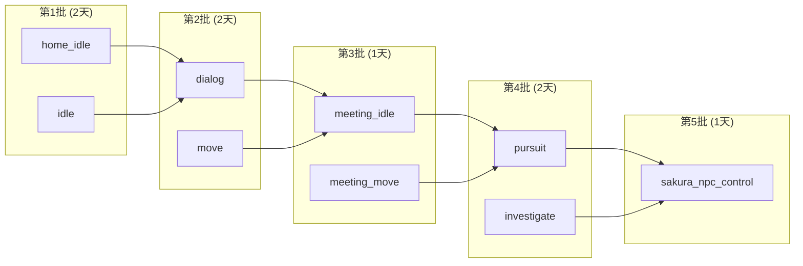
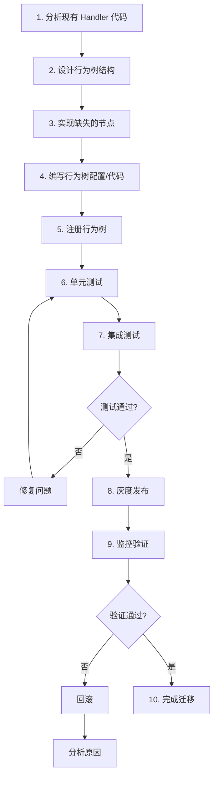
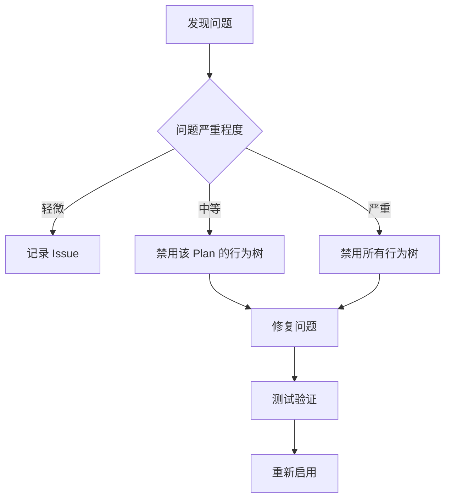

# 行为树迁移策略文档

## 一、概述

本文档描述将 executor.go 中的硬编码 Plan 执行逻辑迁移到行为树驱动的策略。

### 迁移原则

1. **渐进式迁移**：逐个 Plan 迁移，不一次性替换所有逻辑
2. **双轨运行**：新旧实现并存，通过开关控制
3. **充分测试**：每个 Plan 迁移后都要进行回归测试
4. **可回滚**：任何时候都可以快速回退到旧实现

---

## 二、迁移顺序与优先级

### 2.1 Plan 复杂度评估

| Plan 名称 | 复杂度 | Entry 操作数 | Exit 操作数 | 特殊依赖 | 迁移优先级 |
|-----------|--------|--------------|-------------|----------|------------|
| `home_idle` | 低 | 2 | 1 | 无 | P0 (第1批) |
| `idle` | 低 | 5 | 1 | TimeMgr, NpcScheduleComp | P0 (第1批) |
| `dialog` | 中 | 5 | 5 | DialogComp | P1 (第2批) |
| `move` | 中 | 7 | 1 | RoadNetworkMgr | P1 (第2批) |
| `meeting_idle` | 低 | 1 | 0 | 无 | P2 (第3批) |
| `meeting_move` | 中 | 5 | 1 | RoadNetworkMgr | P2 (第3批) |
| `pursuit` | 高 | 6 | 4 | NavMesh | P3 (第4批) |
| `investigate` | 高 | 3 | 4 | NavMesh, PoliceComp | P3 (第4批) |
| `sakura_npc_control` | 高 | 3 | 3 | SakuraNpcControlComp | P4 (第5批) |

### 2.2 推荐迁移顺序



---

## 三、渐进式迁移步骤

### 3.1 单个 Plan 迁移流程



### 3.2 详细步骤说明

#### 步骤 1: 分析现有 Handler 代码

```
输入: executor.go 中对应的 handleXxxEntryTask, handleXxxExitTask, handleXxxMainTask
输出: 操作清单、依赖组件清单、Feature 使用清单
```

**分析模板**:
```markdown
## Plan: {plan_name}

### Entry 操作
1. 操作1: {描述}
2. 操作2: {描述}

### Exit 操作
1. 操作1: {描述}

### Main 操作
1. 操作1: {描述}

### 依赖组件
- [ ] DecisionComp
- [ ] NpcMoveComp
- [ ] TransformComp
- [ ] DialogComp
- [ ] NpcScheduleComp
- [ ] ...

### Feature 使用
| Feature Key | 读/写 | 数据类型 |
|-------------|-------|----------|
| feature_xxx | 读 | int |
| feature_yyy | 写 | bool |
```

#### 步骤 2: 设计行为树结构

使用 Mermaid 或 JSON 描述行为树结构:

```json
{
  "name": "bt_{plan_name}",
  "root": {
    "type": "Sequence",
    "children": [
      {"type": "EntryNode1"},
      {"type": "EntryNode2"},
      {"type": "MainNode1"}
    ]
  }
}
```

#### 步骤 3: 实现缺失的节点

检查节点工厂，确认所需节点是否已存在:
- 如果存在，跳过
- 如果不存在，按 `bt-node-design.md` 实现

#### 步骤 4: 编写行为树配置/代码

选择 JSON 配置或代码方式:

**JSON 配置方式**:
```json
// bt/trees/{plan_name}.json
{
  "name": "bt_{plan_name}",
  "description": "...",
  "root": { ... }
}
```

**代码方式**:
```go
// bt/trees/example_trees.go
func registerPlanNameTree(register func(string, node.IBtNode)) {
    root := nodes.NewSequenceNode()
    root.AddChild(nodes.NewSetFeatureNode(...))
    root.AddChild(nodes.NewSetTransformNode())
    register("plan_name", root)
}
```

#### 步骤 5: 注册行为树

确保在场景初始化时注册:

```go
// scene_impl.go 或 executor_resource.go
func initBehaviorTrees(executor *Executor) {
    trees.RegisterExampleTrees(executor.RegisterBehaviorTree)
    trees.RegisterTreesFromConfig(executor.RegisterBehaviorTree)
}
```

#### 步骤 6: 单元测试

为行为树编写测试:

```go
func TestBtPlanName(t *testing.T) {
    // 创建 mock 场景
    scene := newMockScene()

    // 创建行为树
    tree := createPlanNameTree()

    // 创建上下文
    ctx := context.NewBtContext(scene, entityID)

    // 执行并验证
    status := tree.OnEnter(ctx)
    assert.Equal(t, node.BtNodeStatusSuccess, status)

    // 验证组件状态
    // ...
}
```

#### 步骤 7: 集成测试

在测试服务器运行，验证 NPC 行为:

```
1. 启动 scene_server
2. 触发对应 Plan
3. 观察 NPC 行为
4. 检查日志输出
5. 对比与旧实现的差异
```

#### 步骤 8-10: 灰度发布与监控

```yaml
# 灰度配置示例
behavior_tree:
  enabled_plans:
    - home_idle    # 第1批
    - idle         # 第1批
    # - dialog     # 第2批，待验证
```

---

## 四、回滚策略

### 4.1 快速回滚机制

行为树执行失败时自动回退:

```go
func (e *Executor) OnPlanCreated(req *decision.OnPlanCreatedReq) error {
    // 检查是否有对应的行为树
    if e.btRunner != nil && e.btRunner.HasTree(req.Plan.Name) {
        // 尝试启动行为树
        if err := e.btRunner.Run(req.Plan.Name, uint64(req.EntityID)); err != nil {
            // 启动失败，回退到原有逻辑
            e.Scene.Warningf("[Executor] BT failed, fallback to legacy, err=%v", err)
        } else {
            return nil  // 行为树接管
        }
    }

    // 原有逻辑
    for _, task := range req.Plan.Tasks {
        e.executeTask(req.EntityID, req.Plan.Name, req.Plan.FromPlan, task)
    }
    return nil
}
```

### 4.2 配置级回滚

通过配置禁用特定 Plan 的行为树:

```go
// 配置结构
type BehaviorTreeConfig struct {
    EnabledPlans map[string]bool `json:"enabled_plans"`
}

// 检查是否启用
func (e *Executor) isBtEnabled(planName string) bool {
    if e.btConfig == nil {
        return true  // 默认启用
    }
    enabled, exists := e.btConfig.EnabledPlans[planName]
    if !exists {
        return true  // 未配置默认启用
    }
    return enabled
}
```

### 4.3 紧急回滚流程



---

## 五、测试策略

### 5.1 测试金字塔

```
           /\
          /  \    E2E 测试 (10%)
         /----\   - 完整场景测试
        /      \  - 多 NPC 测试
       /--------\
      /  集成测试 \ (30%)
     /   - 组件交互 \
    /    - 系统集成  \
   /------------------\
  /    单元测试 (60%)  \
 /  - 节点测试          \
/   - 行为树结构测试     \
---------------------------
```

### 5.2 单元测试计划

| 测试目标 | 测试文件 | 测试用例 |
|----------|----------|----------|
| SetTransform 节点 | `set_transform_test.go` | 正常设置、组件缺失、参数错误 |
| ClearFeature 节点 | `clear_feature_test.go` | 正常清除、类型推断、Feature 不存在 |
| StartRun 节点 | `start_run_test.go` | 正常启动、带清路径、组件缺失 |
| SetPathFindType 节点 | `set_pathfind_type_test.go` | 各种类型、无效类型 |
| SetTargetType 节点 | `set_target_type_test.go` | 各种类型、实体 ID 读取 |
| QueryPath 节点 | `query_path_test.go` | 正常寻路、路径不存在、参数组合 |
| SetDialogPause 节点 | `set_dialog_pause_test.go` | 暂停、恢复、时间计算 |
| GetScheduleData 节点 | `get_schedule_data_test.go` | 正常读取、日程不存在 |
| SyncFeatureToBlackboard 节点 | `sync_feature_bb_test.go` | 正常同步、Feature 不存在 |
| SyncBlackboardToFeature 节点 | `sync_bb_feature_test.go` | 正常同步、黑板值不存在 |

### 5.3 集成测试计划

| 测试场景 | 涉及 Plan | 验证点 |
|----------|-----------|--------|
| NPC 回家 | home_idle | 位置正确、Feature 更新 |
| NPC 外出空闲 | idle | 日程读取、超时设置 |
| NPC 对话 | dialog | 暂停/恢复、时间计算 |
| NPC 移动 | move | 路径正确、移动完成 |
| NPC 追逐 | pursuit | 目标追踪、NavMesh 寻路 |
| NPC 调查 | investigate | 警察逻辑、Feature 清理 |
| NPC 会议 | meeting_idle, meeting_move | 会议流程 |
| NPC 樱校控制 | sakura_npc_control | 控制状态 |

### 5.4 端到端测试场景

```gherkin
Feature: NPC 行为树执行

  Scenario: NPC 从移动切换到对话
    Given NPC 正在执行 move Plan
    And 玩家靠近触发对话
    When 决策系统生成 dialog Plan
    Then NPC 应该停止移动
    And NPC 应该面向玩家
    And 对话状态应该设置为 "dialog"

  Scenario: 警察追逐玩家
    Given 警察 NPC 发现通缉犯
    When 决策系统生成 pursuit Plan
    Then NPC 应该进入奔跑状态
    And NPC 应该使用 NavMesh 寻路
    And NPC 应该追踪玩家位置

  Scenario: 追逐丢失后恢复巡逻
    Given 警察 NPC 正在追逐玩家
    And 玩家脱离追踪范围
    When 决策系统生成 move Plan
    Then NPC 应该停止奔跑
    And NPC 应该恢复路网移动
```

---

## 六、风险评估与应对

### 6.1 风险矩阵

| 风险 | 可能性 | 影响 | 风险等级 | 应对措施 |
|------|--------|------|----------|----------|
| 行为不一致 | 高 | 高 | 极高 | 详细对比测试、保留回退 |
| 性能下降 | 中 | 中 | 中 | 分帧处理、性能测试 |
| Feature 同步异常 | 高 | 中 | 高 | 明确同步时机、日志监控 |
| 日程读取错误 | 中 | 高 | 高 | 单元测试、边界测试 |
| NavMesh 路径错误 | 低 | 高 | 中 | 复用现有逻辑 |
| 组件缺失崩溃 | 中 | 高 | 高 | 防御性编程、错误处理 |

### 6.2 应对措施详情

#### 风险: 行为不一致

**问题**: 行为树实现与原硬编码实现在某些边界情况下行为不同

**应对**:
1. 为每个迁移的 Plan 编写对比测试
2. 记录原实现的完整日志
3. 新实现产生相同日志进行对比
4. 保留原实现作为回退

**验证脚本**:
```bash
# 对比测试脚本
./scripts/compare_behavior.sh plan_name entity_id duration
```

#### 风险: Feature 同步异常

**问题**: Feature 值在行为树和决策系统之间同步出现问题

**应对**:
1. 明确文档化每个 Feature 的读写时机
2. 在节点中添加同步日志
3. 定期检查 Feature 状态

**监控点**:
```go
// 添加 Feature 变更日志
func (n *SetFeatureNode) OnEnter(ctx *context.BtContext) node.BtNodeStatus {
    ctx.Scene.Debugf("[BT][SetFeature] entity=%d, key=%s, old=%v, new=%v",
        ctx.EntityID, n.FeatureKey, oldValue, n.FeatureValue)
    // ...
}
```

#### 风险: 组件缺失崩溃

**问题**: 运行时组件不存在导致空指针

**应对**:
1. 所有节点在访问组件前进行 nil 检查
2. 组件缺失时返回 Failed 而非 panic
3. 添加详细日志说明失败原因

**代码规范**:
```go
func (n *SomeNode) OnEnter(ctx *context.BtContext) node.BtNodeStatus {
    moveComp := ctx.GetMoveComp()
    if moveComp == nil {
        ctx.Scene.Warningf("[BT][SomeNode] move comp not found, entity=%d", ctx.EntityID)
        return node.BtNodeStatusFailed
    }
    // 安全使用 moveComp
}
```

---

## 七、监控与告警

### 7.1 关键指标

| 指标 | 描述 | 告警阈值 |
|------|------|----------|
| bt_run_total | 行为树启动总数 | - |
| bt_run_failed | 行为树启动失败数 | > 1% |
| bt_tick_duration_ms | Tick 耗时 | > 5ms |
| bt_fallback_count | 回退到原逻辑次数 | > 0 |
| bt_tree_completed | 行为树完成数 | - |
| bt_tree_failed | 行为树失败数 | > 5% |

### 7.2 日志规范

```
[BT][{NodeType}] {message}, entity={id}, plan={name}, status={status}
```

示例:
```
[BT][SetFeature] updated, entity=123, key=feature_out_timeout, value=true
[BT][QueryPath] path found, entity=123, start=10, end=20, path_count=5
[BT][Sequence] child failed, entity=123, child_index=2
[BtRunner] Run started, entity_id=123, plan_name=move, initial_status=Running
[BtRunner] Tick completed, entity_id=123, plan_name=move, status=Success
```

---

## 八、迁移检查清单

### 8.1 单个 Plan 迁移检查清单

```markdown
## Plan: {plan_name} 迁移检查清单

### 准备阶段
- [ ] 分析完成：操作清单、依赖、Feature
- [ ] 设计完成：行为树结构图
- [ ] 节点就绪：所有需要的节点已实现

### 实现阶段
- [ ] 行为树代码/配置编写完成
- [ ] 行为树已注册到 BtRunner
- [ ] 单元测试编写完成
- [ ] 单元测试通过

### 测试阶段
- [ ] 集成测试通过
- [ ] 行为对比测试通过
- [ ] 性能测试通过 (Tick 耗时 < 1ms)

### 发布阶段
- [ ] 代码 Review 通过
- [ ] 灰度配置就绪
- [ ] 监控告警配置
- [ ] 回滚方案确认

### 验证阶段
- [ ] 灰度运行 24 小时无异常
- [ ] 日志无错误
- [ ] 指标正常
- [ ] 完成迁移，移除旧代码（可选）
```

### 8.2 全量迁移进度跟踪

| Plan | 分析 | 设计 | 实现 | 测试 | 发布 | 验证 | 状态 |
|------|------|------|------|------|------|------|------|
| home_idle | [ ] | [ ] | [ ] | [ ] | [ ] | [ ] | 待开始 |
| idle | [ ] | [ ] | [ ] | [ ] | [ ] | [ ] | 待开始 |
| dialog | [ ] | [ ] | [ ] | [ ] | [ ] | [ ] | 待开始 |
| move | [ ] | [ ] | [ ] | [ ] | [ ] | [ ] | 待开始 |
| meeting_idle | [ ] | [ ] | [ ] | [ ] | [ ] | [ ] | 待开始 |
| meeting_move | [ ] | [ ] | [ ] | [ ] | [ ] | [ ] | 待开始 |
| pursuit | [ ] | [ ] | [ ] | [ ] | [ ] | [ ] | 待开始 |
| investigate | [ ] | [ ] | [ ] | [ ] | [ ] | [ ] | 待开始 |
| sakura_npc_control | [ ] | [ ] | [ ] | [ ] | [ ] | [ ] | 待开始 |
