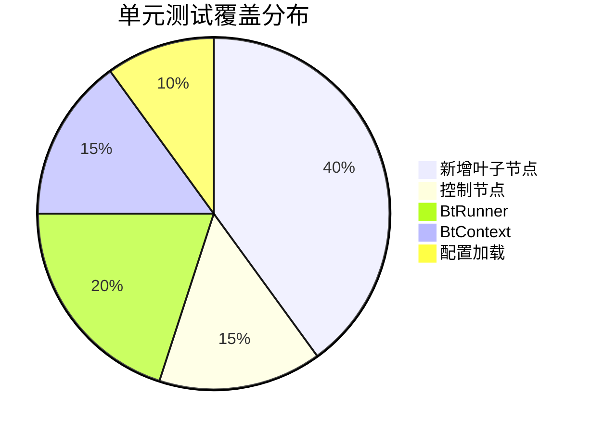

# 行为树测试策略文档

## 一、概述

本文档描述行为树驱动重构的完整测试策略，包括单元测试、集成测试、端到端测试和性能测试。

### 测试目标

1. **功能正确性**：行为树节点和行为树整体功能正确
2. **行为一致性**：行为树实现与原硬编码实现行为一致
3. **系统稳定性**：不引入新的崩溃或异常
4. **性能达标**：满足帧率要求，不造成明显性能下降

---

## 二、单元测试计划

### 2.1 测试覆盖范围



### 2.2 节点单元测试

#### 2.2.1 SetTransform 节点测试

**文件**: `servers/scene_server/internal/common/ai/bt/nodes/set_transform_test.go`

```go
func TestSetTransformNode(t *testing.T) {
    tests := []struct {
        name           string
        positionKey    string
        rotationKey    string
        blackboardData map[string]any
        featureData    map[string]any
        wantStatus     node.BtNodeStatus
        wantPosition   *transform.Vec3
        wantRotation   *transform.Vec3
    }{
        {
            name:        "从黑板读取位置",
            positionKey: "target_pos",
            blackboardData: map[string]any{
                "target_pos": &transform.Vec3{X: 100, Y: 0, Z: 200},
            },
            wantStatus:   node.BtNodeStatusSuccess,
            wantPosition: &transform.Vec3{X: 100, Y: 0, Z: 200},
        },
        {
            name:        "从 Feature 读取位置",
            positionKey: "",  // 使用默认 Feature
            featureData: map[string]any{
                "feature_pos_x": float32(50),
                "feature_pos_y": float32(0),
                "feature_pos_z": float32(100),
            },
            wantStatus:   node.BtNodeStatusSuccess,
            wantPosition: &transform.Vec3{X: 50, Y: 0, Z: 100},
        },
        {
            name:           "TransformComp 不存在",
            positionKey:    "target_pos",
            blackboardData: map[string]any{"target_pos": &transform.Vec3{}},
            wantStatus:     node.BtNodeStatusFailed,
        },
        {
            name:        "位置数据不存在",
            positionKey: "missing_key",
            wantStatus:  node.BtNodeStatusFailed,
        },
    }

    for _, tt := range tests {
        t.Run(tt.name, func(t *testing.T) {
            // 创建 mock 场景和组件
            scene := newMockScene()
            ctx := createTestContext(scene, tt.blackboardData, tt.featureData)

            // 创建节点
            node := NewSetTransformNode()
            node.PositionKey = tt.positionKey
            node.RotationKey = tt.rotationKey

            // 执行
            status := node.OnEnter(ctx)

            // 验证
            assert.Equal(t, tt.wantStatus, status)
            if tt.wantPosition != nil {
                actualPos := ctx.GetTransformComp().Position()
                assert.Equal(t, tt.wantPosition, &actualPos)
            }
        })
    }
}
```

#### 2.2.2 ClearFeature 节点测试

**文件**: `servers/scene_server/internal/common/ai/bt/nodes/clear_feature_test.go`

```go
func TestClearFeatureNode(t *testing.T) {
    tests := []struct {
        name         string
        featureKey   string
        clearValue   any
        initialValue any
        wantValue    any
        wantStatus   node.BtNodeStatus
    }{
        {
            name:         "清除 bool 类型 Feature",
            featureKey:   "feature_test",
            initialValue: true,
            wantValue:    false,
            wantStatus:   node.BtNodeStatusSuccess,
        },
        {
            name:         "清除 int 类型 Feature",
            featureKey:   "feature_count",
            initialValue: int64(100),
            wantValue:    int64(0),
            wantStatus:   node.BtNodeStatusSuccess,
        },
        {
            name:         "使用指定清除值",
            featureKey:   "feature_state",
            clearValue:   "reset",
            initialValue: "active",
            wantValue:    "reset",
            wantStatus:   node.BtNodeStatusSuccess,
        },
        {
            name:       "DecisionComp 不存在",
            featureKey: "feature_test",
            wantStatus: node.BtNodeStatusFailed,
        },
    }

    for _, tt := range tests {
        t.Run(tt.name, func(t *testing.T) {
            scene := newMockScene()
            ctx := createTestContext(scene, nil, map[string]any{
                tt.featureKey: tt.initialValue,
            })

            node := NewClearFeatureNode(tt.featureKey, tt.clearValue)
            status := node.OnEnter(ctx)

            assert.Equal(t, tt.wantStatus, status)
            if tt.wantValue != nil {
                actualValue, _ := ctx.GetDecisionComp().GetFeatureValue(tt.featureKey)
                assert.Equal(t, tt.wantValue, actualValue)
            }
        })
    }
}
```

#### 2.2.3 QueryPath 节点测试

**文件**: `servers/scene_server/internal/common/ai/bt/nodes/query_path_test.go`

```go
func TestQueryPathNode(t *testing.T) {
    tests := []struct {
        name               string
        startPointKey      string
        endPointKey        string
        useCurrentPosition bool
        blackboardData     map[string]any
        mockPathResult     []transform.Vec3
        mockPathError      error
        wantStatus         node.BtNodeStatus
        wantPathCount      int
    }{
        {
            name:           "正常寻路",
            startPointKey:  "start",
            endPointKey:    "end",
            blackboardData: map[string]any{"start": 10, "end": 20},
            mockPathResult: []transform.Vec3{{X: 0}, {X: 50}, {X: 100}},
            wantStatus:     node.BtNodeStatusSuccess,
            wantPathCount:  3,
        },
        {
            name:               "使用当前位置作为起点",
            useCurrentPosition: true,
            endPointKey:        "end",
            blackboardData:     map[string]any{"end": 20},
            mockPathResult:     []transform.Vec3{{X: 0}, {X: 100}},
            wantStatus:         node.BtNodeStatusSuccess,
            wantPathCount:      2,
        },
        {
            name:           "路径不存在",
            startPointKey:  "start",
            endPointKey:    "end",
            blackboardData: map[string]any{"start": 10, "end": 999},
            mockPathError:  errors.New("path not found"),
            wantStatus:     node.BtNodeStatusFailed,
        },
        {
            name:       "终点参数缺失",
            startPointKey: "start",
            blackboardData: map[string]any{"start": 10},
            wantStatus:  node.BtNodeStatusFailed,
        },
    }

    for _, tt := range tests {
        t.Run(tt.name, func(t *testing.T) {
            scene := newMockSceneWithRoadNetwork(tt.mockPathResult, tt.mockPathError)
            ctx := createTestContext(scene, tt.blackboardData, nil)

            node := NewQueryPathNode()
            node.StartPointKey = tt.startPointKey
            node.EndPointKey = tt.endPointKey
            node.UseCurrentPosition = tt.useCurrentPosition

            status := node.OnEnter(ctx)

            assert.Equal(t, tt.wantStatus, status)
            if tt.wantPathCount > 0 {
                moveComp := ctx.GetMoveComp()
                assert.Equal(t, tt.wantPathCount, moveComp.GetPathCount())
            }
        })
    }
}
```

#### 2.2.4 SetDialogPause 节点测试

**文件**: `servers/scene_server/internal/common/ai/bt/nodes/set_dialog_pause_test.go`

```go
func TestSetDialogPauseNode(t *testing.T) {
    tests := []struct {
        name            string
        pause           bool
        initialPause    bool
        initialPauseTime int64
        initialFinish   int64
        currentTime     int64
        wantPause       bool
        wantFinish      int64
        wantStatus      node.BtNodeStatus
    }{
        {
            name:       "设置暂停",
            pause:      true,
            wantPause:  true,
            wantStatus: node.BtNodeStatusSuccess,
        },
        {
            name:            "恢复并计算时间延长",
            pause:           false,
            initialPause:    true,
            initialPauseTime: 1000,  // 暂停时的时间
            initialFinish:   5000,   // 原超时时间
            currentTime:     3000,   // 当前时间
            wantPause:       false,
            wantFinish:      7000,   // 5000 + (3000 - 1000) = 7000
            wantStatus:      node.BtNodeStatusSuccess,
        },
        {
            name:       "DialogComp 不存在",
            pause:      true,
            wantStatus: node.BtNodeStatusFailed,
        },
    }

    for _, tt := range tests {
        t.Run(tt.name, func(t *testing.T) {
            scene := newMockScene()
            ctx := createTestContextWithDialog(scene, tt.initialPause, tt.initialPauseTime, tt.initialFinish)
            setMockTime(tt.currentTime)

            node := NewSetDialogPauseNode(tt.pause)
            status := node.OnEnter(ctx)

            assert.Equal(t, tt.wantStatus, status)
            if tt.wantStatus == node.BtNodeStatusSuccess {
                dialogComp := getDialogComp(ctx)
                assert.Equal(t, tt.wantPause, dialogComp.GetOutPause())
                if tt.wantFinish > 0 {
                    assert.Equal(t, tt.wantFinish, dialogComp.GetOutFinishStamp())
                }
            }
        })
    }
}
```

### 2.3 控制节点测试

#### 2.3.1 Sequence 节点测试

```go
func TestSequenceNode(t *testing.T) {
    tests := []struct {
        name          string
        childStatuses []node.BtNodeStatus
        wantStatus    node.BtNodeStatus
    }{
        {
            name:          "所有子节点成功",
            childStatuses: []node.BtNodeStatus{Success, Success, Success},
            wantStatus:    node.BtNodeStatusSuccess,
        },
        {
            name:          "第一个子节点失败",
            childStatuses: []node.BtNodeStatus{Failed},
            wantStatus:    node.BtNodeStatusFailed,
        },
        {
            name:          "中间子节点失败",
            childStatuses: []node.BtNodeStatus{Success, Failed, Success},
            wantStatus:    node.BtNodeStatusFailed,
        },
        {
            name:          "子节点返回 Running",
            childStatuses: []node.BtNodeStatus{Success, Running},
            wantStatus:    node.BtNodeStatusRunning,
        },
    }

    for _, tt := range tests {
        t.Run(tt.name, func(t *testing.T) {
            seq := NewSequenceNode()
            for _, status := range tt.childStatuses {
                seq.AddChild(newMockNode(status))
            }

            ctx := createTestContext(nil, nil, nil)
            status := seq.OnEnter(ctx)

            // 如果是 Running，需要继续 Tick
            for status == node.BtNodeStatusRunning {
                status = seq.OnTick(ctx)
            }

            assert.Equal(t, tt.wantStatus, status)
        })
    }
}
```

#### 2.3.2 Selector 节点测试

```go
func TestSelectorNode(t *testing.T) {
    tests := []struct {
        name          string
        childStatuses []node.BtNodeStatus
        wantStatus    node.BtNodeStatus
    }{
        {
            name:          "第一个子节点成功",
            childStatuses: []node.BtNodeStatus{Success},
            wantStatus:    node.BtNodeStatusSuccess,
        },
        {
            name:          "第一个失败第二个成功",
            childStatuses: []node.BtNodeStatus{Failed, Success},
            wantStatus:    node.BtNodeStatusSuccess,
        },
        {
            name:          "所有子节点失败",
            childStatuses: []node.BtNodeStatus{Failed, Failed, Failed},
            wantStatus:    node.BtNodeStatusFailed,
        },
        {
            name:          "子节点返回 Running",
            childStatuses: []node.BtNodeStatus{Failed, Running},
            wantStatus:    node.BtNodeStatusRunning,
        },
    }

    for _, tt := range tests {
        t.Run(tt.name, func(t *testing.T) {
            sel := NewSelectorNode()
            for _, status := range tt.childStatuses {
                sel.AddChild(newMockNode(status))
            }

            ctx := createTestContext(nil, nil, nil)
            status := sel.OnEnter(ctx)

            for status == node.BtNodeStatusRunning {
                status = sel.OnTick(ctx)
            }

            assert.Equal(t, tt.wantStatus, status)
        })
    }
}
```

### 2.4 BtRunner 测试

**文件**: `servers/scene_server/internal/common/ai/bt/runner/runner_test.go`

```go
func TestBtRunner_Run(t *testing.T) {
    tests := []struct {
        name       string
        planName   string
        registered bool
        wantErr    error
    }{
        {
            name:       "正常启动",
            planName:   "test_plan",
            registered: true,
            wantErr:    nil,
        },
        {
            name:       "Plan 未注册",
            planName:   "unknown",
            registered: false,
            wantErr:    ErrTreeNotFound,
        },
    }

    for _, tt := range tests {
        t.Run(tt.name, func(t *testing.T) {
            scene := newMockScene()
            runner := NewBtRunner(scene)

            if tt.registered {
                tree := newSimpleTree()
                runner.RegisterTree(tt.planName, tree)
            }

            err := runner.Run(tt.planName, 123)

            if tt.wantErr != nil {
                assert.Equal(t, tt.wantErr, err)
            } else {
                assert.NoError(t, err)
                assert.True(t, runner.IsRunning(123))
            }
        })
    }
}

func TestBtRunner_Stop(t *testing.T) {
    scene := newMockScene()
    runner := NewBtRunner(scene)

    // 注册并启动
    tree := newTreeWithExitCallback()
    runner.RegisterTree("test", tree)
    runner.Run("test", 123)

    // 验证运行中
    assert.True(t, runner.IsRunning(123))

    // 停止
    runner.Stop(123)

    // 验证已停止
    assert.False(t, runner.IsRunning(123))
    // 验证 OnExit 被调用
    assert.True(t, tree.exitCalled)
}

func TestBtRunner_Tick(t *testing.T) {
    scene := newMockScene()
    runner := NewBtRunner(scene)

    // 创建需要多帧完成的树
    tree := newMultiTickTree(3)  // 需要 3 次 Tick 完成
    runner.RegisterTree("test", tree)
    runner.Run("test", 123)

    // 第 1 次 Tick
    status := runner.Tick(123, 0.016)
    assert.Equal(t, node.BtNodeStatusRunning, status)

    // 第 2 次 Tick
    status = runner.Tick(123, 0.016)
    assert.Equal(t, node.BtNodeStatusRunning, status)

    // 第 3 次 Tick - 完成
    status = runner.Tick(123, 0.016)
    assert.Equal(t, node.BtNodeStatusSuccess, status)
}
```

### 2.5 BtContext 测试

**文件**: `servers/scene_server/internal/common/ai/bt/context/context_test.go`

```go
func TestBtContext_Blackboard(t *testing.T) {
    ctx := NewBtContext(nil, 123)

    // 测试基本操作
    ctx.SetBlackboard("key1", "value1")
    ctx.SetBlackboard("key2", 42)
    ctx.SetBlackboard("key3", true)

    val1, ok := ctx.GetBlackboardString("key1")
    assert.True(t, ok)
    assert.Equal(t, "value1", val1)

    val2, ok := ctx.GetBlackboardInt64("key2")
    assert.True(t, ok)
    assert.Equal(t, int64(42), val2)

    val3, ok := ctx.GetBlackboardBool("key3")
    assert.True(t, ok)
    assert.True(t, val3)

    // 测试不存在的 key
    _, ok = ctx.GetBlackboard("missing")
    assert.False(t, ok)

    // 测试类型转换
    ctx.SetBlackboard("float", 3.14)
    floatVal, ok := ctx.GetBlackboardFloat32("float")
    assert.True(t, ok)
    assert.InDelta(t, float32(3.14), floatVal, 0.001)
}

func TestBtContext_ComponentCache(t *testing.T) {
    scene := newMockSceneWithComponents()
    ctx := NewBtContext(scene, 123)

    // 第一次获取 - 从场景加载
    moveComp1 := ctx.GetMoveComp()
    assert.NotNil(t, moveComp1)

    // 第二次获取 - 从缓存
    moveComp2 := ctx.GetMoveComp()
    assert.Same(t, moveComp1, moveComp2)

    // 重置后清空缓存
    ctx.Reset(456, 0.016)
    moveComp3 := ctx.GetMoveComp()
    assert.NotSame(t, moveComp1, moveComp3)
}
```

---

## 三、集成测试计划

### 3.1 测试环境设置

```go
// test/integration/bt_integration_test.go

type BtIntegrationTestSuite struct {
    suite.Suite
    scene    *scene_impl.SceneImpl
    executor *decision.Executor
    btRunner *runner.BtRunner
}

func (s *BtIntegrationTestSuite) SetupTest() {
    // 创建测试场景
    s.scene = createTestScene()

    // 获取 ExecutorResource
    execRes, _ := common.GetResourceAs[*decision.ExecutorResource](
        s.scene, common.ResourceType_Executor)
    s.executor = execRes.GetExecutor()
    s.btRunner = execRes.GetBtRunner()

    // 注册测试行为树
    trees.RegisterExampleTrees(s.executor.RegisterBehaviorTree)
}

func (s *BtIntegrationTestSuite) TearDownTest() {
    s.scene.Destroy()
}
```

### 3.2 Plan 集成测试

#### 3.2.1 home_idle Plan 测试

```go
func (s *BtIntegrationTestSuite) TestHomeIdlePlan() {
    // 创建 NPC 实体
    npcEntity := s.createNpcEntity()
    entityID := npcEntity.ID()

    // 设置初始 Feature
    decisionComp := getDecisionComp(npcEntity)
    decisionComp.UpdateFeature(decision.UpdateFeatureReq{
        EntityID:     entityID,
        FeatureKey:   "feature_pos_x",
        FeatureValue: float32(100),
    })
    decisionComp.UpdateFeature(decision.UpdateFeatureReq{
        EntityID:     entityID,
        FeatureKey:   "feature_pos_z",
        FeatureValue: float32(200),
    })

    // 触发 Plan
    err := s.executor.OnPlanCreated(&decision.OnPlanCreatedReq{
        EntityID: uint32(entityID),
        Plan: &decision.Plan{
            Name: "home_idle",
            Tasks: []*decision.Task{
                {Type: decision.TaskTypeGSSEnter, Name: "do_entry"},
            },
        },
    })
    s.NoError(err)

    // 验证行为树已启动
    s.True(s.btRunner.IsRunning(entityID))

    // Tick 直到完成
    for s.btRunner.IsRunning(entityID) {
        s.btRunner.Tick(entityID, 0.016)
    }

    // 验证结果
    transformComp := getTransformComp(npcEntity)
    pos := transformComp.Position()
    s.InDelta(float32(100), pos.X, 0.01)
    s.InDelta(float32(200), pos.Z, 0.01)

    // 验证 Feature 更新
    val, _ := decisionComp.GetFeatureValue("feature_out_timeout")
    s.True(val.(bool))
}
```

#### 3.2.2 move Plan 测试

```go
func (s *BtIntegrationTestSuite) TestMovePlan() {
    npcEntity := s.createNpcEntity()
    entityID := npcEntity.ID()

    // 设置路径 Feature
    decisionComp := getDecisionComp(npcEntity)
    decisionComp.UpdateFeature(decision.UpdateFeatureReq{
        EntityID:     entityID,
        FeatureKey:   "feature_start_point",
        FeatureValue: 10,
    })
    decisionComp.UpdateFeature(decision.UpdateFeatureReq{
        EntityID:     entityID,
        FeatureKey:   "feature_end_point",
        FeatureValue: 20,
    })

    // 触发 Plan
    err := s.executor.OnPlanCreated(&decision.OnPlanCreatedReq{
        EntityID: uint32(entityID),
        Plan: &decision.Plan{
            Name: "move",
            Tasks: []*decision.Task{
                {Type: decision.TaskTypeGSSEnter, Name: "do_entry"},
            },
        },
    })
    s.NoError(err)

    // 验证移动组件状态
    moveComp := getMoveComp(npcEntity)
    s.True(moveComp.IsMoving())
    s.Equal(int32(cnpc.EPathFindType_RoadNetWork), moveComp.GetPathFindType())
    s.Greater(moveComp.GetPathCount(), 0)
}
```

#### 3.2.3 pursuit Plan 测试

```go
func (s *BtIntegrationTestSuite) TestPursuitPlan() {
    // 创建警察 NPC
    policeEntity := s.createPoliceNpcEntity()
    policeID := policeEntity.ID()

    // 创建玩家实体
    playerEntity := s.createPlayerEntity()
    playerID := playerEntity.ID()

    // 设置追逐目标
    decisionComp := getDecisionComp(policeEntity)
    decisionComp.UpdateFeature(decision.UpdateFeatureReq{
        EntityID:     policeID,
        FeatureKey:   "feature_pursuit_entity_id",
        FeatureValue: playerID,
    })

    // 触发 Plan
    err := s.executor.OnPlanCreated(&decision.OnPlanCreatedReq{
        EntityID: uint32(policeID),
        Plan: &decision.Plan{
            Name: "pursuit",
            Tasks: []*decision.Task{
                {Type: decision.TaskTypeGSSEnter, Name: "do_entry"},
            },
        },
    })
    s.NoError(err)

    // Tick
    s.btRunner.Tick(policeID, 0.016)

    // 验证追逐状态
    moveComp := getMoveComp(policeEntity)
    s.True(moveComp.IsRunning())
    s.Equal(int32(cnpc.EPathFindType_NavMesh), moveComp.GetPathFindType())
    s.Equal(playerID, moveComp.GetTargetEntity())
    s.Equal(cnpc.ETargetType_Player, moveComp.GetTargetType())
}
```

### 3.3 Plan 切换测试

```go
func (s *BtIntegrationTestSuite) TestPlanTransition() {
    npcEntity := s.createNpcEntity()
    entityID := npcEntity.ID()

    // 启动 move Plan
    s.executor.OnPlanCreated(&decision.OnPlanCreatedReq{
        EntityID: uint32(entityID),
        Plan:     &decision.Plan{Name: "move"},
    })
    s.True(s.btRunner.IsRunning(entityID))

    moveComp := getMoveComp(npcEntity)
    s.True(moveComp.IsMoving())

    // 切换到 dialog Plan
    s.executor.OnPlanCreated(&decision.OnPlanCreatedReq{
        EntityID: uint32(entityID),
        Plan:     &decision.Plan{Name: "dialog", FromPlan: "move"},
    })

    // 验证旧行为树已停止
    instance := s.btRunner.GetInstance(entityID)
    s.Equal("dialog", instance.PlanName)

    // 验证移动已停止
    s.False(moveComp.IsMoving())
}
```

---

## 四、端到端测试场景

### 4.1 测试场景定义

使用 BDD 风格定义测试场景:

```gherkin
# test/e2e/features/npc_behavior.feature

Feature: NPC 行为树行为

  Background:
    Given 服务器已启动
    And 场景已加载

  @home_idle
  Scenario: NPC 回家空闲
    Given 存在 NPC "店主"
    And NPC 的 home 位置是 (100, 0, 200)
    When 触发 "home_idle" Plan
    Then NPC 应该在位置 (100, 0, 200)
    And Feature "feature_out_timeout" 应该是 true

  @move
  Scenario: NPC 路网移动
    Given 存在 NPC "巡逻员"
    And 起点路点是 10
    And 终点路点是 20
    When 触发 "move" Plan
    Then NPC 应该开始移动
    And 寻路类型应该是 "road_network"
    And 路径点数应该大于 0

  @dialog
  Scenario: NPC 对话
    Given 存在 NPC "商人"
    And 存在玩家在 NPC 附近
    When 触发 "dialog" Plan
    Then NPC 应该停止移动
    And NPC 应该面向玩家
    And 对话状态应该是 "dialog"

  @pursuit
  Scenario: 警察追逐玩家
    Given 存在警察 NPC
    And 存在通缉玩家
    When 触发 "pursuit" Plan
    Then NPC 应该进入奔跑状态
    And 寻路类型应该是 "nav_mesh"
    And 目标类型应该是 "player"

  @transition
  Scenario: Plan 切换
    Given 存在 NPC "店主" 正在执行 "move" Plan
    When 玩家触发对话
    And 触发 "dialog" Plan
    Then "move" 行为树应该停止
    And "dialog" 行为树应该启动
    And NPC 移动应该停止
```

### 4.2 E2E 测试实现

```go
// test/e2e/npc_behavior_test.go

func TestE2E_NpcBehavior(t *testing.T) {
    if testing.Short() {
        t.Skip("Skipping E2E test in short mode")
    }

    suite := &NpcBehaviorE2ESuite{}
    suite.Run(t, suite)
}

type NpcBehaviorE2ESuite struct {
    suite.Suite
    server *SceneServer
    client *TestClient
}

func (s *NpcBehaviorE2ESuite) SetupSuite() {
    // 启动测试服务器
    s.server = StartTestServer()
    s.client = NewTestClient(s.server.Address())
}

func (s *NpcBehaviorE2ESuite) TearDownSuite() {
    s.client.Close()
    s.server.Stop()
}

func (s *NpcBehaviorE2ESuite) TestNpcHomeIdle() {
    // 创建 NPC
    npcID := s.client.CreateNpc("shopkeeper", Position{100, 0, 200})

    // 设置 home 位置
    s.client.SetNpcFeature(npcID, "feature_pos_x", float32(100))
    s.client.SetNpcFeature(npcID, "feature_pos_z", float32(200))

    // 触发 Plan
    s.client.TriggerPlan(npcID, "home_idle")

    // 等待行为完成
    s.client.WaitForPlanComplete(npcID, 5*time.Second)

    // 验证位置
    pos := s.client.GetNpcPosition(npcID)
    s.InDelta(100, pos.X, 1)
    s.InDelta(200, pos.Z, 1)

    // 验证 Feature
    timeout := s.client.GetNpcFeature(npcID, "feature_out_timeout")
    s.True(timeout.(bool))
}

func (s *NpcBehaviorE2ESuite) TestNpcPursuitPlayer() {
    // 创建警察 NPC
    policeID := s.client.CreatePoliceNpc()

    // 创建玩家
    playerID := s.client.CreatePlayer(Position{500, 0, 500})

    // 设置追逐目标
    s.client.SetNpcFeature(policeID, "feature_pursuit_entity_id", playerID)

    // 触发追逐
    s.client.TriggerPlan(policeID, "pursuit")

    // 验证追逐状态
    time.Sleep(100 * time.Millisecond)
    state := s.client.GetNpcMoveState(policeID)

    s.True(state.IsRunning)
    s.Equal("nav_mesh", state.PathFindType)
    s.Equal(playerID, state.TargetEntity)
    s.Equal("player", state.TargetType)
}

func (s *NpcBehaviorE2ESuite) TestPlanTransition() {
    // 创建 NPC 并开始移动
    npcID := s.client.CreateNpc("merchant", Position{0, 0, 0})
    s.client.SetupMovePath(npcID, 10, 20)
    s.client.TriggerPlan(npcID, "move")

    // 验证移动中
    time.Sleep(100 * time.Millisecond)
    s.True(s.client.IsNpcMoving(npcID))

    // 触发对话 Plan
    s.client.TriggerPlan(npcID, "dialog")

    // 验证状态切换
    time.Sleep(100 * time.Millisecond)
    s.False(s.client.IsNpcMoving(npcID))

    dialogState := s.client.GetNpcDialogState(npcID)
    s.Equal("dialog", dialogState.State)
}
```

---

## 五、性能测试基准

### 5.1 性能指标定义

| 指标 | 目标值 | 告警阈值 |
|------|--------|----------|
| 单次 Tick 耗时 (单 NPC) | < 0.1ms | > 0.5ms |
| 单次 Tick 耗时 (100 NPC) | < 5ms | > 10ms |
| 单次 Tick 耗时 (500 NPC) | < 20ms | > 30ms |
| 内存增长 (每 NPC) | < 1KB | > 5KB |
| GC 暂停时间 | < 1ms | > 5ms |

### 5.2 性能测试代码

```go
// test/benchmark/bt_benchmark_test.go

func BenchmarkBtRunner_Tick_SingleNpc(b *testing.B) {
    scene := createBenchmarkScene()
    runner := NewBtRunner(scene)

    // 注册简单行为树
    tree := createSimpleBehaviorTree()
    runner.RegisterTree("test", tree)
    runner.Run("test", 1)

    b.ResetTimer()
    for i := 0; i < b.N; i++ {
        runner.Tick(1, 0.016)
        tree.Reset()
    }
}

func BenchmarkBtRunner_Tick_100Npcs(b *testing.B) {
    scene := createBenchmarkScene()
    runner := NewBtRunner(scene)

    tree := createSimpleBehaviorTree()
    runner.RegisterTree("test", tree)

    // 启动 100 个 NPC 的行为树
    for i := uint64(1); i <= 100; i++ {
        runner.Run("test", i)
    }

    b.ResetTimer()
    for i := 0; i < b.N; i++ {
        for entityID := uint64(1); entityID <= 100; entityID++ {
            runner.Tick(entityID, 0.016)
        }
        // 重置所有树
        for entityID := uint64(1); entityID <= 100; entityID++ {
            instance := runner.GetInstance(entityID)
            instance.Root.Reset()
        }
    }
}

func BenchmarkBtRunner_Tick_500Npcs(b *testing.B) {
    scene := createBenchmarkScene()
    runner := NewBtRunner(scene)

    tree := createSimpleBehaviorTree()
    runner.RegisterTree("test", tree)

    for i := uint64(1); i <= 500; i++ {
        runner.Run("test", i)
    }

    b.ResetTimer()
    for i := 0; i < b.N; i++ {
        for entityID := uint64(1); entityID <= 500; entityID++ {
            runner.Tick(entityID, 0.016)
        }
        for entityID := uint64(1); entityID <= 500; entityID++ {
            instance := runner.GetInstance(entityID)
            instance.Root.Reset()
        }
    }
}

func BenchmarkBtNode_OnEnter(b *testing.B) {
    scene := createBenchmarkScene()
    ctx := context.NewBtContext(scene, 1)

    nodes := []struct {
        name string
        node node.IBtNode
    }{
        {"SetFeature", NewSetFeatureNode("key", "value", 0)},
        {"StopMove", NewStopMoveNode()},
        {"SetTransform", NewSetTransformNode()},
        {"ClearFeature", NewClearFeatureNode("key", nil)},
    }

    for _, n := range nodes {
        b.Run(n.name, func(b *testing.B) {
            for i := 0; i < b.N; i++ {
                n.node.OnEnter(ctx)
                n.node.Reset()
            }
        })
    }
}
```

### 5.3 内存分析测试

```go
func TestBtRunner_MemoryUsage(t *testing.T) {
    scene := createBenchmarkScene()
    runner := NewBtRunner(scene)

    tree := createSimpleBehaviorTree()
    runner.RegisterTree("test", tree)

    // 记录初始内存
    var m1, m2 runtime.MemStats
    runtime.GC()
    runtime.ReadMemStats(&m1)

    // 启动 1000 个 NPC 的行为树
    for i := uint64(1); i <= 1000; i++ {
        runner.Run("test", i)
    }

    // 记录内存增长
    runtime.GC()
    runtime.ReadMemStats(&m2)

    memPerNpc := float64(m2.Alloc-m1.Alloc) / 1000
    t.Logf("Memory per NPC: %.2f bytes", memPerNpc)

    // 验证内存在预期范围内
    assert.Less(t, memPerNpc, float64(5*1024), "Memory per NPC should be less than 5KB")
}
```

### 5.4 持续性能监控

```go
// 在 BtTickSystem.Update 中添加性能监控
func (s *BtTickSystem) Update() {
    if s.btRunner == nil {
        return
    }

    startTime := time.Now()
    npcCount := s.btRunner.GetRunningCount()

    // 执行 Tick
    deltaTime := float32(0.0167)
    for entityID := range s.btRunner.GetRunningTrees() {
        s.btRunner.Tick(entityID, deltaTime)
    }

    // 记录性能指标
    elapsed := time.Since(startTime)
    metrics.RecordBtTickDuration(elapsed, npcCount)

    if elapsed > 10*time.Millisecond {
        s.Scene().Warningf("[BtTickSystem] slow tick: %v, npc_count=%d",
            elapsed, npcCount)
    }
}
```

---

## 六、测试工具与辅助函数

### 6.1 Mock 场景创建

```go
// test/testutil/mock_scene.go

func newMockScene() *MockScene {
    return &MockScene{
        entities:   make(map[uint64]*MockEntity),
        components: make(map[uint64]map[common.ComponentType]common.Component),
        resources:  make(map[common.ResourceType]any),
    }
}

func (s *MockScene) AddEntity(entityID uint64) *MockEntity {
    entity := &MockEntity{id: entityID}
    s.entities[entityID] = entity
    s.components[entityID] = make(map[common.ComponentType]common.Component)
    return entity
}

func (s *MockScene) AddComponent(entityID uint64, compType common.ComponentType, comp common.Component) {
    s.components[entityID][compType] = comp
}

func (s *MockScene) AddResource(resType common.ResourceType, res any) {
    s.resources[resType] = res
}
```

### 6.2 测试上下文创建

```go
// test/testutil/test_context.go

func createTestContext(
    scene common.Scene,
    blackboardData map[string]any,
    featureData map[string]any,
) *context.BtContext {
    if scene == nil {
        scene = newMockScene()
    }

    entityID := uint64(123)
    mockScene := scene.(*MockScene)

    // 添加默认组件
    mockScene.AddEntity(entityID)
    mockScene.AddComponent(entityID, common.ComponentType_NpcMove, newMockMoveComp())
    mockScene.AddComponent(entityID, common.ComponentType_Transform, newMockTransformComp())
    mockScene.AddComponent(entityID, common.ComponentType_AIDecision, newMockDecisionComp(featureData))

    ctx := context.NewBtContext(scene, entityID)

    // 设置黑板数据
    for k, v := range blackboardData {
        ctx.SetBlackboard(k, v)
    }

    return ctx
}
```

### 6.3 Mock 节点

```go
// test/testutil/mock_node.go

type MockNode struct {
    node.BaseNode
    returnStatus node.BtNodeStatus
    enterCalled  bool
    tickCalled   bool
    exitCalled   bool
}

func newMockNode(status node.BtNodeStatus) *MockNode {
    return &MockNode{
        BaseNode:     node.NewBaseNode(node.BtNodeTypeLeaf),
        returnStatus: status,
    }
}

func (n *MockNode) OnEnter(ctx *context.BtContext) node.BtNodeStatus {
    n.enterCalled = true
    n.SetStatus(n.returnStatus)
    return n.returnStatus
}

func (n *MockNode) OnTick(ctx *context.BtContext) node.BtNodeStatus {
    n.tickCalled = true
    return n.returnStatus
}

func (n *MockNode) OnExit(ctx *context.BtContext) {
    n.exitCalled = true
}
```

---

## 七、测试执行与报告

### 7.1 测试命令

```bash
# 运行所有单元测试
make test

# 运行行为树相关测试
go test -v ./servers/scene_server/internal/common/ai/bt/...

# 运行集成测试
go test -v -tags=integration ./test/integration/...

# 运行 E2E 测试
go test -v -tags=e2e ./test/e2e/...

# 运行性能测试
go test -bench=. -benchmem ./test/benchmark/...

# 生成覆盖率报告
make test-coverage
```

### 7.2 覆盖率目标

| 模块 | 目标覆盖率 |
|------|------------|
| bt/nodes/* | >= 80% |
| bt/runner/* | >= 85% |
| bt/context/* | >= 90% |
| bt/config/* | >= 75% |

### 7.3 测试报告模板

```markdown
## 行为树重构测试报告

### 概要
- 测试日期: YYYY-MM-DD
- 测试版本: vX.Y.Z
- 测试环境: xxx

### 测试结果

| 测试类型 | 总数 | 通过 | 失败 | 跳过 | 覆盖率 |
|----------|------|------|------|------|--------|
| 单元测试 | 150 | 148 | 2 | 0 | 82% |
| 集成测试 | 30 | 30 | 0 | 0 | - |
| E2E 测试 | 10 | 10 | 0 | 0 | - |

### 性能测试结果

| 场景 | 平均耗时 | P99 耗时 | 目标 | 结果 |
|------|----------|----------|------|------|
| 单 NPC Tick | 0.05ms | 0.08ms | <0.1ms | PASS |
| 100 NPC Tick | 3.2ms | 4.5ms | <5ms | PASS |
| 500 NPC Tick | 15ms | 18ms | <20ms | PASS |

### 失败用例分析
1. TestXxx - 原因: xxx, 修复方案: xxx
2. ...

### 待改进项
1. xxx
2. xxx
```
