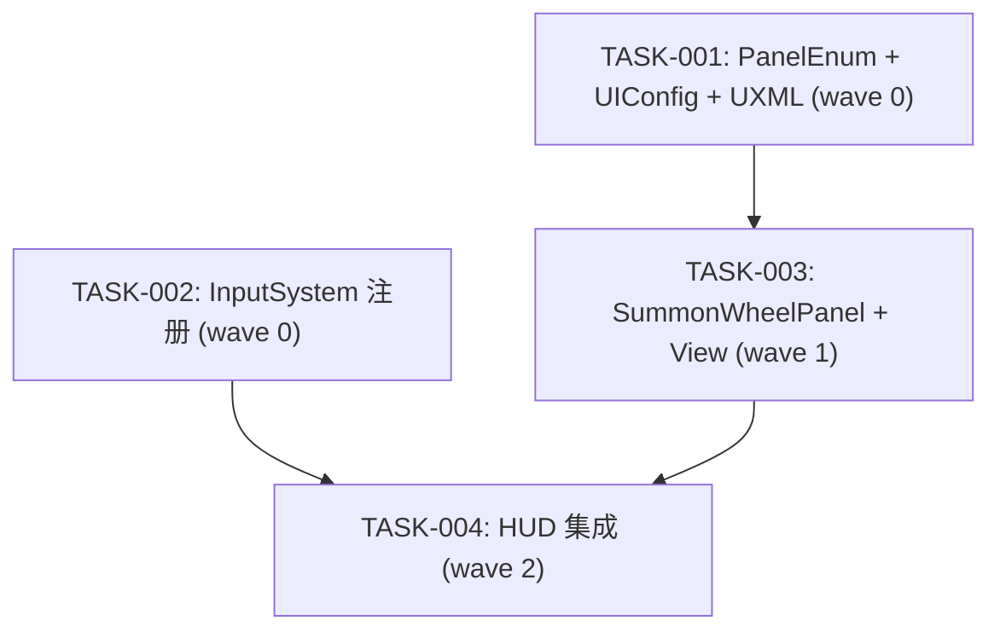

# 召唤轮盘 任务拆解

## Wave 汇总

| Wave | 任务 | 说明 |
|------|------|------|
| 0 | TASK-001, TASK-002 | 基础设施：PanelEnum 注册 + UXML/UIConfig + InputSystem 注册 |
| 1 | TASK-003 | 面板核心实现：SummonWheelPanel + SummonWheelView |
| 2 | TASK-004 | HUD 集成：事件订阅打开轮盘 |

## 依赖图

## 任务清单

[TASK-001] wave:0 depends:[] project:freelifeclient files:[UIPanelEnum.cs, UIConfig.json, SummonWheel.uxml(Mobile), SummonWheel.uxml(PC)]
PanelEnum 添加 SummonWheel 枚举值；UIConfig.json 添加 SummonWheel 配置条目；创建 Mobile/PC 两份 UXML 布局文件

[TASK-002] wave:0 depends:[] project:freelifeclient files:[PlayerControls.inputactions, InputEventId.cs, InputManager.cs, UIOperationCallback.cs, VehicleCallback.cs, InputModes.cs, PlayerControls.cs]
InputSystem 注册 OpenSummonWheelPanel action + O 键绑定；InputEventId 添加常量；InputManager 注册 performed 回调；Callback 类添加接口实现；InputModes 启用新 action

[TASK-003] wave:1 depends:[TASK-001] project:freelifeclient files:[SummonWheelPanel.cs, SummonWheelView.cs]
创建 SummonWheelPanel（数据驱动槽位、角度选择、召唤狗逻辑+冷却、叫车逻辑）和 SummonWheelView（UXML 绑定）

[TASK-004] wave:2 depends:[TASK-002, TASK-003] project:freelifeclient files:[HudInGamePanel.cs, HudDefaultPanel.cs]
HudInGamePanel 和 HudDefaultPanel 订阅 OpenSummonWheelPanel 事件，回调中打开 SummonWheelPanel
