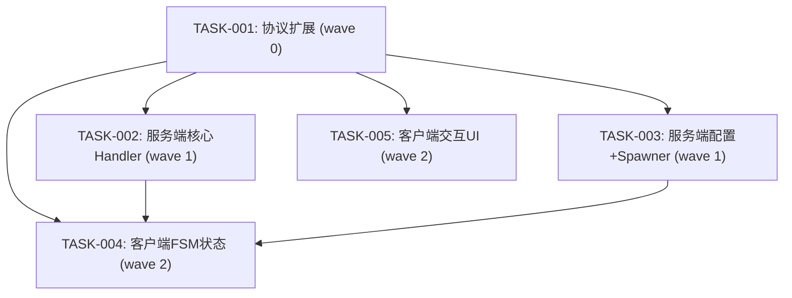

# 任务拆解

## Wave 汇总

| Wave | 任务 | 说明 |
|------|------|------|
| 0 | TASK-001 | 协议扩展 + 代码生成 |
| 1 | TASK-002, TASK-003 | 服务端核心（感知+逃跑+攻击+群体）, 服务端配置（数量+Chicken解锁+metadata） |
| 2 | TASK-004, TASK-005 | 客户端FSM（Flee+Attack状态）, 客户端交互UI（投喂气泡+召唤轮盘） |

## 依赖图

## 结构化任务清单

### [TASK-001] wave:0 depends:[] project:old_proto files:[old_proto/scene/npc.proto]
**协议扩展 + 代码生成**
- AnimalData 新增 group_id=9, threat_source_id=10
- AnimalState enum 新增 Flee=6, Attack=7
- 运行 `old_proto/_tool_new/1.generate.py` 生成双端代码
- 验证：生成代码无语法错误

### [TASK-002] wave:1 depends:[TASK-001] project:P1GoServer files:[handlers/animal_perception.go, handlers/animal_flee.go, handlers/animal_attack.go, npc_state.go, v2_pipeline_defaults.go, field_accessor.go, bt_tick_system.go]
**服务端核心Handler（感知+逃跑+攻击+群体）**
- 新增 AnimalPerceptionHandler（engagement维度，视觉+听觉检测）
- 新增 AnimalFleeHandler（逃跑方向计算，安全距离/超时终止）
- 新增 AnimalAttackHandler（鳄鱼专用，Chase→Attack→Cooldown子状态机）
- AnimalBaseState 新增 GroupID/ThreatSourceID/FleeStartMs/AttackSubState/AttackTimerMs
- 群组逃跑广播（同GroupID实体延迟触发）
- animalDimensionConfigs 注册新Handler
- BehaviorState 推导逻辑适配 Flee/Attack
- FieldAccessor 追加新字段
- 验证：make build 通过

### [TASK-003] wave:1 depends:[TASK-001] project:P1GoServer files:[animal_spawner.go, creature_metadata.go, animal_idle.go, animal_init.go]
**服务端配置+Spawner改造**
- 数量调整：Dog4+Croc4+Bird6+Chicken6=20
- Spawner群组生成：2-4只一组，5-10m间距，共享GroupID
- creature_metadata 感知参数：Bird30/Dog20/Croc15/Chicken10
- Chicken解除Rest锁定（animal_idle.go移除特殊分支）
- animal_init 初始化 GroupID 字段
- 验证：make build 通过

### [TASK-004] wave:2 depends:[TASK-001,TASK-002,TASK-003] project:freelifeclient files:[AnimalFleeState.cs, AnimalAttackState.cs, AnimalFsmComp.cs, AnimalStateData.cs, AnimalController.cs]
**客户端FSM状态扩展**
- 新增 AnimalFleeState（复用run clip，归一化移速）
- 新增 AnimalAttackState（walk 3x加速+推开2m+镜头轻震）
- AnimalFsmComp 注册新状态 + ChangeStateById路由
- AnimalStateData 新增 GroupId/ThreatSourceId 字段
- AnimalController.OnInit 中注册新 Comp（如需要）
- 验证：Unity编译无CS错误

### [TASK-005] wave:2 depends:[TASK-001] project:freelifeclient files:[AnimalInteractComp.cs, PoseWheelPanel.cs, PoseWheelView.cs]
**客户端交互UI**
- AnimalInteractComp 移除背包检查，距离内直接显示气泡
- AnimalFeedReq 发送时 itemId 传空
- PoseWheelPanel 新增"召唤狗"slot + 点击回调
- 验证：Unity编译无CS错误
