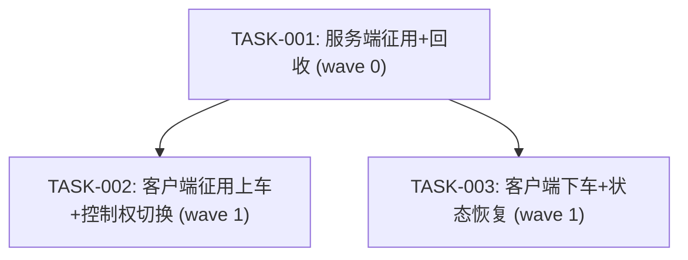

# 任务拆解：玩家自由驾驶车辆

## Wave 汇总表

| Wave | 任务 | 预期修改文件 | 策略 |
|------|------|------------|------|
| 0 | TASK-001 服务端征用+回收 | P1GoServer: traffic_vehicle.go, traffic_vehicle_system.go, vehicle_ops.go | 单任务 |
| 1 | TASK-002 客户端征用上车+控制权切换 | freelifeclient: PlayerGetOnVehicleComp.cs, InteractSurfVehicleComp.cs, GetOnCarState.cs, Vehicle.cs | 与 TASK-003 并行 |
| 1 | TASK-003 客户端下车+状态恢复 | freelifeclient: DriverGetOffCarState.cs, PlayerInteractWithVehicleComp.cs | 与 TASK-002 并行 |

## 任务依赖图

## 结构化任务清单

### [TASK-001] wave:0 depends:[] project:P1GoServer
**描述**：服务端交通车辆征用支持 + 距离回收逻辑

**修改文件**：
- `servers/scene_server/internal/ecs/com/cvehicle/traffic_vehicle.go` — 新增字段：IsPlayerCommandeered, AbandonedAt, OwnerPlayerEntityID, LastRecycleCheckAt
- `servers/scene_server/internal/ecs/system/traffic_vehicle/traffic_vehicle_system.go` — 扩展 Update()：征用车辆距离回收逻辑
- `servers/scene_server/internal/net_func/vehicle/vehicle_ops.go` — OnVehicle 扩展：交通车辆检测、NeedAutoVanish=false、征用标记；OffVehicle 扩展：AbandonedAt 标记

**完成标准**：
- `make build` 编译通过
- OnVehicle 正确处理交通车辆征用（含空车和有人车）
- TrafficVehicleSystem 正确跳过征用车辆的自动消失
- 距离回收逻辑正确（150m XZ平方距离，5s节流，离线立即回收）

---

### [TASK-002] wave:1 depends:[TASK-001] project:freelifeclient
**描述**：客户端交通车辆交互检测、征用上车、控制权切换

**修改文件**：
- `Assets/Scripts/Gameplay/Modules/BigWorld/Entity/Player/Comp/PlayerGetOnVehicleComp.cs` — 扩展：检测交通车辆（isControlledByTraffic）
- `Assets/Scripts/Gameplay/Modules/BigWorld/Entity/Player/Comp/Interact/InteractSurfVehicleComp.cs` — 扩展：交通车辆提示文本
- `Assets/Scripts/Gameplay/Modules/BigWorld/Entity/Player/State/GetOnCarState.cs` — 扩展：交通车辆上车时调用 SwitchToPlayerControl
- `Assets/Scripts/Gameplay/Modules/BigWorld/Managers/Vehicle/Vehicle.cs` — 新增 SwitchToPlayerControl() 封装方法

**完成标准**：
- Unity 编译无 CS 错误
- 靠近交通车辆显示交互提示
- 按键后触发上车 → 控制权切换 → 进入 DrivingCarState → 相机切换到 VehicleMode
- 可自由驾驶（油门/刹车/转向/手刹）

---

### [TASK-003] wave:1 depends:[TASK-001] project:freelifeclient
**描述**：客户端下车流程确认 + 征用车辆不归还交通系统

**修改文件**：
- `Assets/Scripts/Gameplay/Modules/BigWorld/Entity/Player/State/DriverGetOffCarState.cs` — 确认：下车后不调用 SwitchToTrafficControl
- `Assets/Scripts/Gameplay/Modules/BigWorld/Entity/Player/Comp/Interact/PlayerInteractWithVehicleComp.cs` — 确认：征用车辆下车后保持 isControlledByTraffic=false

**完成标准**：
- Unity 编译无 CS 错误
- 下车后角色正常恢复步行状态
- 下车后车辆留在原地，不归还交通系统
- 相机切回步行视角
