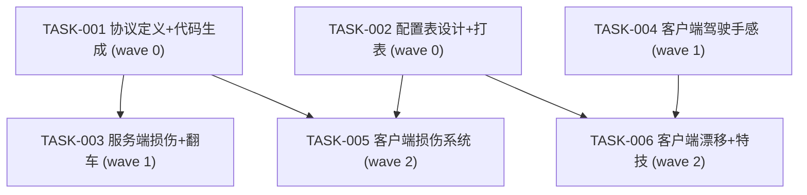

# 载具系统GTA5级提升 - 任务清单

## 依赖图

## Wave 汇总

| Wave | 任务 | 并行策略 | 预估文件数 |
|------|------|----------|-----------|
| 0 | TASK-001, TASK-002 | 可并行（不同工程） | 协议2+配置3 |
| 1 | TASK-003, TASK-004 | 可并行（Server vs Client 不同工程） | Server 3 + Client 4 |
| 2 | TASK-005, TASK-006 | 可并行（不同文件集） | Client 4 + Client 3 |

## 结构化任务清单

### [TASK-001] wave:0 depends:[] project:old_proto 协议定义+代码生成

**描述**：在 old_proto/scene/vehicle.proto 新增 VehicleDamageReq、VehicleDamageNtf（含 steer_offset/flat_tire）、VehicleFlipReq、VehicleFlipRes、VehicleFlipNtf、VehicleDamageInfo 子消息。运行代码生成脚本。

**预期修改文件**：
- `old_proto/scene/vehicle.proto`（编辑）
- 运行 `old_proto/_tool_new/1.generate.py`（生成到 P1GoServer + freelifeclient）

**完成标准**：
- Proto 新消息编译通过
- Go/C# 生成代码存在且无编译错误

---

### [TASK-002] wave:0 depends:[] project:freelifeclient 配置表设计+打表

**描述**：CfgDamageStage 新增 speedPenaltyRate/accelPenaltyRate/steerPenaltyDeg/gripPenaltyRate 字段。新增 CfgDriftScore 表。Excel MCP 编辑后运行打表工具。

**预期修改文件**：
- `freelifeclient/RawTables/DamageStage.xlsx`（Excel MCP 编辑）
- `freelifeclient/RawTables/DriftScore.xlsx`（Excel MCP 新建）
- 运行打表工具生成到 `freelifeclient/Assets/Scripts/Gameplay/Config/Gen/` + `P1GoServer/`

**完成标准**：
- 配置表新字段有默认值
- 打表生成的 C#/Go 代码编译通过

---

### [TASK-003] wave:1 depends:[TASK-001] project:P1GoServer 服务端损伤+翻车处理

**描述**：
1. VehicleStatusComp 新增 DamageHp/DamageMaxHp/DamageStage/IsDestroyed/SteerOffsetX100/FlatTireIndex 字段 + ApplyDamage 方法（含确定性哈希）
2. vehicle_ops.go 新增 OnVehicleDamage handler（反作弊校验+广播 VehicleDamageNtf）
3. vehicle_ops.go 新增 OnVehicleFlip handler（冷却10s+广播 VehicleFlipNtf）
4. 爆炸回收：HP=0 驱逐乘客+回收定时器
5. net_update/vehicle.go 的 getVehicleMsg 中同步损伤字段（AOI 全量快照）

**预期修改文件**：
- `P1GoServer/servers/scene_server/internal/ecs/com/cvehicle/vehicle_status.go`
- `P1GoServer/servers/scene_server/internal/net_func/vehicle/vehicle_ops.go`
- `P1GoServer/servers/scene_server/internal/net_update/vehicle.go`（如存在）

**完成标准**：
- `make build` 编译通过
- ApplyDamage 正确计算阶段变化+确定性哈希

---

### [TASK-004] wave:1 depends:[] project:freelifeclient 客户端驾驶手感

**描述**：
1. CarControl.cs：COMAssister 重量转移激活（加速/刹车/转弯 COM 偏移）
2. CarWheelController.cs：EvaluateGrip() 抓地力曲线替代固定 gripFactor
3. VehiclePhysicDampComp.cs：动态侧向阻尼（低速稳/高速甩）
4. CarControl.cs：确认 steerAngleCurve 速度-转向衰减生效
5. CarControl 初始化：前后轮 brakingMultiplier 分配（前1.4/后0.6）

**预期修改文件**：
- `freelifeclient/Assets/Scripts/Gameplay/Modules/BigWorld/Managers/Vehicle/VehicleControl/CarControl.cs`
- `freelifeclient/Assets/Scripts/Gameplay/Modules/BigWorld/Managers/Vehicle/VehicleBody/CarWheelController.cs`
- `freelifeclient/Assets/Scripts/Gameplay/Modules/BigWorld/Entity/Vehicle/Comp/VehiclePhysicDampComp.cs`
- `freelifeclient/Assets/Scripts/Gameplay/Modules/BigWorld/Managers/VehicleCar/CarConfig/CarControllerConfig.cs`

**完成标准**：
- Unity 编译 0 CS error
- COMAssister 默认 Medium，重量转移逻辑激活
- EvaluateGrip 返回基于 slip 的动态抓地力

---

### [TASK-005] wave:2 depends:[TASK-001,TASK-002] project:freelifeclient 客户端损伤系统

**描述**：
1. 新增 DamagePerformanceModifier.cs：性能衰减逻辑（从服务端确定性值）
2. VehicleCollisionHandlerComp.cs：发送 VehicleDamageReq + 碎片粒子
3. 注册 VehicleDamageNtf handler：更新 DamagePerformanceModifier + VehicleDisfeatureComp
4. AOI 全量同步：接收 VehicleDamageInfo 初始化损伤状态
5. 翻车恢复客户端：VehiclePhysicDampComp 分帧协程 + VehicleFlipRes handler

**预期修改文件**：
- 新增 `freelifeclient/Assets/Scripts/Gameplay/Modules/BigWorld/Entity/Vehicle/Comp/DamagePerformanceModifier.cs`
- `freelifeclient/Assets/Scripts/Gameplay/Modules/BigWorld/Entity/Vehicle/Comp/VehicleCollisionHandlerComp.cs`
- `freelifeclient/Assets/Scripts/Gameplay/Modules/BigWorld/Entity/Vehicle/Comp/VehiclePhysicDampComp.cs`
- `freelifeclient/Assets/Scripts/Gameplay/Modules/BigWorld/Managers/Net/Vehicle/VehicleNetHandle.cs`（如存在）

**完成标准**：
- Unity 编译 0 CS error
- VehicleDamageReq 在碰撞后发送
- DamagePerformanceModifier 正确应用速度/转向/抓地力衰减

---

### [TASK-006] wave:2 depends:[TASK-002,TASK-004] project:freelifeclient 客户端漂移+特技

**描述**：
1. 新增 DriftDetectorComp.cs：漂移检测+计分+连漫
2. CarWheelController.cs：手刹后轮抓地力骤降（handBrakeTractionLoss=0.80）
3. DriftDetectorComp 漂移反馈：轮胎烟雾+相机 FOV+震动+音效
4. VehicleStuntComp.cs：新增漂移特技/空中360旋转/两轮行驶检测
5. Vehicle Controller OnInit 注册 DriftDetectorComp

**预期修改文件**：
- 新增 `freelifeclient/Assets/Scripts/Gameplay/Modules/BigWorld/Entity/Vehicle/Comp/DriftDetectorComp.cs`
- `freelifeclient/Assets/Scripts/Gameplay/Modules/BigWorld/Managers/Vehicle/VehicleBody/CarWheelController.cs`
- `freelifeclient/Assets/Scripts/Gameplay/Modules/BigWorld/Entity/Vehicle/Comp/VehicleStuntComp.cs`

**完成标准**：
- Unity 编译 0 CS error
- DriftDetectorComp 在后轮侧滑>0.3且速度>40km/h时检测到漂移
- 手刹后轮抓地力降至20%

---

## 文件交集检查

| Wave | TASK-004 | TASK-005 | TASK-006 |
|------|----------|----------|----------|
| CarControl.cs | TASK-004 | — | — |
| CarWheelController.cs | TASK-004 | — | TASK-006 |
| VehiclePhysicDampComp.cs | TASK-004 | TASK-005 | — |

**冲突**：
- CarWheelController.cs：TASK-004(wave1) 改 EvaluateGrip，TASK-006(wave2) 改 handBrakeTractionLoss → 不同 wave，无冲突
- VehiclePhysicDampComp.cs：TASK-004(wave1) 改侧向阻尼，TASK-005(wave2) 加翻车恢复 → 不同 wave，无冲突
