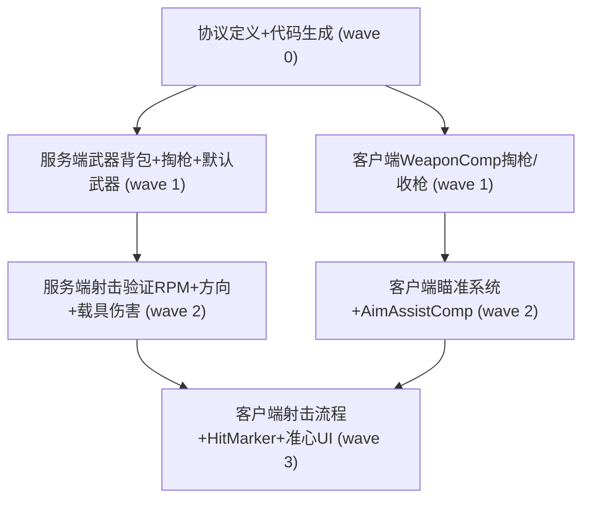

# 任务拆解：GTA5 风格武器系统

## Wave 汇总

| Wave | 任务 | 策略 |
|------|------|------|
| 0 | TASK-001(协议) | 单独执行，后续任务依赖 |
| 1 | TASK-002(服务端武器背包) + TASK-003(客户端WeaponComp掏枪) | 并行（不同工程） |
| 2 | TASK-004(射击验证增强) + TASK-005(客户端瞄准+辅助瞄准) | 并行（不同工程） |
| 3 | TASK-006(客户端射击流程+伤害反馈) | 依赖 TASK-004+005 |

## 依赖图

## 任务清单

[TASK-001] wave:0 depends:[] project:old_proto files:[old_proto/scene/scene.proto, old_proto/_tool_new/1.generate.py] 新增 WeaponBagNtf + DrawWeaponReq/Res 协议定义并运行代码生成

[TASK-002] wave:1 depends:[TASK-001] project:P1GoServer files:[common/citem/weapon_bag.go, servers/scene_server/internal/net_func/weapon_func.go, servers/logic_server/（登录链路）] 服务端：PlayerWeaponBag 持久化 + DrawWeaponReq 处理 + 登录 WeaponBagNtf 下发 + 默认武器初始化

[TASK-003] wave:1 depends:[TASK-001] project:freelifeclient files:[WeaponComp.cs, PlayerController相关注册] 客户端：WeaponComp DrawWeapon/HolsterWeapon + 状态锁 + DrawWeaponRes 回调 + 武器模型挂载/卸载 + WeaponBagNtf 接收初始化

[TASK-004] wave:2 depends:[TASK-002] project:P1GoServer files:[damage/check_manager.go, damage/shot.go, damage/hit.go, damage/damage.go] 服务端：CheckManager RPM 校验 + 方向角度校验 + 载具 canTakeDamage 扩展

[TASK-005] wave:2 depends:[TASK-003] project:freelifeclient files:[PlayerGunFightComp.cs, AimAssistComp.cs(新), CrosshairWidget.cs(新), PlayerController注册] 客户端：瞄准状态补齐(准心UI+FOV+IK) + AimAssistComp 辅助瞄准

[TASK-006] wave:3 depends:[TASK-004, TASK-005] project:freelifeclient files:[GunFightState.cs, HitMarkerWidget.cs(新), WeaponComp.cs] 客户端：射击流程(Raycast+ShotData/HitData上报) + Hit Marker + NPC受击反馈
