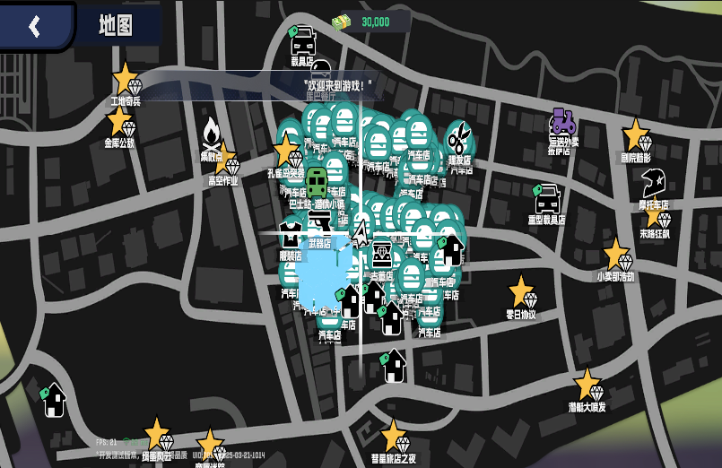

# 未修复bug

（无）

# 已修复bug

## Bug #1: 大世界NPC不显示+小地图图例不显示

- [x] 大世界看不到任何NPC，点击小地图中NPC的图例也没有在小地图中显示NPC的位置
  - **根因**：
    1. BigWorldNpcFsmComp 缺少服务端 NpcState 枚举值（如 Angry=16）的映射，导致 FSM 状态切换失败，NPC 动画不播放
    2. MapBigWorldNpcLegend 使用的图标 ID 50030 在 icon.xlsx MapIcon 表中不存在，导致 iconCfg=null，图例绘制被跳过
  - **修复**：
    1. 补全所有 NpcState 枚举到客户端 FSM 状态的映射（按移动/静止分类）
    2. icon.xlsx MapIcon 表添加 ID=50030 条目 + MapLegendControl 增加 NPC 存在性过滤
  - **验证**：261 个 NPC 加载，小地图图例正常显示
  - **Commit**: `82c1cf813a` (freelifeclient)
  - **修复截图**：
    - 
