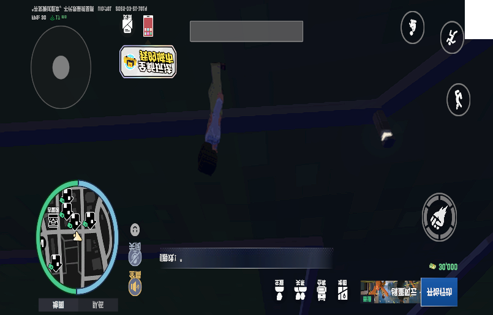
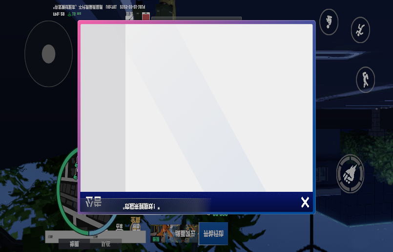

# 未修复bug
- [x] 狗投喂交互UI使用错误组件(InteractGetInWidget)，风格与其他NPC不一致且点击/F键无响应
  - **严重度**: visual-bug
- [x] 点击投喂按钮完全无反应：无喂食动画、无跟随行为、UI不消失。TriggerFeed回调未被触发，AnimalFeedReq未发送到服务器
  - **严重度**: logic-bug
- [x] 喂食成功后狗不跟随：AnimalFollowHandler到达检测阈值(≤4m)在喂食时立即触发（喂食要求≤3m），跟随状态只持续一帧即结束
  - **严重度**: logic-bug
- [x] 投喂狗无反应不跟随：双重bug——客户端/服务端距离判定不一致导致服务端拒绝(14002)，且RPC错误响应未回传客户端导致UniTask永远Pending
  - **严重度**: logic-bug

# 已修复bug
- [x] 大世界靠近狗时投喂交互UI不出现：InteractionPanel未在OpenPanelWhenEnterScene中打开，导致EShowNpcInteractUI事件无监听者
  - **严重度**: visual-bug
  - **截图**：
    - 
    - 
- [x] 召唤狗功能无HUD按钮入口，仅Alt+P快捷键可触发SummonDogPanel，用户无法发现此功能
  - **严重度**: visual-bug
