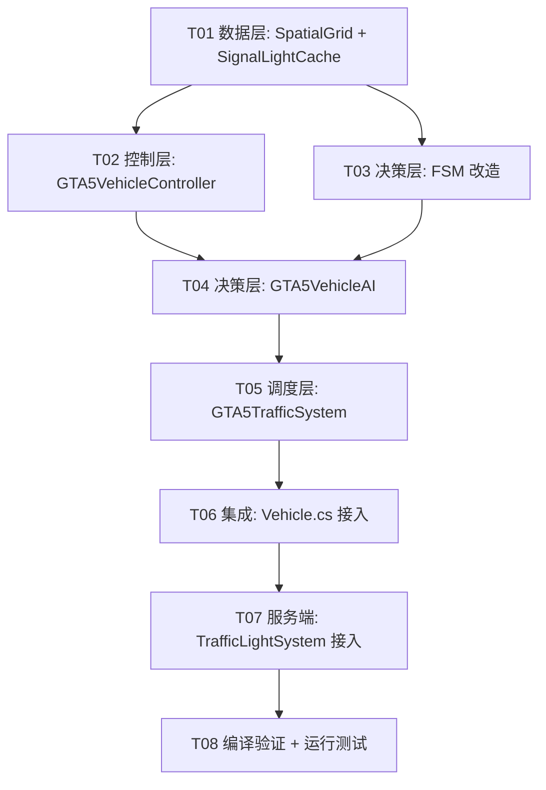

# 大世界交通系统 GTA5 式重构 - 任务清单

> ✅ 重构任务全部完成（2026-03-23）

## 任务依赖图

## 客户端任务

### [T01] 数据层：SpatialGrid + SignalLightCache
- 新建 `SpatialGrid.cs`：50m 网格空间查询，支持 Insert/Remove/QueryRadius
- 新建 `SignalLightCache.cs`：信号灯状态缓存，支持本地时间插值
- 依赖：无
- 完成标准：编译通过

### [T02] 控制层：GTA5VehicleController
- 新建 `GTA5VehicleController.cs`：从 TownVehicleDriver 提取路径跟随逻辑
- 包含：Catmull-Rom 样条、速度平滑、Y Raycast 修正、弯道减速、变道横移
- 依赖：T01（需要路网数据）
- 完成标准：编译通过

### [T03] 决策层：FSM 改造
- 改造 `JunctionDecisionFSM.cs`：移除 Gley 依赖，接入 SignalLightCache，增加死锁令牌
- 改造 `AvoidanceUpgradeChain.cs`：阈值参数化，蠕行/停车分级
- 改造 `LaneChangeController.cs`：速度预测安全检查
- 改造 `PersonalityDriver.cs`：补充默认兜底参数
- 依赖：T01（SignalLightCache）
- 完成标准：编译通过

### [T04] 决策层：GTA5VehicleAI
- 新建 `GTA5VehicleAI.cs`：统一 AI 控制器，组合三个 FSM
- 包含：LOD 级别管理、决策优先级、目标速度合成
- 依赖：T02, T03
- 完成标准：编译通过

### [T05] 调度层：GTA5TrafficSystem
- 新建 `GTA5TrafficSystem.cs`：替代 BigWorldTrafficSpawner
- 包含：车辆注册/注销、协议回调、LOD 更新、SpatialGrid 维护
- 依赖：T04
- 完成标准：编译通过

### [T06] 集成：Vehicle.cs 接入
- 改造 Vehicle.cs 交通车辆初始化，使用 GTA5TrafficSystem 替代原流程
- 保持与现有非交通车辆逻辑兼容
- 依赖：T05
- 完成标准：编译通过

## 服务端任务

### [T07] 服务端：TrafficLightSystem 接入
- 补全场景加载时 InitJunctions 调用
- 补全 Tick 后 GetChangedNtfs 广播逻辑
- 补全新玩家 AOI 同步逻辑
- 依赖：T06（客户端就绪后端到端测试）
- 完成标准：Go 编译通过

## 验证任务

### [T08] 编译验证 + 运行测试
- Unity 编译无错误
- Go 编译无错误
- 登录大世界场景验证交通车辆行驶
- 执行 TC-001 ~ TC-005 验收测试
- 依赖：T07
- 完成标准：全部测试通过
