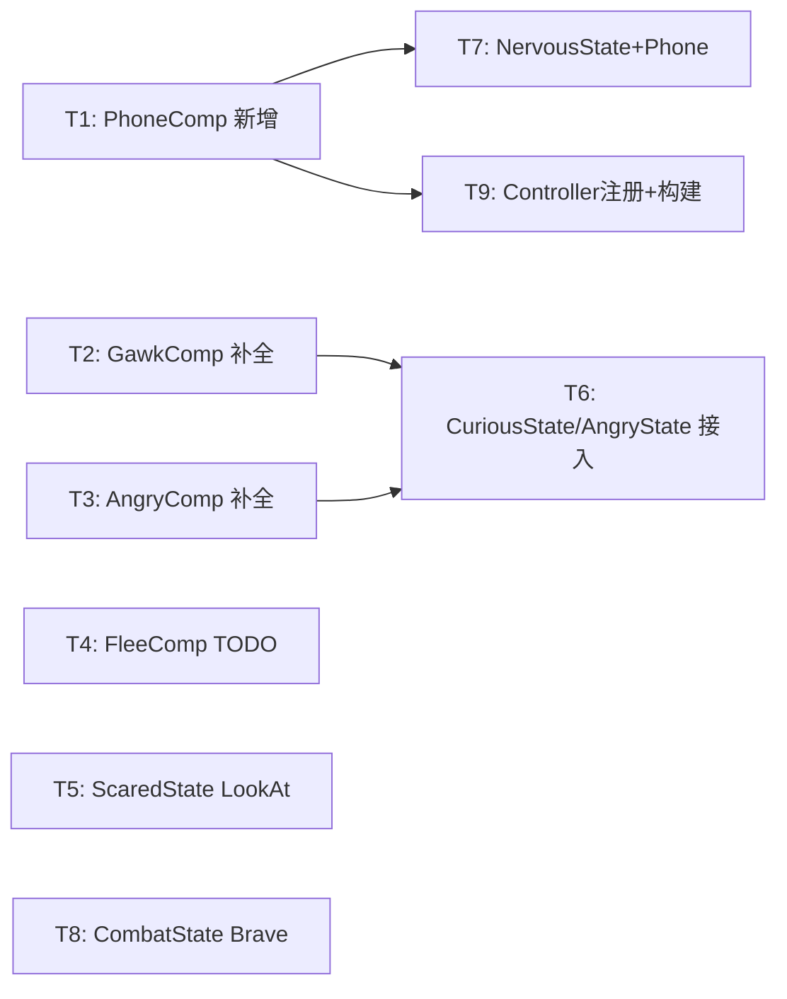

# NPC 情绪动画表现完善 — 技术设计

> **状态**: 实现中（逻辑补全完成，动画 key 占位待美术配置）
> **日期**: 2026-03-14
> **需求文档**: ped-ai-emotion-client.md
> **涉及工程**: freelifeclient

## 1. 现状与目标

### 1.1 现状

情绪系统框架已搭建（5 FSM State + 4 Comp + Proto + 消息处理链），但动画表现层有大量 TODO：

| 模块 | 完成度 | 缺失项 |
|------|--------|--------|
| FleeComp | 60% | 转身动画、尖叫动画 key 占位；跌倒动画 key 占位 |
| GawkComp | 30% | 目标位置查询、走向目标、GawkIdle 动画全缺 |
| AngryComp | 20% | 目标位置查询、走向目标、辱骂/推搡动画全缺 |
| ScaredState | 80% | 蹲伏时 LookAt 朝向未实现 |
| NervousState | 90% | 缺少 10% 打电话触发 |
| PanickedState | 95% | 跌倒 key 依赖 FleeComp |
| PhoneComp | 0% | **完全缺失**：掏手机→通话→收手机动画序列 |
| Brave 参数 | 0% | CombatState 未区分 Brave 和 Combat 动画参数 |

### 1.2 目标

补全所有情绪状态的动画表现，使验收标准 §6 的 11 条用例全部通过。

### 1.3 范围界定

- **本次范围**：步行 NPC 的全部情绪动画（Calm/Curious/Nervous/Scared/Panicked/Angry/Brave + Phone）
- **不在本次范围**：§4.6 载具内情绪行为（VehicleEscape/VehicleCrouch/VehicleShout/VehicleConfront/弃车），涉及独立的载具系统，复杂度高，建议单独迭代

## 2. 关键依赖

| 依赖 | 接口 | 状态 |
|------|------|------|
| 实体查询 | `TownNpcManager.TryQuery(ulong id, out controller)` → `controller.transform.position` | ✅ 已有 |
| 转身动画 | `TownNpcAnimationComp.SetTurnToTargetRotation(targetPos, targetRot, onEnd)` | ✅ 已有 |
| 移动动画 | `AnimationComp.Play(TransitionKey.BaseMove)` + `SetSpeed(key, speed)` | ✅ 已有 |
| 距离计算 | XZ 平方距离（禁用曼哈顿/3D） | ✅ 规范已定 |
| 面部表情 | `TransitionKey.FaceAngry=95`, `FaceMourn=96` | ✅ 枚举已有 |
| 摔倒动画 | `TransitionKey.FallDown=97` | ✅ 枚举已有 |

## 3. 详细设计

### 3.1 GawkComp 补全（围观行为）

**数据流**：`NpcEmotionChangeNtf` → `StateData.EmotionTargetId` → `CuriousState.OnEnter` → `GawkComp.StartGawk(targetId, safeDistance)`

**实现要点**：

```
StartGawk(targetId, safeDistance):
  1. TownNpcManager.TryQuery(targetId) 获取目标位置
  2. AnimationComp.Play(BaseMove) + SetSpeed(1.0) 正常步速
  3. 设置 _isApproaching = true

UpdateGawk(deltaTime):
  1. 若 _isApproaching:
     a. TownNpcManager.TryQuery 刷新目标位置
     b. 计算 XZ 平方距离
     c. 距离 ≤ safeDistance²: _isApproaching = false，切换 GawkIdle
     d. 否则: 更新朝向（LookAt 目标）
  2. 若 GawkIdle 状态:
     a. 持续 LookAt 目标（头部追踪）

StopGawk():
  1. AnimationComp.Play(BaseMove) + SetSpeed(0) 恢复待机
  2. 重置状态
```

**动画 Key 映射**：
- 走近阶段：`BaseMove` + `SetSpeed(1.0f)` + `SetParameter(BaseMove, Vector2.right)`
- 到达后：`BaseMove` + `SetSpeed(0f)`（原地站立张望）
- 朝向：每帧 `Quaternion.RotateTowards` 平滑转向目标（参考 ReactComp 的 `_watchTargetRot` + `UpdateRotation` 模式，转速 360°/s）
- 安全距离：优先从 `ConfigLoader` 读取 `NpcPersonalityConfig.gawk_safe_distance`，读取失败时 fallback 到硬编码默认值

### 3.2 AngryComp 补全（愤怒对抗）

**数据流**：`NpcEmotionChangeNtf` → `StateData.EmotionTargetId` → `AngryState.OnEnter` → `AngryComp.StartConfront(targetId)`

**实现要点**：

```
StartConfront(targetId):
  1. TownNpcManager.TryQuery(targetId) 获取目标位置
  2. AnimationComp.Play(BaseMove) + SetSpeed(1.5) 快步走
  3. AnimationComp.Play(FaceAngry) 触发愤怒表情
  4. 设置 _isApproaching = true

UpdateConfront(deltaTime):
  1. 若 _isApproaching:
     a. TownNpcManager.TryQuery 刷新目标位置
     b. 计算 XZ 平方距离
     c. 距离 ≤ PushDistance²(1.5m): _isApproaching = false，PlayPushAnim()
     d. 否则: 更新朝向
  2. 若推搡完成: 切回辱骂循环（原地愤怒手势）

StopConfront():
  1. 恢复默认动画
  2. 重置状态
```

**动画 Key 映射**：
- 快走阶段：`BaseMove` + `SetSpeed(1.5f)` + 朝向目标
- 愤怒表情：`FaceAngry`（TransitionKey=95）
- 推搡动画：使用独立占位常量 `AnimPush`（现有代码已定义），不复用 FallDown 避免语义混乱，美术配置后自动生效
- 辱骂循环：`BaseMove` + `SetSpeed(0f)` + 持续朝向目标（原地愤怒姿态）+ `FaceAngry` 表情

### 3.3 FleeComp TODO 补全

| TODO | 修复方案 |
|------|---------|
| 转身动画 | 调用 `TownNpcAnimationComp.SetTurnToTargetRotation()`，转身完成回调后开始奔跑 |
| 尖叫动画 | 使用 OneShot 播放音效 + 表情动画（`FaceMourn` 或专用 key），不阻塞移动 |
| 跌倒动画 | 使用 `FallDown`(97)，跌倒→播放完毕→恢复奔跑 |

### 3.4 PhoneComp 新增（打电话报警）

**数据流**：`NpcEmotionChangeNtf(ReactType=Phone)` → `StateData.EmotionReactUpdate` 信号 → `NervousState` 监听 → `PhoneComp.StartPhone(duration)`

**组件设计**：`TownNpcPhoneComp`（新增，注册在 TownNpcController.OnInit）

**状态机**（3 阶段）：

```
StartPhone(float phoneDuration):
  1. _phase = TakeOut
  2. AnimationComp.Play(PhoneTakeOut)  // 掏手机，固定 2s
  3. _phaseTimer = 2.0f

UpdatePhone(deltaTime):
  phase TakeOut:
    _phaseTimer -= deltaTime
    若 ≤ 0: _phase = Calling, _phaseTimer = phoneDuration, Play(PhoneCalling)
  phase Calling:
    _phaseTimer -= deltaTime
    若 ≤ 0: _phase = PutAway, _phaseTimer = 1.5f, Play(PhonePutAway)
  phase PutAway:
    _phaseTimer -= deltaTime
    若 ≤ 0: _phase = None, 通知完成

StopPhone():  // 高优先级打断（Scared/Panicked 触发）
  1. 立即 _phase = None
  2. 停止当前动画
  3. 重置状态
```

**动画 Key 映射**：
- 掏手机：占位 key `PhoneTakeOut`（待美术配置）
- 通话循环：占位 key `PhoneCalling`（待美术配置）
- 收手机：占位 key `PhonePutAway`（待美术配置）
- 通话时长：从 `StateData.PhoneDuration` 读取（服务器下发），不自行随机

**NervousState 集成**：
- OnEnter 时检查 `StateData.EmotionReactType == Phone`，若是则触发 `PhoneComp.StartPhone(StateData.PhoneDuration)`
- OnUpdate 中调用 `PhoneComp.UpdatePhone(deltaTime)`，PhoneComp 内部管理阶段切换
- 打断：收到高优先级状态（Scared/Panicked）时，FSM 切换会触发 NervousState.OnExit → `PhoneComp.StopPhone()`

### 3.5 Brave 状态动画参数

**复用 CombatState**：需求 §3.7 明确 Brave 复用 `TownNpcCombatState`。

**区分方式**：在 `TownNpcCombatState.OnEnter` 中检查 `StateData.PersonalityType`：
- Brave/Fearless 人格：正常站立 + 警惕姿势（`BaseMove` + `SetSpeed(0)` + 面朝威胁方向）
- 其他人格：现有 Combat 逻辑不变

**实现**：CombatState.OnEnter 中增加分支判断，无需新增组件。

### 3.6 ScaredState 蹲伏朝向

蹲伏时持续 LookAt 威胁方向：
```
OnEnter → DuckCover 模式:
  1. TownNpcManager.TryQuery(stateData.EmotionTargetId) 获取目标位置
  2. 计算 XZ 朝向，Quaternion.LookRotation
  3. 设 _isRotating = true

OnUpdate:
  1. 若 _isRotating: Quaternion.RotateTowards 每帧平滑转向
  2. 周期性刷新目标位置（每 0.5s）
```

## 4. 文件变更清单

| 文件 | 变更类型 | 说明 |
|------|---------|------|
| `TownNpcGawkComp.cs` | **重写** | 补全 StartGawk/UpdateGawk/StopGawk，安全距离改读配置表 |
| `TownNpcAngryComp.cs` | **重写** | 补全 StartConfront/UpdateConfront/StopConfront，推搡用独立 key |
| `TownNpcPhoneComp.cs` | **新增** | 打电话 3 阶段状态机（TakeOut→Calling→PutAway） |
| `TownNpcFleeComp.cs` | **修改** | 补全转身、尖叫、跌倒 3 处 TODO |
| `TownNpcScaredState.cs` | **修改** | 补全蹲伏 LookAt 朝向 |
| `TownNpcCuriousState.cs` | **修改** | OnUpdate 调用 GawkComp.UpdateGawk |
| `TownNpcAngryState.cs` | **修改** | OnUpdate 调用 AngryComp.UpdateConfront |
| `TownNpcNervousState.cs` | **修改** | 集成 PhoneComp 触发（ReactType==Phone 时） |
| `TownNpcCombatState.cs` | **修改** | OnEnter 增加 Brave 人格分支 |
| `TownNpcController.cs` | **修改** | OnInit 中 AddComp\<TownNpcPhoneComp\> |

## 5. 风险与缓解

| 风险 | 缓解 |
|------|------|
| 部分 TransitionKey 无对应美术资源 | 使用现有最近似 key 占位，美术配置后自动生效 |
| 目标实体可能已销毁 | TryQuery 返回 false 时停止行为，切回 Idle |
| 推搡动画无专用 key | 使用独立占位常量，美术配 key 后自动生效 |
| 打电话动画无专用 key | 3 个阶段均使用占位 key，美术配置后生效 |
| 配置表 NpcPersonalityConfig 尚未创建 | GawkComp 保留硬编码 fallback，配置表就绪后自动切换 |

## 6. 任务清单

### 6.1 依赖图



### 6.2 任务列表

**第一批（无依赖，可并行）**：

| 编号 | 任务 | 文件 | 说明 |
|------|------|------|------|
| T1 | 新增 TownNpcPhoneComp | `TownNpcPhoneComp.cs`（新增） | 3 阶段状态机：TakeOut→Calling→PutAway |
| T2 | 补全 TownNpcGawkComp | `TownNpcGawkComp.cs`（重写） | 目标查询+走近+GawkIdle+LookAt+安全距离配置化 |
| T3 | 补全 TownNpcAngryComp | `TownNpcAngryComp.cs`（重写） | 目标查询+快走+推搡+辱骂循环 |
| T4 | 补全 FleeComp TODO | `TownNpcFleeComp.cs`（修改） | 转身/尖叫/跌倒 3 处 TODO |
| T5 | 补全 ScaredState LookAt | `TownNpcScaredState.cs`（修改） | 蹲伏时持续朝向威胁方向 |
| T8 | CombatState Brave 分支 | `TownNpcCombatState.cs`（修改） | OnEnter 按 PersonalityType 区分动画 |

**第二批（有依赖）**：

| 编号 | 任务 | 文件 | 依赖 |
|------|------|------|------|
| T6 | CuriousState/AngryState 接入 Comp | `TownNpcCuriousState.cs` `TownNpcAngryState.cs`（修改） | T2, T3 |
| T7 | NervousState 集成 PhoneComp | `TownNpcNervousState.cs`（修改） | T1 |
| T9 | Controller 注册 + 构建验证 | `TownNpcController.cs`（修改） | T1 |
