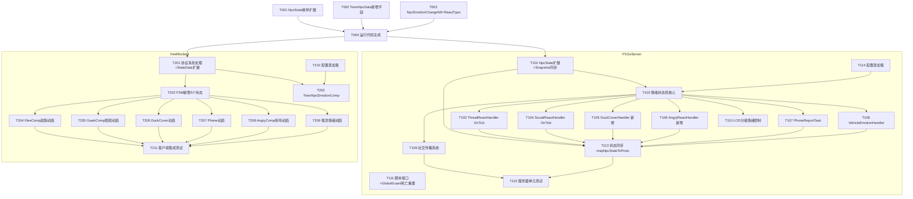

# 路人 AI 与情绪反应 — 任务清单

> ✅ **协议+服务端+客户端核心任务已全部完成**（T001-T004, T101-T113, T201-T211）。部分 Handler（ThreatReact/SocialReact）OnTick 细节待补全。

> **日期**: 2026-03-13
> **设计文档**: ped-ai-emotion-server.md, ped-ai-emotion-client.md

## 任务依赖图



---

## 任务清单

### 协议工程（old_proto） — 最高优先级，其余工程均依赖

| 编号 | 任务 | 完成标准 |
|------|------|---------|
| T001 | NpcState 枚举新增 Scared=12/Panicked=13/Curious=14/Nervous=15/Angry=16 | 枚举值无冲突，编译通过 |
| T002 | TownNpcData 新增 mood_level/emotion_state/personality_type/move_speed/flee_attr_flags 共 5 个字段（字段号 30-34） | 字段号不与现有字段冲突 |
| T003 | 新增 NpcEmotionChangeNtf 消息（10 个字段）+ ReactType 枚举（12 个值） | proto 语法正确，与服务器 §7.3 定义一致 |
| T004 | 运行 `old_proto/_tool_new/1.generate.py`，验证生成产物 | Go/C# 代码无编译错误；Go 产物在 P1GoServer；C# 产物在 freelifeclient |

---

### P1GoServer — 依赖 T004

| 编号 | 任务 | 依赖 | 完成标准 |
|------|------|------|---------|
| T101 | NpcState 扩展：新增 emotionState/moodLevel/personalityType/decayTimer/reportCooldown/spreadCooldown/dedupeTimer 字段；同步更新 NpcStateSnapshot + FieldAccessor | T004 | `make build` 通过；Snapshot 字段与 NpcState 一一对应 |
| T114 | 配置表加载：定义 NpcEmotionConfig（衰减因子/触发阈值）和 NpcPersonalityConfig（逃跑距离/围观距离）结构体，从 bin/config/ 加载 | T004 | 配置文件缺失时使用默认值，不崩溃 |
| T102 | 情绪状态机核心：moodLevel 每秒衰减（k 按个性读配置）；状态跃迁（Level1/2/3 映射）；多事件叠加规则；200ms 去重窗口；脚本钉定（pinned）标志 | T101, T114 | 单元测试覆盖：衰减时序、跨级跳变、同帧叠加、去重 |
| T111 | GlobalGuard 死亡重置：死亡时清零 moodLevel、重置 emotionState=Calm、清空所有计时器、推送 NpcEmotionChangeNtf(Calm)；脚本接口 SET_PED_FLEE_ATTRIBUTES 位掩码读写 | T101 | 死亡后再复活以 Calm 初始化；钉定情绪不参与自然衰减 |
| T110 | LOD 分级情绪控制：LOD0↔LOD1 冻结/恢复；LOD2 丢弃重置；Panicked 并发上限 20 个（排队策略按距离/时间/LOD） | T102 | LOD 切换测试：Scared 冻结→恢复；LOD2 进出以 Calm 初始化 |
| T103 | ThreatReactHandler OnTick：Nervous→设置 moveSpeed=1.2；Scared→逃跑目标+moveSpeed=2.0；Panicked→moveSpeed=3.5+is_trip_fall(5%概率服务器决定) | T102 | flee_attr_flags(FLEE_CAN_SCREAM) 控制尖叫标志下行 |
| T104 | SocialReactHandler OnTick：Curious→围观导航目标（按个性安全距离）；围观超时 30s 返回 Scenario；升级 Level2+ 切换 ThreatReact | T102 | 超时返回；个性安全距离 4/6/8/10m |
| T105 | DuckCoverHandler 新增：Scared + 无逃跑目标时触发；寻找半径 15m 内掩体；蹲伏+LookAt；解除条件（moodLevel < Nervous 或威胁消失 10s）；Panicked 时 ForceExit | T102 | react_type=DuckCover 正确下行 |
| T106 | AngryReactHandler 新增：Angry + Confident/Fearless→走向肇事者+辱骂；Angry 衰减→OnExit；对方攻击→移交 CombatBtHandler | T102 | 个性过滤：Coward 不进入此 Handler |
| T107 | PhoneReportTask：reportCooldown=120s；Phase1(2s)+Phase2(phone_duration 随机 5-10s)；完成→WantedSystem+1；打断→OnExit 不触发 | T102 | 冷却验证；被打断不加通缉值 |
| T108 | VehicleEmotionHandler：车内感知参数差异（15m/衰减 0.4）；各情绪×角色的响应逻辑；collision_severity 判定（阈值配置）；载具隔离（不参与社交传播） | T102, T114 | 驾驶员/乘客分支正确；严重碰撞触发下车 |
| T109 | 社交情绪传播系统：视觉 5m+听觉 10m；传播衰减 0.7；单 NPC 传播上限 3 个；全局 40 次/帧上限（超出次帧补算，最多积压 3 帧）；反向传播（k=0.98）；载具隔离 | T102 | 满载测试（40 次/帧）不丢帧；次帧补算不遗漏 |
| T113 | 状态同步扩展：mapNpcStateToProto 新增 emotion_state/mood_level/move_speed/flee_attr_flags/react_type/phone_duration/is_trip_fall/collision_severity；syncNpcStateToTownNpc 同步新字段；增量 Ntf 推送逻辑（仅状态跃迁时推送） | T103~T109 | 全量同步+增量 Ntf 双路径正确 |
| T115 | 服务器单元测试：情绪状态机（衰减/跃迁/多事件叠加）；传播系统（满载/次帧补算）；PhoneReportTask 冷却 | T109, T113 | `make test` 全部通过 |

---

### freelifeclient — 依赖 T004

| 编号 | 任务 | 依赖 | 完成标准 |
|------|------|------|---------|
| T201 | TownNpcStateData 扩展：新增 MoodLevel/EmotionState/PersonalityType/MoveSpeed/FleeAttrFlags；注册 NpcEmotionChangeNtf 消息处理；OnNpcEmotionChange 触发 FSM 切换 | T004 | 旧版无情绪字段时默认 Calm，无崩溃 |
| T210 | 配置表加载（客户端）：NpcPersonalityConfig/NpcEmotionConfig C# 结构体；Config 生成（打表工具运行）；读取接口 | T004 | 配置缺失时使用默认值 |
| T202 | FSM 新增 5 个状态：TownNpcScaredState/PanickedState/CuriousState/NervousState/AngryState；在 _stateTypes[11-15] 注册；各状态 Enter/Tick/Exit 基础框架 | T201 | FSM 切换不崩溃；索引无越界 |
| T203 | TownNpcEmotionComp：接收 Ntf 后更新 StateData→触发 FSM；集成 FleeAttrFlags 缓存（全量+增量合并） | T201, T210 | Controller.OnInit 中注册 |
| T204 | FleeComp 逃跑动画：ScaredState(moveSpeed=2.0)/PanickedState(moveSpeed=3.5)；is_trip_fall=true 时播放跌倒序列（爬起→继续跑）；flee_attr_flags FLEE_CAN_SCREAM 控制尖叫；FLEE_TURN_180 控制转身 | T202 | 跌倒动画连贯；被打断时中断 |
| T205 | GawkComp 围观动画：CuriousState 下 HeadLook 朝向 target_id；缓步移近至个性安全距离；到达后 GawkIdle；升级 Scared+ 时立即退出 | T202, T210 | 安全距离从配置读取 |
| T206 | DuckCover 动画：ScaredState + ReactType_DuckCover；播放蹲伏循环；持续 LookAt 威胁方向（target_id）；收到 Calm/Nervous Ntf 时切换回 Idle | T202 | 蹲伏姿势正确；朝向每帧更新 |
| T207 | Phone 动画：PhoneState 下动画序列（掏手机 2s→通话 phone_duration 秒→收手机）；打断立即切换；通话音效跟随 phone_duration | T202 | 不自行随机时长；打断无残留动画 |
| T208 | AngryComp 辱骂动画：AngryState 下快步走向 target_id + 辱骂手势循环；到达 1.5m 内播放 Push；收到 Combat=8 切换 CombatState | T202 | Push 距离判定正确 |
| T209 | 载具情绪动画：VehicleEscape（方向盘打满+前倾）；VehicleCrouch（头低于车窗）；VehicleShout（摇窗+辱骂）；VehicleConfront（下车对抗）；Panicked 弃车（推门序列+切换步行 PanickedState）；collision_severity 区分 Shout vs Confront | T202 | 弃车动画连贯；步行 FSM 切换正确 |
| T211 | 客户端集成测试：逃跑/跌倒/围观/打电话/辱骂/蹲伏/载具弃车视觉验收；协议兼容（旧版默认 Calm）；FSM 切换无残留 | T204~T209 | 验收标准见 ped-ai-emotion-client.md §6 |

---

## 并行执行建议

```
阶段 1（串行）：T001 → T002 → T003 → T004
阶段 2（并行）：T001~T004 完成后，服务器和客户端可完全并行
  服务器线：T101 → T114 → T102 → (T103~T110 并行) → T111 → T113 → T115
  客户端线：T201 → T210 → T202 → T203 → (T204~T209 并行) → T211
```

关键路径：**T001-T004（协议）→ T101 → T102 → T103/T109 → T113**
