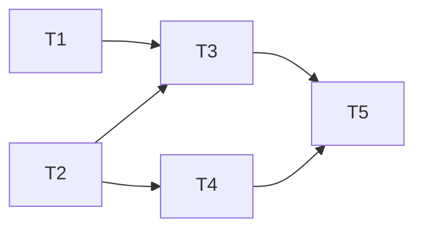

# 大地图追击体验优化 V2

> 状态：联调完成
> 日期：2026-03-19
> 基于：map-npc-chase.md（V3 方案，实现完成待联调）

## 需求

在 V3（服务端 NavMesh 路点跟随）基础上新增：

| # | 功能 | 描述 |
|---|------|------|
| F1 | 不立即关闭小地图 | 点击 NPC 图例后小地图保持打开，玩家自行关闭 |
| F2 | 追踪中 NPC 图例不消失 | 被追踪 NPC 的图例在追击期间始终可见 |
| F3 | 实时追踪路线显示 | 小地图上绘制当前 waypoints 路径线 |
| F4 | NPC 延迟 5 秒消失 | 追踪结束或不可达后，5 秒倒计时才隐藏 NPC 图例 |

**涉及工程**：仅 `freelifeclient/`（无协议/服务端变更）

---

## 架构设计

### 数据流

```
PlayerAutoMoveComp          MapPanel
  IsChasing ────────────►  每帧轮询，检测追击状态变化
  TargetNpcNetId ────────►  确定哪个图例需要"锁定"
  GetWaypoints() ────────►  路线绘制元素用来画线
  OnStopChase event ─────►  触发 5 秒倒计时
```

### 通信方式

MapPanel **纯轮询** PlayerAutoMoveComp（已有 OnFrameUpdate），无需任何事件/回调。

追击停止检测：记录上一帧的 `_wasChasing`，`_wasChasing && !IsChasing` 时触发 5 秒倒计时。
此方案完全规避回调生命周期问题。

---

## 详细设计

### 1. PlayerAutoMoveComp 新增公开 API

```csharp
// 已有
public bool IsChasing => _isChasing;

// 新增
public ulong TargetNpcNetId => _targetNpcNetId;

// 新增：返回当前有效路点的只读快照（供 MapPanel 绘制，零分配）
public (Vector3[] waypoints, int startIndex, int count) GetWaypointsSnapshot()
    => (_waypoints, _waypointIndex, _waypointCount);
```

**无需新增事件/回调**，MapPanel 通过轮询检测状态变化。

### 2. MapPanel 修改

#### 2.1 移除自动关闭（F1）

```csharp
// 修改前（L1758-1760）
autoMove?.StartChase(targetNetId);
UIManager.Close(PanelEnum.Map).Forget();  // ← 删除此行
return;
```

#### 2.2 NPC 图例锁定（F2 + F4）

新增字段：
```csharp
private ulong _pinnedNpcNetId;       // 当前被锁定的 NPC NetId（0 = 无）
private float _npcUnpinCountdown;    // 解锁倒计时（秒），0 = 已解锁
private bool _wasChasing;            // 上一帧的追击状态（用于检测停止时机）
private const float NpcUnpinDelay = 5f;
```

**OnOpen 时同步初始状态**（避免打开时状态残留）：
```csharp
var autoMove = PlayerManager.Controller?.AutoMoveComp;
_wasChasing = autoMove?.IsChasing ?? false;
_pinnedNpcNetId = _wasChasing ? (autoMove?.TargetNpcNetId ?? 0UL) : 0UL;
_npcUnpinCountdown = 0f;
```

**OnClose 时清零**（避免下次打开残留）：
```csharp
_pinnedNpcNetId = 0;
_npcUnpinCountdown = 0f;
_wasChasing = false;
```

在 `OnFrameUpdate` 中（纯轮询，无回调）：
```csharp
var autoMove = PlayerManager.Controller?.AutoMoveComp;
bool isChasing = autoMove?.IsChasing ?? false;

// 追击状态同步
if (isChasing)
{
    // 切换目标或开始追击：重置倒计时，更新锁定目标
    var newNetId = autoMove.TargetNpcNetId;
    if (newNetId != _pinnedNpcNetId)
    {
        _pinnedNpcNetId = newNetId;
        _npcUnpinCountdown = 0f; // 取消旧目标倒计时
    }
}
else if (_wasChasing && !isChasing)
{
    // 刚停止追击 → 启动 5 秒倒计时
    _npcUnpinCountdown = NpcUnpinDelay;
}

_wasChasing = isChasing;

// 倒计时递减
if (_npcUnpinCountdown > 0f)
{
    _npcUnpinCountdown -= deltaTime;
    if (_npcUnpinCountdown <= 0f)
    {
        _pinnedNpcNetId = 0;
        _npcUnpinCountdown = 0f;
    }
}
```

**图例可见性覆盖（F2）— 锁定点：`RefreshLegends` 移除阶段**

`RefreshLegends` 中移除图例的逻辑（L1201-1222）：收集不在 `_tempSets` 中的 ID → 移除 widget。
在收集移除列表时，若该 ID == `_pinnedNpcNetId`，跳过（不加入移除列表）：

```csharp
// L1201 附近，现有循环中加条件：
foreach (var (id, _) in dict)
{
    if (!_tempSets[type].Contains(id))
    {
        // F2: 追踪中的 NPC 图例不移除
        if (type == MapLegendType.TownNpc && id == _pinnedNpcNetId)
            continue;
        legendChange = true;
        _tempLists[type].Add(id);
    }
}
```

此为**唯一需要修改的显隐控制路径**。图例进入 `AllLegendDicts` 的过滤由 `LegendControl` 决定，
MapPanel 只在**移除阶段**加守卫，保住已创建的 widget。

#### 2.3 追踪路线绘制（F3）

新增内部类 `RouteLineElement`（UI Toolkit Painter2D）：

```csharp
private class RouteLineElement : VisualElement
{
    private Vector2[] _points;
    private int _pointCount;

    public RouteLineElement()
    {
        pickingMode = PickingMode.Ignore; // 不拦截点击
        style.position = Position.Absolute;
        style.left = style.top = style.right = style.bottom = 0;
        generateVisualContent += Draw;
    }

    // points 已转换为地图 UI 坐标（像素）
    public void SetPoints(Vector2[] points, int count)
    {
        _points = points;
        _pointCount = count;
        MarkDirtyRepaint();
    }

    public void Clear()
    {
        _pointCount = 0;
        MarkDirtyRepaint();
    }

    private void Draw(MeshGenerationContext ctx)
    {
        if (_points == null || _pointCount < 2) return;
        var p = ctx.painter2D;
        p.strokeColor = new Color(0f, 0.9f, 1f, 0.9f); // 青色
        p.lineWidth = 5f;
        p.lineCap = LineCap.Round;
        p.lineJoin = LineJoin.Round;
        p.BeginPath();
        p.MoveTo(_points[0]);
        for (int i = 1; i < _pointCount; i++)
            p.LineTo(_points[i]);
        p.Stroke();
    }
}
```

**挂载层级**：`RouteLineElement` 挂载到 `_view.legendGroup`（与图例同层），
`style.position = Absolute`，四边 = 0，铺满父容器。

**坐标空间**：`GetMapPosition(Vector3 worldPos)` 调用 `MapManager.GetMapPos`，返回相对于 `MapGp` 的地图局部坐标（像素），与图例 `CalcMapPosAndMove` 使用同一方法。
`legendGroup` 是 `MapGp` 的子级，坐标系一致，无需额外转换。
路线会随地图拖拽/缩放自然跟随（因为 `legendGroup` 本身随 `MapGp` 变换）。

在 `OnOpen` 时创建，`OnClose` 时从父容器移除并置 null：
```csharp
// OnClose
_routeLine?.RemoveFromHierarchy();
_routeLine = null;
```

每帧刷新（OnFrameUpdate，加 null 守卫）：
```csharp
if (_routeLine == null) return; // OnClose 后保护

if (isChasing)
{
    var (wps, startIdx, count) = autoMove.GetWaypointsSnapshot();
    if (wps != null && count > startIdx)
    {
        int drawCount = count - startIdx;
        if (_routeUIPoints == null || _routeUIPoints.Length < drawCount)
            _routeUIPoints = new Vector2[drawCount];
        for (int i = 0; i < drawCount; i++)
            _routeUIPoints[i] = GetMapPosition(wps[startIdx + i]);
        _routeLine.SetPoints(_routeUIPoints, drawCount);
    }
}
else
{
    _routeLine.Clear();
}
```

---

## 状态流转（补充）

```
点击NPC图例
  → StartChase(netId)           // 追击启动
  → 小地图保持打开              // F1: 不自动关闭
  → _pinnedNpcNetId = netId     // F2: 图例锁定
  → RouteLineElement 每帧更新   // F3: 路线绘制

追击中
  → OnFrameUpdate: 画路线 + 保持图例可见

追击停止（到达/打断/失败）
  → StopChase() → OnChaseStopped()
  → _npcUnpinCountdown = 5f     // F4: 开始倒计时
  → 5 秒后 _pinnedNpcNetId = 0  // NPC 恢复正常显隐
  → RouteLineElement.Clear()    // 路线消失
```

---

## 边界条件

| 场景 | 处理 |
|------|------|
| 打开地图时已在追击中 | OnOpen 立即同步 _pinnedNpcNetId 和路线 |
| 关闭再重新打开地图 | OnOpen 同步 _wasChasing/_pinnedNpcNetId 初始状态 |
| 地图关闭时倒计时未结束 | OnClose 清零倒计时，关闭路线元素 |
| 快速切换追击目标 | _pinnedNpcNetId 更新为新目标，旧目标解锁 |
| 路点为空（直线降级模式） | drawCount=0，RouteLineElement.Clear() |
| NPC 不在视野范围内 | 图例固定显示（F2 锁定覆盖正常隐藏） |

---

## 改动文件清单

| 文件 | 改动内容 |
|------|---------|
| `PlayerAutoMoveComp.cs` | 新增 TargetNpcNetId、GetWaypointsSnapshot() |
| `MapPanel.cs` | 删除 UIManager.Close、新增路线元素+锁定逻辑 |
| `MapLegendControl.cs` | 新增 EnsureTownNpcLegend()、RemoveTownNpcLegend() |

---

## 联调踩坑记录

### 坑1：F2/F3 完全无效——RefreshAllLegends 先清后建

**现象**：F2 图例守卫代码写在移除阶段，F3 RouteLineElement 加入 legendGroup，但两者均无效。

**根因**：`RefreshAllLegends` 第一行调 `ClearLegendDict()`，它会：
1. 清空 `_legendWidgets`（所有 widget 引用丢失）
2. 调 `_view.legendGroup.Clear()`（从 hierarchy 移除所有子元素，包括 RouteLineElement）

之后按 `AllLegendDicts` 重建。**我的移除阶段守卫代码在清空之后根本不会遍历到任何已保存的 widget。**

**修复**：
- F2：在 `ClearLegendDict` 之前调 `LegendControl.EnsureTownNpcLegend(_pinnedNpcNetId)`，确保 NPC 在 AllLegendDicts 里，重建时自然生成 widget
- F3：`ClearLegendDict` 之后立即 `_view.legendGroup.Add(_routeLine.RootElement)` 重新挂载

### 坑2：F4 倒计时到期后 NPC 不消失

**根因**：`EnsureTownNpcLegend` 把 NPC 加入了 `TownNpcDict`，倒计时到期 `_pinnedNpcNetId=0` 后 `RefreshAllLegends` 仍能在 `AllLegendDicts` 找到它，会重建 widget。

**修复**：倒计时到期时，若 `ShowAllTownNpc=false`，调 `LegendControl.RemoveTownNpcLegend` 主动从字典删除。若 `ShowAllTownNpc=true`（用户主动开了全NPC显示），则保持可见（符合预期）。

### 坑3：F2 设置 _pinnedNpcNetId 时机太晚

**根因**：原来在 `OnUpdate → RefreshChaseDisplay` 里才设置 `_pinnedNpcNetId`，但 `StartChase` 调用后可能当帧就触发 `RefreshAllLegends`（`LegendControl._frameUpdate=true`），此时 `_pinnedNpcNetId` 还是 0，`EnsureTownNpcLegend` 不执行。

**修复**：在 `SelectNewLegendByClickLegend` 调 `StartChase` 之后立即设置 `_pinnedNpcNetId = targetNetId`。

### 坑4：RouteLineElement 尺寸为零

**根因**：`legendGroup` 的子元素全是 absolute 定位，父容器自身尺寸由内容决定，实际为 0。`right=0, bottom=0` 锚定不起作用，RouteLineElement 无渲染区域。

**修复**：AfterViewLayout 时读 `legendGroup.resolvedStyle.width/height` 设置明确像素尺寸，fallback 到 `MapWidth/MapHeight`。

### 坑5：路线坐标偏移

**根因**：`GetMapPosition` 返回未缩放的地图坐标，而图例 widget 实际位置是 `MapPos * _curScale`（见 `RefreshLegendPosition`）。两者相差 1.5 倍（默认 scale）。

**修复**：`GetMapPosition(wp) * _curScale`。

### 坑6：路线玩家端断层

**根因**：路线从 `_waypoints[startIdx]`（当前目标路点）开始，玩家到该路点之间没有线段。

**修复**：把玩家当前世界坐标转换后作为路线首点插入，路线始终从玩家脚下连续延伸到目标。

---

## 任务清单



| 编号 | 任务 | 文件 | 依赖 | 完成标准 |
|------|------|------|------|---------|
| T1 | PlayerAutoMoveComp：新增 TargetNpcNetId + GetWaypointsSnapshot | `PlayerAutoMoveComp.cs` | 无 | Unity 编译通过 |
| T2 | MapPanel：移除自动关闭地图（F1） | `MapPanel.cs` | 无 | 点击 NPC 图例后地图不关闭 |
| T3 | MapPanel：追踪路线绘制 RouteLineElement（F3） | `MapPanel.cs` | T1 | 追击时地图显示青色路线 |
| T4 | MapPanel：NPC 图例锁定 + 5s 倒计时（F2/F4） | `MapPanel.cs` | 无 | 追击中图例不消失，停止后 5s 消失 |
| T5 | 联调测试 | — | T3+T4 | F1-F4 全部验证通过 |
