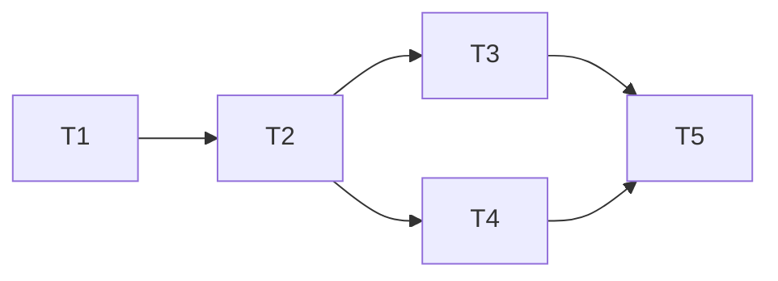

# 大地图点击 NPC 自动寻路追击

> 状态：实现完成，已联调（V2 增强版见 map-npc-chase-v2.md）
> 日期：2026-03-19

## 需求

- 点击大地图上的 NPC 图例后，玩家角色自动 NavMesh 寻路追向 NPC
- NPC 是移动目标，路径需持续更新
- 玩家手动控制角色时立即打断追击
- 到达 NPC 附近自动停止

## 方案演进

| 版本 | 方案 | 问题 |
|------|------|------|
| V1 | 客户端 A* Seeker 寻路 | 小镇场景无 A* NavMesh 数据 |
| V2 | 客户端直线+Raycast避障 | 无法绕过建筑物 |
| **V3（当前）** | **服务端 NavMesh 计算路径，客户端路点跟随** | — |

## 涉及工程

| 工程 | 文件 | 改动 |
|------|------|------|
| `old_proto/` | `scene/scene.proto` | 新增 FindNavPathReq/FindNavPathRes + RPC (=3140) |
| `old_proto/` | 运行 `_tool_new/1.generate.py` | 生成 Go + C# 代码 |
| `P1GoServer/` | `scene_server/internal/net_func/town/navigate.go` | **新建** handler |
| `freelifeclient/` | `PlayerAutoMoveComp.cs` | **重写**：路点跟随 + 定期刷新 |
| `freelifeclient/` | `MapPanel.cs` | 微调（已实现，无需再改） |

## 现有系统分析

### 服务器 NavMesh API

```go
// P1GoServer/servers/scene_server/internal/ecs/res/navmesh/navmesh_mgr.go
path, err := navMeshMgr.FindPath(&startPos, &endPos)
// 返回 []*transform.Vec3
```

> **坐标系说明**：`FindPath` 注释写"Z轴取反"但代码实际**未做转换**（L174/189 `Z: startPos.Z`）。
> NPC 寻路正常工作说明 NavMesh 数据就是 Unity 坐标系，客户端坐标可直接传入，无需额外转换。

### 服务器 Handler 模式

```go
// town/asset.go L16-28
type TownHandler struct {
    scene        common.Scene
    playerEntity common.Entity
    ctx          *rpc.RpcContext
}
// 方法签名：func (h *TownHandler) Method(req *proto.XxxReq) (*proto.XxxRsp, *proto_code.RpcError)
```

### 客户端网络 API

```csharp
NetManager.Call<FindNavPathReq, FindNavPathRes>(module, cmd, req, OnPathReceived);
```

## 详细设计

### 1. 协议 (old_proto/scene/scene.proto)

在 service Scene 块中追加（紧跟 3139 之后）：

```protobuf
// === 导航追击 ===
message FindNavPathReq {
    uint64 target_npc_net_id = 1;   // 目标NPC的NetId
    base.Vector3 start_pos = 2;     // 玩家当前位置（Unity坐标系）
    uint32 request_id = 3;          // 请求序列号（客户端递增，防止过期响应覆盖）
}

message FindNavPathRes {
    repeated base.Vector3 waypoints = 1; // NavMesh路点（Unity坐标系，无需坐标转换）
    base.Vector3 npc_pos = 2;            // NPC当前位置
    uint32 request_id = 3;               // 回传请求序列号
    int32 result_code = 4;               // 0=成功, 1=NPC不存在, 2=路径不可达
}

cs FindNavPath(FindNavPathReq) returns(FindNavPathRes) = 3140; // 导航追击路径请求
```

**设计决策**：
- 编号 **3140**（紧跟 3139，不跳号）
- `request_id` 防止快速切换目标时过期响应覆盖当前路径
- `result_code` 让客户端区分失败原因，选择不同降级策略
- 客户端上报 `start_pos`（服务端坐标可能有同步延迟）
- 返回 `npc_pos` 让客户端判断 NPC 是否已大幅移动

### 2. 服务器 Handler

**新建** `P1GoServer/servers/scene_server/internal/net_func/town/navigate.go`

```go
func (h *TownHandler) FindNavPath(req *proto.FindNavPathReq) (*proto.FindNavPathRes, *proto_code.RpcError) {
    res := &proto.FindNavPathRes{RequestId: req.RequestId}

    // 0. 场景/参数校验
    if !isTownScene(h.scene) || req.StartPos == nil {
        res.ResultCode = 2
        return res, nil
    }

    // 1. 查找NPC Entity（校验实体类型，防止通过非NPC ID泄露位置）
    npcEntity, ok := h.scene.GetEntity(req.TargetNpcNetId)
    if !ok || npcEntity == nil || npcEntity.EntityType() != common.EntityType_Npc {
        res.ResultCode = 1 // NPC不存在
        return res, nil
    }

    // 2. 获取NPC位置（通过 Transform 组件）
    transformComp, ok := npcEntity.GetComponent(common.ComponentType_Transform).(*ctrans.Transform)
    if !ok || transformComp == nil {
        res.ResultCode = 1
        return res, nil
    }
    npcPos := transformComp.Position()

    // 3. 获取NavMeshMgr
    navMeshMgr, ok := common.GetResourceAs[*navmesh.NavMeshMgr](h.scene, common.ResourceType_NavMeshMgr)
    if !ok || navMeshMgr == nil {
        res.ResultCode = 2
        return res, nil
    }

    // 4. FindPath（Unity坐标系直接传入，无需转换）
    startPos := transform.Vec3{X: req.StartPos.X, Y: req.StartPos.Y, Z: req.StartPos.Z}
    path, err := navMeshMgr.FindPath(&startPos, &npcPos)
    if err != nil {
        res.ResultCode = 2 // 路径不可达
        return res, nil
    }

    // 5. 返回路点（内联转换，无 helper 函数）
    waypoints := make([]*proto.Vector3, len(path))
    for i, p := range path {
        waypoints[i] = &proto.Vector3{X: p.X, Y: p.Y, Z: p.Z}
    }
    res.Waypoints = waypoints
    res.NpcPos = &proto.Vector3{X: npcPos.X, Y: npcPos.Y, Z: npcPos.Z}
    return res, nil
}
```

> **注意**：路径计算失败不返回 RpcError（避免客户端 Error 弹窗），而是通过 `result_code` 传递，客户端静默降级。

### 3. 客户端 PlayerAutoMoveComp 重写

**从直线避障改为路点跟随**：

```
字段变更：
  移除: Raycast/避障/卡住检测相关全部字段
  新增:
    Vector3[] _waypoints              // 服务器路点列表（数组，非 List）
    int _waypointIndex                // 当前目标路点索引
    int _waypointCount                // 当前有效路点数
    float _refreshTimer               // 路径刷新计时器
    bool _waitingForPath              // 正在等待服务器响应
    uint _requestIdCounter            // 请求序列号递增器
    float _requestTimestamp           // 请求发出时间（超时检测）
    int _consecutiveFailCount         // 连续失败计数
    Vector3 _lastPosition             // 卡住检测用
    float _stuckTimer                 // 卡住检测计时
    int _consecutiveStuckCount        // 连续卡住计数
    const float ArriveDistance = 2.5f
    const float WaypointArriveDist = 1.0f
    const float RefreshInterval = 1.5f
    const float RequestTimeout = 3.0f
    const int MaxConsecutiveFails = 3
    const float StuckCheckInterval = 0.8f
    const float StuckDistThresholdSq = 0.04f
    const int MaxConsecutiveStuck = 3

StartChase(npcNetId):
  → 校验 NPC 存在（TownNpcManager.TryQuery）
  → 重置所有状态字段（_waypoints=null, _waypointIndex/Count=0, 计时器归零）
  → _isChasing = true
  → 立即调用 RequestPath()（等待路径期间原地等待，不直线冲）

OnPathReceived(FindNavPathRes):
  → 校验 request_id == _requestIdCounter（过期则丢弃）
  → result_code != 0 → _consecutiveFailCount++，达到 MaxConsecutiveFails 时 StopChase
  → result_code == 0 → 填充 _waypoints 数组
  → 从新路径中找到离玩家最近的路点作为起始索引（平滑过渡）
  → _waitingForPath = false

OnUpdate（每帧）:
  1. 检查NPC存在 + FSM状态
  2. 到达NPC附近（XZ平方距离 < ArriveDistance²）→ StopChase
  3. 超时检测：_waitingForPath 且超过 RequestTimeout → _consecutiveFailCount++
  4. 卡住检测：StuckCheckInterval 周期检测位移，连续卡住 MaxConsecutiveStuck 次 → StopChase
  5. 路径刷新：_refreshTimer >= RefreshInterval 且非等待中 → RequestPath()
  6. 移动方向计算：
     a. 有路点且未走完 → 朝 _waypoints[_waypointIndex]
        到达当前路点(XZ距离<1.0m) → index++
     b. 路点走完 或 无路点 → 停止移动(SetAutoMoveInput(zero))，请求新路径
  7. 世界方向 → 相机空间投影 → InputComp注入（复用现有逻辑）
```

### 4. MapPanel

已有的 `SelectNewLegendByClickLegend` 中 TownNpc 拦截逻辑：
```csharp
autoMove?.StartChase(targetNetId);
// F1（V2增强）: 不立即关闭地图，让玩家在地图上看到追踪路线
```

> **注意**：原设计包含 `UIManager.Close(PanelEnum.Map).Forget()`，后在 V2 增强中移除（见 map-npc-chase-v2.md F1）。

## 状态流转

```
点击NPC图例 → StartChase(netId)
  → 地图保持打开（V2 F1：不自动关闭）
  → 发送 FindNavPathReq → _waitingForPath=true
  → 原地等待路径返回（不直线冲）

等待路径中
  → 收到 FindNavPathRes(成功) → 切换为路点跟随
  → 收到 FindNavPathRes(失败) → _consecutiveFailCount++
  → 超时 3s → _consecutiveFailCount++

追击中（路点跟随模式）
  → 每帧：沿路点移动 → 相机空间投影 → 玩家自动跑
  → 每1.5秒：重发路径请求 → 收到新路点 → 平滑替换路径
  → 路点走完 → 停止移动，请求新路径

  打断条件（任一触发 → StopChase）：
    ├─ 手动输入（已实现，InputComp融合逻辑）
    ├─ FSM离开MoveState
    ├─ 到达NPC附近（XZ平方距离 < 2.5²）
    ├─ NPC消失
    ├─ 连续3次路径请求失败
    └─ 连续3次卡住检测（0.8s周期，位移<0.2m）

停止 → InputComp恢复手动控制
```

## 打断检测

已在 PlayerInputComp 中实现（V1/V2 的成果，保持不变）：
- OnUpdate 末尾：手动输入 → CancelAutoMove
- 各回调：跳跃/攻击/瞄准/游泳/飞行 → CancelAutoMove
- FSM 非 MoveState → AutoMoveComp.OnUpdate 中检测

## 性能设计

| 维度 | 策略 |
|------|------|
| 路径请求频率 | 每 1.5 秒一次，_waitingForPath 防重复 |
| 服务器计算 | NavMeshMgr.FindPath 单次调用，无额外开销 |
| 网络传输 | 路点通常 5-20 个 Vec3，包体很小 |
| 客户端开销 | 每帧仅方向计算+相机投影（两个点积） |
| 并发防护 | request_id 序列号，过期响应自动丢弃 |

## 边界条件

| 场景 | 处理 |
|------|------|
| NPC 在不可达区域 | result_code=2 → _consecutiveFailCount++，连续3次 StopChase |
| 网络超时 | 3 秒超时 → _consecutiveFailCount++，连续3次 StopChase |
| 快速切换目标 | request_id 校验，过期响应丢弃 |
| 追击中切场景 | OnClear → StopChase |
| 路径替换 | 找离玩家最近的路点作为起始索引（平滑过渡） |
| 等待首次路径 | 原地等待路径返回（不直线冲） |
| 卡住 | 0.8s 周期检测位移，连续3次卡住 → StopChase |

## 任务清单



| 编号 | 任务 | 工程 | 依赖 | 完成标准 |
|------|------|------|------|---------|
| T1 | proto 定义：FindNavPathReq/Res + RPC(=3140) | old_proto | 无 | proto 语法正确 |
| T2 | 运行 1.generate.py 生成代码 | old_proto | T1 | Go+C# 生成成功 |
| T3 | 服务器 handler：navigate.go | P1GoServer | T2 | `make scene_server` 通过 |
| T4 | 客户端：PlayerAutoMoveComp 路点跟随 | freelifeclient | T2 | Unity 编译通过 |
| T5 | 联调测试 | 全部 | T3+T4 | 追击/打断/刷新正常 |
