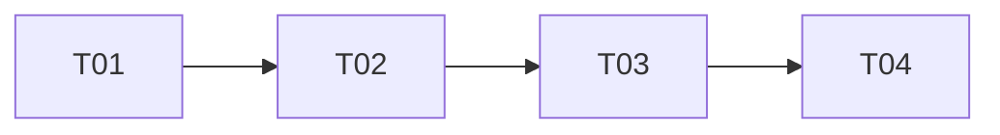

# 小地图 NPC 实时位置追踪

> 状态：实现完成
> 日期：2026-03-19

## 需求

- 打开大地图 (MapPanel) 后，图例列表中显示"NPC追踪"按钮
- 用户点击后开启：所有小镇 NPC 在地图上显示实时位置图标
- 再次点击或关闭大地图：自动关闭追踪，移除额外图标
- 目标：降低小地图渲染性能开销（默认不追踪，按需开启）

## 涉及工程

仅 `freelifeclient/` 客户端，无服务器/协议/配置表修改。

## 现有系统分析

### 小地图图例系统

| 层级 | 类 | 职责 |
|------|-----|------|
| 管理层 | `MapLegendControl` | 图例生命周期（创建、更新、池化、事件驱动） |
| 数据层 | `MapTownNpcLegend` | TownNpc 图例数据（位置、图标、绑定实体） |
| 展示层 | `MiniMapWidget` / `GameplayMapWidget` | 渲染图例到小地图/大地图 |
| 交互层 | `LegendListWidget` | 底部图例类型按钮（点击轮换同类图例） |

### 当前 TownNpc 图例行为

仅在 NPC 满足以下条件之一时才显示图标：

| 条件 | 优先级 | 图标 |
|------|--------|------|
| `HasOrder` — 有订单 | 10 | 50005（固定） |
| `PotentialCustomer` — 潜在客户 | 5 | 从 `NpcContactMapGroupMap` 读取 |

不满足条件的 NPC **不会出现在地图上**。

### 关键代码路径

| 功能 | 文件 | 位置 |
|------|------|------|
| TownNpc 图例区域 | `MapLegendControl.cs` | L1335-L1783 |
| 条件评估 | `MapLegendControl.cs` `TryGetBestConditionConfig()` | L1525 |
| 图例刷新 | `MapLegendControl.cs` `RefreshTownNpcLegend()` | L1587 |
| 图例数据类 | `MapLegendBase.cs` `MapTownNpcLegend` | L432 |
| 默认图标常量 | `MapLegendBase.cs` `MapTownNpcLegend.DefaultIconId` | L434 |
| MapPanel 图例列表 | `MapPanel.cs` | L1081-L1418 |
| 列表按钮交互 | `LegendListWidget.cs` | L87-L108 |

## 详细设计

### 改动文件清单

| 文件 | 改动内容 |
|------|---------|
| `MapLegendControl.cs` | 新增 `_showAllTownNpc` 开关 + `ToggleShowAllTownNpc()` |
| `MapLegendControl.cs` | 修改 `RefreshTownNpcLegend()` 适配开关 |
| `MapLegendControl.cs` | 修改 `ClearTownNpcLegends()` 重置开关 |
| `MapPanel.cs` | 小镇场景始终显示 TownNpc 按钮；点击 Toggle 而非轮换 |

### 1. MapLegendControl — 追踪开关

```csharp
// 新增字段
private bool _showAllTownNpc = false;
public bool ShowAllTownNpc => _showAllTownNpc;

// 新增方法
public void ToggleShowAllTownNpc(bool show)
{
    if (_showAllTownNpc == show) return;
    _showAllTownNpc = show;

    if (show)
    {
        // 遍历所有 NPC，不在 TownNpcDict 中的用 NPC 头像图标添加（跳过无头像的）
        foreach (var (netId, _) in TownNpcManager.TownNpcList)
        {
            if (!TownNpcDict.ContainsKey(netId))
            {
                int iconId = GetNpcAvatarIconId(netId);
                if (iconId > 0)
                    AddTrackingLegendInternal(netId, iconId);
            }
        }
    }
    else
    {
        // 移除不满足条件的图例，保留 HasOrder/PotentialCustomer 的
        _tempList.Clear();
        foreach (var (netId, legend) in TownNpcDict)
        {
            if (!TryGetBestConditionConfig(netId, out _))
                _tempList.Add(netId);
        }
        foreach (var netId in _tempList)
        {
            if (TownNpcDict.TryGetValue(netId, out var legend))
                RemoveLegend(legend);
        }
        _tempList.Clear();
    }
    _frameUpdate = true;
}
```

> **`AddTrackingLegendInternal`** 与普通 `AddTownNpcLegendInternal` 的区别：设置 `legend.IsTrackingMode = true`，无光晕效果。
> **`GetNpcAvatarIconId`** 从 `ConfigLoader.NpcContactMapGroupMap` 读取 NPC 头像图标，无头像时返回 0 并跳过。

### 2. RefreshTownNpcLegend 修改

```csharp
private void RefreshTownNpcLegend(ulong netId)
{
    if (SceneManager.UniverseType != SceneTypeProtoType.Town)
        return;

    bool hasSatisfiedCondition = TryGetBestConditionConfig(netId, out var bestConfig);
    bool hasLegend = TownNpcDict.TryGetValue(netId, out MapLegendBase legend);

    if (!hasSatisfiedCondition)
    {
        if (_showAllTownNpc)
        {
            // 追踪模式开启：无条件也保留，用 NPC 头像图标（跳过无头像的）
            if (!hasLegend)
            {
                int iconId = GetNpcAvatarIconId(netId);
                if (iconId > 0)
                    AddTrackingLegendInternal(netId, iconId);
            }
            // 已有图例则不变
        }
        else
        {
            // 开关关闭：原逻辑，移除图例
            if (hasLegend)
            {
                RemoveLegend(legend);
                _frameUpdate = true;
            }
        }
    }
    else
    {
        // 满足条件：原逻辑不变（添加或更新图标）
        // ... 保持现有代码 ...
    }
}
```

> **注意**：`OnTownNpcSpawned` 不需要额外修改。现有流程中 `OnTownNpcSpawned` 已调用 `RefreshTownNpcLegend`，上述修改已覆盖开关逻辑，保持单一入口，避免冗余。

### 3. ClearTownNpcLegends 修改

```csharp
public void ClearTownNpcLegends()
{
    // 归一清理点，确保切场景/重载时所有开关重置
    _showAllTownNpc = false;
    _showPotentialCustomers = false;

    if (TownNpcDict.Count == 0)
        return;

    foreach (var (_, legend) in TownNpcDict)
    {
        RemoveLegend(legend);
    }
}
```

> 这是开关的**唯一重置点**。覆盖以下场景：
> - 离开小镇（场景切换走 `ClearTownNpcLegends`）
> - MapPanel 关闭（走 `ClearAllLegends` → 清理 TownNpc 图例）
> - 网络重连/热更导致的场景重载

### 4. MapPanel — 图例列表交互

小镇场景下：
- **始终显示** NPC 追踪按钮（通过 `EnsureToggleButton(NpcTrackingLegendTypeId, ShowAllTownNpc)` 创建）
- 按钮文字来自配置表 `LegendType`（ID=125），由 `LegendListWidget.SetInfo` 读取
- 点击时调用 `ToggleShowAllTownNpc(!current)`，按钮通过 `ToggleSelectedStyle(isActive)` 切换高亮
- **OnClose 时显式调用** `MapManager.LegendControl.ToggleShowAllTownNpc(false)`

> **注意**：MapPanel 的 `ClearAllLegends` 只清理 UI Widget 层（`_legendWidgets`），**不会触发** `MapLegendControl.ClearTownNpcLegends()`。因此必须在 MapPanel.OnClose 中显式关闭开关，防止下次打开时状态残留。`ClearTownNpcLegends` 中的重置仍保留，作为切场景等其他路径的兜底。

## 状态流转

```
MapPanel 打开
  → 图例列表显示 NPC 追踪按钮（未激活，文字来自 LegendType 配置表）
     ↓ 用户点击
  → ToggleShowAllTownNpc(true)
  → 所有有头像的 NPC 添加图例（NPC 头像图标，跳过无头像的）
  → 按钮变激活态(selected)
     ↓ 用户再次点击
  → ToggleShowAllTownNpc(false)
  → 移除无条件 NPC 图例
  → 按钮恢复未激活态
     ↓ 关闭 MapPanel
  → MapPanel.OnClose 显式调用 ToggleShowAllTownNpc(false)
     ↓ 切场景（离开小镇）
  → ClearTownNpcLegends() 自动重置 _showAllTownNpc = false（兜底）
```

### NPC 生命周期处理

| 事件 | 行为 |
|------|------|
| NPC 生成 (`TownNpcSpawned`) | `RefreshTownNpcLegend` 检查开关，自动添加图例 |
| NPC 销毁 | `RefreshEntityWorldPos` 中 controller 为 null 时自动 `RemoveLegend`（已有机制） |
| 切出小镇 | `ClearTownNpcLegends` 清理全部图例 + 重置开关 |
| 网络重连 | 同上，重载场景时重新初始化 |

## 性能分析

| 维度 | 说明 |
|------|------|
| 默认开销 | 零（默认关闭，不创建额外图例） |
| NPC 数量级 | 小镇同时在线 NPC 通常 30-50 个，图例数量可控 |
| 位置更新 | 复用 `bindEntity=true` + `RefreshEntityWorldPos`，每帧仅 Vector3 赋值，开销极低 |
| 视口裁剪 | `MiniMapWidget.ShowEdgeLegend` 已有圆形剔除，超出范围的图例自动隐藏不渲染 |
| 关闭时清理 | 关闭大地图自动清理，无残留 |
| 内存 | 图例对象池复用（`GetLegend<T>` / `RemoveLegend`），无 GC 压力 |

## 任务清单

### 依赖图



### 任务列表

| 编号 | 任务 | 文件 | 依赖 | 完成标准 |
|------|------|------|------|---------|
| T01 | MapLegendControl: 新增追踪开关字段 + ToggleShowAllTownNpc 方法 + ClearTownNpcLegends 重置 | `MapLegendControl.cs` | 无 | 编译通过，开关可切换 |
| T02 | MapLegendControl: 修改 RefreshTownNpcLegend 适配开关 | `MapLegendControl.cs` | T01 | NPC 生成时根据开关状态正确添加/移除图例 |
| T03 | MapPanel: TownNpc 按钮始终显示 + Toggle 交互 + OnClose 重置 | `MapPanel.cs` | T02 | 按钮可点击切换，关闭面板开关重置 |
| T04 | 验证: 编译 + 运行时测试 | — | T03 | 开启/关闭追踪、关闭面板、切场景均正常 |
