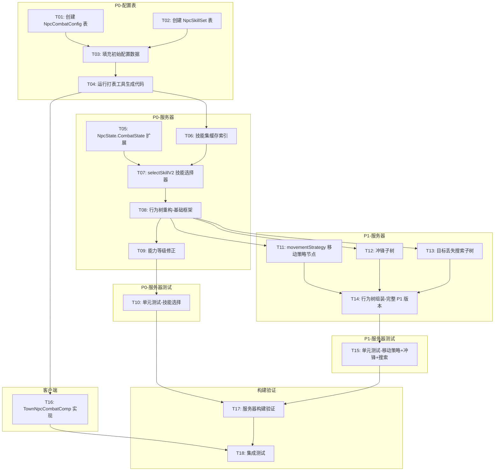

# NPC V2 战斗行为扩展

> ✅ P0 核心已实现（CombatBtHandler + NpcSkillConfig）。⚠️ 延期项：NpcCombatConfig 表未创建、P2 Flee 计划未实现。
>
> 基于 GTA5 战斗系统参考，扩展 P1 现有 CombatBtHandler。
> 源文档：`npc-combat-expansion-requirements.md`、`npc-combat-requirements-review.md`、`npc-combat-expansion-tasks.md`、`npc-combat-expansion-tech-design.md`（已合并）。

## 目录

1. [需求（含审查结论）](#1-需求含审查结论)
2. [配置表设计](#2-配置表设计)
3. [关键接口契约](#3-关键接口契约)
4. [风险与缓解](#4-风险与缓解)
5. [任务清单（含依赖图）](#5-任务清单含依赖图)
6. [并行执行建议](#6-并行执行建议)

---

## 1. 需求（含审查结论）

> 当前 CombatBtHandler 仅实现"追击→选技能→施法→恢复"基础循环。参考 GTA5 战斗系统，扩展为可配置的多层次战斗行为。
>
> 审查结论已全部采纳并反映在下方修订版需求中（配置表明确化、能力等级降为参数、目标丢失作为子阶段、受伤反应拆分、Flee 独立为 P2 计划）。

### P0 — 核心能力

#### 1.1 多技能选择系统

- 每个 NPC 可配置多个技能（NpcSkillSet 配置表）
- 技能选择条件：距离范围、冷却状态、优先级权重
- 技能分类：近战(1) / 远程(2) / AOE(3)
- 独立冷却计时器（每技能独立 CD，存 NpcState.SkillCooldowns）
- **配置表**：新建 NpcSkillSet（NpcId → SkillId 列表 + 优先级 + 距离条件）

#### 1.2 距离分级行为

定义 4 个战斗距离等级（阈值由 NpcCombatConfig 配置）：

- **Near**（近距离）：优先近战技能
- **Medium**（中距离）：常规攻击
- **Far**（远距离）：远程攻击或追近
- **VeryFar**（超远）：追击或脱战

#### 1.3 战斗能力等级（配置参数，非独立模块）

> 审查建议已采纳：降级为 NpcCombatConfig 的 AbilityLevel 字段，不作为独立功能模块。

NpcCombatConfig.AbilityLevel 影响：

- 攻击间隔修正：Poor×1.5 / Average×1.0 / Professional×0.7
- 命中率修正
- 技能选择智能度（Professional 优先选最优技能）

#### 1.4 NPC 战斗配置表

新建 **NpcCombatConfig** 表（详见 §2），字段覆盖：NpcId、MovementStrategy、AbilityLevel、距离阈值、冲锋参数、目标丢失响应、BehaviorFlags。

### P1 — 重要功能

#### 1.5 战斗移动策略

NPC 根据 NpcCombatConfig.MovementStrategy 采用不同策略：

- **Stationary**(0)：原地战斗，不主动移动
- **Defensive**(1)：保持距离，被逼近时后撤
- **Advance**(2)：主动缩短距离
- **Retreat**(3)：拉开距离后攻击

通过 MoveTarget 写入实现，Source=ENGAGEMENT。

#### 1.6 冲锋机制

条件触发（CanCharge + 距离在 ChargeRange 内 + 冷却结束）：

- 冲锋期间移动速度提升（写入 MoveTarget + speed 修正）
- 到达后触发近战攻击
- 冲锋冷却独立计时，冲锋期间设 InteractionLock 抑制导航维度

#### 1.7 目标丢失处理

> 审查建议已采纳：作为 combat 行为树内部子阶段，不是独立计划（与 pursuit 场景不同：pursuit 有明确追击目标，search 是去最后已知坐标）。

当 TargetEntityID 对应实体超出感知范围/死亡时按配置执行：

- **ExitCombat**(0)：直接退出 combat 计划
- **SearchTarget**(1)：combat Handler 内部子树 — 移动到最后已知位置搜索，超时退出
- **NeverLose**(2)：持续追踪不放弃

### P2 — 增强功能

#### 1.8 威胁评估与 Flee

> 审查建议已采纳：Flee 拆分为独立计划实现（新增第 4 个 Engagement 计划）。

新增 Engagement 维度的 `flee` 计划：

- 威胁评估条件：生命值比例、武器状态、周围敌人数量
- 配置标志：NeverFlee / PreferFlee
- 需新增 FleePlanHandler + gta_engagement.json flee 状态转移条件
- 触发时机：进入战斗时 + 受重大伤害时

#### 1.9 受伤反应（拆分实现）

> 审查建议已采纳：硬直与重评估分离实现。

- 硬直动画：Expression 维度的 ThreatReactHandler 处理
- 重伤重评估：作为 1.8 威胁评估的触发条件
- 需要伤害回调入口（NPC 被攻击时通知 AI 系统）

### 涉及工程

| 工程 | 修改范围 | 优先级 |
|------|---------|--------|
| P1GoServer | CombatBtHandler 扩展、NpcState 字段、行为树节点 | P0-P2 |
| RawTables | 新建 NpcCombatConfig + NpcSkillSet 表 | P0 |
| old_proto | Flee 状态枚举（P2 才需要） | P2 |
| freelifeclient | TownNpcCombatComp 实现 | P0-P1 |

### 验收标准

**P0**：NPC 能根据 NpcSkillSet 配置使用多个技能；技能选择基于距离自动切换；每个技能有独立冷却；不同 AbilityLevel 攻击节奏有明显差异；配置表可正常打表并被服务器读取。

**P1**：4 种移动策略 NPC 表现出不同战斗站位；满足条件的 NPC 能触发冲锋并执行近战攻击；目标丢失后按配置执行搜索或退出。

**P2**：NPC 在劣势时能做出 Flee 决策并逃离；NPC 受伤时有对应表现反应。

---

## 2. 配置表设计

### 2.1 NpcCombatConfig（新建）

NPC 战斗行为总配置，每种 NPC 类型一行，路径：`freelifeclient/RawTables/npc/NpcCombatConfig.xlsx`。

| 字段 | 类型 | 说明 | 默认值 |
|------|------|------|--------|
| Id | int32 | NPC 类型 ID（关联 NpcCreator） | — |
| MovementStrategy | int32 | 0=Stationary,1=Defensive,2=Advance,3=Retreat | 2 |
| AbilityLevel | int32 | 0=Poor,1=Average,2=Professional | 1 |
| NearRange | float32 | 近距离阈值（米） | 3.0 |
| MediumRange | float32 | 中距离阈值（米） | 8.0 |
| FarRange | float32 | 远距离阈值（米） | 15.0 |
| CanCharge | int32 | 是否可冲锋 0/1 | 0 |
| ChargeMinRange | float32 | 冲锋最小距离（米） | 5.0 |
| ChargeMaxRange | float32 | 冲锋最大距离（米） | 12.0 |
| ChargeCooldownMs | int32 | 冲锋冷却（毫秒） | 10000 |
| ChargeSpeedMul | float32 | 冲锋速度倍率 | 2.0 |
| TargetLossResponse | int32 | 0=Exit,1=Search,2=NeverLose | 0 |
| SearchTimeoutMs | int32 | 搜索超时（毫秒） | 15000 |
| AttackIntervalMul | float32 | 攻击间隔倍率（能力等级修正后叠加） | 1.0 |
| AccuracyMul | float32 | 命中率倍率 | 1.0 |

### 2.2 NpcSkillSet（新建）

NPC 技能集配置，一个 NPC 可配多行（多技能），路径：`freelifeclient/RawTables/npc/NpcSkillSet.xlsx`。

| 字段 | 类型 | 说明 | 默认值 |
|------|------|------|--------|
| Id | int32 | 自增行 ID | — |
| NpcId | int32 | NPC 类型 ID | — |
| SkillId | int32 | 技能 ID（关联 NpcSkillConfig） | — |
| Priority | int32 | 优先级（越大越优先） | 1 |
| MinRange | float32 | 该技能有效最小距离（米） | 0.0 |
| MaxRange | float32 | 该技能有效最大距离（米） | 999.0 |
| Weight | int32 | 同优先级时的随机权重 | 100 |

### 2.3 NpcSkillConfig（已有，无需修改）

已有 11 列，4 个技能数据（ID 1001-1004），结构完整。

### 2.4 配置读取接口（Go 侧自动生成）

打表后自动生成：

- `GetCfgNpcCombatConfigById(id) *CfgNpcCombatConfig`
- `GetCfgMapNpcSkillSet() map[int32]*CfgNpcSkillSet`（需按 NpcId 二次索引）
- 服务器启动时在 `combat_config_cache.go` 中构建 `npcId → []SkillSetEntry` 缓存（按 Priority 降序排序）

---

## 3. 关键接口契约

> 服务器详细设计（行为树结构、技能选择器实现、移动策略执行器、目标丢失子树、冲锋子树、客户端实现）与现有 GTA5 管线架构高度一致，详见 `npc-gta5-behavior-implementation.md`。

### 3.1 配置表 ↔ 服务器

| 配置表 | 加载时机 | 缺失行为 |
|--------|---------|---------|
| NpcCombatConfig | 服务器启动 | 无配置的 NPC 使用默认值（Advance + Average） |
| NpcSkillSet | 服务器启动 | 无配置的 NPC 使用默认技能 1001 |
| NpcSkillConfig | 服务器启动 | 技能不存在时日志告警 + 跳过该技能 |

### 3.2 服务器 ↔ 客户端（Proto）

复用现有消息，P0/P1 阶段不需要修改 old_proto：

- `NpcSkillCastNtf`：CasterId + TargetId + SkillId + CastPos
- `NpcHitNtf`：TargetId + AttackerId + Damage + HitDir + IsDead
- `TownNpcData` 中 State 字段同步 NPC 状态枚举

### 3.3 NpcState.CombatState 新增字段

在现有字段基础上扩展（同步检查：Snapshot 深拷贝 + Reset 清零）：

```go
// P0 新增：多技能系统
SkillCooldowns    map[int32]int64  // skillId → 冷却结束时间戳(ms)，Snapshot 须深拷贝
NpcTypeID         int32            // NPC 类型 ID，用于查配置表

// P1 新增：移动策略 + 冲锋 + 搜索
LastChargeTime    int64            // 上次冲锋时间戳(ms)
IsCharging        bool             // 是否正在冲锋
LastKnownTargetPos transform.Vec3  // 目标最后已知位置（每帧 update_distance 更新）
SearchStartTime   int64            // 搜索开始时间戳(ms)，0=未搜索
IsSearching       bool             // 是否在搜索中
```

同步检查清单：

- [ ] NpcStateSnapshot 对应字段（SkillCooldowns 需深拷贝 map）
- [ ] NpcState.Reset() 清零新字段
- [ ] NpcStateSnapshot.Reset() 清零新字段
- [ ] ResetWritableFields() 无需重置（跨帧持久状态）

---

## 4. 风险与缓解

| 风险 | 影响 | 缓解措施 |
|------|------|---------|
| SkillCooldowns map 频繁分配 | GC 压力 | 初始容量预分配；考虑用固定长度 slice 替代 |
| 配置表打表失败 | 阻塞开发 | 先用代码硬编码默认值，配置表并行推进 |
| 行为树复杂度增加 | 调试困难 | 每个子树独立测试；增加日志输出关键决策点 |
| Snapshot 深拷贝 map | 性能开销 | 限制技能数上限（建议 ≤8），map 复用 sync.Pool |
| 冲锋期间 MoveTarget 冲突 | 寻路干扰 | 冲锋时设 InteractionLock 抑制导航维度 |

---

## 5. 任务清单（含依赖图）

### 依赖图



### P0 — 核心能力（配置表工程）

**[T01] 创建 NpcCombatConfig 配置表**
- 工程：`freelifeclient/RawTables/npc/`
- 内容：新建 NpcCombatConfig.xlsx，15 列（见 §2.1）
- 完成标准：Excel 文件创建，表头和字段类型正确
- 依赖：无

**[T02] 创建 NpcSkillSet 配置表**
- 工程：`freelifeclient/RawTables/npc/`
- 内容：新建 NpcSkillSet.xlsx，7 列（见 §2.2）
- 完成标准：Excel 文件创建，表头和字段类型正确
- 依赖：无

**[T03] 填充初始配置数据**
- 工程：`freelifeclient/RawTables/npc/`
- 内容：NpcCombatConfig 填充现有 NPC 类型默认战斗参数；NpcSkillSet 为现有 NPC 类型分配已有技能（1001-1004）
- 完成标准：数据合理，覆盖至少 3 种 NPC 类型
- 依赖：T01, T02

**[T04] 运行打表工具生成代码**
- 工程：`freelifeclient/RawTables/_tool/`
- 内容：运行打表工具，生成 Go + C# 配置代码和二进制
- 完成标准：`P1GoServer/common/config/cfg_npccombatconfig.go` + `cfg_npcskillset.go` + 对应 .bytes 文件生成
- 依赖：T03

### P0 — 核心能力（服务器工程）

**[T05] NpcState.CombatState 字段扩展**
- 工程：`P1GoServer/servers/scene_server/internal/common/ai/state/`
- 内容：npc_state.go 新增 SkillCooldowns(map)、NpcTypeID；Snapshot 同步（深拷贝）；Reset() 清零
- 完成标准：编译通过，Snapshot 正确复制新字段
- 依赖：无（可与 T01-T04 并行）

**[T06] 技能集缓存索引**
- 工程：`P1GoServer/servers/scene_server/internal/common/ai/execution/handlers/`
- 内容：新建 combat_config_cache.go；启动时构建 `npcId → []SkillSetEntry` 缓存（按 Priority 降序）；提供 `GetSkillSet` / `GetCombatConfig` 接口
- 完成标准：缓存正确构建，无配置时返回空/默认值
- 依赖：T04

**[T07] selectSkillV2 技能选择器**
- 工程：同上
- 内容：新建 combat_skill_selector.go；实现距离判断 + 冷却检查 + 优先级/权重选择；无可用技能返回 Running
- 完成标准：给定距离和冷却状态，选出正确技能
- 依赖：T05, T06

**[T08] 行为树重构 — P0 基础框架**
- 工程：同上
- 内容：修改 engagement_handlers.go 中 NewCombatBtHandler()；新增 update_distance 节点；替换 combatSelectSkill → selectSkillV2；保持 cast/recover 不变
- 树结构：`UntilFailure → Sequence(has_target, update_distance, engage_sequence)`
- 完成标准：行为树使用新技能选择器，编译通过
- 依赖：T07

**[T09] 能力等级修正**
- 工程：同上
- 内容：cast/recover 节点读取 AbilityLevel，应用攻击间隔修正：Poor×1.5 / Average×1.0 / Professional×0.7
- 完成标准：不同 AbilityLevel 的 NPC 攻击节奏明显不同
- 依赖：T08

**[T10] 单元测试 — 技能选择**
- 工程：同上
- 内容：combat_skill_selector_test.go；用例：距离筛选、冷却过滤、优先级排序、权重随机、无技能兜底
- 完成标准：所有测试通过
- 依赖：T09

### P1 — 重要功能（服务器工程）

**[T11] movementStrategy 移动策略节点**
- 工程：同上
- 内容：新建 combat_movement.go；4 种策略的 MoveTarget 写入逻辑（Stationary/Defensive/Advance/Retreat）
- 完成标准：4 种策略独立可测
- 依赖：T08

**[T12] 冲锋子树**
- 工程：同上
- 内容：combat_charge.go；can_charge 条件 + charge_move 动作 + charge_attack 动作；NpcState 新增 LastChargeTime、IsCharging；冲锋期间设 InteractionLock
- 完成标准：冲锋流程完整执行
- 依赖：T08

**[T13] 目标丢失搜索子树**
- 工程：同上
- 内容：combat_search.go；target_visible 条件 + should_search 条件 + move_to_last_pos + 超时检查；读取 TargetLossResponse
- 完成标准：目标丢失后按配置执行搜索或退出
- 依赖：T08

**[T14] 行为树组装 — 完整 P1 版本**
- 工程：同上
- 内容：将 T11/T12/T13 子树集成到 CombatBtHandler；`Selector(charge, normal_attack)` + `Selector(engage, search)`
- 完成标准：完整行为树编译通过，逻辑正确
- 依赖：T11, T12, T13

**[T15] 单元测试 — 移动策略+冲锋+搜索**
- 工程：同上
- 内容：各子树独立逻辑测试 + 集成测试完整行为树
- 完成标准：所有测试通过
- 依赖：T14

### P1 — 重要功能（客户端工程）

**[T16] TownNpcCombatComp 实现**
- 工程：`freelifeclient/Assets/Scripts/Gameplay/Modules/S1Town/Entity/NPC/Comp/`
- 内容：实现 PlaySkillEffect（读配置→加载特效→播放动画+音效）、PlayHitReact（受击动画+伤害飘字+血条更新）、PlayDeath（死亡动画+禁用碰撞+延时回收）
- 完成标准：客户端编译通过，MCP 验证无报错
- 依赖：T04

### 构建验证

**[T17] 服务器构建验证** — `make build` + `make test` 全部通过；依赖 T10, T15

**[T18] 集成测试** — 起服验证 NPC 战斗行为，观察日志 + 客户端表现；依赖 T16, T17

### 任务统计

| 优先级 | 任务数 | 工程 |
|--------|--------|------|
| P0 | 10 (T01-T10) | 配置表 4 + 服务器 5 + 测试 1 |
| P1 | 6 (T11-T16) | 服务器 4 + 测试 1 + 客户端 1 |
| 验证 | 2 (T17-T18) | 构建 + 集成 |
| **合计** | **18** | — |

---

## 6. 并行执行建议

- **第一批**（并行）：T01+T02（配置表创建） ∥ T05（NpcState 扩展）
- **第二批**（串行）：T03 → T04（配置数据+打表）
- **第三批**（并行）：T06+T07（缓存+选择器） ∥ T16（客户端，依赖 T04）
- **第四批**（串行）：T08 → T09 → T10（行为树 P0 + 测试）
- **第五批**（并行）：T11 ∥ T12 ∥ T13（三个子树并行开发）
- **第六批**（串行）：T14 → T15 → T17 → T18（组装+测试+验证）
