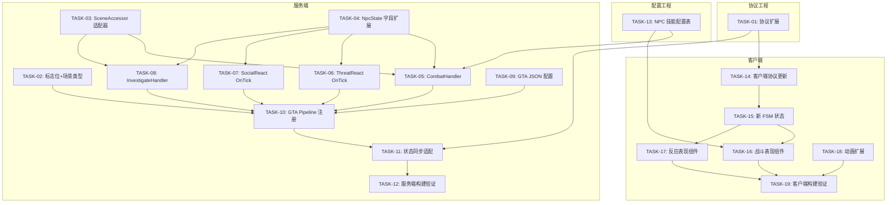

# GTA5 NPC 行为全量移植 — 客户端 + 服务器设计方案

> **状态**: 设计审查完成，框架已实现。⚠️ threat_react/social_react OnTick 仅有框架，待补充实现细节。
> **日期**: 2026-03-12
> **涉及工程**: P1GoServer（服务端）、freelifeclient（客户端）
> **参考来源**: GTA5 NPC 行为树设计文档

## 1. 需求回顾

### 1.1 目标

将 GTA5 中 NPC 的所有行为树，在小镇（Town/S1Town）场景中基于 V2 正交管线框架全量实现。

### 1.2 约束

- **独立性**：通过全局标志位控制，不影响现有小镇 NPC 系统
- **框架复用**：优先使用 V2 框架（OrthogonalPipeline + V2Brain + PlanHandler），不满足时扩展
- **客户端同步**：服务端行为驱动 + 客户端表现同步

### 1.3 GTA5 行为清单

| # | 行为 | 类别 | GTA5 描述 | V2 现有对标 |
|---|------|------|-----------|-------------|
| 1 | home_idle | 日常 | 家中待机（含敲门交互） | ✅ HomeIdleBehaviorNode |
| 2 | idle | 日常 | 户外待机（日程驱动） | ✅ IdleBehaviorNode |
| 3 | move | 日常 | 日程移动（寻路） | ✅ MoveBehaviorNode |
| 4 | meeting_move | 聚会 | 前往聚会点 | ✅ MeetingMoveBehaviorNode |
| 5 | meeting_idle | 聚会 | 聚会待机 | ✅ MeetingIdleBehaviorNode |
| 6 | dialog | 社交 | NPC 对话交互 | ✅ DialogBehaviorNode |
| 7 | pursuit | 战斗 | 追逐目标（警察） | ✅ PursuitBehaviorNode |
| 8 | investigate | 战斗 | 调查行为（警察） | ✅ InvestigateBehaviorNode |
| 9 | npc_combat | 战斗 | 技能选择+攻击循环 | ❌ 缺失 |
| 10 | proxy_trade | 交易 | 经销商代理交易 | ✅ ProxyTradeBehaviorNode |
| 11 | return_to_schedule | 过渡 | 事件结束返回日程 | ✅ ReturnToScheduleNode |
| 12 | sakura_control | 特殊 | 剧情强制控制 | ✅ PlayerControlBehaviorNode |
| 13 | threat_react | 表现 | 威胁反应（逃跑） | ⚠️ 框架存在，OnTick 未实现 |
| 14 | social_react | 表现 | 社交反应（围观） | ⚠️ 框架存在，OnTick 未实现 |

## 2. 架构设计

### 2.1 系统边界

```
┌─────────────────────────────────────────────────────────┐
│                    P1GoServer (服务端)                     │
│                                                          │
│  ┌──────────────┐  ┌──────────────┐  ┌──────────────┐   │
│  │  V2Brain     │  │ Orthogonal   │  │  Behavior    │   │
│  │ (JSON配置    │──│  Pipeline    │──│   Nodes      │   │
│  │  决策引擎)   │  │ (4维度管线)  │  │ (行为执行)   │   │
│  └──────────────┘  └──────────────┘  └──────────────┘   │
│         │                  │                  │          │
│         ▼                  ▼                  ▼          │
│  ┌──────────────────────────────────────────────────┐   │
│  │        NpcState (统一状态模型)                     │   │
│  └──────────────────────────────────────────────────┘   │
│                          │                               │
│                    状态同步协议                            │
│                          │                               │
├──────────────────────────┼───────────────────────────────┤
│                          ▼                               │
│                 freelifeclient (客户端)                    │
│                                                          │
│  ┌──────────────┐  ┌──────────────┐  ┌──────────────┐   │
│  │  NpcData     │  │  NpcFSM      │  │  Animation   │   │
│  │ (网络数据)   │──│ (表现状态机) │──│   & VFX      │   │
│  └──────────────┘  └──────────────┘  └──────────────┘   │
└─────────────────────────────────────────────────────────┘
```

### 2.2 核心原则

1. **服务端权威**：所有行为决策和状态变更由服务端 V2 管线驱动
2. **客户端纯表现**：客户端根据服务端同步的状态数据，驱动动画、特效、UI
3. **标志位隔离**：新增 `UseGtaNpcBehavior` 标志位，与现有 `UseSceneNpcArch` 正交
4. **配置热更**：行为配置通过 JSON 文件驱动，支持运行时重载

### 2.3 标志位矩阵

| UseSceneNpcArch | UseGtaNpcBehavior | 效果 |
|:---:|:---:|------|
| 0 | 0 | V1 旧系统（原有行为） |
| 1 | 0 | V2 管线 + 原有行为配置 |
| 1 | 1 | V2 管线 + GTA5 全量行为（**本次目标**） |
| 0 | 1 | 无效组合，降级为 V1 |

### 2.4 四维度行为映射

将 GTA5 的 14 个行为映射到 V2 正交管线的 4 个维度：

| 维度 | Plan | 触发条件 | 行为说明 |
|------|------|----------|----------|
| **Engagement** | none | 默认 | 无交战状态 |
| | pursuit | Combat.PursuitEntity != 0 | 追逐目标 |
| | combat | Combat.CombatTarget != 0 | **新增**：技能攻击循环 |
| **Expression** | none | 默认 | 无表现 |
| | threat_react | Perception.ThreatSource != 0 **&& Combat.CombatTarget == 0** | 威胁逃跑反应（战斗中不触发） |
| | social_react | len(Perception.NearbyEntities) > 3 **&& Combat.CombatTarget == 0** | 社交围观反应（战斗中不触发） |
| **Locomotion** | on_foot | 默认 | 步行模式（唯一） |
| **Navigation** | idle | 默认 | 待机（home_idle/idle 由行为节点区分） |
| | navigate | Movement.MoveTarget 有效 | 移动（move/meeting_move/return） |
| | interact | Social.HasInteraction | 交互（dialog/trade） |
| | investigate | Combat.InvestigatePos 有效 | **新增**：调查行为 |

**跨维度控制**：
- **sakura_control（剧情强制）**：通过 `External.ForceMode != 0` 触发 GlobalGuard，ForceExit 所有维度 Handler，进入强制控制状态。与 GTA5 的 player_control 行为等价，不需要独立 Plan。
- **NPC 死亡**：通过 `Self.IsDead` 触发 GlobalGuard，ForceExit + Reset 所有 Executor，清理矛盾字段，服务端广播死亡协议，客户端播放死亡动画后回收。

## 3. 服务端详细设计

### 3.1 新增/补全 Handler

#### 3.1.1 CombatHandler（Engagement 维度，新增）

```go
// handlers/engagement_combat.go
type CombatHandler struct{}

func (h *CombatHandler) OnEnter(ctx *PlanContext) {
    // 初始化技能冷却、选择初始技能
    // 写入 state.Combat.CurrentSkillID
}
func (h *CombatHandler) OnTick(ctx *PlanContext) {
    // 1. 检查目标存活
    // 2. 判断技能射程 → 写入 MoveTarget(source=ENGAGEMENT) 追近
    // 3. 技能冷却检查 → 选择技能 → 写入攻击指令
    // 4. 伤害计算（独立伤害系统，非 GAS）
}
func (h *CombatHandler) OnExit(ctx *PlanContext) {
    // 清理战斗状态、重置技能
}
```

#### 3.1.2 ThreatReactHandler（Expression 维度，补全 OnTick）

```go
func (h *ThreatReactHandler) OnTick(ctx *PlanContext) {
    // 1. 获取威胁源位置
    // 2. 计算逃跑方向（反向 + 随机偏移）
    // 3. 写入 MoveTarget(source=EXPRESSION)
    // 4. 写入逃跑动画状态
}
```

#### 3.1.3 SocialReactHandler（Expression 维度，补全 OnTick）

```go
func (h *SocialReactHandler) OnTick(ctx *PlanContext) {
    // 1. 获取事件中心位置
    // 2. 写入朝向（面向事件点）
    // 3. 写入围观动画状态（idle_look、idle_phone 等）
}
```

#### 3.1.4 InvestigateHandler（Navigation 维度，新增）

```go
// handlers/navigation_investigate.go
type InvestigateHandler struct{}

func (h *InvestigateHandler) OnEnter(ctx *PlanContext) {
    // Navigation 维度为 MoveTarget 读取方，不直接写入
    // 调查位置由 Sensor 写入 Combat.InvestigatePos → scheduleWriteBack 转为 MoveTarget
    // 这里设置调查状态标记
}
func (h *InvestigateHandler) OnTick(ctx *PlanContext) {
    // 1. 读取 MoveTarget 判断是否到达调查点
    // 2. 到达后 → 写入搜索动画状态（Expression 字段）
    // 3. 搜索计时 → 完成/超时 → 清除 Combat.InvestigatePos
}
func (h *InvestigateHandler) OnExit(ctx *PlanContext) {
    // 清除调查状态
}
```

### 3.2 Handler vs BehaviorNode 职责说明

> **V2 架构下，Handler 是行为执行单元**，BehaviorNode 仅在 V1 行为树路径中使用。
> GTA 模式全部走 V2 Pipeline → Handler 路径，不新增 BehaviorNode。
> 现有 11 个 BehaviorNode 在 GTA 模式下不使用（它们服务于 V1 兼容路径）。

### 3.3 NpcState 扩展

新增字段支持 GTA5 行为：

```go
// state/npc_state.go - Combat 分组扩展
type CombatFields struct {
    PursuitEntity  uint64  // 已有
    CombatTarget   uint64  // 已有
    InvestigatePos Vec3    // 已有
    // 新增
    CurrentSkillID int32   // 当前技能 ID
    SkillTargetID  uint64  // 技能目标
    AttackPhase    int32   // 攻击阶段（0=idle, 1=cast, 2=recover）
    LastAttackTime int64   // 上次攻击时间戳
}

// state/npc_state.go - Expression 分组（威胁/社交反应）
type ExpressionFields struct {
    // 新增
    ReactType      int32   // 反应类型（0=none, 1=threat_flee, 2=social_watch）
    ReactTargetPos Vec3    // 反应目标位置（逃跑方向/围观点）
    ReactAnimState string  // 反应动画状态名
}
```

### 3.4 V2Brain JSON 配置扩展

新增 GTA5 行为专用配置文件集（独立于现有配置）：

```
bin/config/ai_decision_v2/
├── engagement.json          # 现有
├── expression.json          # 现有
├── locomotion.json          # 现有
├── navigation.json          # 现有
├── gta_engagement.json      # 新增：含 combat Plan
├── gta_expression.json      # 新增：补全 threat/social 条件
├── gta_locomotion.json      # 新增：与现有相同（步行）
└── gta_navigation.json      # 新增：含 investigate Plan
```

**gta_engagement.json 示例**：
```json
{
  "system": "engagement",
  "init_plan": "none",
  "plans": [
    {"name": "none"},
    {"name": "pursuit"},
    {"name": "combat"}
  ],
  "transitions": [
    {"from": "*", "to": "combat", "priority": 2, "condition": "Combat.CombatTarget != 0"},
    {"from": "*", "to": "pursuit", "priority": 1, "condition": "Combat.PursuitEntity != 0 && Combat.CombatTarget == 0"},
    {"from": "pursuit", "to": "none", "priority": 1, "condition": "Combat.PursuitEntity == 0"},
    {"from": "combat", "to": "none", "priority": 1, "condition": "Combat.CombatTarget == 0"}
  ]
}
```

### 3.5 Pipeline 注册

```go
// v2_pipeline_defaults.go - 新增 GTA5 行为管线注册
func init() {
    // 现有注册保持不变...

    // 新增：GTA5 行为管线（Town 场景，UseGtaNpcBehavior=1 时使用）
    RegisterV2Pipeline(&V2PipelineConfig{
        SceneType:  cnpc.SceneNpcExtType_TownGta,  // 新增场景类型
        DimensionConfigs: gtaDimensionConfigs(),
    })
}

func gtaDimensionConfigs() []DimensionConfig {
    return []DimensionConfig{
        {
            Name:       "engagement",
            ConfigPath: "config/ai_decision_v2/gta_engagement.json",
            RegisterHandlers: func(exec *execution.PlanExecutor) {
                exec.RegisterHandler("none", handlers.NewEngagementNoneHandler())
                exec.RegisterHandler("pursuit", handlers.NewPursuitHandler())
                exec.RegisterHandler("combat", handlers.NewCombatHandler()) // 新增
            },
        },
        {
            Name:       "expression",
            ConfigPath: "config/ai_decision_v2/gta_expression.json",
            RegisterHandlers: func(exec *execution.PlanExecutor) {
                exec.RegisterHandler("none", handlers.NewExpressionNoneHandler())
                exec.RegisterHandler("threat_react", handlers.NewThreatReactHandler())
                exec.RegisterHandler("social_react", handlers.NewSocialReactHandler())
            },
        },
        {
            Name:       "locomotion",
            ConfigPath: "config/ai_decision_v2/gta_locomotion.json",
            RegisterHandlers: func(exec *execution.PlanExecutor) {
                exec.RegisterHandler("on_foot", handlers.NewOnFootHandler())
            },
        },
        {
            Name:       "navigation",
            ConfigPath: "config/ai_decision_v2/gta_navigation.json",
            Suppress:   false,
            ReadLiveState: true,
            RegisterHandlers: func(exec *execution.PlanExecutor) {
                exec.RegisterHandler("idle", handlers.NewIdleHandler())
                exec.RegisterHandler("navigate", handlers.NewNavigateHandler())
                exec.RegisterHandler("interact", handlers.NewInteractHandler())
                exec.RegisterHandler("investigate", handlers.NewInvestigateHandler()) // 新增
            },
        },
    }
}
```

## 4. 客户端详细设计

### 4.1 设计原则

客户端为纯表现层，所有行为决策由服务端驱动。客户端需要：
1. 解析服务端同步的 NPC 状态数据
2. 驱动 FSM 状态切换 + 动画播放
3. 处理战斗表现（技能特效、受击反馈）
4. 处理社交表现（表情、围观动画）

### 4.2 模块结构

```
Assets/Scripts/Gameplay/Modules/S1Town/Entity/NPC/
├── TownNpcController.cs          # 现有，扩展支持 GTA 模式判断
├── Comp/
│   ├── TownNpcFsmComp.cs         # 现有，扩展新状态
│   ├── TownNpcAnimationComp.cs   # 现有，扩展新动画
│   ├── TownNpcCombatComp.cs      # 新增：战斗表现组件
│   └── TownNpcReactComp.cs       # 新增：反应表现组件
├── State/
│   ├── TownNpcCombatState.cs     # 新增：战斗状态
│   ├── TownNpcFleeState.cs       # 新增：逃跑状态
│   ├── TownNpcWatchState.cs      # 新增：围观状态
│   └── TownNpcInvestigateState.cs# 新增：调查状态
└── Data/
    └── TownNpcClientData.cs      # 现有，扩展新字段映射
```

### 4.3 新增 FSM 状态

#### TownNpcCombatState（战斗）

```csharp
public class TownNpcCombatState : TownNpcBaseState
{
    // 进入：播放拔武器动画，初始化战斗 HUD
    // Tick：根据 AttackPhase 切换动画（idle_combat → cast → recover）
    // 退出：收武器动画，隐藏战斗 HUD
}
```

#### TownNpcFleeState（逃跑）

```csharp
public class TownNpcFleeState : TownNpcBaseState
{
    // 进入：播放受惊动画（flinch），切换 run 动画
    // Tick：面向逃跑方向移动，播放奔跑动画
    // 退出：恢复正常移动速度
}
```

#### TownNpcWatchState（围观）

```csharp
public class TownNpcWatchState : TownNpcBaseState
{
    // 进入：转向围观点
    // Tick：播放围观动画（idle_look / idle_phone / idle_talk）
    // 退出：恢复正常朝向
}
```

#### TownNpcInvestigateState（调查）

```csharp
public class TownNpcInvestigateState : TownNpcBaseState
{
    // 进入：切换警戒姿态动画
    // Tick：到达后播放搜索动画（look_around / crouch_search）
    // 退出：恢复正常姿态
}
```

### 4.4 状态映射表

服务端 StateId → 客户端 FSM 状态映射：

| StateId（协议） | 客户端状态 | 动画层 | 说明 |
|------|------|------|------|
| NpcState_Idle | TownNpcIdleState | Base | 现有 |
| NpcState_Move | TownNpcMoveState | Base | 现有 |
| NpcState_Run | TownNpcRunState | Base | 现有 |
| NpcState_Combat | TownNpcCombatState | Base+Upper | **新增** |
| NpcState_Flee | TownNpcFleeState | Base | **新增** |
| NpcState_Watch | TownNpcWatchState | Base | **新增** |
| NpcState_Investigate | TownNpcInvestigateState | Base | **新增** |
| NpcState_Dialog | 现有对话流程 | Upper | 现有 |
| NpcState_Trade | TownNpcTradeEffectState | Upper | 现有 |

### 4.5 战斗表现组件

```csharp
// TownNpcCombatComp.cs
public class TownNpcCombatComp : MonoBehaviour
{
    // 技能特效播放
    public void PlaySkillEffect(int skillId, Vector3 targetPos) { }
    // 受击表现
    public void PlayHitReact(Vector3 hitDir, float damage) { }
    // 死亡表现
    public void PlayDeath(Vector3 hitDir) { }
}
```

### 4.6 动画扩展

在 TownNpcAnimationComp 中扩展动画支持：

| 动画状态 | 动画 Clip | 使用场景 |
|----------|-----------|----------|
| combat_idle | idle_combat | 战斗待机 |
| combat_attack | attack_01~03 | 攻击动作（技能驱动） |
| flee_run | run_panic | 逃跑奔跑 |
| flinch | flinch_01~02 | 受惊反应 |
| watch_idle | idle_look_around | 围观待机 |
| investigate_walk | walk_alert | 警戒行走 |
| investigate_search | crouch_look | 搜索动作 |

## 5. 协议设计

### 5.1 NPC 状态同步协议扩展

在现有 `TownNpcData` 协议基础上扩展，新增字段：

```protobuf
// 扩展现有 NpcStateData
message NpcStateData {
    int32 state_id = 1;        // 现有：状态枚举
    // ... 现有字段 ...

    // 新增 GTA 行为字段
    int32 combat_skill_id = 20;      // 当前释放的技能 ID
    int32 attack_phase = 21;         // 攻击阶段（0=idle,1=cast,2=recover）
    uint64 combat_target_id = 22;    // 战斗目标 entity ID
    int32 react_type = 23;           // 反应类型（0=none,1=flee,2=watch）
    Vec3Proto react_target_pos = 24; // 反应目标位置
    int32 react_anim_id = 25;       // 反应动画枚举 ID（由配置表映射动画资源，避免字符串传输）
}

// 新增状态枚举值
enum NpcStateEnum {
    // ... 现有枚举 ...
    NpcState_Combat = 10;       // 战斗
    NpcState_Flee = 11;         // 逃跑
    NpcState_Watch = 12;        // 围观
    NpcState_Investigate = 13;  // 调查
}
```

### 5.2 战斗事件协议

```protobuf
// 新增：NPC 技能释放通知（服务端→客户端）
message NpcSkillCastNtf {
    uint64 caster_id = 1;    // 施法者 entity ID
    uint64 target_id = 2;    // 目标 entity ID
    int32 skill_id = 3;      // 技能 ID
    Vec3Proto cast_pos = 4;  // 施法位置
}

// 新增：NPC 受击通知（服务端→客户端）
message NpcHitNtf {
    uint64 target_id = 1;    // 受击者 entity ID
    uint64 attacker_id = 2;  // 攻击者 entity ID
    int32 damage = 3;        // 伤害值
    Vec3Proto hit_dir = 4;   // 受击方向
    bool is_dead = 5;        // 是否死亡
}
```

### 5.3 协议兼容性

- 新增字段使用高字段号（20+），不影响现有协议解析
- 新增枚举值使用高数值（10+），客户端未知枚举值降级为 Idle
- `UseGtaNpcBehavior=0` 时服务端不填充新字段，客户端忽略零值

## 6. 配置设计

### 6.1 服务端 JSON 配置

**新增 4 个 GTA 行为配置文件**（见 3.4 节），放在 `bin/config/ai_decision_v2/` 下。

**NPC 技能配置**：走 Excel 配置表流程（`RawTables/npc/NpcSkillConfig.xlsx`），与客户端共享数据源，由打表工具生成服务端和客户端代码。不在 `ai_decision_v2/` 目录放技能数值配置。

### 6.2 客户端配置表

在现有 `CfgNpcBehaviorArgs` 配置表中扩展，或新增 Excel 表：

| 配置表 | 说明 | 关键字段 |
|--------|------|----------|
| NpcBehaviorArgs（扩展） | 行为参数 | 逃跑速度倍率、围观距离、调查时长 |
| NpcSkillConfig（新增） | NPC 技能表 | 技能ID、动画名、特效路径、音效 |
| NpcCombatConfig（新增） | 战斗参数 | 攻击间隔、追击距离、脱战距离 |

### 6.3 配置加载时机

- 服务端：scene_server 启动时加载 `gta_*.json`，仅 `UseGtaNpcBehavior=1` 时生效
- 客户端：进入小镇场景时加载技能/战斗配置表，通过 ConfigCenter 统一管理

## 7. 标志位与切换机制

### 7.1 服务端标志位

```go
// common/config/scene_config.go
type SceneConfig struct {
    UseSceneNpcArch   int `toml:"use_scene_npc_arch"`    // 0=V1, 1=V2
    UseGtaNpcBehavior int `toml:"use_gta_npc_behavior"`  // 0=关闭, 1=启用 GTA 行为
}
```

### 7.2 切换逻辑

```go
// scene/scene_impl.go - NPC 初始化时
func (s *SceneImpl) initNpcAI() {
    cfg := s.config
    if cfg.UseSceneNpcArch == 0 {
        if cfg.UseGtaNpcBehavior == 1 {
            glog.Warning("UseGtaNpcBehavior=1 but UseSceneNpcArch=0, falling back to V1")
        }
        // V1 旧系统
        s.initV1NpcAI()
        return
    }
    if cfg.UseGtaNpcBehavior == 1 {
        // V2 + GTA5 行为
        SetupV2Pipeline(s.scene, cnpc.SceneNpcExtType_TownGta)
    } else {
        // V2 + 原有行为
        SetupV2Pipeline(s.scene, cnpc.SceneNpcExtType_Town)
    }
}
```

### 7.3 客户端标志位

通过服务端在登录/进入场景时下发配置：

```csharp
// 客户端根据服务端配置判断
public static bool UseGtaNpcBehavior => ServerConfig.Instance.GtaNpcBehavior == 1;

// FSM 状态注册时根据标志位扩展
if (UseGtaNpcBehavior)
{
    fsm.RegisterState(NpcStateEnum.Combat, new TownNpcCombatState());
    fsm.RegisterState(NpcStateEnum.Flee, new TownNpcFleeState());
    fsm.RegisterState(NpcStateEnum.Watch, new TownNpcWatchState());
    fsm.RegisterState(NpcStateEnum.Investigate, new TownNpcInvestigateState());
}
```

## 8. 风险与缓解

| 风险 | 影响 | 缓解措施 |
|------|------|----------|
| SceneAccessor 未实现 | 追击/对话 Handler 中 Scene==nil | 优先实现 SceneAccessor 适配器 |
| 战斗伤害系统复杂 | CombatHandler + 技能系统工作量大 | 先实现基础近战，远程/技能分期 |
| 客户端动画资源缺失 | 新状态无动画可播 | 先用现有动画占位，标记 TODO |
| 循环依赖 | System ↔ npc_mgr | Handler 通过 SceneAccessor 接口解耦 |
| 协议版本不兼容 | 老客户端崩溃 | 新字段用高字段号，客户端做零值降级 |
| 配置热更 | 运行时切换行为异常 | 标志位仅在场景初始化时读取，运行时不切换 |
| 枚举值冲突 | 新旧枚举重叠导致错误状态 | 实现前确认 old_proto/ 中实际枚举最大值，从 max+10 起分配 |
| NPC 死亡处理 | 战斗中 NPC 死亡后状态残留 | GlobalGuard 检测 Self.IsDead → ForceExit 所有 Handler → 广播死亡 → 客户端播放死亡动画 → 定时回收 |

## 9. 实现优先级

| 优先级 | 内容 | 工程 |
|--------|------|------|
| P0 | 标志位机制 + GTA Pipeline 注册 | 服务端 |
| P0 | SceneAccessor 适配器 | 服务端 |
| P0 | CombatHandler + CombatBehaviorNode | 服务端 |
| P0 | ThreatReact/SocialReact OnTick 补全 | 服务端 |
| P0 | InvestigateHandler | 服务端 |
| P0 | 协议扩展（状态枚举 + 战斗字段） | 协议 |
| P1 | 客户端新 FSM 状态（Combat/Flee/Watch/Investigate） | 客户端 |
| P1 | 客户端战斗表现组件 | 客户端 |
| P1 | GTA JSON 配置文件编写 | 服务端配置 |
| P2 | NPC 技能系统完善（远程、多技能） | 服务端+客户端 |
| P2 | 动画资源制作与接入 | 客户端 |

## 10. 任务拆解

### 10.1 依赖图



### 10.2 结构化任务清单

#### 协议工程（old_proto/）

| 编号 | 任务 | 依赖 | 完成标准 |
|------|------|------|----------|
| TASK-01 | 协议扩展：NpcStateData 新字段 + NpcStateEnum 新枚举 + NpcSkillCastNtf + NpcHitNtf | 无 | proto 编译通过，确认枚举无冲突，客户端/服务端代码生成成功 |

#### 服务端（P1GoServer）

| 编号 | 任务 | 依赖 | 完成标准 |
|------|------|------|----------|
| TASK-02 | 标志位：SceneConfig 新增 UseGtaNpcBehavior，新增 SceneNpcExtType_TownGta 枚举 | 无 | 编译通过，TOML 配置可读取 |
| TASK-03 | SceneAccessor 适配器：实现 GetEntityPos、NotifyDialogEnd 等接口 | 无 | Handler 中 SceneAccessor != nil，追击/对话逻辑可调用 |
| TASK-04 | NpcState 扩展：Combat 分组新增 4 字段，新增 ExpressionFields 分组 | 无 | FieldAccessor 可访问新字段，Snapshot 深拷贝覆盖 |
| TASK-05 | CombatHandler：Engagement 维度战斗 Handler（OnEnter/OnTick/OnExit） | T03, T04, T13 | 单元测试：进入战斗→技能选择→伤害计算→退出战斗 |
| TASK-06 | ThreatReactHandler：补全 OnTick（逃跑方向计算+MoveTarget 写入） | T04 | 单元测试：威胁源出现→计算逃跑方向→写入 MoveTarget(EXPRESSION) |
| TASK-07 | SocialReactHandler：补全 OnTick（朝向+围观动画） | T04 | 单元测试：人群密集→面向事件点→写入动画状态 |
| TASK-08 | InvestigateHandler：Navigation 维度调查 Handler | T03, T04 | 单元测试：调查点设置→移动→搜索→超时清除 |
| TASK-09 | GTA JSON 配置：编写 gta_engagement/expression/locomotion/navigation.json | 无 | JSON 格式合法，V2Brain 可解析 |
| TASK-10 | GTA Pipeline 注册：gtaDimensionConfigs() + RegisterV2Pipeline | T02,T05-T09 | SetupV2Pipeline(TownGta) 成功创建管线 |
| TASK-11 | 状态同步适配：NpcState→协议字段映射，广播新状态枚举 | T01, T10 | 客户端收到 Combat/Flee/Watch/Investigate 状态 |
| TASK-12 | 服务端构建验证：make build + make test | T11 | 全量编译通过，现有测试无回归 |

#### 配置工程（RawTables/）

| 编号 | 任务 | 依赖 | 完成标准 |
|------|------|------|----------|
| TASK-13 | NPC 技能配置表：新建 NpcSkillConfig.xlsx，定义技能ID/伤害/射程/冷却/动画 | 无 | 打表工具生成客户端+服务端代码成功 |

#### 客户端（freelifeclient）

| 编号 | 任务 | 依赖 | 完成标准 |
|------|------|------|----------|
| TASK-14 | 客户端协议更新：运行协议生成工具，更新 C# 协议文件 | T01 | 编译通过，新枚举/消息可引用 |
| TASK-15 | 新 FSM 状态：TownNpcCombatState/FleeState/WatchState/InvestigateState | T14 | 编译通过，状态映射表完整，标志位控制注册 |
| TASK-16 | 战斗表现组件：TownNpcCombatComp（技能特效/受击/死亡） | T13, T15 | 编译通过，接收 NpcSkillCastNtf/NpcHitNtf 正确播放 |
| TASK-17 | 反应表现组件：TownNpcReactComp（逃跑/围观动画） | T15 | 编译通过，根据 react_type 播放对应动画 |
| TASK-18 | 动画扩展：AnimationComp 新增动画状态映射 | 无 | 新动画状态可通过 AnimationComp 播放（先用占位动画） |
| TASK-19 | 客户端构建验证：Unity 编译 + 进入小镇场景 | T16-T18 | 编译无报错，NPC 状态切换正常 |

### 10.3 并行执行路径

```
时间轴 →

协议:  [T01] ─────────────────────────────────────────────
服务端: [T02][T03][T04] → [T05][T06][T07][T08] → [T09][T10] → [T11] → [T12]
配置:  [T13] ─────────────────────────────────────────────
客户端:              等待 T01 → [T14] → [T15] → [T16][T17][T18] → [T19]
```

**关键路径**：T01 → T04 → T05 → T10 → T11 → T12（服务端主线）
**并行分支**：T13（配置表）、T03（SceneAccessor）可与主线并行

---

## 附录 A：GTA5 战斗系统参考

> 从 GTA5 项目提取的战斗行为参考，用于 P1 V2 NPC 战斗行为需求分析。

### 战斗核心架构

战斗任务类（src/dev_ng/game/task/Combat/）：
- TaskCombat — 主战斗任务（含 Flank/Charge/Seek Cover）
- TaskCombatMelee — 近战
- TaskCombatMounted — 载具战斗
- TaskThreatResponse — 威胁评估与 Fight/Flee 决策
- TaskShootAtTarget — 射击
- TaskSearch — 追击搜索
- CombatManager — 群组战斗协调

### 战斗配置系统（CombatData.h）

| 枚举 | 值 | 作用 |
|------|-----|------|
| Movement | Stationary/Defensive/WillAdvance/WillRetreat | 移动策略 |
| Ability | Poor/Average/Professional | 战斗能力等级 |
| Range | Near/Medium/Far/VeryFar | 距离分类 |
| TargetLossResponse | ExitTask/NeverLoseTarget/SearchForTarget | 丢失目标反应 |
| TargetInjuredReaction | TreatAsDead/TreatAsAlive/Execute | 目标受伤反应 |

关键行为标志（91 个，摘录核心）：CanUseCover/JustSeekCover（掩体）、BlindFireWhenInCover（盲射）、CanChaseTargetOnFoot（追击）、RequiresLosToShoot（视线要求）、UseProximityAccuracy/UseProximityFiringRate（距离精度）、AlwaysFlee/DisableFleeFromCombat（逃离控制）、CanCharge（冲锋）、WillDragInjuredPedsToSafety（救援）

### 战斗参数（CCombatBehaviour.h，23+ 项）

| 参数 | 用途 |
|------|------|
| WeaponAccuracy | 武器精度 |
| FightProficiency | 战斗熟练度 |
| MaxShootingDistance | 最大射击距离 |
| MinimumDistanceToTarget | 最小追击距离 |
| WeaponDamageModifier | 伤害倍数 |
| TimeBetweenBursts | 射击间隔 |
| OptimalCoverDistance | 掩体距离 |
| TriggerChargeTime_Near/Far | 冲锋触发时间 |

### 威胁/感知系统

- 视觉范围 SeeingRange + 听觉范围 HearingRange
- 紧急距离 EncroachmentRange、识别距离 IdentificationRange
- 水平/垂直视角约束
- 威胁评估状态流：Analysis → Combat/Flee → Finish
- 6 个标志：NeverFight/NeverFlee/PreferFight/PreferFlee/CanFightArmedWhenNotArmed/ThreatIsIndirect

### 追击与脱战

- 追击（TaskSearch）：StareAtPosition → GoToPosition → SearchOnFoot/InVehicle，扇形搜索最后已知位置
- 脱战条件：ExitTask（直接退出）、NeverLoseTarget（永不放弃）、SearchForTarget（触发搜索）

### 群组战斗协调（CombatManager）

- 多攻击者协调、圆形包围战术、LOS 清晰度检测

---

## 附录 B：全面审查报告（v2，2026-03-12）

> 审查范围: 服务端 24 文件 + 客户端 10 文件 + Proto 2 文件 + JSON 4 文件

### 必须修复（9 项）

**已修复（Phase 6）：**

| # | 来源 | 问题 | 状态 |
|---|------|------|------|
| R1 | 代码 | `time.Now()` → `mtime.NowTimeWithOffset()` 3 处 | ✅ 已修复 |
| R2 | 代码 | 技能 ID 魔数 → `defaultMeleeSkillID` 常量 | ✅ 已修复 |
| R3 | 代码 | expression Handler 名与 JSON init_plan 一致性 | ✅ 确认无问题 |
| R5 | 安全 | SceneAccessor=nil 静默失效 → 添加一次性 Warning | ✅ 已修复 |

**待修复（本轮新增）：**

| # | 来源 | 问题 | 文件 | 修复方案 |
|---|------|------|------|----------|
| R4 | 安全 | combat_target_id 下发 entityID 存在目标欺骗风险 | town_npc.go | 标记 TODO，后续改为方向向量 |
| R6 | 流程 | `resources/proto/` 被错误修改（已回退） | resources/proto/scene/npc.proto | ✅ 已回退 |
| R7 | 功能 | SceneAccessor=nil 导致所有 GTA Handler 静默 return | bt_tick_system.go | 实现 SceneAccessor 适配器 |
| R8 | 功能 | 客户端 CombatComp/ReactComp 未在 Controller 注册 | TownNpcController.cs | 添加 AddComp 注册 |
| R9 | 功能 | ReactComp.UpdateReact 切回 none(0) 时未清理表现 | TownNpcReactComp.cs | case 0 添加停止逻辑 |
| R10 | 数据 | gta_expression.json system 字段大小写不一致 | gta_expression.json | 改为 "expression" |
| R11 | 数据 | SnapshotFieldResolver 缺少 ExpressionState 字段解析 | field_accessor.go | 添加 Expression group |

### 建议改进（12 项，不阻塞）

| # | 问题 | 优先级 |
|---|------|--------|
| B1 | 攻击参数应从配置读取 | P1 |
| B2 | 逃跑距离 10.0 硬编码 | P2 |
| B3 | 调查阈值硬编码 | P2 |
| B4 | FSM 状态映射改用 Dictionary | P2 |
| B5 | ReactComp 直接设 rotation 无插值 | P2 |
| B6 | CombatComp/ReactComp `protected new` 隐藏父类字段 | P1 |
| B7 | defaultDimensionConfigs 与 gtaDimensionConfigs 重复代码 | P2 |
| B8 | NpcState.Reset() 丢失 slice backing array | P2 |
| B9 | guardActive map 泄漏 | P2 |
| B10 | CombatComp._owner 未做 null 检查 | P1 |
| B11 | ReactComp 中 reactType 使用魔法数字 | P2 |
| B12 | 4 个 State 文件有未使用 using | P3 |

### 安全确认（无问题）

服务端权威架构正确、EntityID 空值保护完善、无注入风险、无硬编码凭证、Protobuf 类型安全、MoveTarget 优先级仲裁合理、Handler 无状态设计正确、import 路径合规、时间函数使用正确
