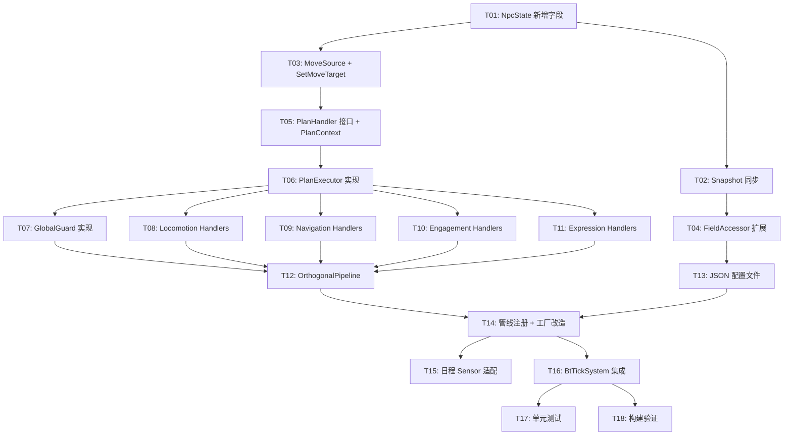

# V2 决策-执行架构重设计 — 技术设计文档

> 基于需求文档 `npc-v2-decision-execution-redesign.md`
>
> 生成日期：2026-03-12

---

## 目录

1. [需求回顾](#1-需求回顾)
2. [架构设计](#2-架构设计)
3. [详细设计：数据结构](#3-详细设计数据结构)
4. [详细设计：全局守卫](#4-详细设计全局守卫)
5. [详细设计：执行层 PlanHandler/PlanExecutor](#5-详细设计执行层)
6. [详细设计：管线编排](#6-详细设计管线编排)
7. [详细设计：写入仲裁](#7-详细设计写入仲裁)
8. [详细设计：JSON 配置](#8-详细设计json-配置)
9. [事务性设计](#9-事务性设计)
10. [接口契约](#10-接口契约)
11. [文件变更清单](#11-文件变更清单)
12. [风险缓解](#12-风险缓解)

---

## 1. 需求回顾

将现有 4 个独立决策系统（MovementMode/MainBehavior/Combat/Expression）重构为 3+1 正交并行维度（运动载体/导航/交战/表现），对标 GTA5 架构。核心变化：

- **决策层**：维度间通过 NpcState 隐式协调（交战写 MoveTarget → 导航读取执行）
- **执行层**：从"全挂行为树"改为 PlanHandler（简单直写 + 复杂挂树）
- **新增模块**：全局守卫、InteractionLock、写入仲裁、恢复协议

详见 `npc-v2-decision-execution-redesign.md`。

## 2. 架构设计

### 2.1 系统边界

所有变更在 `P1GoServer` 内，不涉及客户端或其他工程。

### 2.2 模块划分与新增目录

```
ai/
├── state/                          # [修改] NpcState 新增字段 + SetMoveTarget 仲裁
│   ├── npc_state.go
│   ├── npc_state_snapshot.go
│   └── move_source.go              # [新增] MoveSource 枚举 + SetMoveTarget
│
├── guard/                          # [新增] 全局守卫
│   ├── global_guard.go             # GlobalGuard.Check() + OnEnter/OnExit
│   └── global_guard_test.go
│
├── execution/                      # [新增] 执行层
│   ├── plan_handler.go             # PlanHandler 接口 + PlanContext
│   ├── plan_executor.go            # PlanExecutor（管理单维度 Plan 执行）
│   ├── plan_executor_test.go
│   └── handlers/                   # 各 Plan 的 Handler 实现
│       ├── locomotion_handlers.go  # on_foot
│       ├── navigation_handlers.go  # idle, navigate, interact
│       ├── engagement_handlers.go  # none, pursuit
│       └── expression_handlers.go  # none, threat_react, social_react
│
├── pipeline/                       # [新增] 正交管线编排
│   ├── orthogonal_pipeline.go      # OrthogonalPipeline（替代 MultiTreeExecutor 的编排职责）
│   └── orthogonal_pipeline_test.go
│
├── decision/                       # [保留] V2Brain 引擎不变
│   ├── v2brain/                    # brain.go, config.go, expr/ 不变
│   └── systems/
│       └── v2brain_decision.go     # [保留] IDecisionSystem 实现不变
│
├── sensor/                         # [保留] 感知系统不变
├── bt/                             # [保留] 行为树引擎，供复杂 PlanHandler 内部使用
│   └── multi_tree_executor.go      # [废弃] 不再作为管线编排器，保留代码但不使用
└── ...
```

### 2.3 核心数据流（新架构）

```
SensorPlugin → NpcState → Snapshot
    → GlobalGuard.Check()
        → 触发: 清理 + 跳过决策
        → 未触发: InteractionLock 检查 → ResetWritableFields
            → 交战: V2Brain.Tick() → PlanExecutor.Execute() → PlanHandler
            → 表现: V2Brain.Tick() → PlanExecutor.Execute() → PlanHandler
            → 运动载体: V2Brain.Tick() → PlanExecutor.Execute() → PlanHandler
            → 导航: V2Brain.Tick() → PlanExecutor.Execute() → PlanHandler
    → ECS 组件已由 PlanHandler 直写
```

### 2.4 与现有架构的关系

| 组件 | 现状 | 变更 |
|------|------|------|
| SensorPlugin | 5 个插件 | **保留不变** |
| NpcState/Snapshot | 7 字段分组 | **修改**：新增 Lock 分组，Movement 增加 MoveSource |
| V2Brain | JSON 配置驱动 | **保留不变**（引擎逻辑不改） |
| V2BrainDecisionSystem | 4 个实例 | **保留不变**（改名/重新配置） |
| MultiTreeExecutor | 管线编排 | **废弃**（由 OrthogonalPipeline 替代） |
| 行为树 | Plan→树的执行 | **保留引擎**，由 PlanHandler 内部按需使用 |
| BtTickSystem (ECS) | 调用 MultiTreeExecutor | **修改**：改调 OrthogonalPipeline |

## 3. 详细设计：数据结构

### 3.1 NpcState 字段变更

**现有字段保留**，以下为新增/修改：

```go
// state/npc_state.go — MovementState 修改
type MovementState struct {
    // ... 现有字段保留 ...
    MoveTarget   Vec3       // [新增] 可写移动目标（每 Tick 重置）
    MoveSource   MoveSource // [新增] 写入来源（仲裁用）
}

// state/npc_state.go — 新增 LockState
type LockState struct {
    InteractionLock InteractionLockType // NONE / MELEE
    LockTimer       int64              // 锁定开始时间戳（超时保护）
}

// state/npc_state.go — 新增 ScriptState
type ScriptState struct {
    Override   bool // 任务脚本强制模式
    MoveTarget Vec3 // 脚本指定移动目标
}

// NpcState 新增两个字段分组
type NpcState struct {
    Perception PerceptionState
    Self       SelfState
    Movement   MovementState
    Schedule   ScheduleState
    Combat     CombatState
    Social     SocialState
    External   ExternalState
    Lock       LockState   // [新增]
    Script     ScriptState // [新增]
    // ...
}
```

### 3.2 Snapshot 同步更新

NpcStateSnapshot 镜像新增 Lock 和 Script 字段。`Snapshot()` 方法增加对应的值拷贝（均为值类型，无需深拷贝）。

### 3.3 MoveSource 枚举

```go
// state/move_source.go
type MoveSource int

const (
    MoveSourceNone       MoveSource = 0
    MoveSourceScript     MoveSource = 1 // 普通脚本/任务
    MoveSourceExpression MoveSource = 2 // 表现决策（逃跑方向）
    MoveSourceSchedule   MoveSource = 3 // 日程系统
    MoveSourceEngagement MoveSource = 4 // 交战决策（追击/掩体）
    MoveSourceOverride   MoveSource = 5 // 强制模式（GM 命令）
)
```

### 3.4 InteractionLockType 枚举

```go
// state/npc_state.go 或 move_source.go
type InteractionLockType int

const (
    InteractionLockNone  InteractionLockType = 0
    InteractionLockMelee InteractionLockType = 1
)
```

### 3.5 ResetWritableFields

每 Tick 开始（全局守卫通过后、决策前）重置可写字段：

```go
func (s *NpcState) ResetWritableFields() {
    s.Movement.MoveSource = MoveSourceNone
    s.Movement.MoveTarget = Vec3Zero
}
```

### 3.6 expr FieldAccessor 更新

V2Brain 表达式引擎的 `field_accessor.go` 需新增对 `Lock.*` 和 `Script.*` 字段的访问支持，否则 JSON 配置中的条件表达式无法引用这些字段。

## 4. 详细设计：全局守卫

### 4.1 接口与实现

```go
// guard/global_guard.go
type GlobalGuard struct{}

// Check 返回是否触发全局守卫
func (g *GlobalGuard) Check(snapshot *state.NpcStateSnapshot) bool {
    return snapshot.Self.IsDead || snapshot.Self.IsStunned
}

// OnEnter 全局守卫触发时的清理逻辑
// executors: 所有维度的 PlanExecutor
func (g *GlobalGuard) OnEnter(npcState *state.NpcState, executors []*execution.PlanExecutor, ctx *execution.PlanContext) {
    // 1. 对所有活跃 PlanHandler 调用 OnExit
    for _, exec := range executors {
        exec.ForceExit(ctx)
    }
    // 2. 清理矛盾字段
    npcState.Lock.InteractionLock = state.InteractionLockNone
    npcState.Lock.LockTimer = 0
    npcState.Movement.MoveSource = state.MoveSourceNone
    npcState.Movement.MoveTarget = Vec3Zero
    // 3. 重置所有 PlanExecutor
    for _, exec := range executors {
        exec.Reset()
    }
}
```

### 4.2 生命周期管理

GlobalGuard 在 OrthogonalPipeline 中持有状态标志 `guardActive bool`：

- `guardActive == false && Check() == true` → 首次触发，调用 `OnEnter()`，设 `guardActive = true`
- `guardActive == true && Check() == true` → 持续触发，跳过决策（感知仍更新）
- `guardActive == true && Check() == false` → 恢复，设 `guardActive = false`，决策从零评估

### 4.3 与恢复协议的关系

恢复时不需要特殊 `OnResume()`。因为：
- `OnEnter()` 已重置所有 PlanExecutor（current = ""）
- 恢复后下一 Tick 所有 V2Brain 从 init_plan 开始评估
- PlanHandler 从 `OnEnter()` 开始执行

## 5. 详细设计：执行层

### 5.1 PlanHandler 接口

```go
// execution/plan_handler.go
// SceneAccessor 场景操作接口，PlanHandler 通过此接口访问场景能力
type SceneAccessor interface {
    FindPath(from, to Vec3) ([]Vec3, error) // 寻路
    GetEntityPos(entityID uint64) (Vec3, bool)  // 获取实体位置
    NotifyDialogEnd(entityID, targetID uint64)  // 通知对话结束
    // 未来按需扩展
}

type PlanContext struct {
    EntityID  uint64
    NpcState  *state.NpcState              // 可写（PlanHandler 直写 State/ECS）
    Snapshot  *state.NpcStateSnapshot      // 只读（决策快照）
    Scene     SceneAccessor                // 场景上下文（类型安全）
    DeltaTime float64                      // 帧间隔（秒）
}

type PlanHandler interface {
    OnEnter(ctx *PlanContext) // Plan 切入时初始化
    OnTick(ctx *PlanContext)  // 每 Tick 执行
    OnExit(ctx *PlanContext)  // Plan 切出时清理
}
```

### 5.2 PlanExecutor

```go
// execution/plan_executor.go
type PlanExecutor struct {
    dimension string                    // 维度名（日志用）
    handlers  map[string]PlanHandler    // Plan 名 → Handler
    current   string                    // 当前 Plan
    handler   PlanHandler               // 当前 Handler（缓存，避免每 Tick 查 map）
}

func NewPlanExecutor(dimension string) *PlanExecutor
func (e *PlanExecutor) RegisterHandler(plan string, h PlanHandler)
func (e *PlanExecutor) Execute(plan string, ctx *PlanContext)  // 切换+执行
func (e *PlanExecutor) ForceExit(ctx *PlanContext)             // 全局守卫清理用
func (e *PlanExecutor) Reset()                                 // 重置 current=""
func (e *PlanExecutor) Current() string                        // 当前 Plan 名
```

`Execute()` 逻辑（与需求文档一致）：
1. `plan != current` → 旧 handler.OnExit() → 新 handler.OnEnter()
2. handler.OnTick()

### 5.3 初期 PlanHandler 实现

**第一批实现（当前业务必需）：**

| Handler | 维度 | 复杂度 | 说明 |
|---------|------|--------|------|
| `OnFootHandler` | 运动载体 | 简单 | 设移动模式字段 |
| `IdleHandler` | 导航 | 简单 | 播闲置/徘徊 |
| `NavigateHandler` | 导航 | 中等 | 取 MoveTarget → 寻路 → 移动（复用现有寻路行为树节点） |
| `InteractHandler` | 导航 | 简单 | 停下 → 面朝对方 → 等交互结束 |
| `EngagementNoneHandler` | 交战 | 简单 | 无行为 |
| `PursuitHandler` | 交战 | 简单 | 每 Tick 更新 MoveTarget=目标位置 |
| `ExpressionNoneHandler` | 表现 | 简单 | 无行为 |
| `ThreatReactHandler` | 表现 | 简单 | 设威胁反应字段 |
| `SocialReactHandler` | 表现 | 简单 | 设社交反应字段 |

**延后实现（未来业务需要时）：**
- `ScenarioHandler`（导航）、`CombatHandler`（交战，行为树）、`InvestigateHandler`（交战）
- `InVehicleHandler` / `MountedHandler`（运动载体）

### 5.4 NavigateHandler 与现有行为树的关系

NavigateHandler 是唯一需要复用现有行为树的 Handler。方案：

```go
type NavigateHandler struct {
    tree *bt.BehaviorTree  // 复用现有 navigate 行为树
}

func (h *NavigateHandler) OnEnter(ctx *PlanContext) {
    h.tree.Reset()
    // 从 NpcState.Movement.MoveTarget 取目标点，设置到行为树黑板
}

func (h *NavigateHandler) OnTick(ctx *PlanContext) {
    // 每 Tick 更新目标点（可能被交战系统覆盖）
    h.tree.Tick(ctx)
}

func (h *NavigateHandler) OnExit(ctx *PlanContext) {
    h.tree.Reset()
    // 停止寻路
}
```

行为树引擎（`ai/bt/`）和节点库（`ai/bt/nodes/`）完全保留，只是不再由 MultiTreeExecutor 驱动，改为由 PlanHandler 内部按需使用。

## 6. 详细设计：管线编排

### 6.1 OrthogonalPipeline

替代 MultiTreeExecutor 的管线编排职责：

```go
// pipeline/orthogonal_pipeline.go

// DimensionSlot 一个正交维度的完整配置
type DimensionSlot struct {
    Name          string                              // 维度名
    Brain         *systems.V2BrainDecisionSystem      // 决策
    Executor      *execution.PlanExecutor             // 执行
    Suppress      func(npcState *state.NpcState) bool // InteractionLock 抑制判断（可选）
    ReadLiveState bool                                // 是否读取 NpcState 最新值（导航维度=true）
}

type OrthogonalPipeline struct {
    guard       *guard.GlobalGuard
    guardActive map[uint64]bool            // 每 NPC 的守卫状态
    dimensions  []DimensionSlot            // 有序维度列表（执行顺序固定）
    // 固定顺序：交战 → 表现 → 运动载体 → 导航
}

func NewOrthogonalPipeline(guard *guard.GlobalGuard, dims []DimensionSlot) *OrthogonalPipeline

// Tick 单个 NPC 的完整帧逻辑
func (p *OrthogonalPipeline) Tick(entityID uint64, npcState *state.NpcState, snapshot *state.NpcStateSnapshot, scene interface{}, dt float64)

// RemoveEntity NPC 销毁时清理
func (p *OrthogonalPipeline) RemoveEntity(entityID uint64)
```

### 6.2 Tick 执行流程

```go
func (p *OrthogonalPipeline) Tick(entityID uint64, npcState *state.NpcState, snapshot *state.NpcStateSnapshot, scene interface{}, dt float64) {
    ctx := &execution.PlanContext{
        EntityID: entityID, NpcState: npcState,
        Snapshot: snapshot, Scene: scene, DeltaTime: dt,
    }

    // 步骤 3: 全局守卫检查
    if p.guard.Check(snapshot) {
        if !p.guardActive[entityID] {
            executors := p.allExecutors()
            p.guard.OnEnter(npcState, executors, ctx)
            p.guardActive[entityID] = true
        }
        return // 跳过所有决策
    }
    p.guardActive[entityID] = false

    // 步骤 4: InteractionLock 超时检查
    p.checkLockTimeout(npcState)

    // 步骤 5: 重置可写字段，然后日程系统写入
    // 顺序：先重置 → 再由日程 Sensor 写入（日程写入在 ResetWritableFields 之后）
    npcState.ResetWritableFields()
    p.scheduleWriteBack(npcState) // 从 Schedule 字段重放 MoveTarget（source=SCHEDULE）

    // 步骤 6: 各维度 决策→执行（写入方先于读取方）
    // 注意：交战/表现执行后会写入 NpcState.Movement.MoveTarget，
    //       导航维度需要看到本帧写入，因此导航 Brain 读取 NpcState 而非 snapshot
    for i, dim := range p.dimensions {
        if dim.Suppress != nil && dim.Suppress(npcState) {
            continue
        }
        var plan string
        if dim.ReadLiveState {
            // 导航维度：读取 NpcState 最新值（本帧交战/表现可能已写入 MoveTarget）
            // 刷新 snapshot 的 Movement 字段后再传给 Brain
            snapshot.Movement.MoveTarget = npcState.Movement.MoveTarget
            snapshot.Movement.MoveSource = npcState.Movement.MoveSource
            plan = dim.Brain.Tick(entityID, snapshot)
        } else {
            plan = dim.Brain.Tick(entityID, snapshot)
        }
        _ = i
        dim.Executor.Execute(plan, ctx)
    }
}
```

### 6.3 维度执行顺序

硬编码顺序，写入方先于读取方：

| 序号 | 维度 | 角色 | InteractionLock 抑制 |
|------|------|------|---------------------|
| 0 | 交战 (Engagement) | 写入方 | 不抑制 |
| 1 | 表现 (Expression) | 写入方 | 不抑制（但跳过涉及移动的行为） |
| 2 | 运动载体 (Locomotion) | 无关 | **抑制** |
| 3 | 导航 (Navigation) | 读取方 | **抑制** |

### 6.4 InteractionLock 超时检查

```go
const InteractionLockTimeout = 10 * time.Second

func (p *OrthogonalPipeline) checkLockTimeout(npcState *state.NpcState) {
    if npcState.Lock.InteractionLock != state.InteractionLockNone {
        if mtime.NowTimeWithOffset()-npcState.Lock.LockTimer > int64(InteractionLockTimeout/time.Millisecond) {
            npcState.Lock.InteractionLock = state.InteractionLockNone
            npcState.Lock.LockTimer = 0
        }
    }
}
```

### 6.5 管线注册（替代 v2_pipeline_defaults.go）

```go
// v2_pipeline_defaults.go 改造
// DecisionConfigs 改为 DimensionConfigs

type DimensionConfig struct {
    Name          string // "engagement" / "expression" / "locomotion" / "navigation"
    ConfigPath    string // JSON 配置路径
    Priority      int    // V2Brain 优先级（保留兼容）
    Suppress      func(*state.NpcState) bool // 可选抑制函数
    ReadLiveState bool   // 是否读取 NpcState 最新值（导航维度需要）
}

// Town 场景配置（顺序即执行顺序：写入方 → 读取方）
var townDimensions = []DimensionConfig{
    {Name: "engagement",  ConfigPath: "config/ai_decision_v2/engagement.json",  Priority: 1, Suppress: nil,            ReadLiveState: false},
    {Name: "expression",  ConfigPath: "config/ai_decision_v2/expression.json",  Priority: 2, Suppress: nil,            ReadLiveState: false},
    {Name: "locomotion",  ConfigPath: "config/ai_decision_v2/locomotion.json",  Priority: 3, Suppress: suppressOnLock, ReadLiveState: false},
    {Name: "navigation",  ConfigPath: "config/ai_decision_v2/navigation.json",  Priority: 4, Suppress: suppressOnLock, ReadLiveState: true},
}

func suppressOnLock(s *state.NpcState) bool {
    return s.Lock.InteractionLock != state.InteractionLockNone
}
```

### 6.6 日程 MoveTarget 回写

```go
// scheduleWriteBack 在 ResetWritableFields 之后重放日程目标
// 日程 Sensor 在步骤 1 已将日程信息写入 Schedule 字段，
// 此处根据 Schedule 状态重写 MoveTarget
func (p *OrthogonalPipeline) scheduleWriteBack(npcState *state.NpcState) {
    if npcState.Schedule.HasTarget {
        npcState.SetMoveTarget(npcState.Schedule.TargetPos, state.MoveSourceSchedule)
    }
}
```

> **设计决策**：日程写入放在 Pipeline 步骤 5（而非 Sensor 阶段），确保在 ResetWritableFields 之后执行。日程 Sensor 仍负责更新 Schedule 字段（HasTarget、TargetPos 等），但不直接写 MoveTarget。

### 6.7 与 ECS 的集成点

现有 `BtTickSystem`（ECS System）调用 `MultiTreeExecutor.TickAll()`。改造为调用 `OrthogonalPipeline.Tick()`。Sensor 更新和 Snapshot 生成的流程不变，仍在 BtTickSystem 中完成。

## 7. 详细设计：写入仲裁

### 7.1 SetMoveTarget 实现

```go
// state/move_source.go
func (s *NpcState) SetMoveTarget(target Vec3, source MoveSource) {
    if source >= s.Movement.MoveSource {
        s.Movement.MoveTarget = target
        s.Movement.MoveSource = source
    }
}
```

单线程执行（每 NPC 一个 goroutine），无需加锁。

### 7.2 写入时机

| 写入方 | 何时写 | Source |
|--------|--------|--------|
| 日程 Sensor | Sensor 阶段（ResetWritableFields 之后） | SCHEDULE |
| 交战 PlanHandler | 步骤 6a Execute 阶段 | ENGAGEMENT |
| 表现 PlanHandler | 步骤 6b Execute 阶段 | EXPRESSION |
| 脚本系统 | 外部写入（Sensor 或直接调用） | SCRIPT / OVERRIDE |

### 7.3 为什么日程写入在 Sensor 而非 PlanHandler

日程系统不是决策维度，它是 NpcState 的外部写入者（类似 GTA5 的 Mission Script）。日程 Sensor 在感知阶段写入 MoveTarget（source=SCHEDULE），后续交战系统若有更高优先级目标会覆盖。

## 8. 详细设计：JSON 配置

### 8.1 配置文件变更

| 原文件 | 新文件 | 说明 |
|--------|--------|------|
| `movement_mode.json` | `locomotion.json` | 重命名，内容简化（仅 on_foot） |
| `main_behavior.json` | `navigation.json` | **重写**：拆出导航相关 Plan |
| `combat.json` | `engagement.json` | 重命名，扩充交战 Plan |
| `expression.json` | `expression.json` | 保留，微调条件表达式 |

### 8.2 迁移策略

旧文件保留（V1 兼容），新文件并行存放。`v2_pipeline_defaults.go` 中 Town/Sakura 配置指向新文件。

### 8.3 新增表达式字段

V2Brain expr 引擎需新增以下字段访问器（`field_accessor.go`）：

| 字段路径 | 类型 | 用途 |
|----------|------|------|
| `Movement.MoveTarget` | Vec3 | 导航条件：`Movement.MoveTarget != Vec3Zero` |
| `Movement.MoveSource` | int | 可选：按来源过滤 |
| `Social.HasInteraction` | bool | 导航条件：有待处理交互 |
| `Lock.InteractionLock` | int | 可选：锁定状态判断 |
| `Script.Override` | bool | 可选：脚本强制模式 |

现有 `field_accessor.go` 使用反射或硬编码映射访问 Snapshot 字段，新增字段按相同模式扩展。

## 9. 事务性设计

### 9.1 并发模型

- **单线程安全**：每个 NPC 的 Tick 在单个 goroutine 内顺序执行（ECS System 保证），无需锁
- **跨 NPC 交互**（对话/交易）：通过 NpcState 字段间接通信，不直接访问对方数据
  - 对话请求：EventSensor 写入 `Perception.DialogRequests`，本 NPC 决策读取
  - 对话清理：InteractHandler.OnExit() 通过场景 API 通知对方 NPC

### 9.2 状态一致性

| 场景 | 风险 | 缓解 |
|------|------|------|
| 全局守卫触发时对话中 | InteractHandler.OnExit() 未执行 → 对方 NPC 卡在对话 | GlobalGuard.OnEnter() 强制调用所有 ForceExit()，InteractHandler.OnExit() 负责通知对方 |
| InteractionLock 写入方崩溃 | Lock 残留 → 运动载体/导航永久被抑制 | LockTimer 超时保护（10秒），强制清除 |
| MoveTarget 多方写入 | 低优先级覆盖高优先级 | SetMoveTarget 优先级检查，>= 才覆盖 |
| V2Brain 返回未注册 Plan | PlanExecutor 查不到 Handler | Execute() 中 handler==nil 时跳过（日志警告），不 panic |

### 9.3 幂等性

- Tick 天然幂等：每帧 ResetWritableFields 后重新评估，不依赖上一帧的可写字段
- PlanHandler 切换幂等：OnExit/OnEnter 成对调用，OnExit 负责清理所有副作用

### 9.4 回滚设计

本方案不涉及持久化事务（纯内存状态）。异常恢复路径：
- **NPC 异常**：GlobalGuard 接管 → 清理 → 恢复从零评估
- **服务重启**：NPC 重建时 Pipeline 初始化为默认状态（init_plan），无需恢复

## 10. 接口契约

### 10.1 PlanHandler ↔ NpcState 契约

- PlanHandler 通过 `PlanContext.NpcState` 直写 State 和 ECS 组件
- **MoveTarget 必须通过 `SetMoveTarget()` 写入**（带优先级仲裁），禁止直接赋值
- PlanHandler.OnExit() **必须清理所有副作用**（对话通知、Lock 清除等）

### 10.2 V2Brain ↔ PlanExecutor 契约

- V2Brain.Tick() 返回 Plan 名（string），PlanExecutor 据此查找 Handler
- **Plan 名必须与 JSON 配置和 Handler 注册名一致**
- V2Brain 不感知执行层，PlanExecutor 不感知决策逻辑

### 10.3 OrthogonalPipeline ↔ BtTickSystem 契约

- BtTickSystem 负责：Sensor 更新 → Snapshot 生成 → 调用 Pipeline.Tick() → 释放 Snapshot
- Pipeline 不管理 Sensor 和 Snapshot 生命周期
- Pipeline.Tick() 接收 `npcState`（可写）和 `snapshot`（只读），保证不修改 snapshot

### 10.4 GlobalGuard ↔ PlanExecutor 契约

- GlobalGuard.OnEnter() 调用 `PlanExecutor.ForceExit()` 触发清理
- ForceExit() 与正常 Plan 切换共用 OnExit() 路径
- ForceExit() 后 Reset()，下次 Execute() 从 OnEnter() 开始

### 10.5 日程 Sensor ↔ 导航维度 契约

- 日程 Sensor 通过 `SetMoveTarget(target, MoveSourceSchedule)` 写入目标
- 写入时机：Sensor 阶段（ResetWritableFields 之后）
- 导航维度不关心 MoveTarget 来源，只读取执行

## 11. 文件变更清单

所有路径相对于 `P1GoServer/servers/scene_server/internal/`。

### 11.1 新增文件

| 文件 | 说明 |
|------|------|
| `common/ai/state/move_source.go` | MoveSource 枚举 + SetMoveTarget + ResetWritableFields |
| `common/ai/guard/global_guard.go` | GlobalGuard 实现 |
| `common/ai/guard/global_guard_test.go` | GlobalGuard 测试 |
| `common/ai/execution/plan_handler.go` | PlanHandler 接口 + PlanContext |
| `common/ai/execution/plan_executor.go` | PlanExecutor 实现 |
| `common/ai/execution/plan_executor_test.go` | PlanExecutor 测试 |
| `common/ai/execution/handlers/locomotion_handlers.go` | on_foot Handler |
| `common/ai/execution/handlers/navigation_handlers.go` | idle/navigate/interact Handler |
| `common/ai/execution/handlers/engagement_handlers.go` | none/pursuit Handler |
| `common/ai/execution/handlers/expression_handlers.go` | none/threat_react/social_react Handler |
| `common/ai/pipeline/orthogonal_pipeline.go` | OrthogonalPipeline 实现 |
| `common/ai/pipeline/orthogonal_pipeline_test.go` | OrthogonalPipeline 测试 |

### 11.2 修改文件

| 文件 | 变更 |
|------|------|
| `common/ai/state/npc_state.go` | 新增 LockState、ScriptState 字段分组 |
| `common/ai/state/npc_state_snapshot.go` | 同步新增字段 + Snapshot() 拷贝 |
| `common/ai/decision/v2brain/expr/field_accessor.go` | 新增 Lock/Script/Movement.MoveTarget 等字段访问 |
| `ecs/res/npc_mgr/v2_pipeline_defaults.go` | 改为 DimensionConfigs，指向新 JSON |
| `ecs/res/npc_mgr/v2_pipeline_factory.go` | 组装 OrthogonalPipeline 替代 MultiTreeExecutor |

### 11.3 新增配置文件

路径相对于 `P1GoServer/bin/`：

| 文件 | 说明 |
|------|------|
| `config/ai_decision_v2/locomotion.json` | 运动载体维度 |
| `config/ai_decision_v2/navigation.json` | 导航维度 |
| `config/ai_decision_v2/engagement.json` | 交战维度 |
| `config/ai_decision_v2/expression.json` | 表现维度（更新） |

### 11.4 废弃（不删除，保留 V1 兼容）

| 文件 | 说明 |
|------|------|
| `common/ai/bt/multi_tree_executor.go` | V2 不再使用，V1 仍引用 |
| `config/ai_decision_v2/movement_mode.json` | 旧配置 |
| `config/ai_decision_v2/main_behavior.json` | 旧配置 |
| `config/ai_decision_v2/combat.json` | 旧配置 |

## 12. 风险缓解

| 风险 | 缓解措施 |
|------|---------|
| MultiTreeExecutor 改造影响 V1 | 不修改 MultiTreeExecutor，新建 OrthogonalPipeline。V1 路径（UseSceneNpcArch=0）不受影响 |
| NavigateHandler 复用行为树节点困难 | 先实现简化版（直接调用寻路 API），后续再包装行为树 |
| NpcState 新增字段导致 Snapshot 性能下降 | Lock/Script 均为值类型（int/bool/Vec3），无需深拷贝，开销可忽略 |
| JSON 配置迁移遗漏 | 新旧配置文件并存，通过 DimensionConfigs 切换，可逐维度迁移 |
| PlanHandler.OnExit() 实现遗漏清理 | 代码审查重点检查；GlobalGuard 超时保护兜底 |
| expr FieldAccessor 新增字段遗漏 | 单元测试覆盖所有新字段的表达式求值 |
| 导航 Brain 看不到本帧 MoveTarget 写入 | ReadLiveState 标志：导航维度刷新 snapshot.Movement 后再决策（C1 修复） |
| ResetWritableFields 时机错误 | 日程写入从 Sensor 改为 Pipeline 步骤 5（Reset 后回写）（C2 修复） |
| MoveSource: SCHEDULE > EXPRESSION | 需求文档明确"日程打断逃跑"。如策划调整，改枚举值即可（M3 待确认） |
| guardActive map 内存泄漏 | RemoveEntity() 中 delete guardActive 条目，由 NPC 销毁回调触发 |

---

## 附录：任务清单

> 生成日期：2026-03-12

### 任务依赖图



### 层 1：数据结构基础

**[T01] NpcState 新增字段** — `common/ai/state/npc_state.go`
- 新增 LockState、ScriptState；MovementState 新增 MoveTarget、MoveSource
- 完成标准：编译通过，Reset() 覆盖新字段

**[T02] Snapshot 同步更新** — `common/ai/state/npc_state_snapshot.go`
- 镜像新增字段；Snapshot() 增加值拷贝。依赖 T01

**[T03] MoveSource 枚举 + SetMoveTarget + ResetWritableFields** — `common/ai/state/move_source.go`（新建）
- MoveSource 枚举（6 级）、InteractionLockType、SetMoveTarget() 带优先级仲裁。依赖 T01

### 层 2：表达式引擎扩展

**[T04] FieldAccessor 扩展** — `common/ai/decision/v2brain/expr/field_accessor.go`
- 新增 Lock/Script/Movement/Social 字段访问支持。依赖 T02

### 层 3：执行层

**[T05] PlanHandler 接口 + PlanContext + SceneAccessor** — `common/ai/execution/plan_handler.go`（新建）。依赖 T03

**[T06] PlanExecutor 实现** — `common/ai/execution/plan_executor.go`（新建）
- RegisterHandler/Execute/ForceExit/Reset/Current。依赖 T05

### 层 4：Handler 实现 + 全局守卫（可并行）

**[T07] GlobalGuard** — `common/ai/guard/global_guard.go`（新建）。依赖 T06
**[T08] Locomotion Handlers** — `handlers/locomotion_handlers.go`（新建）。依赖 T06
**[T09] Navigation Handlers** — `handlers/navigation_handlers.go`（新建）。依赖 T06
**[T10] Engagement Handlers** — `handlers/engagement_handlers.go`（新建）。依赖 T06
**[T11] Expression Handlers** — `handlers/expression_handlers.go`（新建）。依赖 T06

### 层 5：管线编排

**[T12] OrthogonalPipeline** — `common/ai/pipeline/orthogonal_pipeline.go`（新建）
- DimensionSlot 有序列表、guardActive 管理、完整 Tick 流程。依赖 T07-T11

### 层 6：配置 + 集成

**[T13] JSON 配置文件** — `bin/config/ai_decision_v2/`（4 维度配置）。依赖 T04
**[T14] 管线注册 + 工厂改造** — `v2_pipeline_defaults.go` + `v2_pipeline_factory.go`。依赖 T12, T13
**[T15] 日程 Sensor 适配** — `schedule_sensor.go`。依赖 T14
**[T16] BtTickSystem 集成** — V2 路径改调 OrthogonalPipeline.Tick()。依赖 T14

### 层 7：验证

**[T17] 单元测试补充** — 各模块 `*_test.go`。依赖 T16
**[T18] 构建验证** — `make build` 全量构建。依赖 T16

### 实现顺序

```
层1 (T01→T02,T03) → 层2 (T04) → 层3 (T05→T06) → 层4 (T07‖T08‖T09‖T10‖T11)
→ 层5 (T12) → 层6 (T13, T14→T15,T16) → 层7 (T17,T18)
```

预计 18 个任务，层 4 可 5 任务并行。
