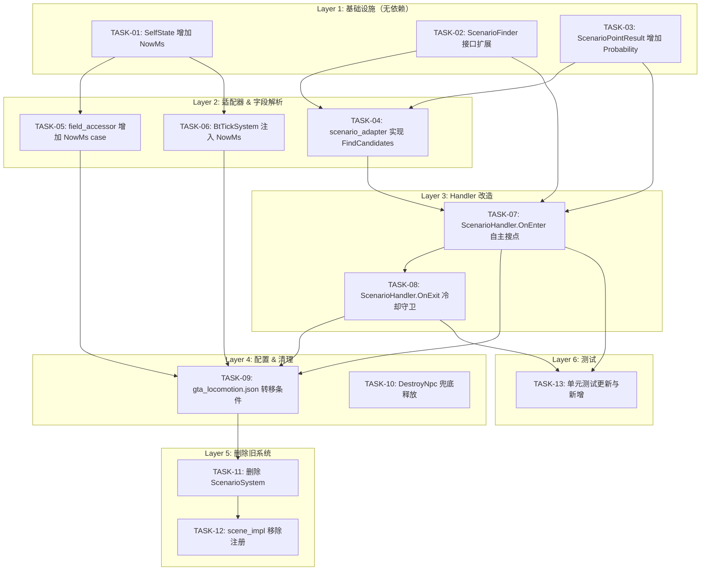

# 场景点正交集成 — 任务清单

> ⚠️ **状态：未实施** — 对应设计方案 `scenario-orthogonal-integration.md` 尚未落地，任务清单暂不可执行。
>
> 基于 `scenario-orthogonal-integration.md` Section 4 拆解
>
> 生成日期：2026-03-18

---

## 任务依赖图

---

## 结构化任务清单

### P1GoServer — Layer 1: 基础设施

#### [TASK-01] SelfState 增加 NowMs 字段
- **文件**: `ai/state/npc_state.go`
- **操作**: SelfState struct 增加 `NowMs int64`
- **依赖**: 无
- **验证**: 编译通过
- **对应**: M8

#### [TASK-02] ScenarioFinder 接口扩展
- **文件**: `ai/execution/handlers/schedule_handlers.go`
- **操作**: ScenarioFinder 接口新增 `FindCandidates(pos Vec3, radius float32, gameSecond int64) []*ScenarioPointResult`
- **依赖**: 无
- **验证**: 编译通过（mock 需同步，见 T13）
- **对应**: M1

#### [TASK-03] ScenarioPointResult 增加 Probability
- **文件**: `ai/execution/handlers/schedule_handlers.go`
- **操作**: ScenarioPointResult struct 增加 `Probability int32`
- **依赖**: 无
- **验证**: 编译通过
- **对应**: M2

### P1GoServer — Layer 2: 适配器 & 字段解析

#### [TASK-04] scenario_adapter 实现 FindCandidates
- **文件**: `ecs/res/npc_mgr/scenario_adapter.go`
- **操作**: 实现 FindCandidates（gameSecond/3600→hour，调用 FindNearestFiltered + GetDuration + GetProbability）
- **依赖**: TASK-02, TASK-03
- **验证**: 编译通过
- **对应**: M5

#### [TASK-05] field_accessor 增加 NowMs case
- **文件**: `ai/decision/v2brain/expr/field_accessor.go`
- **操作**: resolveSelf() 增加 `case "NowMs"` 返回 Self.NowMs
- **依赖**: TASK-01
- **验证**: 编译通过
- **对应**: M10

#### [TASK-06] BtTickSystem 注入 NowMs
- **文件**: `ecs/system/decision/bt_tick_system.go`
- **操作**: Update() 中 Snapshot 前写入 `npcState.Self.NowMs = mtime.NowTimeWithOffset().UnixMilli()`
- **依赖**: TASK-01
- **验证**: 编译通过
- **对应**: M9

### P1GoServer — Layer 3: Handler 改造

#### [TASK-07] ScenarioHandler.OnEnter 自主搜点
- **文件**: `ai/execution/handlers/schedule_handlers.go`
- **操作**: OnEnter 增加 ScenarioPointId==0 时自主搜点逻辑（详见设计 3.4）
- **依赖**: TASK-02, TASK-03, TASK-04
- **验证**: 编译通过
- **对应**: M3

#### [TASK-08] ScenarioHandler.OnExit 冷却守卫
- **文件**: `ai/execution/handlers/schedule_handlers.go`
- **操作**: OnExit 增加 `ScenarioPointId > 0` 条件守卫（详见设计 3.5）
- **依赖**: TASK-07（逻辑耦合）
- **验证**: 编译通过
- **对应**: M4

### P1GoServer — Layer 4: 配置 & 清理

#### [TASK-09] gta_locomotion.json 转移条件
- **文件**: `bin/config/ai_decision_v2/gta_locomotion.json`
- **操作**: 修改 schedule→scenario 转移条件（详见设计 5.2）
- **依赖**: TASK-05, TASK-06, TASK-07, TASK-08
- **验证**: JSON 格式正确，条件表达式语法正确
- **对应**: M7

#### [TASK-10] DestroyNpc 兜底释放
- **文件**: `ecs/res/npc_mgr/scene_npc_mgr.go`
- **操作**: DestroyNpc 增加 `scenarioNpcCleaner.ReleaseByNpc` 兜底调用
- **依赖**: 无（独立安全改动）
- **验证**: 编译通过
- **对应**: M6

### P1GoServer — Layer 5: 删除旧系统

#### [TASK-11] 删除 ScenarioSystem
- **文件**: `ecs/system/scenario/scenario_system.go`, `ecs/system/scenario/scenario_system_test.go`
- **操作**: 删除文件
- **依赖**: TASK-09（新系统就绪后再删）
- **验证**: 编译通过，无残留引用
- **对应**: D1, D2

#### [TASK-12] scene_impl 移除 ScenarioSystem 注册
- **文件**: `ecs/scene/scene_impl.go`
- **操作**: 移除 ScenarioSystem 注册代码及相关 import
- **依赖**: TASK-11
- **验证**: 编译通过
- **对应**: D3

### P1GoServer — Layer 6: 测试

#### [TASK-13] 单元测试更新与新增
- **文件**: `ai/execution/handlers/schedule_handlers_test.go`
- **操作**:
  - T1: mockScenarioFinder 增加 FindCandidates mock
  - T2: 更新 TestScenarioHandler_OnEnter_NoPreAssign
  - T3: 新增 OnEnter 搜点成功/失败/Occupy 失败测试
  - T4: 新增 OnExit PointId==0 不覆写冷却测试
- **依赖**: TASK-07, TASK-08
- **验证**: `go test ./ai/execution/handlers/... -run Scenario` 全部 PASS
- **对应**: T1, T2, T3, T4

---

## 执行计划

| 批次 | 可并行任务 | 说明 |
|------|-----------|------|
| Batch 1 | TASK-01, TASK-02, TASK-03, TASK-10 | 基础设施 + 独立安全改动 |
| Batch 2 | TASK-04, TASK-05, TASK-06 | 适配器 + 字段解析 |
| Batch 3 | TASK-07, TASK-08 | Handler 核心改造 |
| Batch 4 | TASK-09 | JSON 配置 |
| Batch 5 | TASK-11, TASK-12 | 删除旧系统 |
| Batch 6 | TASK-13 | 测试 |

> 每批完成后执行 `go build` 验证编译通过
