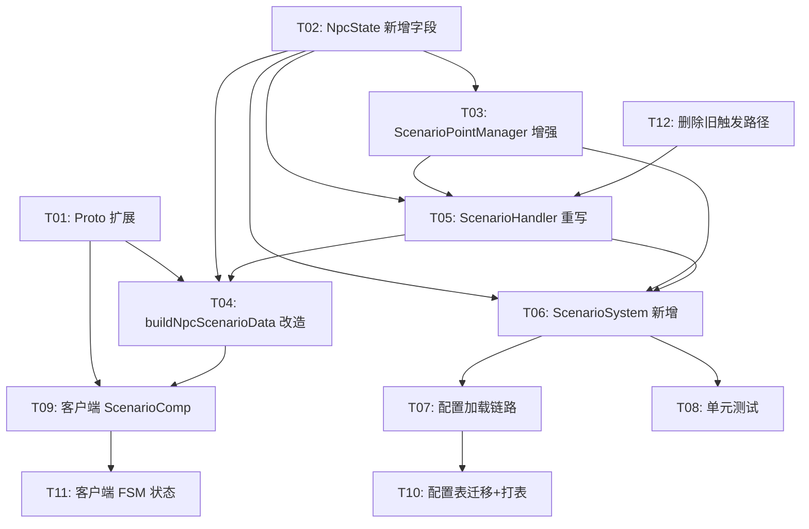

# 场景点导航 P0 — 任务清单

> ✅ 全部 12 个任务已完成（2026-03-19）

> 基于 `scenario-p0-design.md` 拆解
> 状态：全部任务已完成实现（2026-03-19 确认）

## 依赖图



## 任务清单

### 工程 1：old_proto（协议）

**[T01] 扩展 NpcScenarioData Proto** ✅
- 在 `old_proto/` 中为 NpcScenarioData 新增 direction(float) + duration(int32) 字段
- 运行 `1.generate.py` 生成 Go/C# 代码
- 依赖：无
- 验证：生成代码编译通过

### 工程 2：P1GoServer（服务端）

**[T02] NpcState 新增字段 + Snapshot + FieldAccessor** ✅
- ScheduleState 新增 6 个字段（ScenarioTypeId, ScenarioDirection, ScenarioPhase, ScenarioNearNodeId, ScenarioNearNodePos, ScenarioCooldownUntil）
- 同步 ToSnapshot() / FromSnapshot()
- FieldAccessor 注册 scenario_phase, scenario_type, scenario_cooldown
- 依赖：无
- 验证：编译通过

**[T03] ScenarioPointManager 增强** ✅
- FindNearestFiltered：Flags 8 位过滤（NoSpawn/TimeRestricted/HighPriority/ExtendedRange）
- 概率筛选：Probability fallback 到 ScenarioType.DefaultProbability
- Duration 默认值：fallback 到 ScenarioType.DefaultDuration
- 依赖：T02
- 验证：单元测试通过

**[T04] buildNpcScenarioData 改造** ✅
- 从 NpcState 新字段读取 ScenarioPhase/ScenarioTypeId/ScenarioDirection
- 依赖：T01, T02
- 验证：编译通过

**[T05] ScenarioHandler 重写** ✅
- 7 阶段状态机（Init→WalkToNearNode→WalkToPoint→Enter→Loop→Leave→WalkBackToRoad）
- Init：FindNearestPointID + 路网寻路 + NavMesh 距离检查
- 异常回退：abortScenario 辅助方法
- OnExit：释放占用 + 设置冷却
- OnEnter：检查预分配，不清零
- 依赖：T02, T03, T12
- 验证：编译通过 + 状态机流转正确

**[T06] ScenarioSystem 新增** ✅
- 独立 ECS System，分帧扫描
- 空闲判定（含冷却检查）
- 分配写入 NpcState
- NPC 队列维护（创建/销毁/随机化）
- SystemType_Scenario 常量注册
- 依赖：T02, T03, T05
- 验证：编译通过

**[T07] 配置加载链路** ✅
- scene_impl.go init() 中新增 initScenarioPoints()
- 遍历 CfgScenarioPoint → mgr.AddPoint()
- ScenarioSystem 注册到场景
- 依赖：T06
- 验证：起服后场景点加载日志

**[T08] 单元测试** ✅
- scenario_point_manager_test.go：Flags/概率/Duration/占用释放/时间窗口/容量
- scenario_system_test.go：空闲判定/分帧扫描/分配写入/冷却/队列
- 依赖：T06, T07
- 验证：go test 全部通过

**[T12] 删除旧触发路径** ✅
- 删除 ScheduleHandler.OnTick case 5 (BehaviorType=5 UseScenario)
- 依赖：无
- 验证：编译通过

### 工程 3：freelifeclient（客户端）

**[T09] TownNpcScenarioComp 完善** ✅
- StartScenario(pointId, type, direction, duration)
- OnPhaseChanged(phase) → phase 3/4/5 触发动画
- LeaveScenario() 清理
- 依赖：T01, T04
- 验证：编译无报错

**[T11] TownNpcScenarioState FSM 状态** ✅
- 新增 FSM 状态，注册到 TownFsmComp
- OnEnter：查 CfgScenarioType，缓存动画名
- OnUpdate：按 phase 驱动动画（Enter/Loop/Leave）
- OnExit：停止动画层，清理 ScenarioComp
- 依赖：T09
- 验证：编译无报错

### 工程 4：RawTables（配置）

**[T10] 配置表迁移 + 打表** ✅
- 将 NpcScenarioConfig.xlsx（TownNpc/）接入打表流程
- 确认 NpcSchedule.xlsx 中旧数据是否需要清理
- 运行打表工具，验证 bin/config 产物
- 依赖：T07
- 验证：bytes 文件大小合理，Go/C# 代码编译通过

## 执行顺序建议

```
第 1 批（并行）：T01(Proto) + T02(NpcState) + T12(删旧路径)
第 2 批（并行）：T03(Manager增强) + T04(buildData改造)
第 3 批（串行）：T05(Handler重写) → T06(System新增) → T07(配置加载)
第 4 批（并行）：T08(测试) + T09(客户端Comp) + T10(打表)
第 5 批（串行）：T11(客户端FSM)
```
