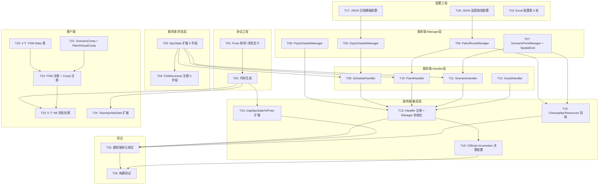

# NPC 日程与巡逻系统——任务清单

> ✅ 全部 26 个任务已完成（2026-03-19）

> 生成日期：2026-03-13 | 更新日期：2026-03-19 | 设计文档：tech-design.md
> 状态：全部任务已完成实现

## 任务依赖图

## 结构化任务清单

### 第一批：协议 + 状态层 + 配置（可并行）

#### [TASK-01] Proto 枚举与消息定义 ✅
- **工程**：`old_proto/scene/npc.proto`
- **依赖**：无
- **内容**：
  1. NpcState 枚举追加 Patrol=17, Guard=18, Scenario=19, ScheduleIdle=20
  2. 新增 4 个枚举：ScheduleBehaviorType, ScenarioPhase, ScheduleChangeReason, PatrolAlertLevel
  3. 新增 3 个子消息：NpcScheduleData, NpcPatrolData(含 direction), NpcScenarioData
  4. TownNpcData 追加 schedule_data=17, patrol_data=18, scenario_data=19
  5. 新增 5 个 Ntf 消息
  6. NpcWeakStateCommand patrol_* 字段 (6-12) 标记 deprecated
- **完成标准**：protoc 编译通过

#### [TASK-02] Proto 代码生成 ✅
- **工程**：`old_proto/_tool_new/`
- **依赖**：TASK-01
- **内容**：运行 `1.generate.py`，生成 Go/C# 代码到各工程目录
- **完成标准**：P1GoServer/common/proto/ 和 freelifeclient Proto 目录更新

#### [TASK-03] NpcState 扩展 5 字段 ✅
- **工程**：`P1GoServer/.../ai/state/npc_state.go`
- **依赖**：无
- **内容**：
  1. ScheduleState 新增 ScheduleTemplateId, PatrolRouteId, PatrolDirection, ScenarioPointId, AlertLevel
  2. 确认 Snapshot CopyFrom 自动覆盖（值类型 struct copy）
  3. NpcState Reset/Pool 回收时清零新字段
- **完成标准**：编译通过，Snapshot 同步正确

#### [TASK-04] FieldAccessor 注册 5 字段 ✅
- **工程**：`P1GoServer/.../ai/decision/v2brain/expr/field_accessor.go`
- **依赖**：TASK-03
- **内容**：resolveSchedule 中注册 templateId, patrolRouteId, patrolDirection, scenarioPointId, alertLevel
- **完成标准**：V2Brain 表达式 `schedule.templateId > 0` 可正确解析

#### [TASK-17] JSON 日程模板配置（最小可用） ✅
- **工程**：`P1GoServer/bin/config/V2TownNpcSchedule/`
- **依赖**：无
- **内容**：创建目录 + 1 个示例模板 JSON（含 2-3 个时段条目）
- **完成标准**：JSON 格式正确，字段与 ScheduleTemplate 结构匹配

#### [TASK-18] JSON 巡逻路线配置（最小可用） ✅
- **工程**：`P1GoServer/bin/config/ai_patrol/`（待建独立目录）
- **依赖**：无
- **内容**：创建目录 + 1 条示例路线 JSON（4-6 个节点，闭环）
- **完成标准**：JSON 格式正确，节点 Links 形成有效闭环

---

### 第二批：服务端 Manager 层（可并行）

#### [TASK-05] DayScheduleManager ✅
- **工程**：`P1GoServer/.../ai/schedule/`（新建包）
- **依赖**：TASK-17
- **内容**：
  1. `schedule_config.go`：ScheduleTemplate/ScheduleEntry 结构 + LoadScheduleTemplates
  2. `day_schedule_manager.go`：MatchEntry（含跨日）、GetTargetPosition
  3. `schedule_config_test.go`：加载测试 + 匹配测试
- **完成标准**：单元测试通过

#### [TASK-06] PatrolRouteManager ✅
- **工程**：`P1GoServer/.../ai/patrol/`（新建包）
- **依赖**：TASK-18
- **内容**：
  1. `patrol_config.go`：PatrolRoute/PatrolNode 结构 + LoadPatrolRoutes + nil map 初始化
  2. `patrol_route_manager.go`：AssignNpc, ReleaseNpc, ReleaseAllByNpc, GetNextNode, IsNodeOccupied, FindNearestNode + npcToRoute 反向索引
  3. `patrol_config_test.go`：加载测试 + 分配/释放测试
- **完成标准**：单元测试通过

#### [TASK-07] ScenarioPointManager + SpatialGrid ✅
- **工程**：`P1GoServer/.../ai/scenario/`（新建包）
- **依赖**：无
- **内容**：
  1. `spatial_grid.go`：SpatialGrid（Insert 坐标校验 [-10000,10000]）、Query、Remove
  2. `scenario_point_manager.go`：FindNearest, Occupy, Release, ReleaseByNpc, IsAvailable + nil map 初始化
  3. `spatial_grid_test.go`：插入/查询/边界测试
- **完成标准**：单元测试通过

#### [TASK-08] PopScheduleManager ✅
- **工程**：`P1GoServer/.../ai/schedule/pop_schedule_manager.go`
- **依赖**：无
- **内容**：
  1. PopAllocation/Region 结构，Evaluate（每秒调用）、GetTimeSlot、SelectNpcType
  2. NpcGroupWeights 正权重校验
  3. SetOverride/ClearOverride（P1 预留）
- **完成标准**：编译通过（依赖 Excel 配置表数据，完整测试需 TASK-19）

---

### 第三批：服务端 Handler 层（可并行）

#### [TASK-09] ScheduleHandler ✅
- **工程**：`P1GoServer/.../ai/execution/handlers/schedule_handlers.go`（新建）
- **依赖**：TASK-03, TASK-05, TASK-07
- **内容**：
  1. ScheduleHandler 结构（持有 ScheduleQuerier + ScenarioFinder 接口）
  2. OnEnter：读取 ScheduleTemplateId 初始化
  3. OnTick：中断恢复 + MatchEntry + BehaviorType 分发 + ctx.Execute 直接切换子 Handler
  4. OnExit：清理临时标记
  5. 无匹配 fallback Idle，PauseAccum clamp
- **完成标准**：编译通过

#### [TASK-10] PatrolHandler ✅
- **工程**：同 TASK-09 文件
- **依赖**：TASK-03, TASK-06
- **内容**：
  1. PatrolHandler 结构（持有 PatrolQuerier 接口）
  2. OnTick 状态机：Start → MoveToNode → StandAtNode → SelectNext
  3. 节点互斥检查、方向翻转、分叉选择
- **完成标准**：编译通过

#### [TASK-11] ScenarioHandler ✅
- **工程**：同 TASK-09 文件
- **依赖**：TASK-03, TASK-07
- **内容**：
  1. ScenarioHandler 结构（持有 ScenarioFinder 接口）
  2. OnTick：搜索→占用→移动→执行→释放
  3. Phase 切换写入 NpcState
- **完成标准**：编译通过

#### [TASK-12] GuardHandler ✅
- **工程**：同 TASK-09 文件
- **依赖**：TASK-03
- **内容**：最简 Handler，OnEnter 设位置+朝向，OnTick 空
- **完成标准**：编译通过

---

### 第四批：服务端集成层

#### [TASK-13] Handler 注册 + Manager 初始化 ✅
- **工程**：`P1GoServer/.../ai/pipeline/v2_pipeline_defaults.go` + `npc_mgr/scene_npc_mgr.go`
- **依赖**：TASK-08, TASK-09, TASK-10, TASK-11, TASK-12
- **内容**：
  1. npc_mgr 中创建 DayScheduleManager/PatrolRouteManager/ScenarioPointManager/PopScheduleManager 实例
  2. 定义 ScheduleQuerier/PatrolQuerier/ScenarioFinder 接口（在 execution/handlers 包内）
  3. v2_pipeline_defaults.go locomotion 维度注册 4 个新 Handler
  4. NpcManager 主循环中调用 PopScheduleManager.Evaluate（每秒一次）
- **完成标准**：编译通过，管线启动正常

#### [TASK-14] mapNpcStateToProto 扩展 ✅
- **工程**：`P1GoServer/.../ecs/system/decision/bt_tick_system.go`
- **依赖**：TASK-02, TASK-03
- **内容**：
  1. syncNpcStateToTownNpc 中新增 NpcScheduleData/NpcPatrolData/NpcScenarioData 序列化
  2. NpcState → NpcState 枚举映射新增 4 个值
  3. NpcWeakStateCommand deprecated 字段双写
- **完成标准**：编译通过

#### [TASK-15] CleanupNpcResources 挂钩 ✅
- **工程**：`P1GoServer/.../npc_mgr/scene_npc_mgr.go`
- **依赖**：TASK-06, TASK-07
- **内容**：
  1. DestroyNpc 流程中调用 ScenarioPointManager.ReleaseByNpc + PatrolRouteManager.ReleaseAllByNpc
  2. 通过 extHandler.OnNpcDestroyed 回调或直接在 DestroyNpc 中添加
- **完成标准**：NPC Despawn 时所有资源正确释放

#### [TASK-16] V2Brain locomotion 决策配置 ✅
- **工程**：`P1GoServer/bin/config/ai_decision_v2/`
- **依赖**：TASK-13
- **内容**：
  1. locomotion.json 新增 4 个 plan（schedule/patrol/scenario/guard）+ 决策规则
  2. gta_locomotion.json 同步更新
  3. 确保 on_foot 作为 fallback 在最后
- **完成标准**：JSON 格式正确，plan name 与 Handler 注册名匹配

---

### 第五批：配置表

#### [TASK-19] Excel 配置表 5 张 ✅
- **工程**：`freelifeclient/RawTables/`
- **依赖**：无（可与服务端并行）
- **内容**：
  1. 创建 PopAllocation 表（1 个区域 × 6 时段 最小数据）
  2. 创建 Region 表（1 个区域）
  3. 创建 ScenarioPoint 表（3-5 个场景点）
  4. 创建 ScenarioType 表（2-3 种类型 + 动画映射）
  5. 创建 NpcGroup 表（2-3 个类型组）
  6. 运行打表工具生成二进制
- **完成标准**：打表工具无错误，二进制文件生成到 bin/config/

---

### 第六批：客户端（依赖协议代码生成）

#### [TASK-20] 4 个 FSM State 类 ✅
- **工程**：`freelifeclient/.../S1Town/Entity/NPC/State/`
- **依赖**：TASK-02
- **内容**：
  1. TownNpcPatrolState：OnEnter 设速度姿态，OnUpdate 移动插值
  2. TownNpcGuardState：OnEnter 播放站岗动画
  3. TownNpcScenarioState：OnEnter 读 scenario_data，委托 ScenarioComp
  4. TownNpcScheduleIdleState：OnEnter 播放 Idle 动画
- **完成标准**：编译通过

#### [TASK-21] TownNpcScenarioComp + TownNpcPatrolVisualComp ✅
- **工程**：`freelifeclient/.../S1Town/Entity/NPC/Comp/`
- **依赖**：TASK-02
- **内容**：
  1. ScenarioComp：async UniTaskVoid + CancellationToken，StartScenario/LeaveScenario
  2. PatrolVisualComp：SetAlertLevel/OnNodeArrive，无 async
- **完成标准**：编译通过

#### [TASK-22] FSM 注册 + Comp 注册 ✅
- **工程**：`freelifeclient/.../TownFsmComp.cs` + `TownNpcController.cs`
- **依赖**：TASK-20, TASK-21
- **内容**：
  1. TownFsmComp 通过 `RegisterServerState<T>(枚举值)` 注册服务端状态值 17/18/19/20
  2. TownNpcController.OnInit 中 AddComp TownNpcScenarioComp + TownNpcPatrolVisualComp
- **完成标准**：编译通过

#### [TASK-23] 5 个 Ntf 消息处理 ✅
- **工程**：`freelifeclient/.../S1Town/Entity/NPC/`
- **依赖**：TASK-02, TASK-22
- **内容**：
  1. 注册 NpcScheduleChangeNtf/NpcPatrolNodeArriveNtf/NpcPatrolAlertChangeNtf/NpcScenarioEnterNtf/NpcScenarioLeaveNtf 处理函数
  2. 各 Ntf 调用对应 Comp 方法
- **完成标准**：编译通过

#### [TASK-24] TownNpcNetData 扩展 ✅
- **工程**：`freelifeclient/.../TownNpcNetData.cs`
- **依赖**：TASK-02
- **内容**：
  1. 解析 TownNpcData 新增子消息（schedule_data/patrol_data/scenario_data）
  2. 传递给对应 Comp 和 FSM State
- **完成标准**：编译通过

---

### 第七批：验证

#### [TASK-25] 服务端单元测试 ✅
- **工程**：P1GoServer
- **依赖**：TASK-13, TASK-14, TASK-15
- **内容**：
  1. schedule_config_test.go：模板加载 + 跨日匹配
  2. patrol_config_test.go：路线加载 + 分配/释放/反向索引
  3. spatial_grid_test.go：插入/查询/边界校验
  4. FieldAccessor 新字段解析测试
- **完成标准**：`make test` 全部通过

#### [TASK-26] 构建验证 ✅
- **工程**：全部
- **依赖**：TASK-25, TASK-16, TASK-23, TASK-24
- **内容**：
  1. `make build` 服务端 16 个微服务编译通过
  2. 客户端 Unity 编译通过（无 CS 错误）
- **完成标准**：零错误构建

---

## 并行执行计划

| 批次 | 任务 | 预计并行度 |
|------|------|-----------|
| 1 | T01→T02, T03→T04, T17, T18 | 4 路并行 |
| 2 | T05, T06, T07, T08 | 4 路并行 |
| 3 | T09, T10, T11, T12 | 4 路并行 |
| 4 | T13, T14, T15, T16 | 3 路并行（T16 依赖 T13） |
| 5 | T19 | 1 路（Excel 操作） |
| 6 | T20+T21 → T22 → T23+T24 | 2→1→2 |
| 7 | T25 → T26 | 串行 |
