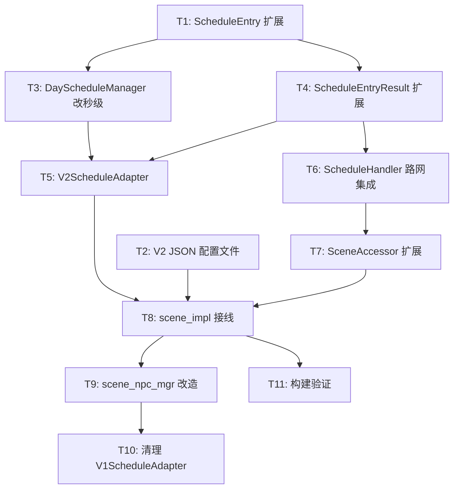

# V2 日程配置 — 任务清单

> ✅ 全部 11 个任务已完成（2026-03-19）

> 状态：全部任务已完成实现（2026-03-19 确认）

## 依赖图

## 任务清单

### 基础设施层

**[T1] ScheduleEntry 扩展** ✅
- 文件: `ai/schedule/schedule_config.go`
- 内容: StartTime/EndTime int32→int64，新增 TargetPos/FaceDirection/StartPointId/EndPointId/BuildingId/DoorId/Duration 字段，新增 Vec3Json 类型
- 验证: 编译通过

**[T2] V2 日程 JSON 配置文件** ✅
- 目录: `bin/config/V2TownNpcSchedule/`
- 内容: 参考 V1 的 24 个 JSON，逐个转换为 V2 格式（秒级时间 + 路点 ID + 扁平结构）
- 验证: JSON 格式正确，templateId 唯一

**[T3] DayScheduleManager 改秒级** ✅
- 文件: `ai/schedule/day_schedule_manager.go`
- 内容: MatchEntry 参数 gameHour int32 → gameSecond int64，matchTimeRange 同步改
- 依赖: T1
- 验证: 编译通过

**[T4] ScheduleEntryResult 扩展** ✅
- 文件: `execution/handlers/schedule_handlers.go`
- 内容: ScheduleEntryResult 新增 FaceDirection/StartPointId/EndPointId/BuildingId/DoorId/Duration；ScheduleQuerier 接口签名 gameHour→gameSecond
- 依赖: T1
- 验证: 编译通过

### Handler 层

**[T5] V2ScheduleAdapter** ✅
- 文件: `npc_mgr/v2_schedule_adapter.go`（新建）
- 内容: 实现 ScheduleQuerier 接口，DayScheduleManager.MatchEntry → ScheduleEntryResult 转换
- 依赖: T3, T4
- 验证: 编译期接口校验 `var _ ScheduleQuerier = (*V2ScheduleAdapter)(nil)`

**[T6] ScheduleHandler 路网集成** ✅
- 文件: `execution/handlers/schedule_handlers.go`
- 内容: 新增 RoadNetQuerier 接口；OnTick 时间获取改秒级；BehaviorType=1 分支集成路网寻路（fallback 直线）；ScenarioFinder 接口 gameHour→gameSecond
- 依赖: T4
- 验证: 编译通过

**[T7] SceneAccessor 扩展** ✅
- 文件: `ai/execution/` 相关（需确认 SceneAccessor 定义位置）
- 内容: 新增 SetEntityPathPoints / FindPathToVec3List 方法，底层操作 NpcMoveComp
- 依赖: T6
- 验证: 编译通过

### 接线层

**[T8] scene_impl 初始化接线** ✅
- 文件: `ecs/scene/scene_impl.go`
- 内容: 替换 V1ScheduleAdapter → NewDayScheduleManager("V2TownNpcSchedule") + NewV2ScheduleAdapter + InitLocomotionManagers
- 依赖: T2, T5, T7
- 验证: 启服不报错

**[T9] scene_npc_mgr 改造** ✅
- 文件: `npc_mgr/scene_npc_mgr.go`
- 内容: scheduleAdapter 字段类型改 V2；CreateNpc 读 scheduleV2 templateId（暂用硬编码或 V1 同名映射，配置表改动后切换）
- 依赖: T8
- 验证: 编译通过

### 清理层

**[T10] 清理 V1ScheduleAdapter** ✅
- 文件: `npc_mgr/v1_schedule_adapter.go`
- 内容: 确认无其他引用后删除
- 依赖: T9
- 验证: 编译通过，无残留引用

### 验证

**[T11] 构建验证** ✅
- 命令: `make build` 或 `make scene_server`
- 依赖: T8
- 验证: 编译通过，无 lint 错误
