# new-feature 完整流程图

```mermaid
flowchart TD
    START(["用户: /new-feature '一句话需求'"])

    %% ========== Step 0 ==========
    subgraph S0["Step 0: 收集基础信息 & 断点恢复"]
        S0_CHECK{"idea.md 状态?"}
        S0_RESUME_4["有 ## 确认方案<br/>→ 跳到 Step 4"]
        S0_RESUME_3["有 idea.md 无确认方案<br/>→ 跳到 Step 3"]
        S0_RESUME_1["仅目录存在<br/>→ 跳到 Step 1"]
        S0_COLLECT["推导 VERSION_ID + FEATURE_NAME<br/>检测 USER_ENGINE_CHOICE<br/>请用户确认"]
    end

    START --> S0_CHECK
    S0_CHECK -->|"## 确认方案 存在"| S0_RESUME_4
    S0_CHECK -->|"idea.md 存在<br/>无确认方案"| S0_RESUME_3
    S0_CHECK -->|"仅目录存在"| S0_RESUME_1
    S0_CHECK -->|"均不存在"| S0_COLLECT

    %% ========== Step 1 ==========
    subgraph S1["Step 1: 建立项目上下文"]
        S1_PARALLEL["并行调研:<br/>① MEMORY.md 历史经验<br/>② docs/ 相关设计文档<br/>③ 代码中最相似实现"]
    end

    S0_COLLECT --> S1_PARALLEL
    S0_RESUME_1 --> S1_PARALLEL

    %% ========== Step 2 ==========
    subgraph S2["Step 2: 创建需求文档"]
        S2_WRITE["写入 idea.md:<br/>核心需求 / 调研上下文<br/>范围边界 / 初步理解"]
    end

    S1_PARALLEL --> S2_WRITE

    %% ========== Step 3 ==========
    subgraph S3["Step 3: 互动确认方案"]
        S3_QA["与用户 Q&A<br/>(每轮 ≤6 问, 软上限 5 轮)"]
        S3_SUMMARY["输出方案摘要:<br/>锁定决策 / 待细化 / 验收标准"]
        S3_CONFIRM{"用户确认?"}
        S3_PERSIST["追加 ## 确认方案<br/>到 idea.md"]
    end

    S2_WRITE --> S3_QA
    S0_RESUME_3 --> S3_QA
    S3_QA --> S3_SUMMARY
    S3_SUMMARY --> S3_CONFIRM
    S3_CONFIRM -->|"需要调整"| S3_QA
    S3_CONFIRM -->|"确认"| S3_PERSIST

    %% ========== Step 3.5 ==========
    subgraph S35["Step 3.5: 技术可行性快检 (≤120s)"]
        S35_EXTRACT["从锁定决策提取<br/>可检查技术假设"]
        S35_VERIFY["并行验证:<br/>grep / go.mod / Excel MCP"]
        S35_RESULT{"结果?"}
        S35_BLOCK_GRADE{"BLOCK 分级"}
        S35_SIMPLE["简单缺失 ≤50行<br/>→ 纳入 plan"]
        S35_SYSTEM["独立系统 >300行<br/>→ 当场 DDRP spawn"]
        S35_STUCK{"顶层 or 子 feature?"}
        S35_REPORT["顶层: 报告用户<br/>回 Step 3"]
        S35_DEGRADE["子 feature:<br/>记录后降级继续"]
    end

    S3_PERSIST --> S35_EXTRACT
    S35_EXTRACT -->|"无命中"| S4_SELECT
    S35_EXTRACT -->|"有假设"| S35_VERIFY
    S35_VERIFY --> S35_RESULT
    S35_RESULT -->|"全部 PASS"| S4_SELECT
    S35_RESULT -->|"WARN"| S4_SELECT
    S35_RESULT -->|"BLOCK"| S35_BLOCK_GRADE
    S35_BLOCK_GRADE -->|"简单缺失"| S35_SIMPLE
    S35_SIMPLE --> S4_SELECT
    S35_BLOCK_GRADE -->|"独立系统"| S35_SYSTEM
    S35_SYSTEM --> S4_SELECT
    S35_BLOCK_GRADE -->|"无法自动解决"| S35_STUCK
    S35_STUCK -->|"顶层"| S35_REPORT
    S35_REPORT --> S3_QA
    S35_STUCK -->|"子 feature"| S35_DEGRADE
    S35_DEGRADE --> S4_SELECT

    %% ========== Step 4 ==========
    subgraph S4["Step 4: 全自动实现 + DDRP"]
        S4_SELECT{"引擎选择<br/>(idea.md字段 > 用户指定 > AI推荐)"}
        S4_ENGINE_DW["dev-workflow<br/>(当前会话执行)"]
        S4_ENGINE_AW["auto-work<br/>(run_in_background)"]

        subgraph DDRP["DDRP 外循环 (MAX=5)"]
            DDRP_INC["ROUND += 1"]
            DDRP_MAX{"ROUND > 5?"}
            DDRP_RUN["步骤2: 运行引擎"]
            DDRP_CHECK["步骤3: 检查 ddrp-req-*.md<br/>防线一: task 主动上报<br/>防线二: 编译错误自动推导"]
            DDRP_OPEN{"有 open?"}
            DDRP_RESOLVE["步骤4: 对每个 open 条目<br/>查 ddrp-registry.json"]
            DDRP_REG{"注册表状态?"}
            DDRP_COMPLETED["completed<br/>→ grep 验证<br/>→ 标记 resolved"]
            DDRP_DEVELOPING["developing<br/>→ 等待 (timeout 30min)"]
            DDRP_FAILED["failed<br/>→ 标记 failed<br/>→ 降级继续"]
            DDRP_NEW["未注册<br/>→ 准备子 idea.md<br/>→ 注册 developing<br/>→ spawn claude -p"]
            DDRP_WAIT["步骤5: 等待子进程完成<br/>读取 acceptance-report.md"]
            DDRP_RERUN{"步骤6: 有新 resolved?"}
            DDRP_RESET["重置被阻塞 task<br/>(discarded → pending)"]
        end
    end

    S0_RESUME_4 --> S4_SELECT
    S4_SELECT -->|"dev-workflow"| S4_ENGINE_DW
    S4_SELECT -->|"auto-work"| S4_ENGINE_AW
    S4_ENGINE_DW --> DDRP_INC
    S4_ENGINE_AW --> DDRP_INC
    DDRP_INC --> DDRP_MAX
    DDRP_MAX -->|"是"| S5_READ
    DDRP_MAX -->|"否"| DDRP_RUN
    DDRP_RUN --> DDRP_CHECK
    DDRP_CHECK --> DDRP_OPEN
    DDRP_OPEN -->|"无 open"| S5_READ
    DDRP_OPEN -->|"有 open"| DDRP_RESOLVE
    DDRP_RESOLVE --> DDRP_REG
    DDRP_REG -->|"completed"| DDRP_COMPLETED
    DDRP_REG -->|"developing"| DDRP_DEVELOPING
    DDRP_REG -->|"failed"| DDRP_FAILED
    DDRP_REG -->|"未注册"| DDRP_NEW
    DDRP_COMPLETED --> DDRP_WAIT
    DDRP_DEVELOPING --> DDRP_WAIT
    DDRP_FAILED --> DDRP_WAIT
    DDRP_NEW -->|"spawn 子 new-feature<br/>(递归)"| DDRP_WAIT
    DDRP_WAIT --> DDRP_RERUN
    DDRP_RERUN -->|"有"| DDRP_RESET
    DDRP_RESET --> DDRP_INC
    DDRP_RERUN -->|"无"| S5_READ

    %% ========== Step 5 ==========
    subgraph S5["Step 5: 验收确认"]
        S5_READ["5.0 读取 engine-result.md"]
        S5_EXTRACT["5.1 提取验收清单 AC-01..N"]
        S5_CLASSIFY["5.2 分类验证方法<br/>(编译/代码存在性/运行时/数据/协议)"]
        S5_EXEC["5.3 逐条执行验证<br/>记录 PASS / FAIL"]
        S5_RESULT{"全部 PASS?"}

        subgraph S54["5.4 失败修复"]
            S54_GRADE{"FAIL 分级"}
            S54_TRIVIAL["TRIVIAL<br/>主进程内联修<br/>(≤200行读 + ≤3文件改)"]
            S54_TRIVIAL_OK{"修复后 PASS?"}
            S54_COMPLEX["COMPLEX<br/>→ bug:report 登记<br/>→ spawn dev-debug"]
            S54_REVERIFY["5.4.3 重新验证"]
            S54_ROUND{"acceptance_round < 5?"}
        end

        S5_REPORT["5.5 输出验收报告<br/>acceptance-report.md"]
    end

    S5_READ --> S5_EXTRACT
    S5_EXTRACT --> S5_CLASSIFY
    S5_CLASSIFY --> S5_EXEC
    S5_EXEC --> S5_RESULT
    S5_RESULT -->|"全部 PASS"| S5_REPORT
    S5_RESULT -->|"有 FAIL"| S54_GRADE
    S54_GRADE -->|"TRIVIAL"| S54_TRIVIAL
    S54_TRIVIAL --> S54_TRIVIAL_OK
    S54_TRIVIAL_OK -->|"PASS"| S5_RESULT
    S54_TRIVIAL_OK -->|"仍 FAIL"| S54_COMPLEX
    S54_GRADE -->|"COMPLEX"| S54_COMPLEX
    S54_COMPLEX --> S54_REVERIFY
    S54_REVERIFY --> S54_ROUND
    S54_ROUND -->|"是"| S5_EXEC
    S54_ROUND -->|"否 (UNRESOLVED)"| S5_REPORT

    S5_REPORT --> END

    END(["交付完成"])

    %% ========== 子 feature 递归入口 ==========
    DDRP_NEW -.->|"claude -p '/new-feature'"| START

    %% ========== 样式 ==========
    classDef step0 fill:#e8f5e9,stroke:#4caf50
    classDef step1 fill:#e3f2fd,stroke:#2196f3
    classDef step2 fill:#fff3e0,stroke:#ff9800
    classDef step3 fill:#fce4ec,stroke:#e91e63
    classDef step4 fill:#f3e5f5,stroke:#9c27b0
    classDef step5 fill:#e0f2f1,stroke:#009688
    classDef ddrp fill:#ede7f6,stroke:#673ab7

    class S0_CHECK,S0_RESUME_4,S0_RESUME_3,S0_RESUME_1,S0_COLLECT step0
    class S1_PARALLEL step1
    class S2_WRITE step2
    class S3_QA,S3_SUMMARY,S3_CONFIRM,S3_PERSIST step3
    class S4_SELECT,S4_ENGINE_DW,S4_ENGINE_AW step4
    class DDRP_INC,DDRP_MAX,DDRP_RUN,DDRP_CHECK,DDRP_OPEN,DDRP_RESOLVE,DDRP_REG,DDRP_COMPLETED,DDRP_DEVELOPING,DDRP_FAILED,DDRP_NEW,DDRP_WAIT,DDRP_RERUN,DDRP_RESET ddrp
    class S5_READ,S5_EXTRACT,S5_CLASSIFY,S5_EXEC,S5_RESULT,S5_REPORT step5
```

## 图例

| 颜色 | 阶段 | 说明 |
|------|------|------|
| 🟢 绿色 | Step 0 | 收集基础信息 & 断点恢复 |
| 🔵 蓝色 | Step 1 | 建立项目上下文 |
| 🟠 橙色 | Step 2 | 创建需求文档 |
| 🔴 粉色 | Step 3 | 互动确认方案（唯一需要用户参与的阶段） |
| 🟣 紫色 | Step 4 | 全自动实现 + DDRP 依赖解决 |
| 🟤 深紫 | DDRP | 递归依赖解决循环 |
| 🔵 青色 | Step 5 | 验收确认 + 失败修复循环 |

## 关键路径

- **顶层 feature 正常路径**: Step 0 → 1 → 2 → 3 → 3.5 → 4(引擎+DDRP) → 5 → 交付
- **断点恢复（方案已确认）**: Step 0 → 直接跳 Step 4
- **子 feature（DDRP 递归）**: Step 0(跳到4) → 4(引擎+DDRP) → 5 → acceptance-report.md → 父进程读取
- **DDRP 触发路径**: 引擎执行 → ddrp-req 发现 → 注册表查重 → spawn 子 feature → 等待 → 重跑引擎
