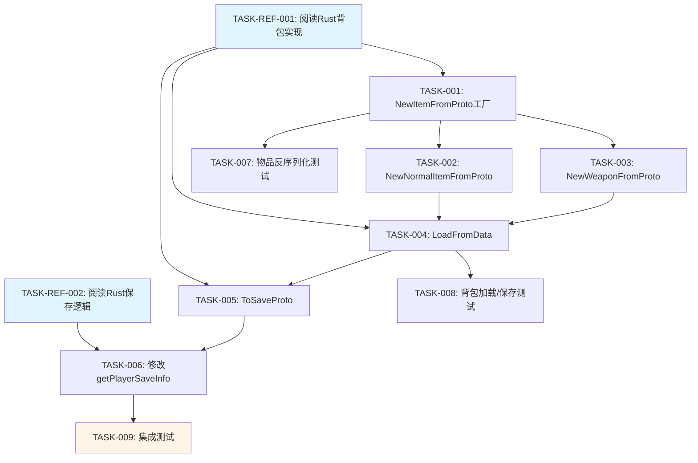

# 任务清单：跨服务器背包数据同步

## 概述

将 Rust 服务器保存的背包数据同步到 Go 服务器的樱花校园场景。

**设计文档**: `design-backpack-sync.md`

---

## 任务依赖图



---

## 0. 参考任务（仅阅读，不修改代码）

### [TASK-REF-001] 阅读 Rust 背包实现

**文件**: `server_old/servers/scene/src/entity_comp/backpack/backpack_comp.rs`

**目的**: 理解 Rust 端的 `load_from_data`、`to_save_data` 实现逻辑

**关键代码位置**:
- Lines 62-77: `load_from_data` 方法
- Lines 79-84: `to_save_data` 方法

**完成标准**: 理解 Rust 如何加载和保存背包数据

---

### [TASK-REF-002] 阅读 Rust 保存逻辑

**文件**: `server_old/servers/scene/src/user_data_sync.rs`

**目的**: 理解副本场景隔离机制（副本内不保存背包变化）

**关键代码位置**:
- Lines 118-122: 副本场景判断逻辑
- Lines 155-179: `get_player_save_info` 中的背包保存

**完成标准**: 理解 Rust 如何判断是否保存背包（副本 vs 正常场景）

---

## 1. 物品模块 (P1GoServer/common/citem/)

### [TASK-001] 新增 `NewItemFromProto()` 工厂方法

**文件**: `P1GoServer/common/citem/item.go`

**修改类型**: 新增函数

**依赖**: TASK-REF-001

**内容**:
```go
// NewItemFromProto 从 proto 创建物品实例
func NewItemFromProto(itemProto *proto.ItemProto) IItem {
    if itemProto == nil {
        return nil
    }

    // 根据 ItemProto 的 oneof 类型创建对应的物品实例
    switch data := itemProto.Data.(type) {
    case *proto.ItemProto_Normal:
        return NewNormalItemFromProto(data.Normal)
    case *proto.ItemProto_Weapon:
        return NewWeaponFromProto(data.Weapon)
    // 其他物品类型...
    default:
        log.Errorf("NewItemFromProto: unknown item type")
        return nil
    }
}
```

**验收标准**:
- [ ] 能够正确识别 `ItemProto_Normal` 类型并调用 `NewNormalItemFromProto`
- [ ] 能够正确识别 `ItemProto_Weapon` 类型并调用 `NewWeaponFromProto`
- [ ] 对未知类型返回 nil 并记录错误日志
- [ ] nil 输入返回 nil（无 panic）

---

### [TASK-002] 新增 `NewNormalItemFromProto()` 方法

**文件**: `P1GoServer/common/citem/normal_item.go`

**修改类型**: 新增函数

**依赖**: TASK-001

**内容**:
```go
// NewNormalItemFromProto 从 proto 创建普通物品实例
func NewNormalItemFromProto(normalProto *proto.ItemProtoNormal) *NormalItem {
    if normalProto == nil {
        return nil
    }

    item := &NormalItem{
        ItemID:   normalProto.ItemId,
        Quantity: normalProto.Quantity,
        Is_bind:  normalProto.IsBind,
        // ... 其他字段
    }

    return item
}
```

**验收标准**:
- [ ] 正确还原 `ItemID`、`Quantity`、`Is_bind` 等所有字段
- [ ] nil 输入返回 nil
- [ ] 创建的物品实例能够通过 `ToProto()` 往返序列化不丢失数据

---

### [TASK-003] 新增 `NewWeaponFromProto()` 方法

**文件**: `P1GoServer/common/citem/weapon.go`

**修改类型**: 新增函数

**依赖**: TASK-001

**内容**:
```go
// NewWeaponFromProto 从 proto 创建武器实例
func NewWeaponFromProto(weaponProto *proto.ItemProtoWeapon) *Weapon {
    if weaponProto == nil {
        return nil
    }

    weapon := &Weapon{
        ItemID:     weaponProto.ItemId,
        Quantity:   weaponProto.Quantity,
        Durability: weaponProto.Durability,
        // ... 其他字段
    }

    return weapon
}
```

**验收标准**:
- [ ] 正确还原武器的所有属性（耐久度等）
- [ ] nil 输入返回 nil
- [ ] 创建的武器实例能够通过 `ToProto()` 往返序列化不丢失数据

---

## 2. 背包组件 (P1GoServer/servers/scene_server/internal/ecs/com/cbackpack/)

### [TASK-004] 实现 `BackpackComp.LoadFromData()`

**文件**: `P1GoServer/servers/scene_server/internal/ecs/com/cbackpack/backpack.go`

**修改类型**: 实现空方法

**依赖**: TASK-002, TASK-003, TASK-REF-001

**当前代码** (Lines 88-92):
```go
func (b *BackpackComp) LoadFromData(saveData *proto.DBSaveBackPackComponent) {
    if saveData == nil || saveData.BackpackInfo == nil {
        return
    }
    // TODO: 实现从数据库加载背包数据  ← 当前为空
}
```

**修改内容**:
```go
func (b *BackpackComp) LoadFromData(saveData *proto.DBSaveBackPackComponent) {
    if saveData == nil || saveData.BackpackInfo == nil {
        return
    }

    // 遍历保存的背包格子
    for _, cellData := range saveData.BackpackInfo.ItemList {
        if cellData.ItemInfo == nil {
            continue
        }

        // 从 proto 加载物品实例
        item := citem.NewItemFromProto(cellData.ItemInfo)
        if item == nil {
            log.Errorf("LoadFromData: failed to load item, cell=%d", cellData.CellIndex)
            continue
        }

        // 创建背包格子
        cell := &BackpackCell{
            CellIndex: cellData.CellIndex,
            Item:      item,
            IsLocked:  cellData.IsLock,
        }

        // 添加到背包
        b.ItemMap[cellData.CellIndex] = cell

        // 更新物品索引
        itemID := item.GetItemID()
        if b.IteamListbyKey[itemID] == nil {
            b.IteamListbyKey[itemID] = make([]*BackpackCell, 0)
        }
        b.IteamListbyKey[itemID] = append(b.IteamListbyKey[itemID], cell)
    }

    // 更新背包大小
    b.updateSize()

    // 标记需要同步给客户端
    b.SetSync()
}
```

**验收标准**:
- [ ] 能够从 `DBSaveBackPackComponent` 正确加载所有背包格子
- [ ] 正确调用 `citem.NewItemFromProto()` 反序列化物品
- [ ] 正确填充 `ItemMap` 和 `IteamListbyKey`
- [ ] 正确更新 `CurrentSize`
- [ ] 调用 `SetSync()` 标记同步
- [ ] 对无效物品跳过并记录日志，不影响其他物品加载
- [ ] nil 输入安全处理（无 panic）

---

### [TASK-005] 新增 `BackpackComp.ToSaveProto()` 方法

**文件**: `P1GoServer/servers/scene_server/internal/ecs/com/cbackpack/backpack.go`

**修改类型**: 新增方法

**依赖**: TASK-004, TASK-REF-001

**内容**:
```go
// ToSaveProto 转换为数据库保存格式
func (b *BackpackComp) ToSaveProto() *proto.DBSaveBackPackComponent {
    cellList := make([]*proto.DBSaveBackpackCell, 0, len(b.ItemMap))

    for cellIndex, cell := range b.ItemMap {
        cellList = append(cellList, &proto.DBSaveBackpackCell{
            CellIndex: cellIndex,
            ItemInfo:  cell.Item.ToProto(),
            IsLock:    cell.IsLocked,
        })
    }

    return &proto.DBSaveBackPackComponent{
        BackpackInfo: &proto.DBSaveBackpack{
            ItemList: cellList,
        },
    }
}
```

**验收标准**:
- [ ] 遍历 `ItemMap` 生成 `DBSaveBackpackCell` 列表
- [ ] 正确调用 `Item.ToProto()` 序列化物品
- [ ] 生成的 proto 结构符合 `db_server.proto` 定义
- [ ] 空背包返回有效的空列表结构（非 nil）
- [ ] 往返测试：`LoadFromData(ToSaveProto(backpack))` 数据不丢失

---

## 3. 场景进出逻辑 (P1GoServer/servers/scene_server/internal/net_func/player/)

### [TASK-006] 修改 `getPlayerSaveInfo()` 添加背包保存

**文件**: `P1GoServer/servers/scene_server/internal/net_func/player/enter.go`

**修改类型**: 添加代码

**位置**: 第 760 行之后（Statistics 保存之后）

**依赖**: TASK-005, TASK-REF-002

**当前代码** (Lines 755-761):
```go
common.SetSaveComponentProto(entity, common.ComponentType_Statistics,
    func(proto *proto.DBSaveRoleGrowthData) { res.RoleGrowthData = proto },
    func(comp *com.StatisticsComp) *proto.DBSaveRoleGrowthData { return comp.ToSaveProto() },
    isAll,
)

// 此处添加背包保存
```

**添加内容**:
```go
// 保存背包数据
common.SetSaveComponentProto(entity, common.ComponentType_Backpack,
    func(proto *proto.DBSaveBackPackComponent) { res.RoleBackpack = proto },
    func(comp *cbackpack.BackpackComp) *proto.DBSaveBackPackComponent { return comp.ToSaveProto() },
    isAll,
)
```

**验收标准**:
- [ ] 玩家离开场景时，背包数据写入 `res.RoleBackpack`
- [ ] 调用 `BackpackComp.ToSaveProto()` 获取序列化数据
- [ ] 与其他组件保存逻辑一致（使用 `SetSaveComponentProto`）
- [ ] 不影响原有 Statistics 等组件的保存

---

## 4. 测试任务

### [TASK-007] 单元测试：物品反序列化

**文件**: `P1GoServer/common/citem/item_test.go`（新建）

**依赖**: TASK-001, TASK-002, TASK-003

**测试内容**:
```go
func TestNewItemFromProto_NormalItem(t *testing.T) {
    // 测试普通物品反序列化
}

func TestNewItemFromProto_Weapon(t *testing.T) {
    // 测试武器反序列化
}

func TestNewItemFromProto_RoundTrip(t *testing.T) {
    // 测试往返序列化：item.ToProto() → NewItemFromProto() → 数据一致
}

func TestNewItemFromProto_NilInput(t *testing.T) {
    // 测试 nil 输入处理
}

func TestNewItemFromProto_UnknownType(t *testing.T) {
    // 测试未知类型处理
}
```

**验收标准**:
- [ ] 覆盖 NormalItem 的反序列化路径
- [ ] 覆盖 Weapon 的反序列化路径
- [ ] 往返序列化测试通过（数据不丢失）
- [ ] nil 输入不 panic
- [ ] 未知类型返回 nil

---

### [TASK-008] 单元测试：背包加载/保存

**文件**: `P1GoServer/servers/scene_server/internal/ecs/com/cbackpack/backpack_test.go`（新建或修改）

**依赖**: TASK-004, TASK-005

**测试内容**:
```go
func TestBackpackComp_LoadFromData(t *testing.T) {
    // 测试从 proto 加载背包数据
}

func TestBackpackComp_ToSaveProto(t *testing.T) {
    // 测试背包序列化为 proto
}

func TestBackpackComp_RoundTrip(t *testing.T) {
    // 测试往返：ToSaveProto() → LoadFromData() → 数据一致
}

func TestBackpackComp_LoadFromData_InvalidItem(t *testing.T) {
    // 测试加载包含无效物品的数据（跳过无效物品）
}

func TestBackpackComp_LoadFromData_EmptyBackpack(t *testing.T) {
    // 测试加载空背包
}
```

**验收标准**:
- [ ] `LoadFromData` 正确恢复背包内容
- [ ] `ToSaveProto` 正确序列化背包数据
- [ ] 往返测试通过（数据不丢失）
- [ ] 无效物品被跳过，不影响其他物品
- [ ] 空背包处理正确

---

### [TASK-009] 集成测试：跨服务器背包同步

**文件**: `P1GoServer/servers/scene_server/internal/integration_test.go`（或新建）

**依赖**: TASK-006

**测试内容**:
```go
func TestCrossServerBackpackSync(t *testing.T) {
    // 模拟完整流程：
    // 1. 创建背包数据（模拟 Rust 保存）
    // 2. 序列化为 DBSaveBackPackComponent
    // 3. Go 服务器加载（LoadFromData）
    // 4. 验证背包内容一致
    // 5. Go 服务器修改背包
    // 6. 保存（ToSaveProto）
    // 7. 重新加载，验证修改被保存
}

func TestBackpackPersistence_DisconnectReconnect(t *testing.T) {
    // 模拟断线重连场景：
    // 1. 玩家进入场景，加载背包
    // 2. 玩家断线（离开场景，保存背包）
    // 3. 玩家重连（重新进入场景，加载背包）
    // 4. 验证背包数据完整
}

func TestBackpackIsolation_DungeonScene(t *testing.T) {
    // 测试副本场景隔离（可选，根据是否实现副本隔离）
    // 1. 玩家进入副本
    // 2. 修改背包
    // 3. 离开副本
    // 4. 验证背包变化未保存
}
```

**验收标准**:
- [ ] 模拟 Rust 保存 → MongoDB → Go 加载的完整流程
- [ ] 背包数据在跨服务器场景切换时保持一致
- [ ] 断线重连后背包数据恢复正确
- [ ] （可选）副本场景隔离机制正确

---

## 任务执行顺序

### 第一批（可并行）
- **TASK-REF-001**: 阅读 Rust 背包实现
- **TASK-REF-002**: 阅读 Rust 保存逻辑
- **TASK-001**: NewItemFromProto 工厂方法骨架

### 第二批（可并行，依赖第一批）
- **TASK-002**: NewNormalItemFromProto
- **TASK-003**: NewWeaponFromProto

### 第三批（串行，依赖第二批）
1. **TASK-004**: LoadFromData（依赖 TASK-002, TASK-003）
2. **TASK-005**: ToSaveProto（依赖 TASK-004）
3. **TASK-006**: 修改 getPlayerSaveInfo（依赖 TASK-005）

### 第四批（可并行，依赖第三批）
- **TASK-007**: 物品反序列化测试
- **TASK-008**: 背包加载/保存测试
- **TASK-009**: 集成测试

---

## 风险与注意事项

| 风险 | 缓解措施 |
|------|----------|
| 物品类型识别错误 | 参考 Rust 实现，添加完整的类型 switch |
| Rust/Go 序列化差异 | 往返测试验证数据一致性 |
| 背包索引冲突 | LoadFromData 前清空旧数据 |
| 副本场景误保存 | （可选）参考 TASK-REF-002 实现场景类型判断 |

---

## 完成标准

- [ ] 所有代码任务完成（TASK-001 ~ TASK-006）
- [ ] 所有测试通过（TASK-007 ~ TASK-009）
- [ ] `make build` 构建成功
- [ ] `make test` 无失败用例
- [ ] 跨服务器背包同步功能验证通过
