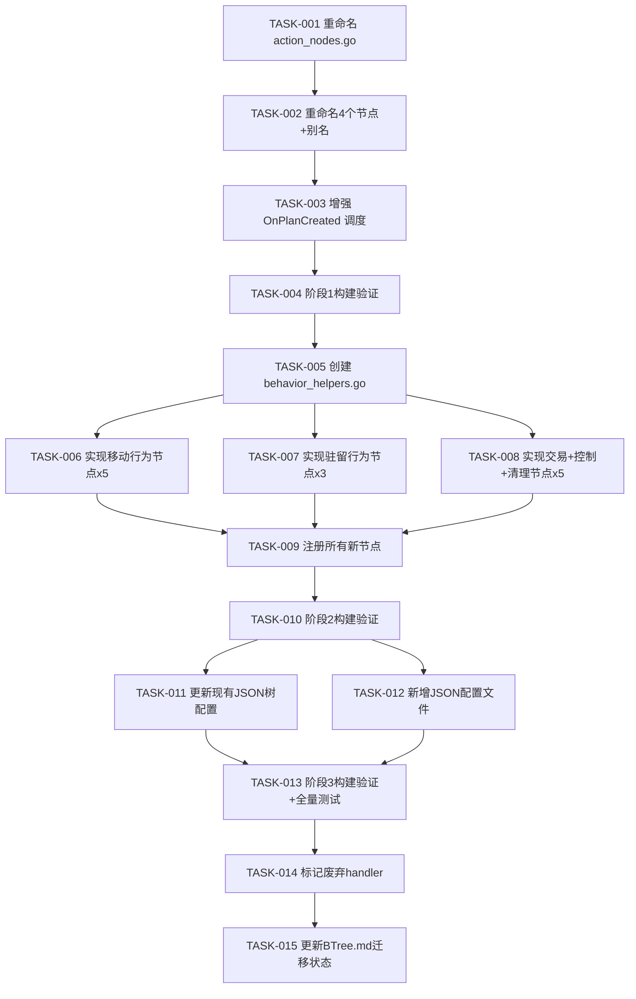

# 任务清单：行为树行为节点重构

## 任务依赖图



---

## 阶段 1：基础设施（无行为变更）

### TASK-001：重命名 action_nodes.go → behavior_nodes.go

**文件**: `bt/nodes/action_nodes.go` → `bt/nodes/behavior_nodes.go`

- [ ] `git mv action_nodes.go behavior_nodes.go`
- [ ] 更新文件头注释（"业务动作节点" → "行为节点"）
- [ ] 确认包名和 import 不变

**完成标准**: 文件重命名，编译通过

---

### TASK-002：重命名 4 个现有节点 + 注册别名

**文件**: `bt/nodes/behavior_nodes.go`, `bt/nodes/factory.go`

behavior_nodes.go:
- [ ] `StartPursuitNode` → `ChaseTargetNode`（struct + 方法 + 构造函数）
- [ ] `StopPursuitNode` → `ClearPursuitStateNode`
- [ ] `EnterDialogNode` → `StartDialogNode`
- [ ] `ExitDialogNode` → `EndDialogNode`

factory.go:
- [ ] 更新 RegisterWithMeta 的 Type 字段为新名（ChaseTarget, ClearPursuitState, StartDialog, EndDialog）
- [ ] 为每个新名额外注册旧名别名：
  ```go
  // 别名兼容
  f.RegisterCreator("StartPursuit", createChaseTargetNode)
  f.RegisterCreator("StopPursuit", createClearPursuitStateNode)
  f.RegisterCreator("EnterDialog", createStartDialogNode)
  f.RegisterCreator("ExitDialog", createEndDialogNode)
  ```

**完成标准**: 新名和旧名均可使用，现有 JSON 配置不受影响，编译通过

**依赖**: TASK-001

---

### TASK-003：增强 OnPlanCreated 调度逻辑

**文件**: `decision/executor.go`

- [ ] 在 OnPlanCreated 的 channel 1 和 channel 2 之间，添加 `buildPhasedTreeName` 构造查找
- [ ] 新增 `buildPhasedTreeName(planName string, taskType int) string` 方法
- [ ] Transition 类型不构造（返回空字符串），保持用 task.Name 匹配

```go
// Step 2: 从 planName + phase 构造树名
treeName := e.buildPhasedTreeName(req.Plan.Name, task.Type)
if treeName != "" && e.btRunner != nil && e.btRunner.HasTree(treeName) {
    e.btRunner.Run(treeName, uint64(req.EntityID))
    continue
}
```

**完成标准**: 新调度逻辑不影响现有行为（因为 JSON 树名已是 `planName_phase` 格式），编译通过

**依赖**: TASK-002

---

### TASK-004：阶段 1 构建验证

- [ ] `make build` 编译通过
- [ ] `make test` 测试通过
- [ ] 确认现有行为树功能不受影响

**依赖**: TASK-003

---

## 阶段 2：实现行为节点（无行为变更）

### TASK-005：创建 behavior_helpers.go 工具函数

**文件**: `bt/nodes/behavior_helpers.go`（新建）

从 executor_helper.go 中提取并适配为使用 BtContext 的版本：

- [ ] `getTransformFromFeatures(ctx) → (pos, rot, ok)` — 从特征值获取坐标和旋转
- [ ] `getMeetingTransformFromFeatures(ctx) → (pos, rot, ok)` — 从会议特征值获取
- [ ] `setTransformFromFeatures(ctx) → bool` — 设置 Transform 组件
- [ ] `setMeetingTransformFromFeatures(ctx) → bool` — 设置会议 Transform
- [ ] `setupNavMeshPath(ctx) → (*Vec3, int, error)` — NavMesh 寻路到特征值坐标
- [ ] `clearDialogEventFeatures(ctx)` — 清除对话事件特征
- [ ] `updateFeature(ctx, key, value)` — 更新单个特征值
- [ ] `updateFeatures(ctx, features)` — 批量更新特征值

**完成标准**: 工具函数编译通过，逻辑与 executor_helper.go 中的等价函数一致

**依赖**: TASK-004

---

### TASK-006：实现移动行为节点（5 个）

**文件**: `bt/nodes/behavior_nodes.go`

- [ ] `GoToSchedulePointNode` ← handleMoveEntryTask
  - 获取日程 → 检查 pathfind_completed → RoadNetwork 寻路 → SetPointList
- [ ] `GoToMeetingPointNode` ← handleMeetingMoveEntryTask
  - FindNearestPoint → RoadNetwork 寻路 → SetPointList → StartMove
- [ ] `GoToInvestigatePosNode` ← handleInvestigateEntryTask
  - setupNavMeshPath 封装
- [ ] `ReturnToScheduleNode` ← handlePursuitToMoveTransition + handleSakuraNpcControlToMoveTransition
  - setupNavMeshPath → SetFeature(pathfind_completed)
- [ ] `StopMovingNode` ← handleMoveExitTask + handleMeetingMoveExitTask
  - npcMoveComp.StopMove()

每个节点需要：struct 定义、NewXxx 构造函数、OnEnter/OnTick/OnExit 实现

**完成标准**: 编译通过（节点未注册，不影响运行）

**依赖**: TASK-005

---

### TASK-007：实现驻留行为节点（3 个）

**文件**: `bt/nodes/behavior_nodes.go`

- [ ] `StandAtSchedulePosNode` ← handleIdleEntryTask
  - 获取日程 → 设置 server/client timeout → setTransformFromFeatures
- [ ] `StandAtHomePosNode` ← handleHomeIdleEntryTask
  - SetFeature(out_timeout, true) → setTransformFromFeatures
- [ ] `StandAtMeetingPosNode` ← handleMeetingIdleEntryTask
  - setMeetingTransformFromFeatures

**完成标准**: 编译通过

**依赖**: TASK-005

---

### TASK-008：实现交易+控制+清理行为节点（5 个）

**文件**: `bt/nodes/behavior_nodes.go`

- [ ] `StartProxyTradeNode` ← handleProxyTradeEntryTask
  - SetTradeStatus(InTrade)
- [ ] `EndProxyTradeNode` ← handleProxyTradeExitTask
  - SetTradeStatus(None)
- [ ] `EnterPlayerControlNode` ← handleSakuraNpcControlEntryTask
  - StopMove → SetEventType(None)
- [ ] `ExitPlayerControlNode` ← handleSakuraNpcControlExitTask
  - SetEventType(None) → setupNavMeshPath
- [ ] `ClearInvestigateStateNode` ← handleInvestigateExitTask
  - SetInvestigatePlayer(0) → ClearFeatures

**完成标准**: 编译通过

**依赖**: TASK-005

---

### TASK-009：注册所有新节点

**文件**: `bt/nodes/factory.go`

- [ ] 为 13 个新节点添加 RegisterWithMeta（Category, Description, Params, Example）
- [ ] 添加对应的 createXxxNode 工厂函数
- [ ] Category 使用 `CategoryAction`（或新增 `CategoryBehavior`，按约定决定）

**完成标准**: 编译通过，`TestNodeRegistryPopulated` 测试通过

**依赖**: TASK-006, TASK-007, TASK-008

---

### TASK-010：阶段 2 构建验证

- [ ] `make build` 编译通过
- [ ] `make test` 测试通过
- [ ] 确认节点已注册（可通过 SearchNodes 查询）
- [ ] 确认现有行为不受影响（新节点已注册但未被 JSON 引用）

**依赖**: TASK-009

---

## 阶段 3：切换执行通道

### TASK-011：更新现有 JSON 树配置

**文件**: `bt/trees/*.json`（约 17 个文件）

按 Plan 逐个更新：

pursuit:
- [ ] `pursuit_entry.json` → `{ "root": { "type": "ChaseTarget" } }`
- [ ] `pursuit_exit.json` → `{ "root": { "type": "ClearPursuitState" } }`

dialog:
- [ ] `dialog_entry.json` → `{ "root": { "type": "StartDialog" } }`
- [ ] `dialog_exit.json` → `{ "root": { "type": "EndDialog" } }`

move:
- [ ] `move_entry.json` → `{ "root": { "type": "GoToSchedulePoint" } }`
- [ ] `move_exit.json` → `{ "root": { "type": "StopMoving" } }`

idle:
- [ ] `idle_entry.json` → `{ "root": { "type": "StandAtSchedulePos" } }`
- [ ] `idle_exit.json` → 用原子节点：`SetDialogOutFinishStamp(0)`

home_idle:
- [ ] `home_idle_entry.json` → `{ "root": { "type": "StandAtHomePos" } }`
- [ ] `home_idle_exit.json` → 用原子节点：`SetFeature(knock_req, false)`

meeting_idle:
- [ ] `meeting_idle_entry.json` → `{ "root": { "type": "StandAtMeetingPos" } }`

meeting_move:
- [ ] `meeting_move_entry.json` → `{ "root": { "type": "GoToMeetingPoint" } }`
- [ ] `meeting_move_exit.json` → `{ "root": { "type": "StopMoving" } }`

investigate:
- [ ] `investigate_entry.json` → `{ "root": { "type": "GoToInvestigatePos" } }`
- [ ] `investigate_exit.json` → `{ "root": { "type": "ClearInvestigateState" } }`

sakura_npc_control:
- [ ] `sakura_npc_control_entry.json` → `{ "root": { "type": "EnterPlayerControl" } }`
- [ ] `sakura_npc_control_exit.json` → `{ "root": { "type": "ExitPlayerControl" } }`

**完成标准**: 所有 JSON 配置使用行为节点或极简原子组合

**依赖**: TASK-010

---

### TASK-012：新增 JSON 配置文件

**文件**: `bt/trees/`（新建约 5 个文件）

proxy_trade:
- [ ] `proxy_trade_entry.json` → `{ "root": { "type": "StartProxyTrade" } }`
- [ ] `proxy_trade_exit.json` → `{ "root": { "type": "EndProxyTrade" } }`
- [ ] `proxy_trade_main.json` → `{ "root": { "type": "Log", "params": {"message": "[ProxyTradeMain]", "level": "debug"} } }`

transition:
- [ ] `pursuit_to_move_transition.json` → `{ "root": { "type": "ReturnToSchedule" } }`
- [ ] `sakura_npc_control_to_move_transition.json` → `{ "root": { "type": "ReturnToSchedule" } }`

plan_config.json:
- [ ] 新增 proxy_trade 条目

**完成标准**: 新 JSON 文件已创建并被 go:embed 包含

**依赖**: TASK-010

---

### TASK-013：阶段 3 构建验证 + 全量测试

- [ ] `make build` 编译通过
- [ ] `make test` 测试通过
- [ ] 验证 BT 通道接管（通过日志确认 "[Executor][OnPlanCreated] started behavior tree" 而非 handler 日志）

**依赖**: TASK-011, TASK-012

---

## 阶段 4：清理

### TASK-014：标记废弃 handler

**文件**: `decision/executor.go`

- [ ] 为被 BT 替代的 handler 添加 `// Deprecated: 已迁移到行为树节点 XxxNode` 注释
- [ ] 包括：handlePursuitEntryTask, handlePursuitExitTask, handleDialogEntryTask, handleDialogExitTask, handleMoveEntryTask, handleMoveExitTask, handleIdleEntryTask, handleIdleExitTask, handleHomeIdleEntryTask, handleHomeIdleExitTask, handleMeetingIdleEntryTask, handleMeetingMoveEntryTask, handleMeetingMoveExitTask, handleInvestigateEntryTask, handleInvestigateExitTask, handleSakuraNpcControlEntryTask, handleSakuraNpcControlExitTask, handleProxyTradeEntryTask, handleProxyTradeExitTask, handlePursuitToMoveTransition, handleSakuraNpcControlToMoveTransition

**依赖**: TASK-013

---

### TASK-015：更新 BTree.md 迁移状态

**文件**: `.claude/skills/dev-workflow/BTree.md` Section 4.5

- [ ] 更新 handler → 行为节点映射表中的"迁移状态"列：`规划中` → `已完成`

**依赖**: TASK-014

---

## 任务统计

| 阶段 | 任务数 | 预估文件改动 |
|------|--------|------------|
| 阶段 1 基础设施 | 4 | 3 文件 |
| 阶段 2 实现节点 | 6 | 3 文件（1 新建 + 2 修改） |
| 阶段 3 切换通道 | 3 | ~22 JSON 文件 + plan_config |
| 阶段 4 清理 | 2 | 2 文件 |
| **合计** | **15** | |
