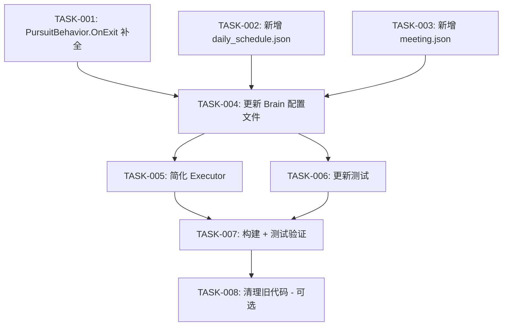

# 任务清单：BT 与 Brain 集成重设计

## 任务依赖图



## 分组与并行策略

### 组 1（可并行，无依赖）

- [x] TASK-001: PursuitBehavior.OnExit 补全 NavMesh
- [x] TASK-002: 新增 daily_schedule.json
- [x] TASK-003: 新增 meeting.json

### 组 2（依赖组 1）

- [x] TASK-004: 更新 Brain 配置文件（4 个模板）

### 组 3（依赖组 2，可并行）

- [x] TASK-005: 简化 Executor.OnPlanCreated
- [x] TASK-006: 更新测试

### 组 4（验证）

- [x] TASK-007: 构建 + 测试验证

### 组 5（可选，不阻塞）

- [ ] TASK-008: 清理旧代码

---

## 详细任务

### TASK-001: PursuitBehavior.OnExit 补全 NavMesh

**文件**: `bt/nodes/behavior_nodes.go`

**改动**: 在 PursuitBehavior.OnExit 中，现有 StopMove + ClearTarget 之后，补充：
1. 调用 `setupNavMeshPathToFeaturePos(ctx, standardPosKeys)`
2. 调用 `setFeature(ctx, "feature_args1", "pathfind_completed")`

**参考**: 从 `handlePursuitToMoveTransition` (executor.go) 和 `ReturnToScheduleNode.OnEnter` (behavior_nodes.go) 迁移逻辑。

**验收标准**:
- pursuit 结束后 NPC 能 NavMesh 寻路回日程点
- MoveBehavior.OnEnter 检测到 pathfind_completed 跳过路网寻路

---

### TASK-002: 新增 daily_schedule.json

**文件**: `bt/trees/daily_schedule.json`（新增）

**内容**: 见设计文档 Section 3.1 的完整 JSON。

**结构**:
```
Selector
├─ Service: SyncFeatureToBlackboard(feature_schedule → "schedule", 500ms)
├─ [0] MoveBehavior + BlackboardCheck(schedule=="MoveToBPointFormAPoint", abort=both)
├─ [1] HomeIdleBehavior + BlackboardCheck(schedule=="StayInBuilding", abort=both)
└─ [2] IdleBehavior + BlackboardCheck(schedule=="LocationBasedAction", abort=both)
```

**验收标准**:
- JSON 文件能被 embed.FS 加载
- 树结构正确解析（Selector + 3 children + Service + Decorators）

---

### TASK-003: 新增 meeting.json

**文件**: `bt/trees/meeting.json`（新增）

**内容**: 见设计文档 Section 3.2 的完整 JSON。

**结构**:
```
Selector
├─ Service: SyncFeatureToBlackboard(feature_meeting_state → "meeting_state", 500ms)
├─ [0] MeetingMoveBehavior + BlackboardCheck(meeting_state==1, abort=both)
└─ [1] MeetingIdleBehavior + BlackboardCheck(meeting_state==2, abort=both)
```

**验收标准**: 同 TASK-002。

---

### TASK-004: 更新 Brain 配置文件

**文件**: `config/RawTables/Json/Server/ai_decision/` 下 4 个 JSON

**改动要点**:

| 模板 | init_plan | Plans | Transitions |
|------|-----------|-------|-------------|
| Dan_State | daily_schedule | daily_schedule, meeting, dialog, pursuit | ~9 条 |
| CustomeNpc_State | daily_schedule | daily_schedule, meeting, dialog, pursuit | ~9 条 |
| DealerNpc_State | daily_schedule | daily_schedule, meeting, dialog, pursuit, proxy_trade | ~13 条 |
| Sakura_Common_State | daily_schedule | daily_schedule, dialog, sakura_npc_control | ~5 条 |

**每个模板的操作**:
1. 合并 idle/move/home_idle → daily_schedule（保留 main_task 字段）
2. 合并 meeting_move/meeting_idle → meeting（DAN/CUSTOMER/DEALER）
3. 删除日程循环内部的 transition（schedule 驱动的那些）
4. 更新跨行为 transition 的 from/to 字段
5. 删除 entry_task/exit_task/transition_task 字段（BT 处理）
6. 更新 init_plan

**验收标准**:
- JSON 格式合法
- 条件嵌套深度 ≤ 5
- 所有 transition 的 from/to 引用存在的 plan

---

### TASK-005: 简化 Executor.OnPlanCreated

**文件**: `ecs/system/decision/executor.go`

**改动**:
1. `OnPlanCreated` 改为直接 `btRunner.Run(req.Plan.Name)` + legacy fallback
2. 删除 `resolveTreeName` 方法
3. 删除 Task 遍历 for 循环
4. 删除 TaskType 判断（GSSExit/GSSEnter/GSSMain/Transition）
5. 将现有 hardcoded handlers 包装到 `executePlanLegacy(req)` 中
6. 更新文件顶部注释

**验收标准**:
- OnPlanCreated 方法体 ≤ 20 行
- init Plan 仍走 hardcoded 回退路径

---

### TASK-006: 更新测试

**文件**: `bt/integration_phased_test.go`

**改动**:
1. 删除 `TestResolveTreeName`（resolveTreeName 已删除）
2. 更新 `TestSingleTreeNamesMatchRegisteredTrees` 的 planName 列表：
   - 新增: daily_schedule, meeting
   - 保留: dialog, pursuit, investigate, sakura_npc_control, proxy_trade
   - 删除: idle, move, home_idle, meeting_idle, meeting_move（被组合树替代）
3. 可选新增：测试 daily_schedule.json 和 meeting.json 的树结构（Service/Decorator 正确解析）

**验收标准**: `go test -v ./servers/scene_server/internal/common/ai/bt/...` 全部通过

---

### TASK-007: 构建 + 测试验证

**命令**:
```bash
go build ./servers/scene_server/internal/...
go test -v ./servers/scene_server/internal/common/ai/bt/...
```

**验收标准**: 构建通过，测试通过。

---

### TASK-008: 清理旧代码（可选，不阻塞）

**文件**:
- 删除 `bt/trees/idle.json`, `home_idle.json`, `move.json`, `meeting_idle.json`, `meeting_move.json`
- 删除 `bt/trees/pursuit_to_move_transition.json`, `sakura_npc_control_to_move_transition.json`, `return_to_schedule.json`
- 删除 `bt/nodes/behavior_nodes.go` 中的 `ReturnToScheduleNode`（transition 逻辑已合并到 OnExit）
- executor.go: 逐步删除与 BT 行为节点重复的 handle* 函数

**验收标准**: 构建通过，测试通过，无死代码。
