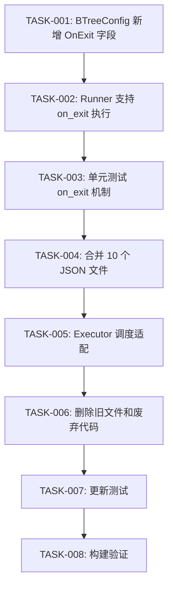

# 任务清单：行为树单树化重构

## 任务依赖图



---

## 第一阶段：基础设施

### TASK-001: BTreeConfig 新增 OnExit 字段

**文件**: `bt/config/types.go`

**改动**:
- `BTreeConfig` 新增 `OnExit *NodeConfig \`json:"on_exit,omitempty"\`` 字段

**验收**: 编译通过，现有 JSON（无 on_exit 字段）加载不受影响

---

### TASK-002: Runner 支持 on_exit 执行

**文件**: `bt/runner/runner.go`

**改动**:
1. 新增 `executeOnExitTree(instance *TreeInstance)` 方法
   - 从 treeConfigs 获取配置
   - 检查 cfg.OnExit 是否存在
   - 用 loader.BuildNode 构建 on_exit 节点树
   - 同步执行：OnEnter → OnExit
   - Running 状态 warning + 强制 OnExit
2. `Stop()` 中在 stopNode 后调用 executeOnExitTree
3. `Tick()` 中树完成时（Success/Failed）调用 executeOnExitTree

**验收**:
- Stop 时执行 on_exit 子树
- Tick 正常完成时执行 on_exit 子树
- 无 on_exit 时行为不变

---

### TASK-003: 单元测试 on_exit 机制

**文件**: 新增测试或在现有测试文件中添加

**测试用例**:
1. 有 on_exit 的树被 Stop → on_exit 执行
2. 有 on_exit 的树正常完成 → on_exit 执行
3. 无 on_exit 的树被 Stop → 行为不变
4. on_exit 返回 Running → warning + 强制退出

**验收**: 测试全部通过

---

## 第二阶段：JSON 合并

### TASK-004: 合并 10 个 JSON 文件

**新建文件** (10 个):

| 文件 | entry 节点 | on_exit 节点 | main 逻辑来源 |
|------|-----------|-------------|--------------|
| `idle.json` | StandAtSchedulePos | ClearIdleState | idle_main.json |
| `home_idle.json` | StandAtHomePos | ClearHomeIdleState | home_idle_main.json |
| `move.json` | GoToSchedulePoint | StopMoving | move_main.json |
| `dialog.json` | StartDialog | EndDialog | dialog_main.json |
| `pursuit.json` | ChaseTarget | ClearPursuitState | pursuit_main.json |
| `investigate.json` | GoToInvestigatePos | ClearInvestigateState | investigate_main.json |
| `meeting_idle.json` | StandAtMeetingPos | (读现有 exit) | meeting_idle_main.json |
| `meeting_move.json` | GoToMeetingPoint | (读现有 exit) | meeting_move_main.json |
| `sakura_npc_control.json` | EnterPlayerControl | ExitPlayerControl | sakura_npc_control_main.json |
| `proxy_trade.json` | StartProxyTrade | EndProxyTrade | proxy_trade_main.json |

**合并规则**:
- `name` = plan 名称（无后缀）
- `on_exit.type` = 原 exit 树的 root 节点类型
- `root` = Sequence，第一个 child 是原 entry 节点，后续 children 来自原 main 树
- 如果原 main 树 root 就是 Sequence，将 entry 节点插入为第一个 child
- 如果原 main 树 root 不是 Sequence（如 pursuit 的 Selector），外包一层 Sequence

**验收**: 每个新 JSON 文件可被 loader 正确解析

---

## 第三阶段：调度适配

### TASK-005: Executor 调度适配

**文件**: `executor.go`

**改动**:
1. `buildPhasedTreeName()` 修改：
   - `TaskTypeGSSMain` → 返回 `planName`（不加 `_main` 后缀）
   - `TaskTypeGSSEnter` → 返回 `""`（不再单独调度 entry）
   - `TaskTypeGSSExit` → 触发 `Runner.Stop()`（on_exit 自动执行）
2. `OnPlanCreated()` 对 exit task 的处理：
   - 检测到 exit task 时，调用 `Runner.Stop(entityID)` 即可
   - 不再需要查找和运行 exit 树

**验收**: 行为切换流程正确，exit 清理自动执行

---

## 第四阶段：清理

### TASK-006: 删除旧文件和废弃代码

**删除的 JSON 文件** (21 个):
- `plan_config.json`
- `idle_entry.json`, `idle_exit.json`, `idle_main.json`
- `home_idle_entry.json`, `home_idle_exit.json`, `home_idle_main.json`
- `move_entry.json`, `move_exit.json`, `move_main.json`
- `dialog_entry.json`, `dialog_exit.json`, `dialog_main.json`
- `pursuit_entry.json`, `pursuit_exit.json`, `pursuit_main.json`
- `investigate_entry.json`, `investigate_exit.json`, `investigate_main.json`
- `meeting_idle_entry.json`, `meeting_idle_exit.json`, `meeting_idle_main.json`
- `meeting_move_entry.json`, `meeting_move_exit.json`, `meeting_move_main.json`
- `sakura_npc_control_entry.json`, `sakura_npc_control_exit.json`, `sakura_npc_control_main.json`
- `proxy_trade_entry.json`, `proxy_trade_exit.json`, `proxy_trade_main.json`

**删除的 Go 文件**:
- `bt/config/plan_config.go`

**清理的代码** (`executor.go`):
- 删除 `PlanExecPhase` 类型和常量
- 删除 `PlanExecution` 结构体
- 删除 `planConfigs` 字段及相关方法 (RegisterPlanConfig, LoadPlanConfigs, GetPlanConfig)
- 删除 `executions` 字段及相关方法 (GetExecution, getOrCreateExecution)
- 删除废弃的三阶段状态机方法:
  - handlePlanWithStateMachine, startPlan, startMainTree, startExitTree
  - gracefulTransition, finishTransition, startSimpleTree
  - TickPlanExecution, onTreeCompleted

**清理的代码** (`example_trees.go`):
- 删除 `RegisterTreesFromConfig` 中跳过 plan_config.json 的逻辑

**验收**: 编译通过，无引用废弃代码

---

### TASK-007: 更新测试

**改动**:
1. 更新现有测试中引用 `*_entry`/`*_exit`/`*_main` 树名的用例
2. 更新树注册数量断言（30+ → 10+ 合并树 + transition + 示例树）
3. 确保 on_exit 测试覆盖
4. 删除 plan_config 相关测试

**验收**: `make test` 全部通过

---

### TASK-008: 构建验证

**执行**:
```bash
make build
make test
```

**验收**: 构建和测试全部通过

---

## 任务依赖总结

```
TASK-001 → TASK-002 → TASK-003 → TASK-004 → TASK-005 → TASK-006 → TASK-007 → TASK-008
```

全部串行，因为每步依赖上一步的产出。
