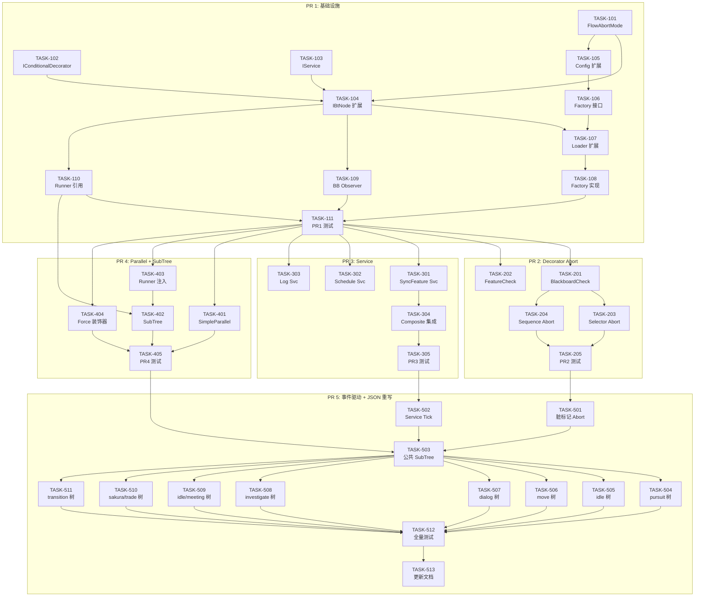

# 任务清单：基于 UE5 设计思想的行为树重构（第二期）

## PR 1：基础设施扩展

### Step 1.1：类型定义（新增文件，无依赖）

- [ ] [TASK-101] 新增 FlowAbortMode 类型
  - 文件：新建 `node/abort.go`
  - 内容：FlowAbortMode 枚举（None/Self/LowerPriority/Both）+ ParseFlowAbortMode + String
  - 验证：构建通过

- [ ] [TASK-102] 新增 IConditionalDecorator 接口
  - 文件：新建 `node/conditional_decorator.go`
  - 内容：Evaluate / AbortType / ObservedKeys 方法定义
  - 验证：构建通过

- [ ] [TASK-103] 新增 IService 接口
  - 文件：新建 `node/service_iface.go`
  - 内容：OnActivate / OnTick / OnDeactivate / IntervalMs 方法定义
  - 验证：构建通过

### Step 1.2：IBtNode 接口扩展（依赖 Step 1.1）

- [ ] [TASK-104] 扩展 IBtNode 接口 + BaseNode 默认实现
  - 文件：`node/interface.go`
  - 内容：
    - IBtNode 新增 `Decorators() []IConditionalDecorator` 和 `Services() []IService`
    - IBtNode 新增 `AddDecorator(IConditionalDecorator)` 和 `AddService(IService)`
    - BaseNode 新增 `decorators []IConditionalDecorator` 和 `services []IService` 字段
    - BaseNode 提供默认空实现（返回空 slice）
  - 验证：构建通过，现有测试不受影响

### Step 1.3：JSON 格式扩展（依赖 Step 1.1）

- [ ] [TASK-105] 扩展 NodeConfig 配置结构
  - 文件：`config/types.go`
  - 内容：
    - 新增 `DecoratorConfig` 结构体（Type/Params/AbortType）
    - 新增 `ServiceConfig` 结构体（Type/Params）
    - NodeConfig 新增 `Decorators []DecoratorConfig` 和 `Services []ServiceConfig` 字段
  - 验证：构建通过，现有 JSON 加载不受影响（omitempty）

- [ ] [TASK-106] 扩展 NodeFactory 接口
  - 文件：`config/loader.go`
  - 内容：
    - NodeFactory 接口新增 `CreateDecorator(*DecoratorConfig) (IConditionalDecorator, error)`
    - NodeFactory 接口新增 `CreateService(*ServiceConfig) (IService, error)`
  - 验证：构建通过

- [ ] [TASK-107] 扩展 BTreeLoader 解析逻辑
  - 文件：`config/loader.go`
  - 内容：
    - BuildNode 中解析 cfg.Decorators → 调用 factory.CreateDecorator → n.AddDecorator
    - BuildNode 中解析 cfg.Services → 调用 factory.CreateService → n.AddService
    - 无 decorators/services 时跳过（向后兼容）
  - 验证：构建通过，现有 JSON 树加载正常

- [ ] [TASK-108] NodeFactory 实现 CreateDecorator / CreateService
  - 文件：`nodes/factory.go`
  - 内容：
    - 新增 `decoratorCreators map[string]DecoratorCreator` 和 `serviceCreators map[string]ServiceCreator`
    - 实现 CreateDecorator / CreateService 方法
    - 新增 RegisterDecorator / RegisterService 注册方法
    - 暂不注册任何具体实现（PR 2/3 注册）
  - 验证：构建通过

### Step 1.4：Blackboard Observer（依赖 Step 1.2）

- [ ] [TASK-109] BtContext 新增 Blackboard Observer 机制
  - 文件：`context/context.go`
  - 内容：
    - 新增 `BlackboardObserver` 结构体
    - 新增 `observers []BlackboardObserver` 字段
    - 新增 `dirtyKeys map[string]struct{}` 字段
    - 修改 `SetBlackboard`：设值后标记 dirtyKeys + 通知 observers
    - 新增 `AddObserver` / `RemoveObservers` / `ConsumeDirtyKeys` 方法
    - `DeleteBlackboard` 也需标记 dirtyKeys
  - 验证：构建通过，单元测试验证 observer 通知和 dirtyKeys

### Step 1.5：BtContext 扩展（供 SubTree 使用）

- [ ] [TASK-110] BtContext 新增 BtRunner 引用
  - 文件：`context/context.go`
  - 内容：
    - 新增 `runner` 字段（interface 类型避免循环导入）
    - 新增 `GetRunner()` 方法
    - 定义 `BtRunnerAccess` 接口（GetTreeConfig / GetLoader）
  - 验证：构建通过

### Step 1.6：PR 1 集成测试

- [ ] [TASK-111] PR 1 集成测试
  - 文件：新建 `node/abort_test.go`、`context/context_observer_test.go`
  - 内容：
    - FlowAbortMode 解析测试
    - Blackboard Observer 通知测试
    - DirtyKeys 消费测试
    - 含 decorators/services 的 JSON 解析测试（空实现，验证不报错）
    - 不含 decorators/services 的旧 JSON 兼容测试
  - 验证：`make test` BT 相关测试全部通过

---

## PR 2：Decorator Abort 系统

### Step 2.1：Decorator 实现（依赖 PR 1）

- [ ] [TASK-201] 实现 BlackboardCheckDecorator
  - 文件：新建 `nodes/blackboard_decorator.go`
  - 内容：
    - 实现 IConditionalDecorator 接口
    - 支持 operator: ==, !=, >, <, >=, <=, is_set, not_set
    - 支持从 JSON 创建（createBlackboardCheckDecorator 函数）
    - 在 factory.go 注册 decorator creator
  - 验证：单元测试

- [ ] [TASK-202] 实现 FeatureCheckDecorator
  - 文件：新建 `nodes/feature_decorator.go`
  - 内容：
    - 实现 IConditionalDecorator 接口
    - 从 DecisionComp 读取 Feature 值进行比较
    - 在 factory.go 注册
  - 验证：单元测试

### Step 2.2：Composite Abort 逻辑（依赖 Step 2.1）

- [ ] [TASK-203] Selector 增强：LowerPriority Abort
  - 文件：`nodes/selector.go`
  - 内容：
    - OnTick 开头新增 abort 评估逻辑
    - `shouldAbortForChild`：检查高优先级子节点的 decorator（LowerPriority/Both）
    - `abortCurrentChild`：中断当前活跃子树（OnExit + Reset）
    - 触发 abort 后重置 currentIndex 到更高优先级子节点
  - 验证：单元测试（模拟 blackboard 变化触发 abort）

- [ ] [TASK-204] Sequence 增强：Self Abort
  - 文件：`nodes/sequence.go`
  - 内容：
    - OnTick 开头新增 self abort 评估逻辑
    - 检查自身的 decorator（Self/Both），条件不满足则中断自身返回 Failed
  - 验证：单元测试

### Step 2.3：PR 2 集成测试

- [ ] [TASK-205] Decorator Abort 集成测试
  - 文件：新建 `nodes/abort_test.go` 或扩展 `integration_test.go`
  - 内容：
    - 测试 1：Selector + LowerPriority — 低优先级运行中，高优先级条件满足，触发 abort
    - 测试 2：Sequence + Self — 运行中条件变为 false，触发 self abort
    - 测试 3：abort_type=both 双向测试
    - 测试 4：abort_type=none 不触发 abort
    - 测试 5：OnExit 在 abort 时被正确调用
    - 测试 6：JSON 加载含 decorator 的树并执行
  - 验证：`make test` 全部通过

---

## PR 3：Service 节点

### Step 3.1：Service 实现（依赖 PR 1）

- [ ] [TASK-301] 实现 SyncFeatureToBlackboardService
  - 文件：新建 `nodes/service_sync_feature.go`
  - 内容：
    - 实现 IService 接口
    - OnActivate 立即执行一次同步
    - OnTick 按 interval 同步 Feature → Blackboard
    - 在 factory.go 注册 service creator
  - 验证：单元测试

- [ ] [TASK-302] 实现 UpdateScheduleService
  - 文件：新建 `nodes/service_update_schedule.go`
  - 内容：
    - 周期性获取日程数据写入 Blackboard
    - 在 factory.go 注册
  - 验证：单元测试

- [ ] [TASK-303] 实现 LogService
  - 文件：新建 `nodes/service_log.go`
  - 内容：
    - 调试用，周期性输出日志
    - 在 factory.go 注册
  - 验证：构建通过

### Step 3.2：Composite Service 集成（依赖 Step 3.1）

- [ ] [TASK-304] Sequence/Selector 集成 Service 生命周期
  - 文件：`nodes/sequence.go`、`nodes/selector.go`
  - 内容：
    - 新增 `activeServices` 和 `serviceLastTick` 字段
    - OnEnter：激活所有 Services（调用 OnActivate）
    - OnTick：按 interval 调用 Service.OnTick
    - OnExit：停用所有 Services（调用 OnDeactivate）
    - Reset：清理 service 状态
  - 验证：单元测试

### Step 3.3：PR 3 集成测试

- [ ] [TASK-305] Service 集成测试
  - 文件：扩展集成测试
  - 内容：
    - 测试 1：Service 在 Composite 激活时被调用
    - 测试 2：Service 按 interval 周期执行
    - 测试 3：Composite 退出时 Service 被停用
    - 测试 4：JSON 加载含 service 的树并执行
    - 测试 5：Service 更新 Blackboard 触发 dirtyKeys
  - 验证：`make test` 全部通过

---

## PR 4：Simple Parallel + SubTree

### Step 4.1：SimpleParallel（依赖 PR 1）

- [ ] [TASK-401] 实现 SimpleParallelNode
  - 文件：新建 `nodes/simple_parallel.go`
  - 内容：
    - FinishMode 枚举（Immediate / Delayed）
    - 同时 Tick 主任务和后台任务
    - 主任务完成后根据 FinishMode 处理后台任务
    - OnExit 中断所有运行中子节点
    - 在 factory.go 注册
  - 验证：单元测试

### Step 4.2：SubTree（依赖 PR 1 + TASK-110）

- [ ] [TASK-402] 实现 SubTreeNode
  - 文件：新建 `nodes/subtree.go`
  - 内容：
    - OnEnter：从 BtRunner 获取 config → BuildNode → 启动子树
    - OnTick：委托给子树根节点
    - OnExit：调用子树根节点 OnExit
    - 递归深度检测（最大 10 层，防循环引用）
    - 在 factory.go 注册
  - 验证：单元测试

- [ ] [TASK-403] BtRunner 注入到 BtContext
  - 文件：`runner/runner.go`、`context/context.go`
  - 内容：
    - BtRunner.Run / GetOrCreateContext 时将自身注入 context
    - 实现 BtRunnerAccess 接口
  - 验证：构建通过

### Step 4.3：额外 Decorator（依赖 PR 1）

- [ ] [TASK-404] 实现 ForceSuccess / ForceFailure 装饰节点
  - 文件：`nodes/decorator.go`（追加）
  - 内容：
    - ForceSuccessNode：子节点无论结果返回 Success
    - ForceFailureNode：子节点无论结果返回 Failed
    - 在 factory.go 注册
  - 验证：单元测试

### Step 4.4：PR 4 集成测试

- [ ] [TASK-405] SimpleParallel + SubTree 集成测试
  - 文件：扩展集成测试
  - 内容：
    - 测试 1：SimpleParallel FinishImmediate — 主任务完成后中断后台
    - 测试 2：SimpleParallel FinishDelayed — 等后台完成
    - 测试 3：SubTree 引用已注册树并执行
    - 测试 4：SubTree 递归深度限制
    - 测试 5：ForceSuccess / ForceFailure 正确覆盖子节点结果
    - 测试 6：JSON 加载含 SimpleParallel / SubTree 的树
  - 验证：`make test` 全部通过

---

## PR 5：事件驱动评估 + JSON 全量重写

### Step 5.1：事件驱动评估（依赖 PR 2）

- [ ] [TASK-501] BtRunner Tick 增强：脏标记驱动 Abort 评估
  - 文件：`runner/runner.go`
  - 内容：
    - Tick 开头消费 dirtyKeys
    - 有脏 key 时遍历树，只评估与脏 key 相关的 decorator
    - 触发 abort 时执行中断（复用 PR 2 的 abort 逻辑）
    - 无脏 key 时跳过 abort 评估（性能优化）
  - 验证：单元测试验证脏标记触发和不触发的路径

- [ ] [TASK-502] BtRunner Service Tick 集成
  - 文件：`runner/runner.go`
  - 内容：
    - TreeInstance 管理 activeServices 列表
    - Tick 中在节点 Tick 前执行 Service Tick
    - 树停止时清理 Services
  - 验证：单元测试

### Step 5.2：JSON 全量重写

重写原则：
- entry 树：保持现有结构（一次性初始化），可添加 Service
- main 树：从空壳升级为响应式树，使用 Decorator + Service + Parallel
- exit 树：保持现有结构（一次性清理）
- 提取公共 SubTree

- [ ] [TASK-503] 新增公共 SubTree JSON
  - 文件：新建 `trees/return_to_schedule.json`
  - 内容：从 transition 树中提取的公共逻辑（NavMesh 路径 + 标记完成）
  - 验证：JSON 加载通过

- [ ] [TASK-504] 重写 pursuit 相关树（3 个）
  - 文件：`trees/pursuit_entry.json`、`trees/pursuit_main.json`、`trees/pursuit_exit.json`
  - 内容：
    - entry：保持现有结构，改用 Service 做 Feature 同步
    - main：从空壳升级 → Selector + BlackboardCheck(target_entity_id) + abort
    - exit：保持不变
  - 验证：构建通过，JSON 加载通过

- [ ] [TASK-505] 重写 idle 相关树（3 个）
  - 文件：`trees/idle_*.json`
  - 内容：main 可添加 Service 更新超时信息
  - 验证：构建通过

- [ ] [TASK-506] 重写 move 相关树（3 个）
  - 文件：`trees/move_*.json`
  - 内容：main 可使用 SimpleParallel（移动 + 路径监控）
  - 验证：构建通过

- [ ] [TASK-507] 重写 dialog 相关树（3 个）
  - 文件：`trees/dialog_*.json`
  - 内容：main 可添加对话状态监控 Service
  - 验证：构建通过

- [ ] [TASK-508] 重写 investigate 相关树（3 个）
  - 文件：`trees/investigate_*.json`
  - 验证：构建通过

- [ ] [TASK-509] 重写 home_idle / meeting_idle / meeting_move 相关树（9 个）
  - 文件：对应 `trees/*.json`
  - 验证：构建通过

- [ ] [TASK-510] 重写 sakura_npc_control / proxy_trade 相关树（6 个）
  - 文件：对应 `trees/*.json`
  - 验证：构建通过

- [ ] [TASK-511] 重写 transition 树（2 个）使用 SubTree
  - 文件：`trees/pursuit_to_move_transition.json`、`trees/sakura_npc_control_to_move_transition.json`
  - 内容：使用 SubTree 引用 `return_to_schedule`
  - 验证：构建通过

### Step 5.3：PR 5 全量测试

- [ ] [TASK-512] 全量集成测试 + 回归
  - 文件：更新所有测试文件
  - 内容：
    - 所有 36 个 JSON 树加载测试
    - 节点注册数量验证（50+ 原有 + 新增节点/装饰器/服务）
    - 调度名称匹配测试（plan_config 与树名一致）
    - 端到端执行测试（构建树 → Tick → abort → 完成）
    - 事件驱动路径测试（脏标记触发 vs 不触发）
  - 验证：`make test` 全部通过，`make build` 通过

### Step 5.4：文档更新

- [ ] [TASK-513] 更新 behavior-tree.md 规范文档
  - 文件：`P1GoServer/.claude/rules/behavior-tree.md`
  - 内容：
    - 新增"UE5 特性"章节（Decorator Abort / Service / SimpleParallel / SubTree）
    - 新增 JSON 格式说明（decorators / services 字段）
    - 新增 abort 评估时序说明
    - 更新目录结构（新文件）
    - 更新节点两层架构说明

---

## 任务依赖图

## 并行化策略

| 阶段 | 并行任务 | 说明 |
|------|----------|------|
| PR 1 Step 1.1 | T101 / T102 / T103 并行 | 三个独立新文件 |
| PR 1 Step 1.2-1.5 | T104 → T105/T106/T107/T108 串行；T109 / T110 可与 T105 并行 | T104 是关键路径 |
| PR 2 / PR 3 / PR 4 | **三个 PR 并行开发** | 都只依赖 PR 1，互不干扰 |
| PR 2 内部 | T201 / T202 并行 → T203 / T204 并行 | 不同文件 |
| PR 3 内部 | T301 / T302 / T303 并行 → T304 串行 | 不同文件 |
| PR 4 内部 | T401 / T402+T403 / T404 并行 | 不同文件 |
| PR 5 Step 5.1 | T501 / T502 并行 | 不同逻辑区域 |
| PR 5 Step 5.2 | T504 ~ T511 **全部并行** | 不同 JSON 文件 |
| PR 5 Step 5.3-5.4 | T512 → T513 串行 | 测试完再更新文档 |

## 工作量预估

| PR | 新增文件 | 修改文件 | 新增行数 | 修改行数 |
|----|----------|----------|----------|----------|
| PR 1 | 3 | 4 | ~500 | ~100 |
| PR 2 | 2 | 2 | ~600 | ~200 |
| PR 3 | 3 | 2 | ~400 | ~150 |
| PR 4 | 3 | 2 | ~500 | ~50 |
| PR 5 | 1 | 38 | ~200 | ~1000 (JSON) |
| **合计** | **12** | **~48** | **~2200** | **~1500** |
