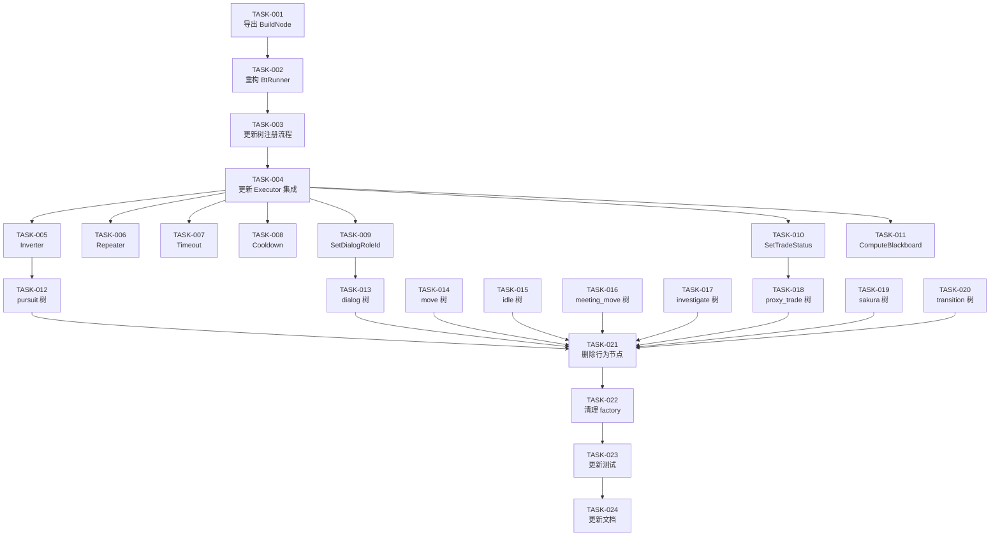

# 任务清单：基于 UE5 设计思想的行为树重构（第一期）

## Step 1：节点实例隔离（基础设施）

- [ ] [TASK-001] 导出 BTreeLoader.BuildNode 方法
  - 文件：`config/loader.go`
  - 内容：`buildNode` → `BuildNode`（首字母大写）
  - 验证：构建通过，现有测试不受影响

- [ ] [TASK-002] 重构 BtRunner 存储结构
  - 文件：`runner/runner.go`
  - 内容：
    - `trees map[string]node.IBtNode` → `treeConfigs map[string]*config.BTreeConfig`
    - 新增 `loader *config.BTreeLoader` 字段
    - 修改 `NewBtRunner` 接收 loader 参数
    - `RegisterTree` → `RegisterTreeConfig`（接收 config 替代 root）
    - `HasTree` / `GetTree` 适配新存储
    - `Run()` 调用 `loader.BuildNode` 重建节点树
    - `Stop()` 不变
    - 删除 `RegisterTreeWithPhases`（已 Deprecated）
  - 验证：构建通过

- [ ] [TASK-003] 更新树注册流程
  - 文件：`trees/example_trees.go`
  - 内容：
    - `RegisterTreesFromConfig` 改为注册 `BTreeConfig` 替代注册根节点
    - 不再需要在注册时创建 factory/loader（延迟到 Run 时）
    - 更新函数签名和调用方
  - 验证：构建通过

- [ ] [TASK-004] 更新 Executor 集成代码
  - 文件：`ecs/system/decision/executor.go`、`scene_impl.go`（或初始化调用处）
  - 内容：
    - 创建 BtRunner 时传入 loader
    - 注册树时传入 config 替代 root
    - 适配新的 RegisterTreeConfig 接口
  - 验证：构建通过，`make test` BT 测试通过

## Step 2：新增节点

- [ ] [TASK-005] 实现 Decorator 基础设施 + InverterNode
  - 文件：新建 `nodes/decorator.go`
  - 内容：
    - BaseDecoratorNode 基类（单子节点管理）
    - InverterNode：翻转 Success ↔ Failed
    - 在 factory.go 注册
  - 验证：单元测试

- [ ] [TASK-006] 实现 RepeaterNode
  - 文件：`nodes/decorator.go`
  - 内容：重复执行子节点 N 次，支持 break_on_failure
  - 验证：单元测试

- [ ] [TASK-007] 实现 TimeoutNode
  - 文件：`nodes/decorator.go`
  - 内容：超时强制失败，支持 timeout_ms 和 timeout_ms_key
  - 验证：单元测试

- [ ] [TASK-008] 实现 CooldownNode
  - 文件：`nodes/decorator.go`
  - 内容：冷却期间直接 Failed，冷却状态存黑板
  - 验证：单元测试

- [ ] [TASK-009] 实现 SetDialogRoleId 原子节点
  - 文件：新建 `nodes/set_dialog_role_id.go`
  - 内容：从 feature/blackboard 读取角色 ID，设置到 DialogComponent
  - 验证：在 factory.go 注册，构建通过

- [ ] [TASK-010] 实现 SetTradeStatus 原子节点
  - 文件：新建 `nodes/set_trade_status.go`
  - 内容：设置 NpcTradeProxyComponent 的交易状态
  - 验证：在 factory.go 注册，构建通过

- [ ] [TASK-011] 实现 ComputeBlackboard 计算节点
  - 文件：新建 `nodes/compute_blackboard.go`
  - 内容：黑板值数学运算（add/subtract/multiply/divide/multiply_const）
  - 验证：在 factory.go 注册，构建通过

## Step 3：重写 JSON 树

- [ ] [TASK-012] 重写 pursuit 相关树（3 个）
  - 文件：`trees/pursuit_entry.json`、`trees/pursuit_exit.json`、`trees/pursuit_main.json`
  - 内容：按设计文档 4.4.1 / 4.4.2 拆解
  - 验证：构建通过，运行 BT 加载测试

- [ ] [TASK-013] 重写 dialog 相关树（3 个）
  - 文件：`trees/dialog_entry.json`、`trees/dialog_exit.json`、`trees/dialog_main.json`
  - 内容：按设计文档 4.4.3 / 4.4.4 拆解
  - 验证：构建通过，运行 BT 加载测试

- [ ] [TASK-014] 重写 move 相关树（3 个）
  - 文件：`trees/move_entry.json`、`trees/move_exit.json`、`trees/move_main.json`
  - 内容：按设计文档 4.4.5 / 4.4.6 拆解（move_entry 最复杂，含 Selector 分支）
  - 验证：构建通过，运行 BT 加载测试

- [ ] [TASK-015] 重写 idle / home_idle / meeting_idle 相关树（9 个）
  - 文件：`trees/idle_*.json`、`trees/home_idle_*.json`、`trees/meeting_idle_*.json`
  - 内容：按设计文档 4.4.7 / 4.4.8 / 4.4.9 拆解
  - 验证：构建通过，运行 BT 加载测试

- [ ] [TASK-016] 重写 meeting_move 相关树（3 个）
  - 文件：`trees/meeting_move_*.json`
  - 内容：按设计文档 4.4.10 拆解
  - 验证：构建通过，运行 BT 加载测试

- [ ] [TASK-017] 重写 investigate 相关树（3 个）
  - 文件：`trees/investigate_*.json`
  - 内容：按设计文档 4.4.11 / 4.4.12 拆解
  - 验证：构建通过，运行 BT 加载测试

- [ ] [TASK-018] 重写 proxy_trade 相关树（3 个）
  - 文件：`trees/proxy_trade_*.json`
  - 内容：按设计文档 4.4.14 / 4.4.15 拆解
  - 验证：构建通过，运行 BT 加载测试

- [ ] [TASK-019] 重写 sakura_npc_control 相关树（3 个）
  - 文件：`trees/sakura_npc_control_*.json`
  - 内容：按设计文档 4.4.16 / 4.4.17 拆解
  - 验证：构建通过，运行 BT 加载测试

- [ ] [TASK-020] 重写 transition 树（2 个）
  - 文件：`trees/pursuit_to_move_transition.json`、`trees/sakura_npc_control_to_move_transition.json`
  - 内容：按设计文档 4.4.13 拆解
  - 验证：构建通过，运行 BT 加载测试

## Step 4：清理 + 测试更新

- [ ] [TASK-021] 删除 behavior_nodes.go 和 behavior_helpers.go
  - 文件：删除 `nodes/behavior_nodes.go`、`nodes/behavior_helpers.go`
  - 内容：确认无其他文件引用后删除
  - 验证：构建通过

- [ ] [TASK-022] 清理 factory.go 中的行为节点注册
  - 文件：`nodes/factory.go`
  - 内容：删除 17 个 createXxxNode 行为节点创建函数 + 4 个别名注册
  - 验证：构建通过

- [ ] [TASK-023] 更新集成测试
  - 文件：`integration_test.go`、`integration_phased_test.go`
  - 内容：
    - 删除行为节点注册测试（17 + 4 个）
    - 新增 Decorator 节点注册测试（4 个）
    - 新增新原子节点注册测试（3 个）
    - 适配 RegisterTreeConfig 接口
    - JSON 加载测试验证新的组合树结构
  - 验证：`make test` BT 测试全部通过

- [ ] [TASK-024] 更新 rules/behavior-tree.md 文档
  - 文件：`P1GoServer/.claude/rules/behavior-tree.md`
  - 内容：
    - 删除"节点两层架构"章节（行为节点已不存在）
    - 新增 Decorator 节点文档
    - 更新目录结构
    - 更新"已知架构约束"（模板共享问题已解决）
    - 更新禁止事项（Running 状态现在可用）

## 任务依赖图

## 并行化策略

| 阶段 | 并行任务 | 说明 |
|------|----------|------|
| Step 1 | 串行 T001→T002→T003→T004 | 有依赖，必须串行 |
| Step 2 | T005-T011 全部并行 | 互不依赖的新文件 |
| Step 3 | T012-T020 全部并行 | 不同 JSON 文件，无冲突 |
| Step 4 | 串行 T021→T022→T023→T024 | 有依赖，必须串行 |
