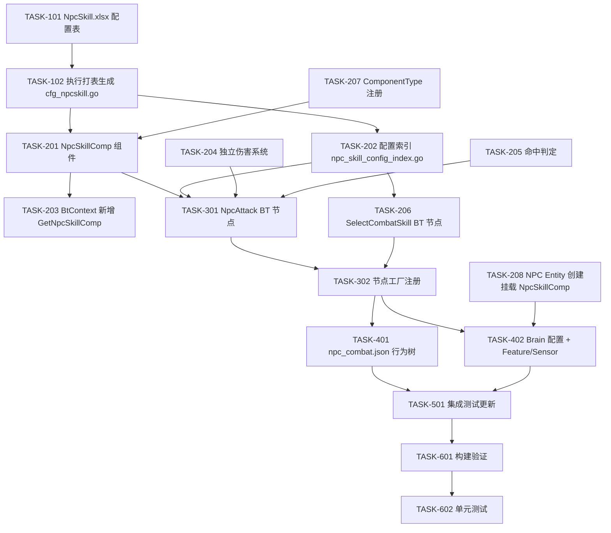

# NPC 技能系统 — 任务清单

> 设计文档: `design-npc-skill.md`

## 任务依赖图



---

## 配置工程 (config/RawTables/)

### TASK-101: 创建 NpcSkill.xlsx 配置表

- **文件**: `config/RawTables/TownNpc/NpcSkill.xlsx`
- **内容**: 按设计文档 Section 5.1 创建 Excel 表
- **字段**: id, name, skillType, npcCfgId, priority, damage, attackRange, cooldownMs, durationMs, hitDelayMs, maxAngle, animId
- **示例数据**: 警棍攻击(1001) + 手枪射击(1002)
- **完成标准**: Excel 文件格式正确，字段类型标注完整
- **依赖**: 无

### TASK-102: 执行打表生成 cfg_npcskill.go

- **命令**: `cd config/RawTables/_tool && echo "" | python3 3.generate_server.py`
- **验证**: `P1GoServer/common/config/cfg_npcskill.go` 已生成
- **验证**: `GetCfgNpcSkillById()` 和 `GetCfgMapNpcSkill()` 函数可用
- **完成标准**: 生成代码无语法错误
- **依赖**: TASK-101

---

## 业务工程 — 基础设施 (P1GoServer/)

### TASK-207: 注册 ComponentType_NpcSkill

- **文件**: `common/component_types.go`（或同等位置）
- **内容**: 新增 `ComponentType_NpcSkill` 枚举值
- **完成标准**: 编译通过
- **依赖**: 无

### TASK-201: 实现 NpcSkillComp 组件

- **文件**: `servers/scene_server/internal/ecs/com/cnpc/npc_skill_comp.go`
- **内容**: 按设计文档 Section 3.1 实现
  - NpcSkillComp struct（skills, cooldownMap, currentSkillID, currentTargetID, attackStartTime）
  - NpcSkillSlot struct
  - 查询接口: CanUseSkill, GetBestSkill, GetMeleeSkill, GetRangedSkill
  - 状态管理: StartSkill, FinishSkill, IsAttacking, GetCurrentTargetID
  - ComponentType() 返回 ComponentType_NpcSkill
- **完成标准**: 编译通过，接口签名与设计文档一致
- **依赖**: TASK-207

### TASK-202: 实现配置索引

- **文件**: `servers/scene_server/internal/ecs/com/cnpc/npc_skill_config_index.go`
- **内容**: 按设计文档 Section 5.2 实现
  - `npcSkillIndex map[int32][]*config.CfgNpcSkill`
  - `InitNpcSkillIndex()`: 构建索引 + 按 priority 降序排序
  - `GetNpcSkillsByNpcCfgId(npcCfgId)`: 查询接口
- **完成标准**: 编译通过
- **依赖**: TASK-102

### TASK-203: BtContext 新增 GetNpcSkillComp 缓存

- **修改文件**:
  - `bt/context/context.go`: 新增 npcSkillComp + npcSkillCompOnce 字段，实现 GetNpcSkillComp()
  - `bt/context/context.go` Reset(): 清除缓存
  - `bt/context/context_test.go` TestReset: 新增断言
- **完成标准**: 编译通过，TestReset 通过
- **依赖**: TASK-201

### TASK-204: 实现独立伤害系统

- **文件**: `servers/scene_server/internal/ecs/com/cnpc/npc_damage.go`
- **内容**: 按设计文档 Section 3.2 实现
  - DamageResult struct
  - ApplyNpcDamage(): 验证目标 → 读 HP → 扣减 → 死亡检查 → 广播事件
  - ReadTargetHP() / WriteTargetHP(): HP 桥接函数
  - BroadcastHitEvent(): 构建 HitData + SceneEvent，添加到帧缓存
  - BuildNpcHitData(): HitData 构建（设计文档 Section 6.3）
- **完成标准**: 编译通过，ApplyNpcDamage 函数签名与设计一致
- **依赖**: 无（独立模块）

### TASK-205: 实现命中判定

- **文件**: `servers/scene_server/internal/ecs/com/cnpc/npc_hit_check.go`
- **内容**: 按设计文档 Section 3.3 实现
  - CheckMeleeHit(): 距离检查
  - CheckRangedHit(): 距离 + 角度检查
- **完成标准**: 编译通过
- **依赖**: 无（独立模块）

---

## 业务工程 — BT 节点 (P1GoServer/)

### TASK-206: 实现 SelectCombatSkill 节点

- **文件**: `bt/nodes/npc_select_skill.go`
- **内容**: 按设计文档 Section 4.2 实现
  - 同步动作节点（OnEnter 一次性完成）
  - 获取 NpcSkillComp → 按距离和类型选最优技能 → 写入 BB
  - params: skill_type（可选，过滤近战/远程）
- **完成标准**: 编译通过
- **依赖**: TASK-201, TASK-202

### TASK-301: 实现 NpcAttack 节点

- **文件**: `bt/nodes/npc_attack.go`
- **内容**: 按设计文档 Section 4.1 实现
  - 异步攻击节点
  - OnEnter: 获取技能配置 + 验证目标 + 设动画状态 → Running
  - OnTick: 命中帧判定 + 施加伤害 + 等待 duration → Success
  - OnExit: 清理动画状态 + 处理打断
  - params: skill_id_key, target_id_key
- **完成标准**: 编译通过，生命周期与设计文档 Section 4.1 一致
- **依赖**: TASK-201, TASK-202, TASK-204, TASK-205

### TASK-302: 节点工厂注册

- **修改文件**: `bt/nodes/factory.go`
- **内容**:
  - RegisterWithMeta NpcAttack（Category: 异步节点）
  - RegisterWithMeta SelectCombatSkill（Category: 同步动作节点）
  - 实现 createNpcAttackNode / createSelectCombatSkillNode
- **完成标准**: 编译通过
- **依赖**: TASK-301, TASK-206

---

## 业务工程 — 集成 (P1GoServer/)

### TASK-401: 创建 npc_combat.json 行为树

- **文件**: `bt/trees/npc_combat.json`
- **内容**: 按设计文档 Section 4.4（更新版）实现
  - Selector > [SimpleParallel + Decorator, ReturnToSchedule]
  - SimpleParallel > [ChaseTarget(Main), Repeater[Sequence[SelectCombatSkill, NpcAttack]](Background)]
  - Service: SyncFeatureToBlackboard（combat target 映射）
  - Decorator: BlackboardCheck has_combat_target == true, abort_type=both
- **完成标准**: JSON 格式正确，所有引用的节点类型已注册
- **依赖**: TASK-302

### TASK-402: Brain 配置 + Feature/Sensor 集成

- **修改文件**:
  - `ai_decision_bt/` 对应 NPC 配置: 新增 npc_combat plan + transition
  - Sensor 代码（MiscSensor 或相关）: 新增 feature_combat_target_id, feature_combat_target_distance, feature_has_combat_target
- **内容**: 按设计文档 Section 7 + Section 8 实现
  - Brain plan: name="npc_combat", priority=200
  - Transition: any→npc_combat (has_target=true), npc_combat→daily (has_target=false)
  - MiscSensor: updateCombatTarget() 从 HateComp 获取最高仇恨目标
- **完成标准**: Brain 配置 JSON 格式正确，Feature 键名与 BT Service mappings 一致
- **依赖**: TASK-401, TASK-208

### TASK-208: NPC Entity 创建时挂载 NpcSkillComp

- **修改文件**: NPC Entity 创建流程（scene_impl.go 或 NPC 创建函数）
- **内容**:
  - 根据 NpcCfgId 查询 GetNpcSkillsByNpcCfgId
  - 如果有技能配置 → 创建 NpcSkillComp 并挂载到 Entity
  - 调用 InitNpcSkillIndex()（场景初始化时）
- **完成标准**: 有技能配置的 NPC 正确挂载 NpcSkillComp
- **依赖**: TASK-201, TASK-202

---

## 测试 (P1GoServer/)

### TASK-501: 集成测试更新

- **修改文件**: `bt/integration_test.go` + `bt/integration_phased_test.go`
- **内容**:
  - TestNodeFactoryRegistration: 异步节点列表加 NpcAttack，同步动作节点列表加 SelectCombatSkill
  - TestLoadSpecificTrees: JSON 树列表加 npc_combat.json
  - 调度名称列表更新
- **完成标准**: integration_test 通过
- **依赖**: TASK-401, TASK-402

### TASK-601: 构建验证

- **命令**: `cd P1GoServer && make build`
- **完成标准**: 编译无错误
- **依赖**: TASK-501

### TASK-602: 单元测试

- **新增文件**:
  - `ecs/com/cnpc/npc_skill_comp_test.go`: 测试 CanUseSkill, GetBestSkill, 冷却逻辑
  - `ecs/com/cnpc/npc_hit_check_test.go`: 测试近战/远程命中判定
  - `ecs/com/cnpc/npc_damage_test.go`: 测试伤害结算流程
- **命令**: `go test -v ./servers/scene_server/internal/...`
- **完成标准**: 所有测试通过
- **依赖**: TASK-601

---

## 任务依赖总结

```
阶段 1 — 配置 (可与阶段 2 基础设施并行):
  TASK-101 → TASK-102

阶段 2 — 基础设施 (TASK-204, TASK-205, TASK-207 无依赖，可并行):
  TASK-207 → TASK-201 → TASK-203
  TASK-102 → TASK-202
  TASK-204 (独立)
  TASK-205 (独立)

阶段 3 — BT 节点 (依赖阶段 2):
  TASK-201 + TASK-202 → TASK-206
  TASK-201 + TASK-202 + TASK-204 + TASK-205 → TASK-301
  TASK-301 + TASK-206 → TASK-302

阶段 4 — 集成 (依赖阶段 3):
  TASK-302 → TASK-401
  TASK-201 + TASK-202 → TASK-208
  TASK-401 + TASK-208 → TASK-402

阶段 5 — 验证:
  TASK-401 + TASK-402 → TASK-501 → TASK-601 → TASK-602
```

## 并行执行计划

| 批次 | 可并行任务 | 说明 |
|------|-----------|------|
| 批次 1 | TASK-101, TASK-207, TASK-204, TASK-205 | 配置表 + 组件注册 + 独立模块 |
| 批次 2 | TASK-102, TASK-201, TASK-203 | 打表 + 组件实现 + BtContext |
| 批次 3 | TASK-202, TASK-206, TASK-301 | 配置索引 + BT 节点 |
| 批次 4 | TASK-302, TASK-208 | 工厂注册 + Entity 挂载 |
| 批次 5 | TASK-401, TASK-402 | 行为树 JSON + Brain 配置 |
| 批次 6 | TASK-501, TASK-601, TASK-602 | 测试验证 |

## 任务统计

- 配置工程: 2 个任务
- 业务工程 — 基础设施: 6 个任务
- 业务工程 — BT 节点: 3 个任务
- 业务工程 — 集成: 3 个任务
- 测试: 3 个任务
- **总计: 17 个任务**
