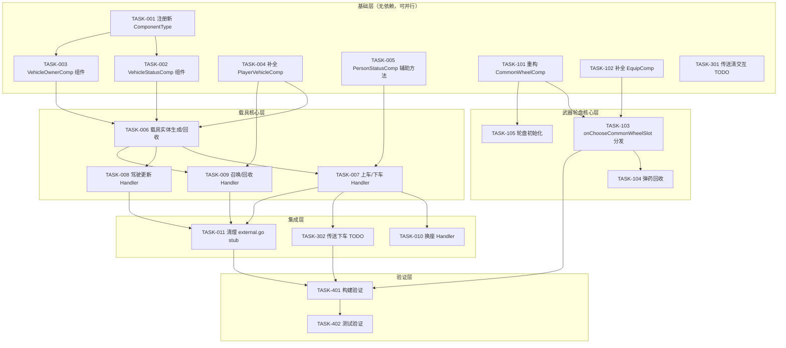

# 任务清单：樱花场景 - 载具/武器轮盘/传送

> 设计文档：`docs/design-sakura-vehicle-wheel-teleport.md`

---

## 任务依赖图



---

## 任务详情

### 基础层（无依赖，3 条线可并行）

---

#### TASK-001: 注册新 ComponentType

**文件**: `servers/scene_server/internal/common/com_type.go`

**内容**:
- 在载具组件区域（`ComponentType_Vehicle` 之后）新增：
  - `ComponentType_VehicleStatus` — 载具状态组件
  - `ComponentType_VehicleOwner` — 载具归属组件

**完成标准**: 编译通过，新类型可在代码中引用

---

#### TASK-002: 新增 VehicleStatusComp

**文件**: 新增 `servers/scene_server/internal/ecs/com/cvehicle/vehicle_status.go`

**内容**:
```go
type VehicleStatusComp struct {
    common.ComponentBase
    SeatList         []*VehicleSeat
    DoorList         []*VehicleDoor
    Speed            trans.Vec3
    IsLock           bool
    IsInParking      bool
    IsTrafficVehicle bool
    NeedAutoVanish   bool
    TouchedStamp     int64
    LeanAngle        trans.Vec3
    Rotator          trans.Vec3
    AudioRadioCfgId  int32
}
```

**方法**:
- `Type()` → `ComponentType_VehicleStatus`
- `NewVehicleStatusComp(seatCount int) *VehicleStatusComp` — 根据配置初始化座位列表
- `ChangePassenger(seatIndex int32, entityId uint64) uint64` — 设置座位乘客，返回旧乘客
- `PassengerLeaveVehicle(entityId uint64)` — 按实体 ID 清除座位
- `GetDriverEntity() uint64` — 获取驾驶员
- `IsPassenger(entityId uint64) bool`
- `ToProto() *proto.VehicleStatus`

**依赖**: TASK-001

---

#### TASK-003: 新增 VehicleOwnerComp

**文件**: 新增 `servers/scene_server/internal/ecs/com/cvehicle/vehicle_owner.go`

**内容**:
```go
type VehicleOwnerComp struct {
    common.ComponentBase
    OwnerEntityId uint64
}
```

**方法**:
- `Type()` → `ComponentType_VehicleOwner`
- `NewVehicleOwnerComp(ownerEntityId uint64) *VehicleOwnerComp`
- `IsOwner(entityId uint64) bool`
- `ToProto() *proto.VehicleOwnerProto`

**依赖**: TASK-001

---

#### TASK-004: 补全 PlayerVehicleComp

**文件**: `servers/scene_server/internal/ecs/com/cplayer/player_vehicle.go`

**修改点**:
1. 新增字段：`CurrentCallVehicle uint32`、`LastCallStamp int64`、`UniqueGenerator uint32`
2. 补全 `LoadFromData(saveData *proto.DBSavePesonVehicleComp)`：
   - 加载 `UniqueGenerator = saveData.UniqueGenerator`
   - 遍历 `saveData.VehicleList`，构建 `PersonalVehicleInfo`
3. 新增方法：
   - `GetVehicleByUnique(uniqueId uint32) *PersonalVehicleInfo`
   - `SetCurrentCallVehicle(uniqueId uint32)` / `ClearCurrentCallVehicle()`
   - `NextUniqueId() uint32` — 自增返回

**依赖**: 无

---

#### TASK-005: PersonStatusComp 辅助方法

**文件**: `servers/scene_server/internal/ecs/com/cperson/person_status.go`

**新增方法**:
- `OnVehicle(vehicleEntityId uint64, seat uint32)` — 设置驾驶状态 + SetSync
- `OffVehicle()` — 清除驾驶状态 + SetSync
- `CanOnVehicle() bool` — 检查 `DriveVehicleId == 0`
- `ClearInteraction()` — 清除 `InteractionEntityId` + SetSync

**依赖**: 无

---

#### TASK-101: 重构 CommonWheelComp

**文件**: `servers/scene_server/internal/ecs/com/cui/common_wheel.go`

**修改点**:
1. 重构数据结构：
   - `WheelList []*CommonWheelSlot` → `WheelMap map[int32]*CommonWheel`（wheelCfgId 分组）
   - 新增 `CommonWheel` 结构（SlotMap + NowActiveSlotIndex）
   - 新增 `CommonSlot` 结构（SlotCfgId + SlotType + BackpackCellIndex + ItemCollectionId）
   - 新增 `CommonSlotType` 枚举
2. 重写 `LoadFromData`：按 Proto 结构（`CommonWheelCompProto` → `CommonWheelProto` → `CommonSlotProto`）加载
3. 重写 `ToProto`：反向转换
4. 重写 `SelectWheelSlot`：按 `wheelCfgId` 查找轮盘再查槽位
5. 重写 `GetSlotInfo`：返回 `*CommonSlot`

**依赖**: 无

---

#### TASK-102: 补全 EquipComp

**文件**: `servers/scene_server/internal/ecs/com/cbackpack/equip.go`

**修改点**:
1. 补全 `LoadFromData(saveData *proto.DBSaveEquipMentComponent)`
2. 新增方法：
   - `SetWeapon(weapon *proto.WeaponCellInfo, cellIndex int32) *proto.WeaponCellInfo` — 返回旧武器
   - `RemoveWeapon() *proto.WeaponCellInfo` — 卸下当前武器
   - `GetActiveWeapon() *proto.WeaponCellInfo` — 获取当前武器

**依赖**: 无

---

#### TASK-301: 传送清交互 TODO

**文件**: `servers/scene_server/internal/net_func/player/teleport.go`

**修改点**: 在 `TeleportPlayerToPoint` 函数中：
1. 获取 `PersonStatusComp`，调用 `ClearInteraction()`（依赖 TASK-005，但可先直接写 `personStatusComp.InteractionEntityId = 0`）
2. 获取 `PersonInteractionComp`（可选），清除交互状态

**依赖**: 无（TASK-005 的方法是便捷封装，可先内联实现）

---

### 载具核心层

---

#### TASK-006: 载具实体生成/回收

**文件**: 新增 `servers/scene_server/internal/net_func/player/vehicle_spawn.go`

**内容**:
- `SpawnPlayerVehicle(s, ownerEntity, vehicleInfo, position, rotation) (common.Entity, error)`
  1. `s.NewEntity()` 创建实体
  2. 添加 `Transform`（设置 position/rotation）
  3. 添加 `VehicleStatusComp`（从配置初始化座位数）
  4. 添加 `VehicleOwnerComp`（设置 owner entity ID）
  5. 添加 `BaseStatusComp`
  6. 更新 `vehicleInfo.NowEntity`
- `RecyclePlayerVehicle(s, ownerEntity, vehicleUnique) error`
  1. 找到载具实体（遍历 PlayerVehicleComp.VehicleList）
  2. 所有乘客强制下车（遍历 VehicleStatusComp.SeatList）
  3. 保存载具状态回 PersonalVehicleInfo
  4. `s.RemoveEntity(vehicleEntity.ID())`
  5. 清除 `CurrentCallVehicle`

**依赖**: TASK-002, TASK-003, TASK-004

---

#### TASK-007: 上车/下车 Handler

**文件**: 新增 `servers/scene_server/internal/net_func/player/vehicle.go`

**内容**:
- `OnVehicle(req *proto.OnVehicleReq) (*proto.OnVehicleRes, *proto_code.RpcError)`
  - 验证 → 旧乘客处理 → 更新座位 → 更新 PersonStatusComp → 同步 Transform
- `OffVehicle(req *proto.OffVehicleReq) (*proto.OffVehicleRes, *proto_code.RpcError)`
  - 验证在车上 → PersonStatusComp.OffVehicle → 清除座位 → 更新 TouchedStamp
- 内部函数 `offVehicle(s, entity)` — 供传送/强制下车复用

**依赖**: TASK-005, TASK-006

---

#### TASK-008: 驾驶更新 Handler

**文件**: `servers/scene_server/internal/net_func/player/vehicle.go`（同上文件）

**内容**:
- `DriveVehicle(req *proto.DriveVehicleReq)`
  - 验证是驾驶员
  - 更新 VehicleStatusComp（speed, lean_angle, rotator）
  - 同步载具 Transform + 所有乘客 Transform

**依赖**: TASK-006

---

#### TASK-009: 召唤/回收 Handler

**文件**: `servers/scene_server/internal/net_func/player/vehicle.go`（同上文件）

**内容**:
- `CallUpVehicle(req *proto.CallUpVehicleReq) (*proto.CallUpVehicleRes, *proto_code.RpcError)`
  - 验证载具存在 + 未损毁
  - 先 RecyclePlayerVehicle（旧载具）
  - SpawnPlayerVehicle
  - 更新 CurrentCallVehicle + LastCallStamp
- `CallBackVehicle(req *proto.CallBackVehicleReq) (*proto.CallBackVehicleRes, *proto_code.RpcError)`
  - RecyclePlayerVehicle

**依赖**: TASK-004, TASK-006

---

### 武器轮盘核心层

---

#### TASK-103: onChooseCommonWheelSlot 动作分发

**文件**: `servers/scene_server/internal/net_func/ui/common_wheel.go`

**修改点**:
1. 更新 `SelectCommonWheelSlot` handler 适配新的 `CommonWheelComp` 结构
2. 实现 `onChooseCommonWheelSlot(s, entity, slot, isChangeItem)`：
   - 查询 `CfgQuickActionSlot` 获取 `onChooseAction`
   - `EquipItemQuickActionType`：从 BackpackComp 取物品 → EquipComp.SetWeapon → 触发旧武器卸载
   - `UnEquipCurItemQuickActionType`：EquipComp.RemoveWeapon → 触发弹药回收
   - `AddonToCurItemQuickActionType`：验证弹药兼容 → 触发换弹（简化实现）

**依赖**: TASK-101, TASK-102

---

#### TASK-104: 弹药回收

**文件**: `servers/scene_server/internal/net_func/ui/common_wheel.go`（或独立 `equip_helper.go`）

**内容**:
- `onWeaponUnloadRecycleBullet(s, entity, weapon, cellIndex)`
  - 读取 weapon.Attributes 中 BULLETID + BULLETCURRENT
  - 跳过免费弹药
  - 创建弹药物品 → BackpackComp.AddItem
  - 武器属性 bullet_current 归零

**依赖**: TASK-103

---

#### TASK-105: 轮盘初始化

**文件**: `servers/scene_server/internal/net_func/player/enter.go` 或 `ui/common_wheel.go`

**内容**:
- 玩家进入场景后，如果 `CommonWheelComp.WheelMap` 为空，从配置表 `CfgQuickActionPanel` 初始化
- 遍历 BackpackItem 槽位，从背包搜索匹配物品
- 激活默认槽位

**依赖**: TASK-101

---

### 集成层

---

#### TASK-010: 换座 Handler

**文件**: `servers/scene_server/internal/net_func/player/vehicle.go`

**内容**:
- `SwitchVehicleSeat(req *proto.SwitchVehicleSeatReq) (*proto.SwitchVehicleSeatRes, *proto_code.RpcError)`
  - 验证在车上 + 目标座位不同
  - 离开当前座位 → 进入新座位
  - 处理旧乘客被挤出

**依赖**: TASK-007

---

#### TASK-302: 传送下车 TODO

**文件**: `servers/scene_server/internal/net_func/player/teleport.go`

**修改点**:
- 在 `TeleportPlayerToPoint` 中，补充载具下车逻辑：
  ```go
  if personStatusComp.DriveVehicleId != 0 {
      offVehicle(s, entity) // 复用 TASK-007 的内部函数
  }
  ```

**依赖**: TASK-007

---

#### TASK-011: 清理 external.go stub

**文件**: `servers/scene_server/internal/net_func/temp/external.go`

**修改点**:
- 将已实现的 handler（OnVehicle, OffVehicle, DriveVehicle, SwitchVehicleSeat, CallUpVehicle, CallBackVehicle）从 `TempExternalHandler` 迁移到新的 handler
- 更新 `server_func.go` 或 `scene_service.go` 的路由分发（如果是自动生成的则不动）
- 保留未实现的 stub（车门/喇叭/停车等 P2 功能）

**依赖**: TASK-007, TASK-008, TASK-009

---

### 验证层

---

#### TASK-401: 构建验证

**执行**: `make build` + `make lint`

**验证内容**:
- [ ] 编译通过，无错误
- [ ] lint 无新增告警
- [ ] 未修改自动生成文件

**依赖**: TASK-011, TASK-103, TASK-302

---

#### TASK-402: 测试验证

**执行**: `make test`

**验证内容**:
- [ ] 现有测试不受影响
- [ ] 新组件可正确创建和序列化

**依赖**: TASK-401

---

## 任务汇总

### 载具线（T001 → T011）

| ID | 任务 | 依赖 | 优先级 |
|----|------|------|--------|
| T001 | 注册新 ComponentType | - | P0 |
| T002 | VehicleStatusComp 组件 | T001 | P0 |
| T003 | VehicleOwnerComp 组件 | T001 | P0 |
| T004 | 补全 PlayerVehicleComp | - | P0 |
| T005 | PersonStatusComp 辅助方法 | - | P0 |
| T006 | 载具实体生成/回收 | T002,T003,T004 | P0 |
| T007 | 上车/下车 Handler | T005,T006 | P0 |
| T008 | 驾驶更新 Handler | T006 | P0 |
| T009 | 召唤/回收 Handler | T004,T006 | P0 |
| T010 | 换座 Handler | T007 | P1 |
| T011 | 清理 external.go stub | T007,T008,T009 | P0 |

### 武器轮盘线（T101 → T105）

| ID | 任务 | 依赖 | 优先级 |
|----|------|------|--------|
| T101 | 重构 CommonWheelComp | - | P0 |
| T102 | 补全 EquipComp | - | P0 |
| T103 | onChooseCommonWheelSlot 分发 | T101,T102 | P0 |
| T104 | 弹药回收 | T103 | P1 |
| T105 | 轮盘初始化 | T101 | P1 |

### 传送线（T301 → T302）

| ID | 任务 | 依赖 | 优先级 |
|----|------|------|--------|
| T301 | 传送清交互 TODO | - | P0 |
| T302 | 传送下车 TODO | T007 | P0 |

### 验证层

| ID | 任务 | 依赖 | 优先级 |
|----|------|------|--------|
| T401 | 构建验证 | T011,T103,T302 | P0 |
| T402 | 测试验证 | T401 | P0 |

---

## 并行策略

```
时间线 →

线程1（载具线）:   T001 → T002+T003 → T006 → T007+T008+T009 → T010+T011
线程2（轮盘线）:   T101+T102 → T103 → T104+T105
线程3（传送线）:   T301 ... (等T007完成) ... T302
线程4（共享基础）:  T004+T005（与线程1/2的基础层并行）

汇合点:            T401 构建验证 → T402 测试验证
```

**总计 17 个任务**，其中基础层 8 个可并行，核心层 7 个分 2 条线并行，集成层 2 个串行。
