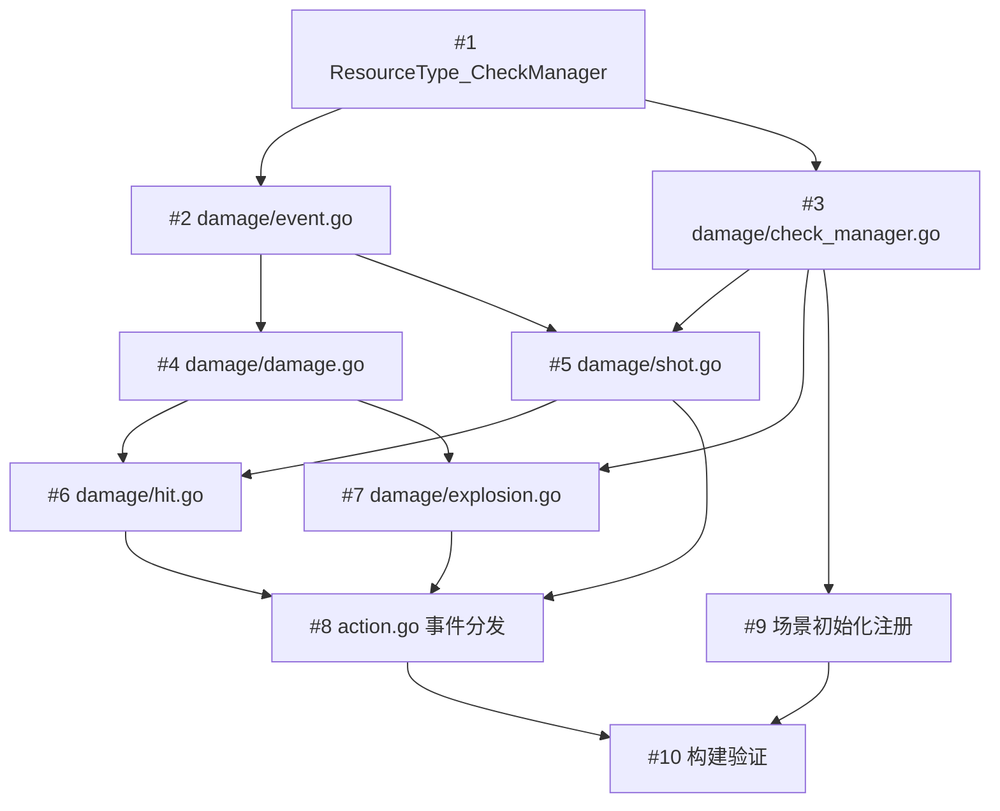

# 射击系统迁移 - 任务清单

## 任务依赖图

## 分组执行策略

### 第一组：基础设施（可并行，无依赖）

- [TASK-001] 新增 `ResourceType_CheckManager` 到 `resource_type.go`

### 第二组：包骨架（依赖第一组，可并行）

- [TASK-002] 创建 `damage/event.go` — SceneEvent 广播 + 实体类型判断辅助
- [TASK-003] 创建 `damage/check_manager.go` — CheckManager Resource（反作弊）

### 第三组：核心逻辑（依赖第二组，部分可并行）

- [TASK-004] 创建 `damage/damage.go` — canTakeDamage + DealDamage（依赖 #2）
- [TASK-005] 创建 `damage/shot.go` — HandleShotData + weaponFire（依赖 #2, #3）
- [TASK-007] 创建 `damage/explosion.go` — HandleExplosionData（依赖 #3, #4）

### 第四组：Hit 处理（依赖第三组）

- [TASK-006] 创建 `damage/hit.go` — HandleHitData（依赖 #3, #4, #5）

### 第五组：集成（依赖第四组，可并行）

- [TASK-008] 修改 `action.go` 事件分发（依赖 #5, #6, #7）
- [TASK-009] 场景初始化注册 CheckManager Resource（依赖 #3）

### 第六组：验证

- [TASK-010] `make build` 构建验证（依赖 #8, #9）

## 详细任务列表

### 基础设施

| ID | 文件 | 改动类型 | 说明 |
|----|------|----------|------|
| #1 | `common/resource_type.go` | 修改 | 新增 1 行常量 |

### damage 包（新增 6 个文件）

| ID | 文件 | 依赖 | 核心内容 |
|----|------|------|----------|
| #2 | `damage/event.go` | #1 | addSceneEvent, isPlayer, isNpc |
| #3 | `damage/check_manager.go` | #1 | CheckManager struct + 4 个方法 |
| #4 | `damage/damage.go` | #2 | canTakeDamage(5 层验证) + DealDamage + 红名后果 |
| #5 | `damage/shot.go` | #2,#3 | HandleShotData + weaponFire(BULLETCURRENT) |
| #6 | `damage/hit.go` | #3,#4,#5 | HandleHitData（完整流程） |
| #7 | `damage/explosion.go` | #3,#4 | HandleExplosionData + 范围衰减 |

### 集成

| ID | 文件 | 依赖 | 说明 |
|----|------|------|------|
| #8 | `action.go` | #5,#6,#7 | type switch 替换 TODO |
| #9 | 场景初始化 | #3 | AddResource(CheckManager) |
| #10 | 构建验证 | #8,#9 | make build + make lint |
