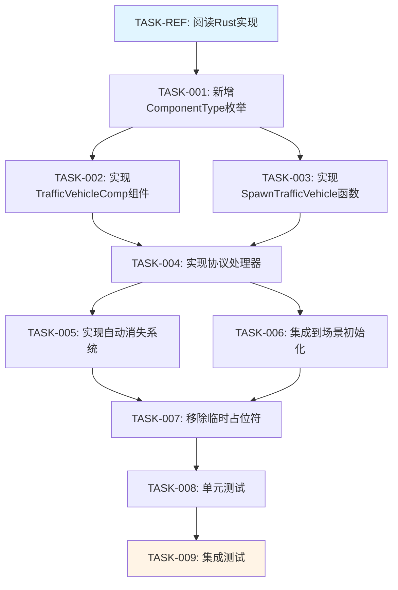

# 任务清单：交通载具功能实现与樱花校园扩展

## 任务依赖图



---

## 0. 参考任务（仅阅读，不修改代码）

### [TASK-REF] 阅读 Rust 交通载具实现

**文件**：`server_old/servers/scene/src/scene_service/service_for_scene.rs`

**目的**：
- 理解 `on_traffic_vehicle()` 方法的完整实现
- 理解 `VehicleSpawnInfo::get_spawn_info()` 的参数和逻辑
- 理解 `create_entity_for_spawn_info()` 的实体创建流程
- 理解交通载具的特殊标记（is_traffic_system, need_auto_vanish, touched_stamp）

**关键逻辑**：
- Lines 约 466-520：`on_traffic_vehicle()` 方法
- 载具生成参数设置
- 颜色列表设置
- 触碰时间戳设置（now + 5000ms）

**完成标准**：理解 Rust 实现的所有关键步骤

---

## 1. 基础设施任务

### [TASK-001] 新增 ComponentType 枚举

**文件**：`servers/scene_server/internal/common/component_type.go`

**修改类型**：修改（新增枚举值）

**依赖**：TASK-REF

**内容**：
```go
const (
    // ... 现有枚举
    ComponentType_TrafficVehicle ComponentType = XX  // 分配未使用的枚举值
)
```

**验收标准**：
- [ ] 枚举值不与现有值冲突
- [ ] 代码可编译

---

### [TASK-002] 实现 TrafficVehicleComp 组件

**文件**：`servers/scene_server/internal/ecs/com/ctraffic_vehicle/traffic_vehicle.go`（新建）

**修改类型**：新建文件和目录

**依赖**：TASK-001

**内容**：
```go
package ctraffic_vehicle

import (
    "mp/servers/scene_server/internal/common"
)

type TrafficVehicleComp struct {
    common.ComponentBase
    IsTrafficSystem bool  // 是否为交通系统载具
    NeedAutoVanish  bool  // 是否需要自动消失
    TouchedStamp    int64 // 触碰时间戳（毫秒）
    VanishDelay     int64 // 消失延迟（毫秒）
}

func NewTrafficVehicleComp() *TrafficVehicleComp {
    return &TrafficVehicleComp{
        IsTrafficSystem: true,
        NeedAutoVanish:  true,
        VanishDelay:     5000,
    }
}

func (t *TrafficVehicleComp) Type() common.ComponentType {
    return common.ComponentType_TrafficVehicle
}

// ShouldVanish 判断是否应该消失
func (t *TrafficVehicleComp) ShouldVanish(currentTime int64) bool {
    if !t.NeedAutoVanish {
        return false
    }
    return currentTime > t.TouchedStamp
}

// SetInitialTouchedStamp 设置初始触碰时间戳
func (t *TrafficVehicleComp) SetInitialTouchedStamp(currentTime int64) {
    t.TouchedStamp = currentTime + t.VanishDelay
}
```

**验收标准**：
- [ ] 组件正确实现 Component 接口
- [ ] ShouldVanish() 逻辑正确
- [ ] 代码可编译

---

### [TASK-003] 实现 SpawnTrafficVehicle 函数

**文件**：`servers/scene_server/internal/ecs/spawn/vehicle_spawn.go`（新建）

**修改类型**：新建文件和目录

**依赖**：TASK-001, TASK-REF

**内容**：
```go
package spawn

import (
    "errors"
    "time"

    "common/config"
    "common/proto"
    "mp/servers/scene_server/internal/common"
    "mp/servers/scene_server/internal/ecs/com/ctraffic_vehicle"
    // 其他组件导入...
)

// SpawnTrafficVehicle 生成交通载具
func SpawnTrafficVehicle(
    scene common.Scene,
    vehicleCfgId int32,
    location *proto.Vector3,
    rotation *proto.Vector3,
    colorList []int32,
) (common.Entity, error) {
    // 1. 验证载具配置
    cfg := config.GetCfgVehicleById(vehicleCfgId)
    if cfg == nil {
        return 0, errors.New("invalid vehicle cfg id")
    }

    // 2. 验证参数
    if location == nil || rotation == nil {
        return 0, errors.New("invalid location or rotation")
    }

    // 3. 创建实体
    entity := scene.CreateEntity()

    // 4. 添加 TransformComp（位置组件）
    // TODO: 实现

    // 5. 添加 VehicleStatusComp（状态组件）
    // TODO: 根据实际组件定义实现

    // 6. 添加 TrafficVehicleComp（交通标记）
    trafficComp := ctraffic_vehicle.NewTrafficVehicleComp()
    trafficComp.SetInitialTouchedStamp(time.Now().UnixMilli())
    scene.AddComponent(entity, trafficComp)

    // 7. 设置颜色列表（如果 VehicleStatusComp 有 colorList 字段）
    // TODO: 实现

    return entity, nil
}
```

**注意事项**：
- 需要根据实际的 VehicleStatusComp 和 TransformComp 定义来实现
- 如果这些组件不存在，需要先创建或使用替代方案

**验收标准**：
- [ ] 载具配置验证正确
- [ ] 实体创建成功
- [ ] 所有必要组件添加完整
- [ ] 代码可编译

---

## 2. 协议处理任务

### [TASK-004] 实现协议处理器

**文件**：`servers/scene_server/internal/net_func/vehicle/traffic_vehicle.go`（新建）

**修改类型**：新建文件和目录

**依赖**：TASK-002, TASK-003

**内容**：
```go
package vehicle

import (
    "common/proto"
    "common/proto_code"
    "common/rpc"
    "mp/servers/scene_server/internal/common"
    "mp/servers/scene_server/internal/ecs/spawn"
)

type VehicleHandler struct {
    scene common.Scene
    ctx   *rpc.RpcContext
}

func NewVehicleHandler(scene common.Scene, ctx *rpc.RpcContext) *VehicleHandler {
    return &VehicleHandler{
        scene: scene,
        ctx:   ctx,
    }
}

func (h *VehicleHandler) OnTrafficVehicle(
    req *proto.OnTrafficVehicleReq,
) (*proto.OnTrafficVehicleRes, *proto_code.RpcError) {
    // 1. 场景类型检查
    switch h.scene.GetSceneType().(type) {
    case *common.CitySceneInfo:
        // 大世界 - 允许
    case *common.SakuraSceneInfo:
        // 樱花校园 - 允许
    case *common.DungeonSceneInfo:
        // 副本 - 拒绝
        return nil, proto_code.NewErrorMsg("Traffic vehicles not supported in dungeons")
    case *common.TownSceneInfo:
        // 小镇 - 拒绝
        return nil, proto_code.NewErrorMsg("Traffic vehicles not supported in town")
    default:
        return nil, proto_code.NewErrorMsg("Unknown scene type")
    }

    // 2. 生成交通载具
    vehicleEntity, err := spawn.SpawnTrafficVehicle(
        h.scene,
        req.VehicleCfgId,
        req.Location,
        req.Rotation,
        req.ColorList,
    )
    if err != nil {
        h.scene.Errorf("OnTrafficVehicle: spawn failed, err=%v", err)
        return nil, proto_code.NewErrorMsg("Failed to spawn traffic vehicle")
    }

    // 3. 返回载具实体ID
    return &proto.OnTrafficVehicleRes{
        VehicleEntity: uint64(vehicleEntity),
    }, nil
}
```

**验收标准**：
- [ ] 场景类型检查正确（大世界和樱花校园允许，副本和小镇拒绝）
- [ ] 调用 SpawnTrafficVehicle 成功
- [ ] 返回正确的载具实体ID
- [ ] 错误处理完整
- [ ] 代码可编译

---

## 3. 系统任务

### [TASK-005] 实现自动消失系统

**文件**：`servers/scene_server/internal/ecs/system/traffic_vehicle_system.go`（新建）

**修改类型**：新建文件

**依赖**：TASK-002

**内容**：
```go
package system

import (
    "time"

    "mp/servers/scene_server/internal/common"
    "mp/servers/scene_server/internal/ecs/com/ctraffic_vehicle"
    "mp/servers/scene_server/internal/ecs/system"
)

type TrafficVehicleSystem struct {
    *system.SystemBase
}

func NewTrafficVehicleSystem(scene common.Scene) common.System {
    return &TrafficVehicleSystem{
        SystemBase: system.New(scene),
    }
}

func (s *TrafficVehicleSystem) Type() common.SystemType {
    return common.SystemType_TrafficVehicle
}

func (s *TrafficVehicleSystem) Update(dt time.Duration) {
    currentTime := time.Now().UnixMilli()

    // 遍历所有 TrafficVehicleComp
    comps := s.Scene().ComList(common.ComponentType_TrafficVehicle)
    for _, comp := range comps {
        trafficComp, ok := comp.(*ctraffic_vehicle.TrafficVehicleComp)
        if !ok {
            continue
        }

        // 检查是否应该消失
        if trafficComp.ShouldVanish(currentTime) {
            entity := s.Scene().GetEntityByComponent(trafficComp)
            if entity != 0 {
                s.Scene().RemoveEntity(entity)
                s.Scene().Debugf("TrafficVehicle auto vanish, entity=%d", entity)
            }
        }
    }
}
```

**注意事项**：
- 需要确认 SystemType 枚举中有 `SystemType_TrafficVehicle`
- 需要确认 Scene 接口有 `GetEntityByComponent()` 方法

**验收标准**：
- [ ] 正确遍历所有 TrafficVehicleComp
- [ ] 正确判断是否应该消失
- [ ] 正确移除过期实体
- [ ] 代码可编译

---

### [TASK-006] 集成到场景初始化

**文件**：`servers/scene_server/internal/ecs/scene_impl.go`

**修改类型**：修改（添加系统注册）

**依赖**：TASK-005

**内容**：
在场景初始化时注册 TrafficVehicleSystem

**查找位置**：搜索其他 System 的注册位置（如 `AddSystem`）

**添加代码**：
```go
// 注册交通载具系统
trafficVehicleSystem := system.NewTrafficVehicleSystem(s)
s.AddSystem(trafficVehicleSystem)
```

**验收标准**：
- [ ] 系统正确注册
- [ ] 场景初始化不报错
- [ ] 代码可编译

---

## 4. 集成任务

### [TASK-007] 移除临时占位符

**文件**：`servers/scene_server/internal/net_func/temp/external.go`

**修改类型**：修改（移除占位符，调用新处理器）

**依赖**：TASK-004

**当前代码**（Lines 693-696）：
```go
func (h *TempExternalHandler) OnTrafficVehicle(req *proto.OnTrafficVehicleReq) (*proto.OnTrafficVehicleRes, *proto_code.RpcError) {
    h.scene.Error("OnTrafficVehicle not implemented")
    return nil, proto_code.NewErrorMsg("OnTrafficVehicle not implemented")
}
```

**修改为**：
```go
func (h *TempExternalHandler) OnTrafficVehicle(req *proto.OnTrafficVehicleReq) (*proto.OnTrafficVehicleRes, *proto_code.RpcError) {
    handler := vehicle.NewVehicleHandler(h.scene, h.ctx)
    return handler.OnTrafficVehicle(req)
}
```

**需要添加导入**：
```go
import (
    "mp/servers/scene_server/internal/net_func/vehicle"
)
```

**验收标准**：
- [ ] 正确调用新的处理器
- [ ] 导入路径正确
- [ ] 代码可编译

---

## 5. 测试任务

### [TASK-008] 单元测试

**文件**：
- `servers/scene_server/internal/ecs/com/ctraffic_vehicle/traffic_vehicle_test.go`（新建）
- `servers/scene_server/internal/ecs/spawn/vehicle_spawn_test.go`（新建）

**修改类型**：新建测试文件

**依赖**：TASK-002, TASK-003

**测试内容**：

**traffic_vehicle_test.go**：
```go
func TestTrafficVehicleComp_ShouldVanish(t *testing.T) {
    // 测试消失逻辑
    comp := NewTrafficVehicleComp()
    comp.SetInitialTouchedStamp(1000)

    // 时间未到，不应消失
    assert.False(t, comp.ShouldVanish(5000))

    // 时间已到，应该消失
    assert.True(t, comp.ShouldVanish(7000))
}

func TestTrafficVehicleComp_NeedAutoVanish_False(t *testing.T) {
    // 测试关闭自动消失
    comp := NewTrafficVehicleComp()
    comp.NeedAutoVanish = false
    comp.SetInitialTouchedStamp(1000)

    // 无论时间，都不应消失
    assert.False(t, comp.ShouldVanish(10000))
}
```

**vehicle_spawn_test.go**：
```go
func TestSpawnTrafficVehicle_InvalidCfgId(t *testing.T) {
    // 测试无效的载具配置ID
    // TODO: 需要 mock Scene
}

func TestSpawnTrafficVehicle_NilLocation(t *testing.T) {
    // 测试空位置参数
}
```

**验收标准**：
- [ ] TrafficVehicleComp 逻辑测试通过
- [ ] SpawnTrafficVehicle 参数验证测试通过
- [ ] 所有测试用例通过

---

### [TASK-009] 集成测试

**文件**：`servers/scene_server/internal/integration/traffic_vehicle_test.go`（新建）

**修改类型**：新建测试文件

**依赖**：TASK-007（所有实现完成）

**测试内容**：
```go
func TestOnTrafficVehicle_CityScene(t *testing.T) {
    // 测试在大世界场景生成交通载具
    // 1. 创建大世界场景
    // 2. 调用 OnTrafficVehicle
    // 3. 验证载具实体创建成功
    // 4. 验证 TrafficVehicleComp 存在
}

func TestOnTrafficVehicle_SakuraScene(t *testing.T) {
    // 测试在樱花校园场景生成交通载具
}

func TestOnTrafficVehicle_DungeonScene(t *testing.T) {
    // 测试在副本场景拒绝生成
    // 应该返回错误
}

func TestTrafficVehicle_AutoVanish(t *testing.T) {
    // 测试自动消失机制
    // 1. 生成交通载具
    // 2. 等待 5 秒
    // 3. TrafficVehicleSystem Update
    // 4. 验证载具被移除
}
```

**验收标准**：
- [ ] 大世界场景测试通过
- [ ] 樱花校园场景测试通过
- [ ] 副本场景拒绝测试通过
- [ ] 自动消失机制测试通过

---

## 任务执行顺序

### 第一批（串行）
1. **TASK-REF**：阅读 Rust 实现
2. **TASK-001**：新增 ComponentType 枚举

### 第二批（可并行）
- **TASK-002**：实现 TrafficVehicleComp 组件
- **TASK-003**：实现 SpawnTrafficVehicle 函数

### 第三批（可并行，依赖第二批）
- **TASK-004**：实现协议处理器
- **TASK-005**：实现自动消失系统

### 第四批（串行，依赖第三批）
1. **TASK-006**：集成到场景初始化
2. **TASK-007**：移除临时占位符

### 第五批（可并行，依赖第四批）
- **TASK-008**：单元测试
- **TASK-009**：集成测试

---

## 完成标准

- [ ] 所有代码任务完成（TASK-001 ~ TASK-007）
- [ ] 所有测试通过（TASK-008 ~ TASK-009）
- [ ] `make build` 构建成功
- [ ] `make test` 无失败用例
- [ ] 大世界和樱花校园场景功能验证通过
- [ ] 副本场景拒绝验证通过
- [ ] 自动消失机制验证通过

---

## 注意事项

### 依赖组件检查

在实现 TASK-003 之前，需要确认以下组件是否存在：
- [ ] `TransformComp` - 位置和旋转组件
- [ ] `VehicleStatusComp` - 载具状态组件
- [ ] `NetProxyComp` - 网络代理组件（可选）

如果这些组件不存在，需要：
1. 创建简化版本的组件
2. 或参考 Rust 实现创建完整组件
3. 或使用现有的替代组件

### SystemType 枚举检查

在实现 TASK-005 之前，需要确认：
- [ ] `common/system_type.go` 中是否有 `SystemType_TrafficVehicle` 枚举
- 如果没有，需要先添加此枚举值

### 场景接口方法检查

在实现过程中，需要确认 `common.Scene` 接口是否有以下方法：
- [ ] `CreateEntity() Entity`
- [ ] `RemoveEntity(Entity)`
- [ ] `AddComponent(Entity, Component)`
- [ ] `ComList(ComponentType) []Component`
- [ ] `GetEntityByComponent(Component) Entity`

如果缺少方法，需要根据实际接口调整实现。
