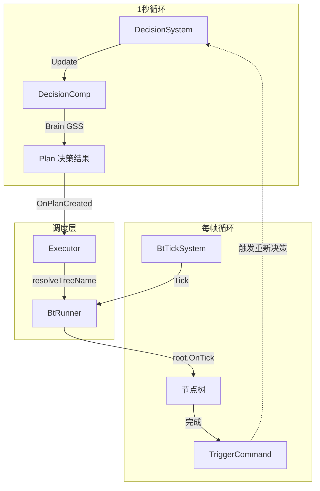
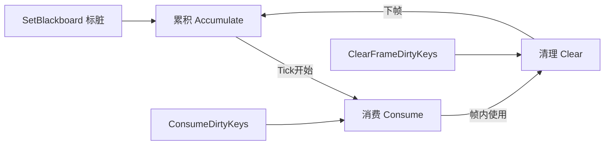

# AI 决策与行为树架构

> Brain(1秒决策) → Executor(Plan调度) → BtRunner(每帧Tick) → 节点树，完整的 NPC 智能行为系统。

## 整体架构



## 三层驱动机制

| 层级 | 系统 | 频率 | 职责 |
|------|------|------|------|
| **战略** | DecisionSystem | 1 秒 | Brain 决策，产生 Plan（行为类别切换） |
| **调度** | Executor | 按需 | 解析 Plan Task，启动/停止 BT |
| **战术** | BtTickSystem | 每帧 | 驱动节点树 Tick，Abort 分支切换 |

## DecisionSystem — 1 秒决策循环

```
DecisionSystem.Update()   [每 1 秒]
  ├─ 遍历所有 NPC Entity（含 DecisionComp）
  ├─ DecisionComp.Update()
  │   └─ Brain (GSS) 根据 Feature 评估 Transition
  │       └─ 返回 Plan {Name, Tasks[]}
  └─ Executor.OnPlanCreated(plan)
```

### Plan 结构

```go
type Plan struct {
    Name     string    // 计划名称（如 "daily_schedule", "police_enforcement"）
    FromPlan string    // 前置计划
    Tasks    []Task    // 任务列表
}

type Task struct {
    Type TaskType      // GSSMain / GSSExit / Transition
    Name string        // 任务名称
}
```

### Task 类型

| TaskType | 含义 | Executor 处理 |
|----------|------|--------------|
| `GSSMain` | 主任务 | `btRunner.Run(planName, entityID)` |
| `GSSExit` | 退出清理 | `btRunner.Stop(entityID)` |
| `GSSEnter` | 已废弃 | skip（合并到行为节点 OnEnter） |
| `Transition` | 转换任务 | `btRunner.Run(taskName, entityID)` |

## Executor — Plan 调度

```
Executor.OnPlanCreated(plan)
  ├─ 遍历 Plan.Tasks
  │
  ├─ GSSExit → btRunner.Stop(entityID)
  │   └─ 递归触发节点 OnExit，清理资源
  │
  └─ GSSMain / Transition
      ├─ resolveTreeName(planName, task)
      │   ├─ GSSMain → planName（如 "daily_schedule"）
      │   └─ Transition → task.Name（如 "return_to_schedule"）
      │
      └─ btRunner.HasTree(treeName) ?
          ├─ Yes → btRunner.Run(treeName, entityID)
          └─ No  → 静默回退硬编码（遗留代码，不推荐）
```

> **关键约束**：Brain plan name **必须与 JSON 树 name 字段完全一致**。不匹配 → HasTree 返回 false → 行为不执行。

## BtRunner — 行为树运行引擎

### 核心结构

```go
type BtRunner struct {
    treeConfigs  map[string]*BTreeConfig     // 配置模板（JSON 解析结果）
    runningTrees map[uint64]*TreeInstance    // 运行中树 entityID → instance
    contexts     map[uint64]*BtContext       // 跨树共享上下文 entityID → context
    loader       *BTreeLoader                // 节点构建器
}

type TreeInstance struct {
    TreeName  string
    Root      IBtNode
    Context   *BtContext
    Status    BtNodeStatus
}
```

### 三个核心方法

#### Run(treeName, entityID) — 启动树

```
Run()
├─ 从 BTreeConfig 重建全新节点树（模板隔离，NPC 间互不干扰）
├─ 如有旧树运行 → 先 Stop(entityID)
├─ 获取或创建 BtContext（跨树共享，按 Entity 隔离）
├─ 创建 TreeInstance
└─ root.OnEnter(ctx)
```

#### Tick(entityID, deltaTime) — 每帧更新

```
Tick()
├─ dirtyKeys = ConsumeDirtyKeys()     // Phase 2: 消费累积的脏 key
├─ SetFrameDirtyKeys(dirtyKeys)       // 供 Abort 评估使用
├─ root.OnTick(ctx)                   // 驱动节点树
├─ ClearFrameDirtyKeys()              // Phase 3: 清理
└─ 树完成(Success/Failed) → 清理 Observer，移除 TreeInstance
```

#### Stop(entityID) — 停止树

```
Stop()
├─ stopNode(root, ctx)                // 递归调用 Running 节点的 OnExit
├─ 清理 Blackboard Observer
├─ 清理本帧脏 key
└─ 从 runningTrees 移除（但保留 context）
```

## BtTickSystem — 每帧驱动

```
BtTickSystem.Update()   [每帧]
├─ 遍历所有运行中的树
├─ btRunner.Tick(entityID, deltaTime)
└─ 树完成时
    ├─ btRunner.Stop(entityID)
    └─ decisionComp.TriggerCommand()    // 触发 Brain 重新决策
```

## BtContext — 执行上下文

```go
type BtContext struct {
    Scene     Scene
    EntityID  uint64
    DeltaTime float32

    // Blackboard — 树内节点通信总线
    Blackboard     map[string]any
    dirtyKeys      map[string]struct{}    // 累积的脏 key
    frameDirtyKeys map[string]struct{}    // 当前帧脏 key

    // 组件缓存（懒加载）
    moveComp, decisionComp, transformComp, npcComp, visionComp ...
}
```

### Blackboard 三阶段生命周期



| 阶段 | 时机 | 操作 |
|------|------|------|
| **累积** | 节点/Service 调用 `SetBlackboard()` | 值变化时 markDirty(key) |
| **消费** | Tick 开始 | `ConsumeDirtyKeys()` → `SetFrameDirtyKeys()` |
| **清理** | 帧结束 | `ClearFrameDirtyKeys()` |

### Feature vs Blackboard

| 维度 | Feature | Blackboard |
|------|---------|------------|
| 来源 | DecisionComp（1秒更新） | 树内节点直接设置 |
| 读写 | 只读 | 可读写 |
| 脏 key | 无 | 有（驱动 Abort） |
| 用途 | Brain 决策 + Decorator 每帧评估 | 节点间通信 + 事件驱动 |
| 转换 | Service 搬入 BB | — |

## 节点体系

### 四层节点类型

```
IBtNode
├── 控制节点（Control）—— N 个子节点，决定执行顺序
│   ├── Selector   首个成功即返回成功
│   └── Sequence   全部成功才返回成功
│
├── 装饰节点（Decorator）—— 1 个子节点，拦截/变换结果
│   ├── Inverter    反转结果
│   ├── Repeater    循环执行
│   ├── Timeout     超时中断
│   ├── Cooldown    冷却间隔
│   └── ForceSuccess 强制成功
│
└── 叶子节点（Leaf）—— 0 个子节点，具体操作
    ├── 行为节点（Long-Running）
    │   OnEnter→Running, OnTick→Running循环, OnExit→清理
    │   例: IdleBehavior, MoveBehavior, DialogBehavior
    │
    ├── 异步节点（Async Action）
    │   OnEnter发命令→Running, OnTick轮询→Success/Failed, OnExit区分打断vs完成
    │   例: ChaseTarget, WaitForArrival
    │
    └── 同步节点（Sync Action）
        OnEnter一次性操作→Success/Failed, OnTick直接返回Status
        例: StartMove, SetupNavMeshPath, ArrestTarget
```

### BaseNode 三字段结构

```go
type BaseNode struct {
    children   []IBtNode               // 子节点 → 占树层级
    decorators []IConditionalDecorator  // 条件装饰器 → 不占层级（附加属性）
    services   []IService              // 服务 → 不占层级（附加属性）
}
```

对应 JSON：
- `children` / `child` → children[]
- `decorators` → decorators[]
- `services` → services[]

### 节点生命周期

```
OnEnter(ctx)   → 初始化，返回 Running（行为节点契约）
OnTick(ctx)    → 主逻辑，返回 Running/Success/Failed
OnExit(ctx)    → 清理（OnEnter 做了什么，OnExit 必须撤销）
```

## Service 与 Decorator

### Service — 数据搬运工

```go
type IService interface {
    OnActivate(ctx)    // Composite OnEnter 时激活
    OnTick(ctx)        // 按 IntervalMs 定期调用
    OnDeactivate(ctx)  // Composite OnExit 时停用
    IntervalMs() int64
}
```

- 仅在 **Composite 节点**（Selector/Sequence）中生效
- 典型实现：`SyncFeatureToBlackboard`（Feature → BB，产生脏 key）
- 只写数据不做判断

### Conditional Decorator — 条件门卫

```go
type IConditionalDecorator interface {
    Evaluate(ctx) bool            // 条件是否满足
    AbortType() FlowAbortMode     // 中断模式
    ObservedKeys() []string       // 观察的 BB key（事件驱动优化）
}
```

- 配置在被守卫节点上，由**父 Composite** 评估
- 只读数据不搬数据
- 两种实现：
  - **BlackboardCheck**：检查 BB 值，有 ObservedKeys → 仅脏 key 变化时重评估
  - **FeatureCheck**：检查 Feature 值，无 ObservedKeys → 每帧评估

### Abort 模式

| 模式 | 触发条件 | 效果 | 评估位置 |
|------|---------|------|---------|
| `self` | 条件变 false | 打断自己 | Sequence.OnTick |
| `lower_priority` | 条件变 true | 打断低优先级兄弟 | Selector.OnTick |
| `both` | 两者都有 | Self + LowerPriority | 两处都评估 |

### 帧内执行顺序

```
Composite.OnTick()
  ① 父节点评估子节点 decorators（入口守卫）
  ② Self Abort 检查（事件驱动：仅脏 key 相关时）
  ③ Tick Services（数据搬运）
  ④ 执行 children
```

## 事件驱动链路

```
外部状态变化
    ↓
Feature 更新（DecisionComp, 1秒）
    ↓
Service.OnTick()（SyncFeatureToBlackboard, 500ms）
    ├─ GetFeatureValue(featureKey)
    └─ SetBlackboard(bbKey, value)  → markDirty(key)
    ↓
Tick 开始：ConsumeDirtyKeys → SetFrameDirtyKeys
    ↓
Composite.OnTick()
    ├─ HasRelevantFrameDirtyKeys(observedKeys)?
    │   ├─ Yes → 重评估 Decorator
    │   └─ No  → 跳过（性能优化）
    └─ 条件变化 → 触发 Abort
        └─ 中断当前节点 → child.OnExit() → child.Reset()
```

**BT 节点直接设 BB 绕过延迟**：关键状态切换时，节点直接 `ctx.SetBlackboard()`，不走 Feature→Service→BB 链路，确保同帧响应。

## 复合树模式

### 结构模板

```
Selector (根节点)
  ├─ services: [SyncFeatureToBlackboard]     ← 搬运 Feature → BB
  ├─ children[0]: 分支A
  │   └─ decorators: [BlackboardCheck(key=X, abort_type=both)]
  ├─ children[1]: 分支B
  │   └─ decorators: [BlackboardCheck(key=Y, abort_type=both)]
  └─ children[2]: 分支C（默认）
```

### 典型示例

| 树 | 分支数 | 切换依据 |
|----|--------|---------|
| `daily_schedule` | 3 分支 | `feature_schedule`（移动/待在家/外出） |
| `meeting` | 2 分支 | `feature_meeting_state`（移动/会面） |
| `police_enforcement` | 3 分支 | `state_pursuit` / `pursuit_miss`（追逐↔调查↔返回） |

### 与原子树对比

- **原子树**：只有 1 个行为节点（如 `idle.json`）
- **复合树**：Selector > N 个行为节点，Service + Decorator 驱动分支切换

## Brain 配置

### 目录结构

```
resources/ai_decision_bt/     ← BT 版 Brain 配置（JSON）
├── dan.json                  ← Dan NPC
├── customer.json
├── dealer.json
├── sakura.json
└── blackman.json
```

### 合并原则

- **Brain 管行为类别切换（战略）**，BT 管类别内部分支（战术）
- 同一行为类别的原子 plan 合并为单个复合 plan：
  - `idle + move + home_idle` → `daily_schedule`
  - `meeting_move + meeting_idle` → `meeting`
- NPC 独有行为保留独立 plan（如 `police_enforcement`、`proxy_trade`）

## JSON 树格式

```json
{
  "name": "daily_schedule",
  "description": "NPC 日常日程",
  "root": {
    "type": "Selector",
    "services": [{
      "type": "SyncFeatureToBlackboard",
      "params": {
        "interval_ms": 500,
        "mappings": {"feature_schedule": "schedule"}
      }
    }],
    "children": [
      {
        "type": "MoveBehavior",
        "decorators": [{
          "type": "BlackboardCheck",
          "abort_type": "both",
          "params": {"key": "schedule", "operator": "==", "value": "MoveToBPoint"}
        }]
      },
      {
        "type": "HomeIdleBehavior",
        "decorators": [{
          "type": "BlackboardCheck",
          "abort_type": "both",
          "params": {"key": "schedule", "operator": "==", "value": "StayInBuilding"}
        }]
      }
    ]
  }
}
```

## 关键文件路径

| 文件/目录 | 内容 |
|----------|------|
| `system/decision/decision.go` | DecisionSystem（1秒决策） |
| `system/decision/executor.go` | Executor（Plan→BT 调度） |
| `system/decision/bt_tick_system.go` | BtTickSystem（每帧 Tick） |
| `com/caidecision/` | DecisionComp（Brain/Feature/Plan） |
| `common/ai/bt/runner/runner.go` | BtRunner 核心（Run/Stop/Tick） |
| `common/ai/bt/context/context.go` | BtContext + Blackboard |
| `common/ai/bt/node/` | 节点接口 + 基类 |
| `common/ai/bt/nodes/` | 所有节点实现 |
| `common/ai/bt/config/` | JSON 加载器 + BTreeConfig |
| `resources/ai_decision_bt/` | Brain 配置 JSON |
| `resources/bt/trees/` | 行为树 JSON |
