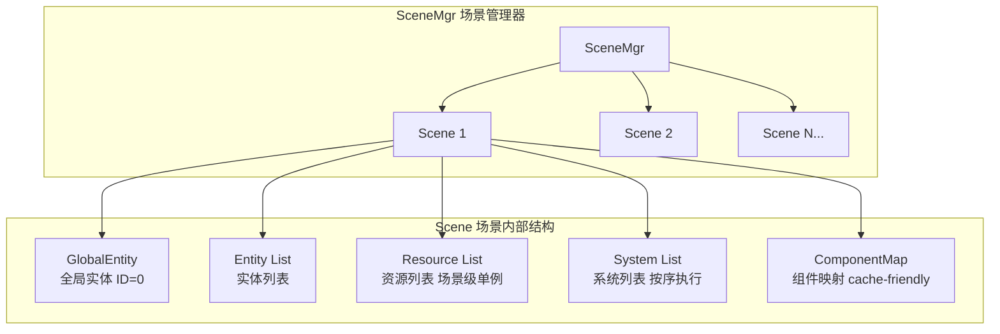
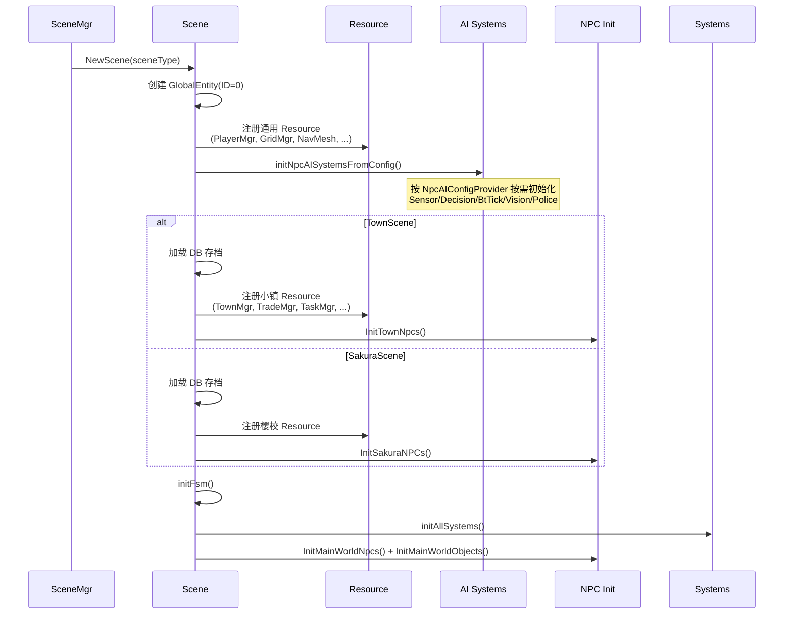

# ECS 场景框架架构

> Scene Server 的核心架构，所有游戏逻辑的运行基础。

## 整体架构



## 核心接口体系

### 四大接口

| 接口 | 归属层级 | 标识类型 | 职责 |
|------|---------|---------|------|
| `Entity` | 场景内 | `EntityIdentity(ID+Type)` | 纯容器，承载 Component |
| `Component` | Entity 级 | `ComponentType` | 存储单实体数据，支持同步/存盘脏标 |
| `Resource` | Scene 级 | `ResourceType` | 场景全局单例，管理器/全局状态 |
| `System` | Scene 级 | `SystemType` | 处理逻辑，操作 Component 和 Resource |

### 共性基类 ICompAndResBase

Component 和 Resource 共享同一个基类，提供：
- **脏标管理**：`SetSync()` / `SetSave()` / `ClearSync()` / `ClearSave()`
- **场景引用**：`GetScene()`
- **日志接口**：带上下文信息的日志方法

```
ICompAndResBase
├── ComponentBase（实体级）
│   └── 具体组件（Transform、Backpack、NpcBase ...）
└── ResourceBase（场景级）
    └── 具体资源（PlayerManager、GridMgr、TownMgr ...）
```

## Entity 实体

### 内部结构

```go
type entity struct {
    identity EntityIdentity      // ID + EntityType
    scene    Scene               // 所属场景
    coms     []Component         // 附属组件列表
    handler  []Handler           // 消息处理器
}
```

### 实体类型

| EntityType | 说明 |
|-----------|------|
| `EntityType_Base` | 基础实体 |
| `EntityType_Player` | 玩家 |
| `EntityType_Npc` | NPC |
| `EntityType_Vehicle` | 载具 |
| `EntityType_Object` | 场景物件 |

### 组件添加流程

```
entity.AddComponent(com)
  ├─ 检查同类型组件是否已存在（每类型仅一个）
  ├─ com.InitIdentify(entity)  → 绑定场景引用 + 设置 dirtyFlagSync
  ├─ append 到 entity.coms[]
  └─ scene.AddComponent(com, entity) → componentMap.Add()
```

## Component 组件

### 继承结构

```go
// 共性基类
CompAndResBase {
    scene     Scene
    dirtyFlag dirtyFlag  // 位标志：Sync(bit0) + Save(bit1)
}

// 组件专用基类
ComponentBase {
    CompAndResBase
    compType  ComponentType
    identity  *CompIdentity     // 含 EntityIdentity 引用
}
```

### 脏标传播机制

```
com.SetSync()
  ├─ dirtyFlag |= dirtyFlagSync
  └─ scene.MarkEntitySyncDirty(entityID)  → 标记实体需网络同步

com.SetSave()
  ├─ dirtyFlag |= dirtyFlagSave
  ├─ scene.MarkSceneSaveDirty()           → 标记场景需存盘（小镇用）
  └─ scene.MarkPlayerSaveDirty(entityID)  → 标记玩家需存盘
```

### ComponentMap — Cache-Friendly 存储

```
ComponentMap
└── arrays[ComponentType_MAX]  // 按组件类型索引
    └── ComponentArray
        ├── components []Component    // 连续内存，同类型组件排列
        └── entityMap  map[uint64]int // entityID → 数组下标
```

**性能优化**：
- 同类型组件内存连续 → CPU 缓存友好（System 遍历同类组件时高效）
- O(1) 按 entityID 查找
- 交换删除法（swap-remove）保持数组连续

### 组件类型分类（89 种）

| 分类 | 典型组件 | 说明 |
|------|---------|------|
| **基础** | Transform、Movement、BaseStatus、Gas、Physics | 所有实体通用 |
| **玩家** | PlayerBase、Team、Camp、Wallet、Achievement、Statistics | 仅玩家实体 |
| **NPC** | NpcBase、AIDecision、BehaviorTree、NpcSchedule、Dialog、NpcMove | NPC 专用 |
| **人物共用** | Backpack、Equip、PersonStatus、Vision、MoveControl | NPC 和玩家共用 |
| **载具** | Vehicle、TrafficVehicle、VehicleStatus | 载具实体 |
| **物件** | ObjectBase、MovableDoor、Furniture、ObjectFunc | 场景物件 |
| **警察** | NpcPolice、Wanted、PlayerBeingWanted | 执法系统 |
| **小镇** | TownNpc、TownInventory、TradeProxy | 小镇场景专用 |
| **樱校** | SakuraNpc、SakuraNpcControl、SakuraWorkshop | 樱校场景专用 |

## Resource 资源（场景级单例）

### 与 Component 的区别

| 维度 | Component | Resource |
|------|-----------|----------|
| 归属 | Entity 级别（一对一） | Scene 级别（全局唯一） |
| 存储 | ComponentMap（优化数组） | resources[]（简单数组） |
| 生命周期 | 随 Entity 创建/销毁 | 随 Scene 创建/销毁 |
| SetSync | 触发 MarkEntitySyncDirty | 不触发实体脏标 |
| SetSave | 触发场景脏 + 玩家脏 | 仅触发场景脏 |
| 用途 | 单实体数据 | 管理器、全局状态、跨实体数据 |

### 资源类型分类（43 种）

| 分类 | 典型资源 | 说明 |
|------|---------|------|
| **场景基础** | PlayerManager、GridMgr、SnapshotMgr、SpawnPointManager | 所有场景通用 |
| **导航物理** | NavMeshMgr、RoadNetworkMgr、Physx | 空间运算 |
| **AI 系统** | Executor（BtRunner 宿主） | NPC AI 场景 |
| **战斗** | CheckManager | 射击验证/反作弊 |
| **时间** | TimeMgr | 小镇时间（含睡眠机制） |
| **小镇** | TownMgr、TownNpcMgr、TownAssetManager、TaskManager | 小镇场景 |
| **交易** | TradeManager、OrderDropManager、VendorManager、DealerManager | 经济系统 |
| **小镇资产** | TownProductManager、TownGarbageManager、TownContact | 小镇生产/垃圾/联系人 |
| **樱校** | SakuraMgr、SakuraNpcMgr、SakuraPlacementManager | 樱校场景 |

### 泛型查询接口

```go
// 类型安全的资源查询
gridMgr, ok := common.GetResourceAs[*GridMgr](scene, ResourceType_GridMgr)

// 类型安全的组件查询
npcComp, ok := common.GetComponentAs[*NpcBase](scene, entityID, ComponentType_NpcBase)
```

## System 系统

### 系统基类

```go
type SystemBase struct {
    scene Scene
}

// 生命周期钩子（子类覆盖需要的方法）
OnBeforeTick()              // Tick 前处理
Update()                    // 主逻辑
OnAfterTick()               // Tick 后处理
OnMsg(msg any) error        // 消息处理
OnRpc(msg any) (any, error) // RPC 处理
OnDestroy()                 // 销毁清理
```

### 系统执行顺序

每帧严格按数组索引顺序执行：

```
frame++
for _, sys := range syses:
    sys.OnBeforeTick()
for _, sys := range syses:
    sys.Update()
for _, sys := range syses:
    sys.OnAfterTick()
```

### 系统初始化顺序

```
场景初始化
├── 【AI 系统】initNpcAISystemsFromConfig()（按需）
│   ├── SensorFeatureSystem      — 感知系统
│   ├── ExecutorResource         — BT 运行器（Resource）
│   ├── DecisionSystem           — 决策系统（1秒 Tick）
│   ├── BtTickSystem             — 行为树系统（每帧 Tick）
│   ├── VisionSystem             — 视野系统
│   └── PoliceSystem             — 警察系统
│
├── 【通用系统】
│   ├── NpcUpdateSystem          — NPC 状态更新
│   ├── NpcMoveSystem            — NPC 移动
│   ├── SceneSaveSystem          — 场景存档
│   ├── RoleInfoSaveSystem       — 角色信息存档
│   ├── SceneStopSystem          — 场景停止检测
│   ├── ReddotSystem             — 红点
│   ├── SubTransformSystem       — 相对位移
│   └── TrafficVehicleSystem     — 交通载具
│
├── 【场景特定系统】
│   ├── 小镇: Town/Task/Door/Container/TownTime/OrderDrop/Vendor/Trade
│   └── 樱校: SakuraUpdate
│
└── 【同步系统】永远最后
    ├── UserDataSyncSystem       — 用户数据同步
    └── NetSystem                — 网络更新（发包）
```

## 场景生命周期

### 初始化



### 帧循环（33ms/帧）

```
tick() {
    frame++
    for sys in syses: sys.OnBeforeTick()
    for sys in syses: sys.Update()
    for sys in syses: sys.OnAfterTick()
    doSaveData()  // 处理存盘脏标
}
```

### 脏标三级管理

| 级别 | 触发条件 | 消费者 | 用途 |
|------|---------|--------|------|
| **实体脏** | `Component.SetSync()` | NetSystem | 网络同步给客户端 |
| **场景脏** | `Component.SetSave()` / `Resource.SetSave()` | SceneSaveSystem | 小镇/樱校存盘 |
| **玩家脏** | `Component.SetSave()` | RoleInfoSaveSystem | 玩家角色存盘 |

## 场景类型

```go
type ISceneType interface {
    ToProto() *proto.SceneTypeProto
    IsMainScene() bool
    GetSceneCfgId() int32
}

// 可选 AI 配置接口
type NpcAIConfigProvider interface {
    GetNpcAIConfig() *SceneNpcAIConfig
}

type SceneNpcAIConfig struct {
    EnableSensor   bool
    EnableDecision bool
    EnableVision   bool
    EnablePolice   bool
    EnableWanted   bool
    NavMeshName    string
}
```

| 场景类型 | AI 支持 | 说明 |
|---------|---------|------|
| `CitySceneInfo` | 否 | 大世界/主城 |
| `DungeonSceneInfo` | 否 | 副本（含匹配信息） |
| `PossessionSceneInfo` | 否 | 房产场景 |
| `TownSceneInfo` | 是 | 小镇（NPC AI + 经济系统） |
| `SakuraSceneInfo` | 是 | 樱花校园（NPC AI） |

## 关键文件路径

| 文件/目录 | 内容 |
|----------|------|
| `scene_server/internal/common/ecs.go` | 核心接口定义（Entity/Component/Resource/System/Scene） |
| `scene_server/internal/common/com.go` | CompAndResBase/ComponentBase/ResourceBase 基类 |
| `scene_server/internal/common/com_type.go` | ComponentType 枚举（89 种） |
| `scene_server/internal/common/resource_type.go` | ResourceType 枚举（43 种） |
| `scene_server/internal/common/ecs.go` | SystemType 枚举 + EntityType 枚举 |
| `scene_server/internal/ecs/scene/scene.go` | Scene 结构体定义 |
| `scene_server/internal/ecs/scene/scene_impl.go` | Scene 初始化/tick/系统注册 |
| `scene_server/internal/ecs/entity/` | Entity 实现 + Factory |
| `scene_server/internal/ecs/com/` | 所有组件实现（30 个子包） |
| `scene_server/internal/ecs/res/` | 所有资源实现（20+ 子包） |
| `scene_server/internal/ecs/system/` | 所有系统实现（25+ 子包） |
| `scene_server/internal/ecs/spawn/` | 实体生成（交通载具等） |
