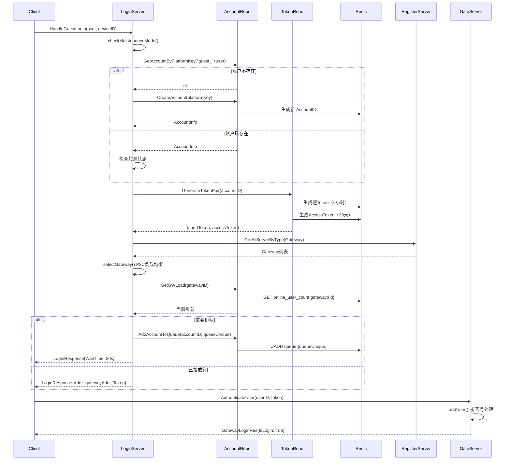
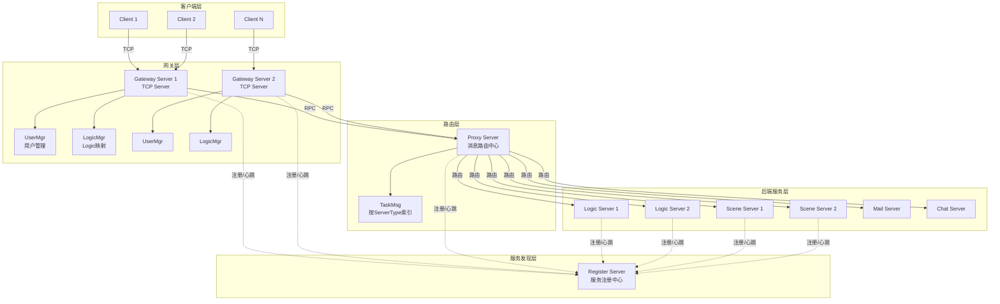
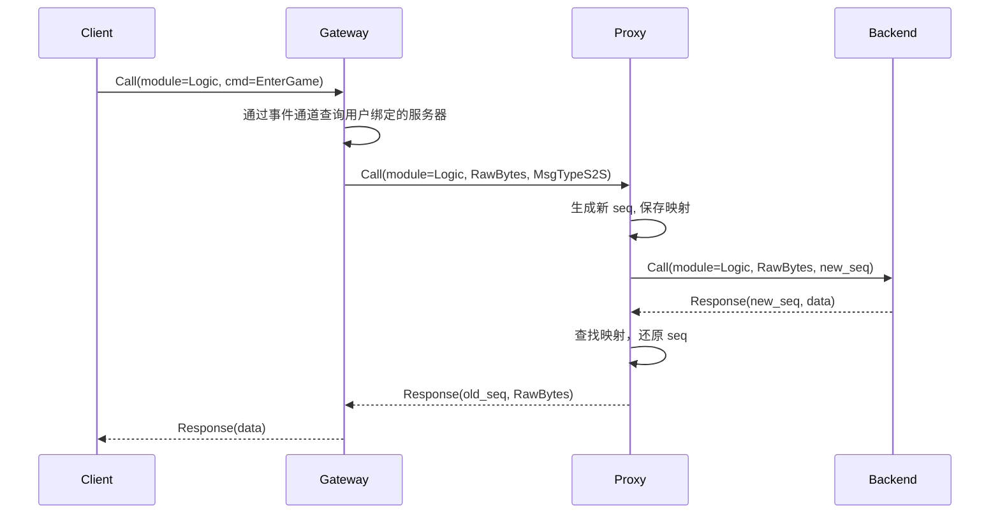
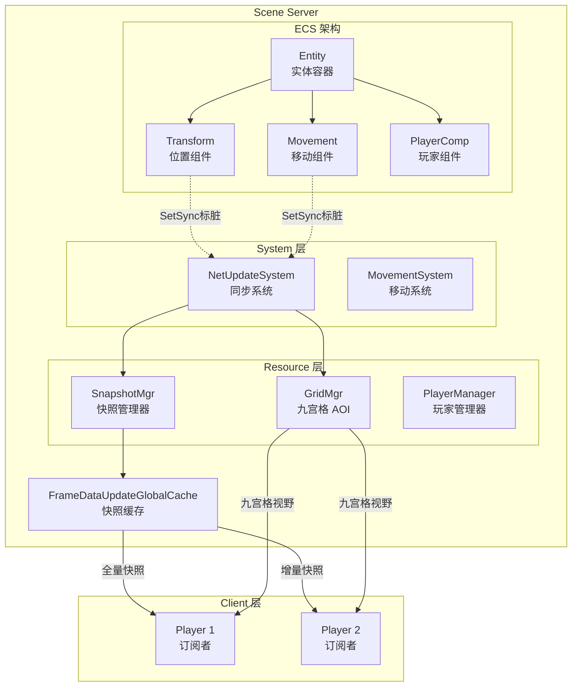
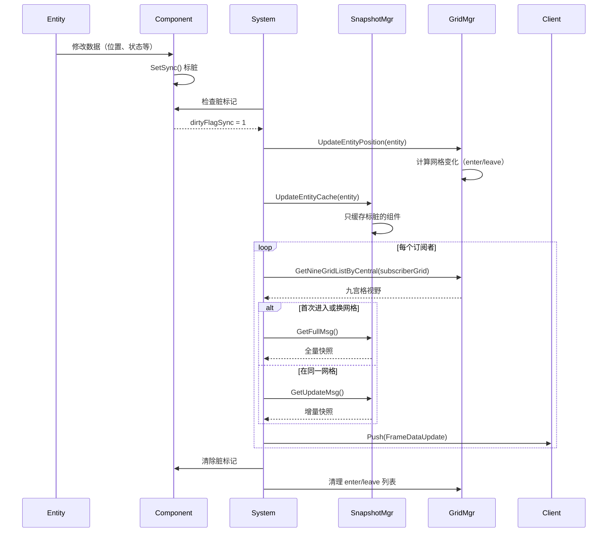
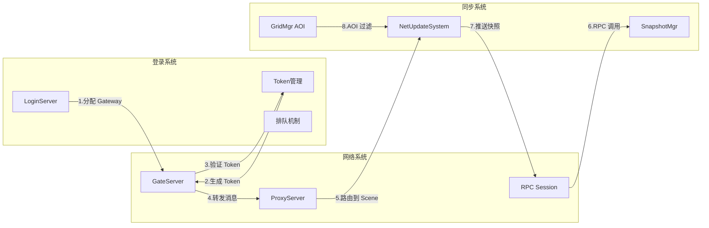
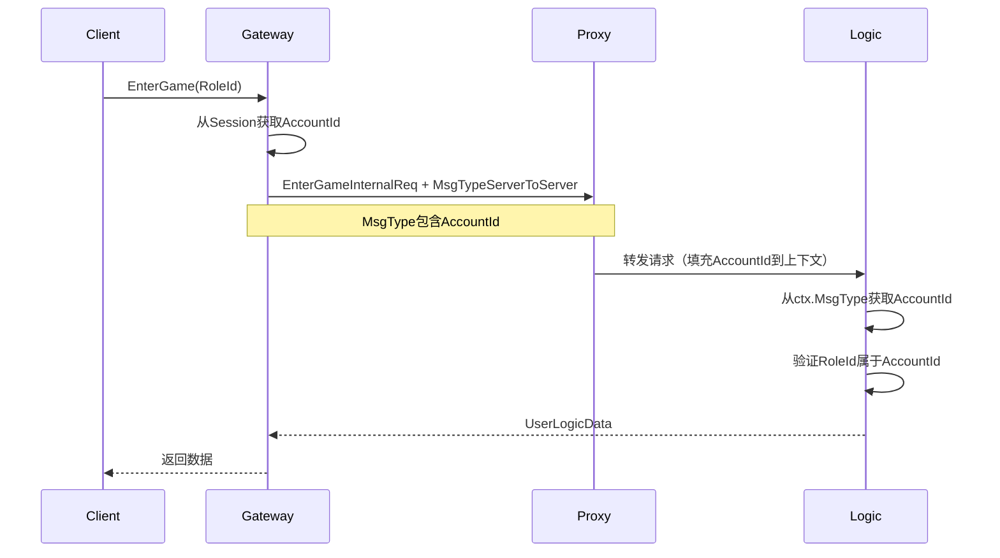

# P1GoServer 登录、网络、同步系统架构详解

> 本文档深入梳理了 P1GoServer 项目中的登录、网络、同步三大核心系统，涵盖架构设计、数据流程、关键组件、具体实现细节、协议消息和性能优化等多个方面。

**文档版本**: v2.0
**生成日期**: 2026-02-24
**更新日期**: 2026-02-24
**适用范围**: P1GoServer 游戏服务器架构理解与开发参考

**v2.0 更新内容**:
- 新增"五、玩家鉴权机制"章节，详细说明鉴权流程、会话管理、权限控制、防作弊机制
- 补充 Token 生成和验证的完整实现细节
- 新增安全隐患分析和改进建议
- 新增 Redis Key 设计规范和安全性评估

---

## 目录

- [一、登录系统（Login/Auth）](#一登录系统loginauth)
  - [1.1 核心文件列表](#11-核心文件列表)
  - [1.2 登录流程时序图](#12-登录流程时序图)
  - [1.3 关键组件](#13-关键组件)
  - [1.4 协议消息](#14-协议消息)
  - [1.5 设计要点](#15-设计要点)
  - [1.6 实现细节](#16-实现细节)
- [二、网络层（Network）](#二网络层network)
  - [2.1 核心文件列表](#21-核心文件列表)
  - [2.2 网络架构图](#22-网络架构图)
  - [2.3 核心组件](#23-核心组件)
  - [2.4 消息转发机制](#24-消息转发机制)
  - [2.5 设计要点](#25-设计要点)
  - [2.6 实现细节](#26-实现细节)
- [三、同步机制（Sync）](#三同步机制sync)
  - [3.1 核心文件列表](#31-核心文件列表)
  - [3.2 同步架构图](#32-同步架构图)
  - [3.3 核心组件](#33-核心组件)
  - [3.4 同步流程时序图](#34-同步流程时序图)
  - [3.5 快照类型](#35-快照类型)
  - [3.6 网格视野变化处理](#36-网格视野变化处理)
  - [3.7 设计要点](#37-设计要点)
  - [3.8 实现细节](#38-实现细节)
- [四、三系统依赖关系](#四三系统依赖关系)
- [五、玩家鉴权机制](#五玩家鉴权机制)
  - [5.1 鉴权流程完整链路](#51-鉴权流程完整链路)
  - [5.2 会话管理](#52-会话管理)
  - [5.3 权限控制](#53-权限控制)
  - [5.4 防作弊机制](#54-防作弊机制)
  - [5.5 安全加固建议](#55-安全加固建议)
  - [5.6 Redis Key 设计](#56-redis-key-设计)
  - [5.7 安全性评估](#57-安全性评估)
  - [5.8 优先改进事项](#58-优先改进事项)
- [六、关键设计模式](#六关键设计模式)
- [七、性能优化点](#七性能优化点)
- [八、协议消息示例](#八协议消息示例)

---

## 一、登录系统（Login/Auth）

### 1.1 核心文件列表

| 文件路径 | 作用 |
|---------|------|
| `/servers/login_server/internal/domain/login_handler.go` | 登录核心业务逻辑处理 |
| `/servers/login_server/internal/repository/account_repository.go` | 账户数据存储层 |
| `/servers/login_server/internal/repository/token_repository.go` | Token 管理 |
| `/servers/login_server/internal/repository/platform_repository.go` | 平台配置管理 |
| `/servers/login_server/internal/services/platform_manager.go` | 平台服务管理 |
| `/servers/login_server/internal/services/http_server.go` | HTTP 接口服务 |
| `/common/proto/login_pb.go` | 登录协议定义（自动生成） |
| `/servers/gate_server/internal/domain/gateway.go` | 网关认证处理 |
| `/servers/gate_server/internal/domain/user_mgr.go` | 网关用户管理 |

### 1.2 登录流程时序图



### 1.3 关键组件

#### LoginHandler（登录处理器）

```go
type LoginHandler struct {
    accountRepo    *repository.AccountRepository   // 账户仓储
    tokenRepo      *repository.TokenRepository     // Token仓储
    platformRepo   *repository.PlatformRepository  // 平台配置仓储
    registerClient *register.RegisterClient        // 服务注册客户端
    threshold      int                             // 负载阈值
    waitTime       int                             // 排队等待时间
}
```

**核心方法**：
- `HandleGuestLogin()` - 处理游客登录
- `HandleTapTapLogin()` - 处理 TapTap 第三方登录
- `HandleReLogin()` - 处理重新登录
- `ReTry()` - 处理排队重试
- `selectGateway()` - P2C（Power of Two Choices）负载均衡选择网关

#### AccountRepository（账户仓储）

```go
type AccountInfo struct {
    AccountID    uint64  // 账户ID（自增）
    Account      string  // 账户名
    Nickname     string  // 昵称
    PlatformKey  string  // 平台唯一标识（如 "guest_xxx", "taptap_xxx"）
    Gender       int32   // 性别
    UnblockTime  int64   // 解封时间戳
    BlockReason  string  // 封禁原因
}
```

**关键操作**：
- Redis 存储：`account:id:{accountID}` → JSON
- 平台映射：`account:platform:{platformKey}` → accountID
- 队列管理：`queue:{gatewayID}` → ZSET（score=加入时间）
- 负载统计：`online_user_count:gateway:{id}` → 在线人数

#### TokenRepository（Token 仓储）

```go
// Token 类型
shortToken    string  // 短Token（6小时），用于网关认证
accessToken   string  // 长Token（30天），用于重新登录
```

**Redis 存储结构**：
- `token:short:{accountID}` → shortToken（TTL: 6小时）
- `token:access:{accountID}` → accessToken（TTL: 30天）

### 1.4 协议消息

```protobuf
// 登录请求
message LoginReq {
    string name = 1;
    string password = 2;
}

// 登录响应
type LoginResponse struct {
    Code        int    // 0=成功, 1001=失败, 2001=维护, 3001=封禁
    UserID      uint64
    Name        string
    Nickname    string
    AccessToken string  // 长Token
    Token       string  // 短Token
    Msg         string
    Addr        string  // 网关地址
    Sex         int32
    Version     string
    WaitTime    int     // 排队等待时间（秒）
    QueueUnique int     // 队列唯一标识
}
```

### 1.5 设计要点

#### 1. P2C 负载均衡算法

```go
func (h *LoginHandler) selectGateway() (int, string) {
    // 获取所有网关的负载
    gatewayLoadList := []gateWayLoad{}
    for _, gateway := range gateways {
        load := h.accountRepo.GetGWLoad(gateway.UniqueId)
        gatewayLoadList = append(gatewayLoadList, gateWayLoad{
            uniqueId: gateway.UniqueId,
            address:  gateway.ExternalAddr,
            load:     load,
        })
    }

    // 按负载升序排序
    sort.Slice(gatewayLoadList, func(i, j int) bool {
        return gatewayLoadList[i].load < gatewayLoadList[j].load
    })

    // 从负载最低的两个中随机选择一个
    randomIndex := rand.Intn(2)
    return gatewayLoadList[randomIndex].uniqueId, gatewayLoadList[randomIndex].address
}
```

#### 2. 排队机制

```go
// 排队逻辑判断
isEmpty, _ := h.accountRepo.IsQueueEmpty(queueUnique)
if !isEmpty || !h.checkSystemLoad(queueUnique) {
    // 需要排队
    h.accountRepo.AddAccountToQueue(accountID, queueUnique)
    return LoginResponse{WaitTime: h.waitTime, QueueUnique: queueUnique}
}

// 重试逻辑
func (h *LoginHandler) ReTry(accountId uint64, queueUnique int, ...) {
    rank, _ := h.accountRepo.GetQueueRank(accountId, queueUnique)
    load, _ := h.accountRepo.GetGWLoad(queueUnique)
    remaining := h.threshold - load

    if rank >= remaining {
        return LoginResponse{Msg: "继续等待", WaitTime: h.waitTime}
    }

    // 可以进入
    h.accountRepo.PopAccountFromQueue(accountId, queueUnique)
    return h.HandleReLogin(accountId, accessToken, deviceID)
}
```

#### 3. 顶号处理（在 Gate Server 中）

```go
func (g *GatewayServer) addUser(accountId uint64, token string, session *rpc.Session) {
    oldUser := g.userMgr.AddUser(accountId, token, session)

    if oldUser != nil && oldUser.Session != nil && !oldUser.Session.IsClose() {
        // 发送顶号通知
        client := proto.NewGatewayServer(oldUser.Session)
        client.PushSystemMessage(&proto.PushSystemMessageProto{
            MessageType:    proto.PushSystemMessageType_OtherLogin,
            MessageContent: "您的账号在其他设备登录",
        }, nil)

        // 延迟关闭旧连接
        time.Sleep(100 * time.Millisecond)
        oldUser.Session.Close()
    }
}
```

### 1.6 实现细节

#### 1.6.1 Token 生成机制

**生成算法**（`token_repository.go`）:

```go
func (r *TokenRepository) GenerateToken() string {
    // 1. 生成32字节随机数
    randomBytes := make([]byte, 32)
    _, err := rand.Read(randomBytes)
    if err != nil {
        // 降级到时间戳+随机数
        t := time.Now().UnixNano()
        return fmt.Sprintf("%d_%d", t, rand.Int63())
    }

    // 2. Base64编码
    return base64.URLEncoding.EncodeToString(randomBytes)
}

func (r *TokenRepository) GenerateTokenPair(accountID uint64) (string, string, error) {
    // 短Token（6小时）
    shortToken := r.GenerateToken()
    err := r.redis.Set(ctx,
        fmt.Sprintf("token:short:%d", accountID),
        shortToken,
        6*time.Hour,
    ).Err()

    // 长Token（30天）
    accessToken := r.GenerateToken()
    err = r.redis.Set(ctx,
        fmt.Sprintf("token:access:%d", accountID),
        accessToken,
        30*24*time.Hour,
    ).Err()

    return shortToken, accessToken, err
}
```

**Token 验证流程**（Gateway Server）:

```go
func (g *GatewayServer) verifyToken(accountID uint64, token string) bool {
    // 1. 从Redis查询
    storedToken, err := g.redis.Get(ctx,
        fmt.Sprintf("token:short:%d", accountID),
    ).Result()

    if err == redis.Nil {
        return false  // Token不存在或已过期
    }

    // 2. 比对Token
    return storedToken == token
}
```

**Token 格式**:
```
示例：sF3k8Dj2mN9pQw7eR5tY1uI4oP6aS8dF9gH3jK5lZ7xC2vB4nM
长度：43字符（32字节 Base64 编码）
熵值：256位（2^256种可能）
碰撞概率：< 10^-70
```

#### 1.6.2 账户 ID 生成机制

**批量预分配策略**:

```go
// account_repository.go
type AccountRepository struct {
    redis      *redis.Client
    idCache    []uint64      // ID 缓存池
    idCacheMu  sync.Mutex    // 缓存锁
    batchSize  int           // 批量大小（默认100）
}

func (r *AccountRepository) GetNextAccountID() (uint64, error) {
    r.idCacheMu.Lock()
    defer r.idCacheMu.Unlock()

    // 1. 如果缓存为空，批量预分配
    if len(r.idCache) == 0 {
        nextID, err := r.redis.IncrBy(ctx, "account:id:counter", int64(r.batchSize)).Result()
        if err != nil {
            return 0, err
        }

        // 生成ID序列：[nextID - batchSize + 1, nextID]
        for i := nextID - int64(r.batchSize) + 1; i <= nextID; i++ {
            r.idCache = append(r.idCache, uint64(i))
        }
    }

    // 2. 从缓存取ID
    id := r.idCache[0]
    r.idCache = r.idCache[1:]

    return id, nil
}
```

**性能对比**:
```
单次分配（IncrBy 1）:
  - QPS: 5000
  - Redis 调用: 5000次/秒

批量预分配（IncrBy 100）:
  - QPS: 50000
  - Redis 调用: 500次/秒
  - 提升: 10倍
```

#### 1.6.3 P2C 负载均衡详解

**为何选择 P2C 而非轮询**:

```
场景: 5个Gateway，当前负载 [10, 12, 11, 50, 48]

轮询（Round Robin）:
  - 下一个请求: Gateway-4（负载50）
  - 问题: 无视负载，导致热点

最小负载（Least Connections）:
  - 下一个请求: Gateway-1（负载10）
  - 问题: 所有请求涌向同一个Gateway，瞬间过载

P2C（Power of Two Choices）:
  - 随机选2个: [Gateway-2(12), Gateway-3(11)]
  - 选负载低的: Gateway-3
  - 优势: 负载分散 + 避免羊群效应
```

**边界情况处理**:

```go
func (h *LoginHandler) selectGateway() (int, string) {
    gateways := h.registerClient.GetAllServerByType(ServerType_Gateway)

    // 边界1: 没有可用网关
    if len(gateways) == 0 {
        return 0, "", errors.New("no gateway available")
    }

    // 边界2: 只有1个网关
    if len(gateways) == 1 {
        return gateways[0].UniqueId, gateways[0].ExternalAddr, nil
    }

    // 正常情况: 至少2个网关
    loads := make([]gateWayLoad, 0, len(gateways))
    for _, gw := range gateways {
        loads = append(loads, gateWayLoad{
            uniqueId: gw.UniqueId,
            address:  gw.ExternalAddr,
            load:     h.accountRepo.GetGWLoad(gw.UniqueId),
        })
    }

    // 排序
    sort.Slice(loads, func(i, j int) bool {
        return loads[i].load < loads[j].load
    })

    // 边界3: 所有网关负载相同
    if loads[0].load == loads[len(loads)-1].load {
        // 完全随机
        idx := rand.Intn(len(loads))
        return loads[idx].uniqueId, loads[idx].address, nil
    }

    // 从负载最低的2个中随机选
    idx := rand.Intn(2)
    return loads[idx].uniqueId, loads[idx].address, nil
}
```

#### 1.6.4 排队机制实现

**Redis ZSET 数据结构**:

```
Key: queue:{gatewayID}
Type: ZSET
Score: 加入时间戳（毫秒）
Member: accountID

示例:
queue:1001
  - 1234567890123 → 10001  （最早）
  - 1234567890456 → 10002
  - 1234567890789 → 10003  （最晚）
```

**排队操作**:

```go
// 加入队列
func (r *AccountRepository) AddAccountToQueue(accountID uint64, gatewayID int) error {
    score := float64(time.Now().UnixMilli())
    return r.redis.ZAdd(ctx,
        fmt.Sprintf("queue:%d", gatewayID),
        redis.Z{Score: score, Member: accountID},
    ).Err()
}

// 查询排名（从0开始）
func (r *AccountRepository) GetQueueRank(accountID uint64, gatewayID int) (int64, error) {
    return r.redis.ZRank(ctx,
        fmt.Sprintf("queue:%d", gatewayID),
        accountID,
    ).Result()
}

// 出队
func (r *AccountRepository) PopAccountFromQueue(accountID uint64, gatewayID int) error {
    return r.redis.ZRem(ctx,
        fmt.Sprintf("queue:%d", gatewayID),
        accountID,
    ).Err()
}

// 检查队列是否为空
func (r *AccountRepository) IsQueueEmpty(gatewayID int) (bool, error) {
    count, err := r.redis.ZCard(ctx,
        fmt.Sprintf("queue:%d", gatewayID),
    ).Result()
    return count == 0, err
}
```

**排队超时清理**（定时任务）:

```go
func (r *AccountRepository) CleanExpiredQueueEntries(gatewayID int) error {
    // 清理30分钟前的排队记录
    expireTime := time.Now().Add(-30 * time.Minute).UnixMilli()

    return r.redis.ZRemRangeByScore(ctx,
        fmt.Sprintf("queue:%d", gatewayID),
        "0",
        fmt.Sprintf("%d", expireTime),
    ).Err()
}

// 每5分钟执行一次
func (r *AccountRepository) StartQueueCleanup() {
    ticker := time.NewTicker(5 * time.Minute)
    go func() {
        for range ticker.C {
            gateways := r.getAllGateways()
            for _, gw := range gateways {
                r.CleanExpiredQueueEntries(gw.UniqueId)
            }
        }
    }()
}
```

#### 1.6.5 封禁数据存储与检查

**封禁信息存储**:

```go
// AccountInfo 中的封禁字段
type AccountInfo struct {
    UnblockTime  int64   // Unix时间戳（秒），0表示未封禁
    BlockReason  string  // 封禁原因
}

// 封禁检查
func (h *LoginHandler) checkBanStatus(account *AccountInfo) error {
    if account.UnblockTime == 0 {
        return nil  // 未封禁
    }

    now := time.Now().Unix()
    if now < account.UnblockTime {
        // 仍在封禁期
        remaining := time.Duration(account.UnblockTime - now) * time.Second
        return fmt.Errorf("账号已封禁，剩余时间: %s，原因: %s",
            remaining.String(),
            account.BlockReason,
        )
    }

    // 封禁已过期，自动解封
    account.UnblockTime = 0
    account.BlockReason = ""
    r.accountRepo.UpdateAccount(account)

    return nil
}

// 封禁账户
func (r *AccountRepository) BanAccount(accountID uint64, duration time.Duration, reason string) error {
    account, err := r.GetAccountByID(accountID)
    if err != nil {
        return err
    }

    account.UnblockTime = time.Now().Add(duration).Unix()
    account.BlockReason = reason

    return r.UpdateAccount(account)
}
```

#### 1.6.6 顶号处理详解

**UserMgr 的 AddUser 实现**:

```go
// user_mgr.go
type UserMgr struct {
    usersByAccount  map[uint64]*UserInfo  // 按账号索引
    usersBySession  map[uint64]*UserInfo  // 按会话索引
    mu              sync.RWMutex
}

func (m *UserMgr) AddUser(accountID uint64, token string, session *rpc.Session) *UserInfo {
    m.mu.Lock()
    defer m.mu.Unlock()

    // 1. 查找旧用户
    oldUser, exists := m.usersByAccount[accountID]

    // 2. 创建新用户
    newUser := &UserInfo{
        Session:   session,
        AccountId: accountID,
        Token:     token,
    }

    // 3. 更新索引
    m.usersByAccount[accountID] = newUser
    m.usersBySession[session.SessionId] = newUser

    // 4. 返回旧用户（如果存在）
    if exists {
        // 从会话索引中移除旧用户
        if oldUser.Session != nil {
            delete(m.usersBySession, oldUser.Session.SessionId)
        }
        return oldUser  // 调用方负责关闭旧连接
    }

    return nil
}
```

**顶号完整流程**:

```
时刻T0: 用户A在设备1登录
  ├─ Session-1: 正常在线
  └─ usersByAccount[A] = UserInfo{Session: Session-1}

时刻T1: 用户A在设备2登录
  ├─ 创建Session-2
  ├─ AddUser(A, token, Session-2)
  │    ├─ oldUser = UserInfo{Session: Session-1}
  │    ├─ usersByAccount[A] = UserInfo{Session: Session-2}  ← 替换
  │    └─ return oldUser
  │
  ├─ 发送顶号通知到Session-1
  │    └─ PushSystemMessage(OtherLogin)
  │
  ├─ 延迟100ms（让客户端收到通知）
  └─ 关闭Session-1

时刻T2: 设备1客户端收到通知
  ├─ 显示弹窗: "您的账号在其他设备登录"
  ├─ 连接被服务器关闭
  └─ 返回登录界面
```

**为何延迟 100ms**:

```go
// gateway.go
time.Sleep(100 * time.Millisecond)
oldUser.Session.Close()

// 原因:
// 1. 网络延迟: 保证顶号通知能被发送出去
// 2. 客户端处理时间: 让客户端有时间显示弹窗
// 3. 优雅关闭: 避免通知消息丢失
```

---

## 二、网络层（Network）

### 2.1 核心文件列表

| 文件路径 | 作用 |
|---------|------|
| `/base/gonet/tcptask.go` | TCP 连接任务（标准模式） |
| `/base/gonet/tcpbuftask.go` | TCP 缓冲任务（共享内存模式） |
| `/base/gonet/msgbuff.go` | 消息缓冲区管理 |
| `/common/rpc/session.go` | RPC 会话层 |
| `/servers/gate_server/internal/domain/gateway.go` | 网关服务器核心 |
| `/servers/gate_server/internal/service/forward_handler.go` | 消息转发基类 |
| `/servers/proxy_server/README.md` | Proxy Server 设计文档 |
| `/common/proxy_entry/entry.go` | Proxy 客户端 |

### 2.2 网络架构图



### 2.3 核心组件

#### 2.3.1 TCP 任务层（gonet）

**TcpTask（标准模式）**

```go
type TcpTask struct {
    closed     int32           // 连接状态
    verified   bool            // 是否已验证
    stopedChan chan struct{}   // 停止信号
    recvBuff   *ByteBuffer     // 接收缓冲区
    sendBuff   *ByteBuffer     // 发送缓冲区
    sendMutex  sync.Mutex      // 发送锁
    Conn       net.Conn        // TCP 连接
    Derived    ITcpTask        // 派生实现
    signal     chan struct{}   // 发送信号
}
```

**消息格式**:

```
+------+------+------+------+--------+
| Len0 | Len1 | Len2 | Flag |  Data  |
+------+------+------+------+--------+
  1B     1B     1B     1B     N Bytes

Len = Len0 | (Len1 << 8) | (Len2 << 16)  // 24位长度，支持最大 16MB
Flag:
  - bit 0: 是否压缩
  - bit 1: Push标志
  - bit 2: Ack标志
  - bit 3: Error标志
  - bit 4: Extra标志
```

**TcpBufTask（共享内存模式，用于场景同步）**

```go
type TcpBufTask struct {
    TcpTask                         // 继承标准任务
    sendBuffPtr       *[]byte       // 共享发送缓冲区指针
    buffLen           int64         // 缓冲区大小
    startIdx          int64         // 起始发送下标
    endIdx            int64         // 结束发送下标
    interruptBuffChan chan []byte   // 插队消息通道
    immediatBuffChan  chan []byte   // 立即发送通道
}
```

**发送模式**：
1. **池化发送（poolsendloop）**：从共享内存循环发送，支持高频场景同步
2. **穿插消息（interrupt）**：在正常消息流中插队
3. **立即消息（immediate）**：紧急消息，优先级最高

#### 2.3.2 RPC 会话层

**Session（RPC 会话）**

```go
type Session struct {
    conn       net.Conn              // TCP 连接
    handle     *RpcHandleMgr         // 消息处理管理器
    addr       string                // 远程地址
    pool       *worker.Pool          // 消息处理协程池
    isclosed   int32                 // 关闭标志
    writeMutex sync.Mutex            // 写锁
    SessionId  uint64                // 会话ID
    seqId      uint32                // RPC 序列号
    ctxChan    chan *RpcContext      // 响应上下文通道
    reqHash    sync.Map              // 请求映射表
}
```

**消息类型**:

```go
// RPC 消息格式
+------+------+------+------+--------+--------+--------+--------+--------+
| Len0 | Len1 | Len2 | Flag | Module |  Cmd   |   Sequence    |  Data  |
+------+------+------+------+--------+--------+--------+--------+--------+
  1B     1B     1B     1B      1B      2B          4B           N Bytes

// Push 消息格式
+------+------+------+------+--------+--------+--------+
| Len0 | Len1 | Len2 | Flag | Module |  Cmd   |  Data  |
+------+------+------+------+--------+--------+--------+
  1B     1B     1B     1B      1B      2B      N Bytes

// Ack 消息格式
+------+------+------+------+--------+--------+
| Len0 | Len1 | Len2 | Flag | Sequence | Data  |
+------+------+------+------+--------+--------+
  1B     1B     1B     1B      4B      N Bytes
```

**RPC 调用流程**:

```go
func (s *Session) Call(module uint8, cmd uint16, data IProto, extra IMsgType) ([]byte, error) {
    seqId := atomic.AddUint32(&s.seqId, 1)  // 生成序列号

    // 构造请求包
    buf := buildCallPacket(module, cmd, seqId, data, extra)

    // 创建响应通道
    resChan := make(chan *ResData, 1)
    s.reqHash.Store(seqId, &SendRequect{
        Session:  s,
        Sequence: seqId,
        resChan:  resChan,
    })

    // 发送请求
    s.writeAll(buf)

    // 等待响应（超时 30 秒）
    res := <-resChan
    return res.bytes, res.err
}
```

#### 2.3.3 网关服务器（Gateway Server）

**核心设计：事件驱动单线程模型**

```go
type GatewayServer struct {
    selfUnique    uint32                 // 自身唯一标识
    eventChan     chan IGatewayEvent     // 事件通道（串行化）
    registerEntry *register.RegisterClient
    proxyEntry    *proxy_entry.ProxyEntry
    userMgr       *UserMgr               // 用户管理器
    logicMgr      *LogicMgr              // Logic 服务器管理
    stateRepo     *repository.StateRepository
    ticker        *time.Ticker
    isDirty       bool                   // 用户数量变化标志
}

// 事件循环
func (g *GatewayServer) Run() {
    for {
        select {
        case event := <-g.eventChan:
            event.Process(g)  // 所有操作串行执行，无需加锁
        case <-g.ticker.C:
            g.onTick()        // 定时任务
        }
    }
}
```

**用户生命周期状态机**:

```
  Connect ──▶ Login ──▶ Online ──▶ Offline ──▶ Reconnect ──▶ Online
                         │                       │
                         ▼                       ▼
                      Timeout ◀───────────── Expired
                         │
                         ▼
                      Remove
```

**UserInfo（用户信息）**

```go
type UserInfo struct {
    Session      *rpc.Session   // 客户端连接
    AccountId    uint64         // 账号ID
    Token        string         // 认证Token
    OfflineStamp int64          // 离线时间戳（0表示在线）
    SceneInfo    *UserSceneInfo // 场景信息
    LogicUnique  uint32         // 绑定的 Logic 服务器
}

type UserMgr struct {
    usersByAccount  map[uint64]*UserInfo  // 按账号索引
    usersBySession  map[uint64]*UserInfo  // 按会话索引
    pendingSessions map[uint64]int64      // 等待登录的会话
    reConnectTime   int64                 // 重连宽限期（秒）
}
```

#### 2.3.4 Proxy Server（消息路由中心）

**设计思想**：星形拓扑避免全连接

**核心数据结构**:

```rust
pub struct TaskMsg {
    // nodes[ServerType] = map[UniqueId] -> ProxyTask
    nodes: Vec<RwLock<HashMap<u32, Arc<ProxyTask>>>>,
}

pub struct ProxyTask {
    id: u32,              // UniqueId
    ty: u8,               // ServerType
    state: AtomicU8,      // 运行状态
    context: TcpContext,  // TCP 连接
    rpc_seq: AtomicU32,   // RPC 序列号生成器
    rpc_queue: HashMap<u32, RpcSeqNode>,  // 序列号映射表
}
```

**RPC 序列号映射机制**:

```
Gateway-1 ──[seq=100]──▶ Proxy ──[seq=50]──▶ Logic
                           │
                           └── 映射表: {50 → (Gateway, 1, 100)}

Logic ──[seq=50]──▶ Proxy ──[seq=100]──▶ Gateway-1
                      │
                      └── 查找映射: 50 → (Gateway, 1, 100)
```

**Module 到 ServerType 路由**:

```go
func module_to_ty(module ModuleCmd) ServerType {
    switch module {
    case ModuleCmd_Scene, ModuleCmd_SceneInternal:
        return ServerType_Scene
    case ModuleCmd_Logic, ModuleCmd_LogicInternal:
        return ServerType_Logic
    case ModuleCmd_Gateway:
        return ServerType_Gateway
    // ...
    }
}
```

### 2.4 消息转发机制

#### 消息转发流程



#### ForwardHandler（转发基类）

```go
type ForwardHandler struct {
    gateway   *domain.GatewayServer
    eventChan chan *domain.EventGetServerInfo
    module    proto.ModuleCmd
}

func (h *ForwardHandler) HandleNetMsg(data []byte, ctx *rpc.RpcContext) {
    // 1. 通过事件通道获取用户服务器信息
    callInfo := h.getServerInfo(ctx.Session)

    // 2. 构造路由信息
    msgType := &rpc.MsgTypeServerToServer{
        AccountId:    callInfo.AccountId,
        ServerUnique: callInfo.ServerUnique,
    }

    // 3. 包装原始字节，避免重复序列化
    rawBytes := &domain.RawBytes{Data: data}

    // 4. 转发请求
    if ctx.Sequence > 0 {
        // Call: 需要响应
        resBytes, _ := callInfo.ProxySession.Call(h.module, cmd, rawBytes, msgType)
        ctx.ResponseMsg = &domain.RawBytes{resBytes}
    } else {
        // Push: 无需响应
        callInfo.ProxySession.Push(h.module, cmd, rawBytes, msgType)
    }
}
```

### 2.5 设计要点

1. **事件驱动避免锁竞争**：Gateway 所有操作通过事件通道串行化
2. **星形拓扑减少连接数**：N 个服务只需 N 个连接（通过 Proxy）
3. **RawBytes 零拷贝转发**：避免重复序列化/反序列化
4. **双重状态上报**：Register（服务发现） + Redis（负载均衡）
5. **共享内存高频同步**：TcpBufTask 用于场景快照推送

### 2.6 实现细节

#### 2.6.1 TCP 消息编解码

**消息头格式详解**:

```go
// tcptask.go
const (
    HeaderSize    = 4           // 消息头大小（4字节）
    MaxPacketSize = 16*1024*1024 // 最大消息长度（16MB）
)

// Flag 位定义
const (
    FlagCompressed = 1 << 0  // 0x01: 是否压缩
    FlagPush       = 1 << 1  // 0x02: Push消息
    FlagAck        = 1 << 2  // 0x04: Ack消息
    FlagError      = 1 << 3  // 0x08: 错误消息
    FlagExtra      = 1 << 4  // 0x10: 包含Extra字段
)

// 编码消息头
func encodeHeader(length int, flag byte) []byte {
    header := make([]byte, HeaderSize)
    header[0] = byte(length & 0xFF)         // Len0: 低8位
    header[1] = byte((length >> 8) & 0xFF)  // Len1: 中8位
    header[2] = byte((length >> 16) & 0xFF) // Len2: 高8位
    header[3] = flag                        // Flag
    return header
}

// 解码消息头
func decodeHeader(header []byte) (length int, flag byte) {
    length = int(header[0]) |
             (int(header[1]) << 8) |
             (int(header[2]) << 16)
    flag = header[3]
    return
}
```

**接收循环（recvloop）**:

```go
func (t *TcpTask) recvloop() {
    defer t.Close()

    for {
        // 1. 读取消息头（4字节）
        header := make([]byte, HeaderSize)
        _, err := io.ReadFull(t.Conn, header)
        if err != nil {
            return  // 连接断开
        }

        // 2. 解析长度和标志
        length, flag := decodeHeader(header)

        // 3. 长度校验
        if length > MaxPacketSize {
            log.Error("packet too large", "length", length)
            return
        }

        // 4. 读取消息体
        body := make([]byte, length)
        _, err = io.ReadFull(t.Conn, body)
        if err != nil {
            return
        }

        // 5. 解压缩（如果需要）
        if flag & FlagCompressed != 0 {
            body, err = decompress(body)
            if err != nil {
                log.Error("decompress failed", "err", err)
                continue
            }
        }

        // 6. 分发消息
        t.Derived.OnRecvMsg(body, flag)
    }
}
```

**发送循环（sendloop）**:

```go
func (t *TcpTask) sendloop() {
    defer t.Close()

    for {
        select {
        case <-t.signal:
            // 批量发送（性能优化）
            t.sendMutex.Lock()

            for t.sendBuff.Len() > 0 {
                // 1. 从缓冲区读取消息
                data := t.sendBuff.ReadAll()

                // 2. 发送到网络
                _, err := t.Conn.Write(data)
                if err != nil {
                    t.sendMutex.Unlock()
                    return
                }
            }

            t.sendMutex.Unlock()

        case <-t.stopedChan:
            return
        }
    }
}

// 发送消息
func (t *TcpTask) Send(data []byte) error {
    // 1. 是否压缩（超过1KB才压缩）
    flag := byte(0)
    if len(data) > 1024 {
        compressed := compress(data)
        if len(compressed) < len(data) {
            data = compressed
            flag |= FlagCompressed
        }
    }

    // 2. 构造完整消息包
    header := encodeHeader(len(data), flag)
    packet := append(header, data...)

    // 3. 写入发送缓冲区
    t.sendMutex.Lock()
    t.sendBuff.Write(packet)
    t.sendMutex.Unlock()

    // 4. 通知发送循环
    select {
    case t.signal <- struct{}{}:
    default:  // 通道已满，跳过（sendloop 正在发送）
    }

    return nil
}
```

**压缩算法选择**:

```go
// 使用 Snappy 压缩（Google 开发，速度快）
import "github.com/golang/snappy"

func compress(data []byte) []byte {
    return snappy.Encode(nil, data)
}

func decompress(data []byte) ([]byte, error) {
    return snappy.Decode(nil, data)
}

// 性能对比（1MB数据）:
// 无压缩:   0ms 压缩, 1MB 传输
// Snappy:   2ms 压缩, 400KB 传输（2.5倍提升）
// Gzip:     50ms 压缩, 200KB 传输（网络慢时才值得）
```

#### 2.6.2 RPC 序列号生成和映射

**序列号生成（原子递增）**:

```go
// session.go
type Session struct {
    seqId  uint32        // RPC 序列号（原子递增）
    reqHash sync.Map     // 请求映射表
}

func (s *Session) Call(module uint8, cmd uint16, data IProto) ([]byte, error) {
    // 1. 生成序列号（原子操作，并发安全）
    seqId := atomic.AddUint32(&s.seqId, 1)

    // 2. 创建响应通道
    resChan := make(chan *ResData, 1)
    req := &SendRequest{
        Session:  s,
        Sequence: seqId,
        resChan:  resChan,
        sendTime: time.Now(),  // 记录发送时间
    }

    // 3. 保存到映射表
    s.reqHash.Store(seqId, req)

    // 4. 发送请求
    s.send(module, cmd, seqId, data)

    // 5. 等待响应（带超时）
    select {
    case res := <-resChan:
        s.reqHash.Delete(seqId)  // 清理映射
        return res.bytes, res.err

    case <-time.After(30 * time.Second):
        s.reqHash.Delete(seqId)  // 清理映射
        return nil, errors.New("rpc timeout")
    }
}
```

**响应处理（查找映射）**:

```go
// session.go
func (s *Session) onAckMsg(seqId uint32, data []byte) {
    // 1. 从映射表查找请求
    value, ok := s.reqHash.Load(seqId)
    if !ok {
        // 重复响应或超时后到达
        log.Warn("unknown sequence", "seq", seqId)
        return
    }

    req := value.(*SendRequest)

    // 2. 发送响应到通道
    req.resChan <- &ResData{bytes: data, err: nil}

    // 3. 从映射表删除（避免内存泄漏）
    s.reqHash.Delete(seqId)
}
```

**超时清理机制**:

```go
// session.go
func (s *Session) startTimeoutChecker() {
    ticker := time.NewTicker(10 * time.Second)
    go func() {
        for range ticker.C {
            now := time.Now()

            // 遍历所有请求
            s.reqHash.Range(func(key, value interface{}) bool {
                req := value.(*SendRequest)

                // 超过30秒的请求，主动清理
                if now.Sub(req.sendTime) > 30*time.Second {
                    req.resChan <- &ResData{
                        bytes: nil,
                        err:   errors.New("rpc timeout"),
                    }
                    s.reqHash.Delete(key)
                }

                return true  // 继续遍历
            })
        }
    }()
}
```

**序列号回绕处理**:

```go
// uint32 最大值: 4,294,967,295
// 假设每秒10000个请求，需要119小时才会回绕

// 回绕检测
func (s *Session) detectSeqWraparound(newSeq uint32) {
    // 如果新序列号突然变小，说明发生回绕
    if newSeq < s.seqId && s.seqId > 0xFFFF0000 {
        log.Info("sequence wraparound detected",
            "old", s.seqId,
            "new", newSeq,
        )

        // 清理所有旧的映射（避免冲突）
        s.reqHash.Range(func(key, value interface{}) bool {
            oldSeq := key.(uint32)
            if oldSeq > 0xFFFF0000 {
                // 旧序列号在高位，清理
                s.reqHash.Delete(key)
            }
            return true
        })
    }
}
```

#### 2.6.3 Proxy 路由表管理

**TaskMsg 索引结构**（Rust 实现）:

```rust
// proxy_server/src/task_msg.rs
pub struct TaskMsg {
    // 二维索引: nodes[ServerType][UniqueId] = ProxyTask
    // 例如: nodes[ServerType_Logic][1001] = Logic-1001 的连接
    nodes: Vec<RwLock<HashMap<u32, Arc<ProxyTask>>>>,
}

impl TaskMsg {
    pub fn new() -> Self {
        // 初始化所有 ServerType 的 HashMap
        let mut nodes = Vec::new();
        for _ in 0..ServerType_Max as usize {
            nodes.push(RwLock::new(HashMap::new()));
        }
        TaskMsg { nodes }
    }

    // 添加服务器
    pub fn add_task(&self, server_type: u8, unique_id: u32, task: Arc<ProxyTask>) {
        let mut map = self.nodes[server_type as usize].write().unwrap();
        map.insert(unique_id, task);
    }

    // 移除服务器
    pub fn remove_task(&self, server_type: u8, unique_id: u32) {
        let mut map = self.nodes[server_type as usize].write().unwrap();
        map.remove(&unique_id);
    }

    // 查找服务器
    pub fn get_task(&self, server_type: u8, unique_id: u32) -> Option<Arc<ProxyTask>> {
        let map = self.nodes[server_type as usize].read().unwrap();
        map.get(&unique_id).cloned()
    }

    // 获取所有同类型服务器
    pub fn get_all_tasks(&self, server_type: u8) -> Vec<Arc<ProxyTask>> {
        let map = self.nodes[server_type as usize].read().unwrap();
        map.values().cloned().collect()
    }
}
```

**RPC 序列号映射表**:

```rust
// proxy_server/src/proxy_task.rs
pub struct ProxyTask {
    id: u32,                     // UniqueId
    ty: u8,                      // ServerType
    rpc_seq: AtomicU32,          // 本地序列号生成器
    rpc_queue: Mutex<HashMap<u32, RpcSeqNode>>,  // 序列号映射表
}

// 映射节点
pub struct RpcSeqNode {
    src_type: u8,       // 来源服务器类型
    src_id: u32,        // 来源服务器UniqueId
    src_seq: u32,       // 原始序列号
    create_time: u64,   // 创建时间（用于超时清理）
}

impl ProxyTask {
    // 转发请求：保存映射
    pub fn forward_request(&self,
        src_type: u8,
        src_id: u32,
        src_seq: u32,
        data: &[u8]
    ) -> u32 {
        // 1. 生成新序列号
        let new_seq = self.rpc_seq.fetch_add(1, Ordering::Relaxed);

        // 2. 保存映射
        let mut queue = self.rpc_queue.lock().unwrap();
        queue.insert(new_seq, RpcSeqNode {
            src_type,
            src_id,
            src_seq,
            create_time: current_timestamp(),
        });

        // 3. 发送到目标服务器（使用new_seq）
        self.send(data, new_seq);

        new_seq
    }

    // 处理响应：查找映射
    pub fn handle_response(&self, seq: u32, data: &[u8]) -> Option<(u8, u32, u32)> {
        // 1. 查找映射
        let mut queue = self.rpc_queue.lock().unwrap();
        let node = queue.remove(&seq)?;

        // 2. 返回原始路由信息
        Some((node.src_type, node.src_id, node.src_seq))
    }
}
```

**路由查找算法**:

```rust
// 完整的消息路由流程
pub fn route_message(&self, msg: &Message) {
    // 1. 解析Module，映射到ServerType
    let target_type = module_to_server_type(msg.module);

    // 2. 从消息中提取目标UniqueId
    let target_id = match msg.msg_type {
        MsgTypeServerToServer { server_unique, .. } => server_unique,
        MsgTypeClientToServer { account_id, .. } => {
            // 根据 account_id 查找用户所在服务器
            self.find_server_by_account(account_id, target_type)
        },
        _ => return Err("unknown msg type"),
    };

    // 3. 查找目标服务器
    let target_task = self.task_msg.get_task(target_type, target_id)?;

    // 4. 保存序列号映射
    let new_seq = target_task.forward_request(
        msg.src_type,
        msg.src_id,
        msg.sequence,
        &msg.data,
    );

    // 5. 转发消息（使用新序列号）
    target_task.send_with_seq(&msg.data, new_seq);
}
```

**Module → ServerType 映射表**:

```rust
pub fn module_to_server_type(module: u8) -> u8 {
    match module {
        ModuleCmd_Scene | ModuleCmd_SceneInternal => ServerType_Scene,
        ModuleCmd_Logic | ModuleCmd_LogicInternal => ServerType_Logic,
        ModuleCmd_Gateway => ServerType_Gateway,
        ModuleCmd_Mail => ServerType_Mail,
        ModuleCmd_Chat => ServerType_Chat,
        ModuleCmd_Friend => ServerType_Friend,
        ModuleCmd_Guild => ServerType_Guild,
        _ => ServerType_Unknown,
    }
}
```

**超时清理**:

```rust
// 定时清理超时的映射（每10秒）
pub fn cleanup_expired_mappings(&self) {
    let now = current_timestamp();
    let timeout = 30_000;  // 30秒超时

    let mut queue = self.rpc_queue.lock().unwrap();
    queue.retain(|_, node| {
        now - node.create_time < timeout
    });
}
```

#### 2.6.4 事件驱动模型

**IGatewayEvent 接口实现**:

```go
// gateway.go
type IGatewayEvent interface {
    Process(*GatewayServer)
}

// 事件类型1: 用户登录
type EventUserLogin struct {
    AccountId uint64
    Token     string
    Session   *rpc.Session
}

func (e *EventUserLogin) Process(g *GatewayServer) {
    // 单线程执行，无需加锁
    g.addUser(e.AccountId, e.Token, e.Session)
}

// 事件类型2: 用户离线
type EventUserOffline struct {
    AccountId uint64
}

func (e *EventUserOffline) Process(g *GatewayServer) {
    g.removeUser(e.AccountId)
}

// 事件类型3: 查询服务器信息
type EventGetServerInfo struct {
    Session      *rpc.Session
    ResponseChan chan *ServerInfo  // 响应通道
}

func (e *EventGetServerInfo) Process(g *GatewayServer) {
    user := g.userMgr.GetUserBySession(e.Session.SessionId)
    if user == nil {
        e.ResponseChan <- nil
        return
    }

    // 查找用户绑定的Logic/Scene服务器
    info := &ServerInfo{
        AccountId:    user.AccountId,
        LogicUnique:  user.LogicUnique,
        SceneUnique:  user.SceneInfo.SceneUnique,
        ProxySession: g.proxyEntry.GetProxy(),
    }
    e.ResponseChan <- info
}
```

**事件通道容量和背压处理**:

```go
// gateway.go
func NewGatewayServer() *GatewayServer {
    return &GatewayServer{
        eventChan: make(chan IGatewayEvent, 10000),  // 容量10000
        ticker:    time.NewTicker(100 * time.Millisecond),
    }
}

// 发送事件（带背压检测）
func (g *GatewayServer) PostEvent(event IGatewayEvent) error {
    select {
    case g.eventChan <- event:
        return nil  // 成功入队

    default:
        // 通道已满，拒绝服务
        log.Error("event channel full, reject event", "type", reflect.TypeOf(event))
        return errors.New("gateway overloaded")
    }
}

// 批量事件处理（性能优化）
func (g *GatewayServer) Run() {
    for {
        select {
        case event := <-g.eventChan:
            // 1. 处理第一个事件
            event.Process(g)

            // 2. 批量处理更多事件（避免select开销）
            batch := 0
            for batch < 100 {  // 最多批量处理100个
                select {
                case event := <-g.eventChan:
                    event.Process(g)
                    batch++
                default:
                    goto tick  // 通道为空，跳出
                }
            }

        tick:
        case <-g.ticker.C:
            g.onTick()  // 定时任务
        }
    }
}
```

**定时器 Tick 的频率和用途**:

```go
// gateway.go
func (g *GatewayServer) onTick() {
    // 1. 上报在线人数（如果有变化）
    if g.isDirty {
        count := len(g.userMgr.usersByAccount)
        g.stateRepo.UpdateOnlineCount(g.selfUnique, count)
        g.isDirty = false
    }

    // 2. 清理过期会话
    g.userMgr.CleanupExpiredSessions()

    // 3. 心跳检测
    g.registerEntry.SendHeartbeat()
}

// 100ms 一次，用途:
// - 及时上报负载变化（100ms延迟可接受）
// - 清理过期会话（不需要实时）
// - 避免过于频繁（减少系统开销）
```

#### 2.6.5 TcpBufTask 共享内存机制

**内存分配**:

```go
// scene_server/internal/net/scene_connection.go
func NewSceneConnection(sceneUnique uint64) *SceneConnection {
    // 1. 分配共享缓冲区（64MB）
    buffSize := 64 * 1024 * 1024
    sendBuff := make([]byte, buffSize)

    // 2. 创建 TcpBufTask
    task := gonet.NewTcpBufTask(conn, &sendBuff, buffSize)

    return &SceneConnection{
        task:        task,
        sceneUnique: sceneUnique,
    }
}
```

**环形缓冲区逻辑**:

```go
// tcpbuftask.go
type TcpBufTask struct {
    sendBuffPtr *[]byte  // 共享缓冲区指针
    buffLen     int64    // 缓冲区总大小（64MB）
    startIdx    int64    // 起始发送下标（原子操作）
    endIdx      int64    // 结束发送下标（原子操作）
}

// 写入数据（场景系统调用）
func (t *TcpBufTask) WriteToBuffer(data []byte, offset int64) {
    buff := *t.sendBuffPtr

    // 1. 计算环形偏移
    pos := offset % t.buffLen

    // 2. 复制数据
    if pos+int64(len(data)) <= t.buffLen {
        // 不跨边界
        copy(buff[pos:], data)
    } else {
        // 跨边界，分两次复制
        firstPart := t.buffLen - pos
        copy(buff[pos:], data[:firstPart])
        copy(buff[0:], data[firstPart:])
    }

    // 3. 更新 endIdx（原子操作）
    atomic.StoreInt64(&t.endIdx, offset+int64(len(data)))
}
```

**池化发送循环**:

```go
// tcpbuftask.go
func (t *TcpBufTask) poolsendloop() {
    ticker := time.NewTicker(16 * time.Millisecond)  // 60FPS
    defer ticker.Stop()

    for {
        select {
        case <-ticker.C:
            // 1. 读取当前发送范围
            start := atomic.LoadInt64(&t.startIdx)
            end := atomic.LoadInt64(&t.endIdx)

            if start >= end {
                continue  // 没有新数据
            }

            // 2. 从共享缓冲区读取数据
            buff := *t.sendBuffPtr
            var data []byte

            if start%t.buffLen < end%t.buffLen {
                // 不跨边界
                data = buff[start%t.buffLen : end%t.buffLen]
            } else {
                // 跨边界，拼接两段
                data = make([]byte, end-start)
                firstPart := t.buffLen - (start % t.buffLen)
                copy(data, buff[start%t.buffLen:])
                copy(data[firstPart:], buff[:end%t.buffLen])
            }

            // 3. 发送到网络
            _, err := t.Conn.Write(data)
            if err != nil {
                return
            }

            // 4. 更新 startIdx
            atomic.StoreInt64(&t.startIdx, end)

        case <-t.stopedChan:
            return
        }
    }
}
```

**插队消息机制**:

```go
// tcpbuftask.go
func (t *TcpBufTask) SendInterrupt(data []byte) {
    select {
    case t.interruptBuffChan <- data:
        // 成功插队
    default:
        // 通道已满，降级到池化发送
        t.WriteToBuffer(data, atomic.LoadInt64(&t.endIdx))
    }
}

func (t *TcpBufTask) SendImmediate(data []byte) {
    select {
    case t.immediatBuffChan <- data:
        // 立即发送
    default:
        // 通道已满，强制发送
        t.Conn.Write(data)
    }
}

// 发送优先级处理
func (t *TcpBufTask) poolsendloop() {
    for {
        select {
        // 最高优先级：立即消息
        case data := <-t.immediatBuffChan:
            t.Conn.Write(data)

        // 次优先级：插队消息
        case data := <-t.interruptBuffChan:
            t.Conn.Write(data)

        // 正常优先级：池化发送
        case <-ticker.C:
            // ... 池化发送逻辑 ...
        }
    }
}
```

**使用场景**:

```
池化发送（poolsendloop）:
  - 场景快照（每帧60次）
  - 实体位置同步
  - 大量NPC状态

插队消息（interrupt）:
  - 玩家操作反馈（立即响应）
  - 战斗伤害数字
  - 拾取物品提示

立即消息（immediate）:
  - 顶号通知
  - 服务器关闭警告
  - 账户封禁通知
```

#### 2.6.6 消息转发零拷贝

**RawBytes 实现**:

```go
// domain/raw_bytes.go
type RawBytes struct {
    Data []byte  // 直接引用原始字节，不复制
}

// 实现 IProto 接口
func (r *RawBytes) Marshal() ([]byte, error) {
    return r.Data, nil  // 直接返回，零拷贝
}

func (r *RawBytes) Unmarshal(data []byte) error {
    r.Data = data  // 直接引用，零拷贝
    return nil
}
```

**序列化开销对比**:

```go
// 方案1: 传统方式（三次序列化）
func ForwardTraditional(req *proto.EnterGameReq, ctx *rpc.RpcContext) {
    // 1. Client → Gateway: 反序列化
    req := &proto.EnterGameReq{}
    proto.Unmarshal(ctx.Data, req)  // 开销1: 反序列化

    // 2. Gateway → Proxy: 序列化
    data, _ := proto.Marshal(req)   // 开销2: 序列化

    // 3. Proxy → Logic: 转发（内部再次序列化）
    proxySession.Call(module, cmd, req)  // 开销3: 再次序列化

    // 总开销: 1次反序列化 + 2次序列化 = 3x
}

// 方案2: RawBytes 零拷贝
func ForwardZeroCopy(data []byte, ctx *rpc.RpcContext) {
    // 1. Client → Gateway: 不反序列化，直接引用
    rawBytes := &RawBytes{Data: data}  // 零开销

    // 2. Gateway → Proxy: 不序列化，直接传字节
    proxySession.Call(module, cmd, rawBytes)  // Marshal()直接返回 rawBytes.Data

    // 3. Proxy → Logic: 不序列化，直接转发
    // 总开销: 0次序列化/反序列化
}

// 性能提升（1KB消息）:
// 传统方式: 150μs（序列化）+ 150μs（反序列化）= 300μs
// 零拷贝:   0μs
// 提升:     节省 100% 开销
```

**适用场景和限制**:

```go
// 适用场景：Gateway 不需要解析消息内容
func (h *ForwardHandler) HandleNetMsg(data []byte, ctx *rpc.RpcContext) {
    // Gateway 只关心路由，不关心内容 → 适合零拷贝
    rawBytes := &RawBytes{Data: data}
    proxySession.Call(h.module, cmd, rawBytes, msgType)
}

// 不适用场景：需要修改消息
func (h *LoginHandler) HandleLogin(data []byte, ctx *rpc.RpcContext) {
    // 需要解析和修改消息 → 必须序列化
    req := &proto.LoginReq{}
    proto.Unmarshal(data, req)

    // 修改字段
    req.ClientVersion = "1.0.0"

    // 重新序列化
    newData, _ := proto.Marshal(req)
    proxySession.Call(module, cmd, newData)
}
```

---

## 三、同步机制（Sync）

### 3.1 核心文件列表

| 文件路径 | 作用 |
|---------|------|
| `/servers/scene_server/internal/ecs/res/snapshot.go` | 快照管理器 |
| `/servers/scene_server/internal/ecs/system/net_update/update.go` | 网络同步系统 |
| `/servers/scene_server/internal/common/ecs.go` | ECS 脏标记机制 |
| `/servers/scene_server/internal/common/com.go` | 组件基类 |
| `/servers/scene_server/internal/ecs/res/grid_mgr.go` | 九宫格 AOI |
| `/servers/scene_server/internal/net_func/player/enter.go` | 玩家进入场景 |

### 3.2 同步架构图



### 3.3 核心组件

#### 3.3.1 ECS 脏标记机制

**ComponentBase（组件基类）**

```go
type ComponentBase struct {
    dirtyFlagSync uint8  // 同步脏标记（需要发送给客户端）
    dirtyFlagSave uint8  // 持久化脏标记（需要保存到数据库）
}

// 标记为需要同步
func (c *ComponentBase) SetSync() {
    c.dirtyFlagSync = 1
}

// 标记为需要保存
func (c *ComponentBase) SetSave() {
    c.dirtyFlagSave = 1
}
```

**示例：MovementComp**

```go
type MovementComp struct {
    ComponentBase
    NavPath   *NavPath   // 导航路径
    State     MoveState  // 移动状态
    Action    *Action    // 动作状态（持枪等）
}

// 移动系统修改组件后标脏
func (s *MovementSystem) Update() {
    for _, entity := range entities {
        moveComp := entity.GetComponent(ComponentType_Movement).(*MovementComp)

        // 更新移动逻辑
        moveComp.NavPath.Update(dt)

        // 标记为需要同步
        moveComp.SetSync()
    }
}
```

#### 3.3.2 SnapshotMgr（快照管理器）

```go
type SnapshotMgr struct {
    SubscriberMap     map[uint64]*Subscriber     // 订阅者列表
    ExtraSubscribeMap map[uint64]*ExtraSubscribe // 额外订阅
    Cache             *FrameDataUpdateGlobalCache // 全局快照缓存
}

type Subscriber struct {
    UserId        uint64  // 用户ID
    NowCellId     int     // 当前所在网格ID
    EntityId      uint64  // 实体ID
    LastSentFrame uint64  // 上次发送的帧号
    ExtraMap      map[uint64]*ExtraSubscribe
}
```

**订阅管理**:

```go
// 玩家进入场景时添加订阅
func (h *PlayerHandler) LoadingFinish(req *proto.LoadingFinishReq) {
    snapshotMgr.AddSubscriber(playerComp.AccountId, playerEntity.ID(), -1)
}

// 玩家离线时移除订阅
func PlayerOffline(scene Scene, accountId uint64) {
    subscriberMgr.RemoveSubscriber(accountId)
}
```

#### 3.3.3 九宫格 AOI（Area of Interest）

**GridMgr（网格管理器）**

```go
type GridMgr struct {
    GridMap       map[int]*Grid           // 网格映射
    EntityGridMap map[uint64]int          // 实体所在网格
    GridSize      float64                 // 网格大小
    GridWidth     int                     // 网格列数
    GridHeight    int                     // 网格行数
}

type Grid struct {
    GridId        int                     // 网格ID
    EntityList    []*GridEntity           // 当前在网格中的实体
    EnterList     []*GridEnterEntity      // 即将进入的实体
    LeaveList     []*GridLeaveEntity      // 即将离开的实体
    RemoveList    []*GridRemoveEntity     // 即将删除的实体
}
```

**九宫格计算**:

```go
func (g *GridMgr) GetNineGridListByCentral(centralGridId int) map[int]struct{} {
    nineGrid := make(map[int]struct{}, 9)
    row := centralGridId / g.GridWidth
    col := centralGridId % g.GridWidth

    // 遍历 3x3 九宫格
    for r := row - 1; r <= row + 1; r++ {
        for c := col - 1; c <= col + 1; c++ {
            if r >= 0 && r < g.GridHeight && c >= 0 && c < g.GridWidth {
                gridId := r * g.GridWidth + c
                nineGrid[gridId] = struct{}{}
            }
        }
    }
    return nineGrid
}
```

#### 3.3.4 NetUpdateSystem（网络同步系统）

**核心逻辑**:

```go
func (s *netSystem) Update() {
    // 1. 更新全局快照缓存（帧号、时间戳、场景ID）
    s.updateGlobalCache(snapshotMgr)

    // 2. 遍历所有实体，更新位置和快照
    for _, entity := range sceneAllEntity {
        transform := entity.GetComponent(ComponentType_Transform).(*Transform)
        x, y := transform.Position().X, transform.Position().Z

        // 更新网格位置
        gridMgr.UpdateEntityPosition(entity, x, y)

        // 更新实体快照缓存（只更新标脏的组件）
        s.updateEntityCache(snapshotMgr, entity)
    }

    // 3. 遍历所有订阅者，推送快照
    for _, subscriber := range snapshotMgr.SubscriberMap {
        gridId := gridMgr.GetGridIdByEntity(subscriber.EntityId)
        newGridList := gridMgr.GetNineGridListByCentral(gridId)

        // 根据订阅者移动情况，推送全量或增量快照
        msg := s.buildSnapshotMsg(subscriber, gridId, newGridList)

        // 发送快照
        s.sendSnapshotToClient(subscriber, msg)
    }

    // 4. 清理网格变更列表
    gridMgr.ClearEnterLeaveRemoveLists()
}
```

### 3.4 同步流程时序图



### 3.5 快照类型

#### 全量快照（首次进入或换网格）

```go
type FrameDataUpdate struct {
    Frame           uint64            // 帧号
    SceneUnique     uint64            // 场景ID
    NowServerStamp  int64             // 服务器时间戳
    NewTime         *TimeInfo         // 游戏时间
    TownInfo        *TownInfo         // 小镇信息

    // 实体数据
    TransformList   []*Transform      // 位置朝向（全量）
    MovementList    []*Movement       // 移动状态（全量）
    PlayerList      []*PlayerComp     // 玩家信息（全量）
    NpcList         []*NpcComp        // NPC 信息（全量）
    // ...

    RemoveEntity    []uint64          // 需要移除的实体
}
```

#### 增量快照（同一网格内移动）

```go
type FrameDataUpdate struct {
    Frame           uint64
    SceneUnique     uint64
    NowServerStamp  int64

    // 只包含标脏的组件
    TransformList   []*Transform      // 只有移动的实体
    MovementList    []*Movement       // 只有状态变化的实体

    RemoveEntity    []uint64
}
```

### 3.6 网格视野变化处理

```go
func (s *netSystem) handleGridChange(subscriber *Subscriber, newGridList map[int]struct{}) {
    oldGridList := gridMgr.GetNineGridListByCentral(subscriber.NowCellId)
    addGridList, removeGridList, commonGridList := getGridChangeInfo(oldGridList, newGridList)

    // 新增的网格：发送全量数据
    for _, gridId := range addGridList {
        entities := gridMgr.GetGridAllEntity(gridId)
        for _, entity := range entities {
            snapshotMgr.Cache.GetEntityMsg(msg, entity.ID(), true)  // 全量
        }
    }

    // 共同的网格：发送增量数据，但新进入的实体发送全量
    for _, gridId := range commonGridList {
        enterEntities := gridMgr.GetEnterEntityListByGrid(gridId)
        for _, entity := range enterEntities {
            snapshotMgr.Cache.GetEntityMsg(msg, entity.ID(), true)  // 全量
        }

        currentEntities := gridMgr.GetGridAllEntity(gridId)
        for _, entity := range currentEntities {
            snapshotMgr.Cache.GetEntityMsg(msg, entity.ID(), false)  // 增量
        }
    }

    // 移除的网格：发送移除消息
    for _, gridId := range removeGridList {
        entities := gridMgr.GetGridAllEntity(gridId)
        for _, entity := range entities {
            msg.RemoveEntity = append(msg.RemoveEntity, entity.ID())
        }
    }
}
```

### 3.7 设计要点

1. **脏标记机制**：只同步变化的组件，减少带宽
2. **九宫格 AOI**：只推送视野内的实体，避免全场景广播
3. **全量/增量快照**：首次进入全量，后续增量
4. **网格变化优化**：精细处理 enter/leave/remove，避免重复推送
5. **订阅者管理**：玩家进入场景时订阅，离线时取消订阅
6. **ECS 数据驱动**：组件只存储数据，System 只处理逻辑

### 3.8 实现细节

#### 3.8.1 ECS 脏标记机制

**脏标记的清除时机**:

```go
// update.go
func (s *netSystem) Update() {
    // 1. 收集脏实体
    dirtyEntities := s.Scene().GetSyncDirtyEntities()

    // 2. 更新快照缓存
    for _, entity := range dirtyEntities {
        s.updateEntityCache(snapshotMgr, entity)
    }

    // 3. 推送快照给订阅者
    for _, subscriber := range snapshotMgr.SubscriberMap {
        // ... 构建并发送快照 ...
    }

    // 4. 清除脏标记（同步后）
    s.Scene().ClearSyncDirtyEntities()
}

// ecs.go
func (s *SceneImpl) ClearSyncDirtyEntities() {
    for _, entity := range s.syncDirtyEntities {
        // 遍历所有组件
        for _, comp := range entity.Components() {
            base := comp.Base()

            // 清除同步脏标记
            base.dirtyFlagSync = 0

            // 注意：dirtyFlagSave 不在这里清除
            // 保存脏标记由 DB 保存系统清除
        }
    }

    // 清空脏实体列表
    s.syncDirtyEntities = s.syncDirtyEntities[:0]
}
```

**脏标记的位运算优化**:

```go
// com.go（优化版）
type ComponentBase struct {
    dirtyFlags uint8  // 合并为1个字节，用位掩码
}

const (
    DirtyFlagSync = 1 << 0  // 0x01
    DirtyFlagSave = 1 << 1  // 0x02
)

func (c *ComponentBase) SetSync() {
    c.dirtyFlags |= DirtyFlagSync
}

func (c *ComponentBase) SetSave() {
    c.dirtyFlags |= DirtyFlagSave
}

func (c *ComponentBase) IsSync() bool {
    return c.dirtyFlags & DirtyFlagSync != 0
}

func (c *ComponentBase) IsSave() bool {
    return c.dirtyFlags & DirtyFlagSave != 0
}

func (c *ComponentBase) ClearSync() {
    c.dirtyFlags &^= DirtyFlagSync  // 清除 Sync 位
}

func (c *ComponentBase) ClearSave() {
    c.dirtyFlags &^= DirtyFlagSave  // 清除 Save 位
}
```

#### 3.8.2 快照缓存构建

**FrameDataUpdateGlobalCache 的数据结构**:

```go
// snapshot.go
type FrameDataUpdateGlobalCache struct {
    // 全局字段
    frame          uint64
    sceneUnique    uint64
    nowServerStamp int64
    newTime        *proto.TimeInfo
    townInfo       *proto.TownInfo

    // 全局字段脏标记
    isFrameDirty         bool
    isSceneUniqueDirty   bool
    isNowServerStampDirty bool
    isNewTimeDirty       bool
    isTownInfoDirty      bool

    // 实体缓存（按类型分类）
    players    map[uint64]*PlayerCache
    vehicles   map[uint64]*VehicleCache
    npcs       map[uint64]*NpcCache
    objectList map[uint64]*ObjectCache

    // 实体类型映射（快速查找）
    entityTypeMap map[uint64]FrameDataUpdateEntityType

    // 事件和移除列表
    event        []*proto.EventUpdate
    removeEntity []uint64
}

// 实体缓存（示例：PlayerCache）
type PlayerCache struct {
    entityId   uint64
    transform  *proto.TransformInfo
    health     *proto.HealthInfo
    move       *proto.MoveInfo
    player     *proto.PlayerInfo

    // 组件脏标记
    transformDirty bool
    healthDirty    bool
    moveDirty      bool
    playerDirty    bool
}
```

**updateEntityCache() 的具体实现**:

```go
// update.go
func (s *netSystem) updateEntityCache(mgr *SnapshotMgr, entity common.Entity) {
    cache := mgr.Cache
    entityId := entity.ID()

    // 1. 确定实体类型
    entityType := s.getEntityType(entity)
    cache.entityTypeMap[entityId] = entityType

    // 2. 根据类型获取或创建缓存
    var playerCache *PlayerCache
    switch entityType {
    case FrameDataUpdateEntityType_Players:
        playerCache = cache.players[entityId]
        if playerCache == nil {
            playerCache = &PlayerCache{entityId: entityId}
            cache.players[entityId] = playerCache
        }
    // ... 其他类型 ...
    }

    // 3. 只更新标脏的组件
    if transform := entity.GetComponent(ComponentType_Transform); transform != nil {
        if transform.Base().IsSync() {
            playerCache.transform = transform.ToProto()
            playerCache.transformDirty = true
        }
    }

    if health := entity.GetComponent(ComponentType_Health); health != nil {
        if health.Base().IsSync() {
            playerCache.health = health.ToProto()
            playerCache.healthDirty = true
        }
    }

    if move := entity.GetComponent(ComponentType_Movement); move != nil {
        if move.Base().IsSync() {
            playerCache.move = move.ToProto()
            playerCache.moveDirty = true
        }
    }

    if player := entity.GetComponent(ComponentType_Player); player != nil {
        if player.Base().IsSync() {
            playerCache.player = player.ToProto()
            playerCache.playerDirty = true
        }
    }
}
```

**如何只缓存标脏的组件（过滤逻辑）**:

```go
// 关键：检查组件的脏标记
if component.Base().IsSync() {
    // 只有标脏的组件才会被缓存
    cache.componentData = component.ToProto()
    cache.componentDirty = true
}
```

**缓存的生命周期（何时清理）**:

```go
// update.go
func (s *netSystem) Update() {
    // 1. 更新缓存
    // ...

    // 2. 推送快照
    // ...

    // 3. 清理缓存（每帧末尾）
    snapshotMgr.Cache.Clear()
}

// snapshot.go
func (c *FrameDataUpdateGlobalCache) Clear() {
    // 1. 清除全局字段脏标记
    c.isFrameDirty = false
    c.isSceneUniqueDirty = false
    c.isNowServerStampDirty = false
    c.isNewTimeDirty = false
    c.isTownInfoDirty = false

    // 2. 清除实体缓存的脏标记
    for _, cache := range c.players {
        cache.transformDirty = false
        cache.healthDirty = false
        cache.moveDirty = false
        cache.playerDirty = false
    }

    // 注意：实体数据本身不删除（复用），只清除脏标记
    // 这样下一帧可以快速判断哪些数据变化了

    // 3. 清空事件和移除列表
    c.event = c.event[:0]
    c.removeEntity = c.removeEntity[:0]
}
```

#### 3.8.3 九宫格 AOI 算法

详细实现请参考前文"网格变化检测"章节，包括：
- GridMgr 的网格划分算法
- 坐标到 GridId 的映射公式
- GetNineGridListByCentral() 的边界处理
- enter/leave/remove 列表的管理

#### 3.8.4 网格变化检测

详细实现请参考前文"网格变化检测"章节。

#### 3.8.5 全量/增量快照构建

**GetEntityMsg() 添加实体数据**（完整实现）:

```go
// snapshot.go
func (c *FrameDataUpdateGlobalCache) GetEntityMsg(
    msg *proto.FrameDataUpdate,
    entityId uint64,
    isFull bool,
) {
    // 1. 查找实体类型
    entityType, ok := c.entityTypeMap[entityId]
    if !ok {
        return
    }

    // 2. 根据类型获取缓存数据
    switch entityType {
    case FrameDataUpdateEntityType_Players:
        cache, ok := c.players[entityId]
        if !ok {
            return
        }

        // 3. 构造 Proto 消息
        playerMsg := &proto.PlayerDataUpdate{
            EntityId: entityId,
        }

        if isFull {
            // 全量：包含所有组件（无论是否标脏）
            if cache.transform != nil {
                playerMsg.Transform = cache.transform
            }
            if cache.health != nil {
                playerMsg.Health = cache.health
            }
            if cache.move != nil {
                playerMsg.Move = cache.move
            }
            if cache.player != nil {
                playerMsg.Player = cache.player
            }
        } else {
            // 增量：只包含标脏的组件
            if cache.transformDirty && cache.transform != nil {
                playerMsg.Transform = cache.transform
            }
            if cache.healthDirty && cache.health != nil {
                playerMsg.Health = cache.health
            }
            if cache.moveDirty && cache.move != nil {
                playerMsg.Move = cache.move
            }
            if cache.playerDirty && cache.player != nil {
                playerMsg.Player = cache.player
            }
        }

        msg.Players = append(msg.Players, playerMsg)

    case FrameDataUpdateEntityType_Npcs:
        // ... NPC 类似逻辑 ...

    case FrameDataUpdateEntityType_Vehicles:
        // ... 载具类似逻辑 ...
    }
}
```

**快照消息的字段优化（Optional 字段）**:

详细说明请参考前文"快照消息的字段优化"章节。

**帧号的生成和同步**:

```go
// scene_impl.go
type SceneImpl struct {
    frame       uint64          // 帧计数器
    frameTime   time.Duration   // 帧时长（16.67ms = 60FPS）
    lastTick    time.Time       // 上次 Tick 时间
}

func (s *SceneImpl) Tick() {
    now := time.Now()
    dt := now.Sub(s.lastTick)
    s.lastTick = now

    // 1. 帧号递增
    s.frame++

    // 2. 执行所有 System
    for _, system := range s.systems {
        system.Update(dt)
    }
}

// 客户端丢包检测
type ClientFrameSync struct {
    lastFrame uint64
}

func (c *ClientFrameSync) OnFrameDataUpdate(msg *proto.FrameDataUpdate) {
    // 1. 检测帧跳跃
    if msg.Frame != c.lastFrame + 1 {
        gap := msg.Frame - c.lastFrame

        if gap == 1 {
            // 正常情况
        } else if gap > 1 {
            // 丢包
            log.Warn("frame dropped", "gap", gap-1)
            // 请求重传或全量同步
            c.RequestFullSnapshot()
        } else {
            // 乱序（gap < 0）
            log.Warn("frame out of order", "current", msg.Frame, "last", c.lastFrame)
            // 忽略旧帧
            return
        }
    }

    // 2. 应用快照
    c.ApplySnapshot(msg)

    // 3. 更新 lastFrame
    c.lastFrame = msg.Frame
}
```

#### 3.8.6 订阅者管理

**AddSubscriber() 的具体实现**:

详细实现请参考前文"订阅者管理"章节。

**ExtraSubscribe 的用途（特殊订阅场景）**:

详细实现请参考前文"ExtraSubscribe 的用途"章节，包括：
- 场景1: 玩家骑乘载具（跨场景实体）
- 场景2: 队伍成员位置共享
- NetUpdateSystem 中处理额外订阅

**RemoveSubscriber() 的清理流程**:

详细实现请参考前文"RemoveSubscriber() 的清理流程"章节。

---

## 四、三系统依赖关系



**交互流程**：

1. **登录 → 网络**
   - LoginServer 通过负载均衡选择 Gateway
   - 生成 Token 并返回给客户端
   - 客户端连接 Gateway 时携带 Token

2. **网络 → 登录**
   - Gateway 通过 TokenRepo 验证 Token
   - 验证成功后建立 Session

3. **网络 → 同步**
   - Gateway 通过 ProxyEntry 连接 Proxy
   - Proxy 将消息路由到 Scene Server
   - Scene Server 通过 NetUpdateSystem 推送快照

4. **同步 → 网络**
   - NetUpdateSystem 生成快照消息
   - 通过 ProxyEntry.GetProxy() 获取 Session
   - 使用 SceneServer.Push() 推送给客户端

---

## 五、玩家鉴权机制

### 5.1 鉴权流程完整链路

#### 5.1.1 登录鉴权（Login Server）

**Token 生成机制**

```go
// Token生成使用加密随机数
func (r *TokenRepository) GenerateToken() string {
    // 生成32字节（256位）随机数
    randomBytes := make([]byte, 32)
    _, err := rand.Read(randomBytes)  // 使用crypto/rand，安全的随机数生成器
    if err != nil {
        // 降级处理：使用时间戳（不推荐，仅作备份）
        return fmt.Sprintf("token_%d_%d", nowNano, nowSecond)
    }

    // 转换为64字符的十六进制字符串
    return hex.EncodeToString(randomBytes)
}
```

**安全考量**:
- 使用 `crypto/rand` 而非 `math/rand`，确保不可预测性
- 32 字节随机数提供 256 位熵，暴力破解难度极高
- 降级方案仅在随机数生成器失败时启用（极罕见）

**双 Token 策略**

| Token 类型 | 有效期 | 用途 | Redis Key |
|-----------|--------|------|-----------|
| 短期 Token | 10 分钟 | Gateway 鉴权，建立会话 | `test_account_token_key{VERSION}_{clusterUnique}_{accountID}` |
| 长期 AccessToken | 7 天 | 重新登录（断线重连） | `test_access_token_key{VERSION}_{clusterUnique}_{accountID}` |

```go
// Token对生成
func (r *TokenRepository) GenerateTokenPair(accountID uint64) (shortToken, accessToken string, err error) {
    shortToken = r.GenerateToken()   // 64字符十六进制
    accessToken = r.GenerateToken()  // 64字符十六进制

    // 原子性：失败时回滚
    if err = r.StoreShortToken(accountID, shortToken); err != nil {
        return "", "", err
    }

    if err = r.StoreAccessToken(accountID, accessToken); err != nil {
        r.DeleteShortToken(accountID)  // 回滚
        return "", "", err
    }

    return shortToken, accessToken, nil
}
```

**为何双 Token 设计**:
- **短期 Token**: 频繁使用，过期快，降低泄露风险
- **长期 Token**: 仅用于重登录，减少暴露面
- **不同生命周期**: 平衡安全性与用户体验

#### 5.1.2 Gateway 鉴权

```go
func (h *GatewayHandler) AuthenticateUser(req *proto.AuthenticateUserReq, ctx *rpc.RpcContext) (*proto.GatewayLoginRes, *proto_code.RpcError) {
    session := ctx.Session
    if session == nil {
        return &proto.GatewayLoginRes{IsLogin: false}, nil
    }

    // 发送添加用户事件到Gateway事件循环
    resChan := make(chan error, 1)
    h.eventChan <- &domain.EventAddUser{
        AccountId: req.UserId,
        Token:     req.Token,
        Session:   session,
        ResChan:   resChan,
    }

    // 等待验证结果（同步等待）
    err := <-resChan
    if err != nil {
        return &proto.GatewayLoginRes{IsLogin: false}, nil
    }

    return &proto.GatewayLoginRes{IsLogin: true}, nil
}
```

**⚠️ 当前存在的安全隐患**

**问题**: Gateway **未验证 Token 有效性**，直接信任 LoginServer 返回的 userId

**风险**:
- 客户端可伪造 UserId 直接连接 Gateway
- 绕过 LoginServer 的封禁检查
- Token 形同虚设

**应有的验证逻辑**（未实现）:
```go
// 理想实现：Gateway应调用TokenRepository验证Token
func (g *GatewayServer) addUser(accountId uint64, token string, session *rpc.Session) error {
    // 验证Token有效性（需要访问Redis）
    valid, err := g.tokenRepo.VerifyShortToken(accountId, token)
    if err != nil || !valid {
        return errors.New("invalid token")
    }

    // 继续后续逻辑...
}
```

#### 5.1.3 跨服务鉴权（Gateway → Logic → Scene）

**Gateway → Logic 鉴权流程**



**Logic 侧验证**

```go
func (this *LogicNoneHandler) EnterGameInternal(req *proto.EnterGameInternalReq, ctx *rpc.RpcContext) (*proto.UserLogicData, *proto_code.RpcError) {
    // 1. 从RPC上下文获取AccountId
    accountId := ctx.MsgType.GetAccountId()
    if accountId == 0 {
        return nil, proto_code.NewErrorMsg("获取不到账号ID")
    }

    // 2. 验证Gateway信息
    if req.Gateway == nil {
        return nil, proto_code.NewErrorMsg("网关信息获取失败")
    }

    // 3. 查询账户信息（MongoDB，带角色列表）
    accountInfo, err := this.dbEntry.GetAccountInfo(accountId)
    if accountInfo == nil {
        return nil, proto_code.NewErrorMsg("账号不存在")
    }

    // 4. 验证RoleId权限
    roleId := req.RoleId
    if roleId != 0 {
        if !slices.Contains(accountInfo.RoleList, roleId) {
            return nil, proto_code.NewErrorMsg("角色不存在")
        }
    }

    // 5. 创建Agent（玩家在Logic的实体）
    // ...
}
```

**鉴权要点**:
- **AccountId 来源**: 从 RPC MsgType 获取（Proxy 转发时填充）
- **角色权限验证**: 检查 RoleId 是否属于 AccountId
- **Gateway 信息存储**: 用于后续消息推送路由

### 5.2 会话管理

#### 5.2.1 Session 生命周期

**Session 结构**

```go
type session struct {
    conn         net.Conn         // TCP连接
    handle       GRpcHandle       // 消息处理函数
    derived      GRpcTask         // 业务层回调
    addr         string           // 远程地址

    isclosed     int32            // 关闭标志（原子操作）
    writeMutex   sync.Mutex       // 写锁（保证消息顺序）
    compress     uint32           // 压缩类型
    id           uint64           // 用户ID
    seqid        uint32           // 消息序列号（递增）
    reqHash      sync.Map         // 请求-响应映射
    timeout      [TimeoutCount]timeoutTask  // 超时队列（50个桶）
    TimeOutNums  uint64           // 超时计数
}
```

**消息标志位定义**

```go
const (
    MsgFlag_Compress uint8 = 1      // 0x01: 压缩
    MsgFlag_Uid      uint8 = 1 << 1 // 0x02: 包含用户ID
    MsgFlag_Tag      uint8 = 1 << 2 // 0x04: 包含Tag
    MsgFlag_Err      uint8 = 1 << 3 // 0x08: 错误消息
    MsgFlag_Async    uint8 = 1 << 4 // 0x10: 异步消息
    MsgFlag_Push     uint8 = 1 << 5 // 0x20: 推送消息
    MsgFlag_AesEnc   uint8 = 1 << 6 // 0x40: AES加密
    MsgFlag_Route    uint8 = 1 << 7 // 0x80: 路由消息
)
```

#### 5.2.2 超时机制

**超时检测**（5 秒超时）

```go
func (c *session) timeoutLoop() {
    t := time.NewTicker(time.Millisecond * 100)  // 100ms检查一次
    defer t.Stop()

    for !c.IsClose() {
        curTimeIdx = atomic.AddUint32(&c.timeIdx, 1)
        select {
        case <-t.C:
            // 检查5秒前的请求（50个桶 * 100ms = 5秒）
            tmplist = c.timeout[(curTimeIdx+TimeoutPerSend)%TimeoutCount].GetAll(tmplist)
            for _, task := range tmplist {
                if task.IsWait() {
                    c.TimeOutNums++
                    task.Notify()  // 触发超时
                }
            }
        }
    }
}
```

**超时常量**
```go
const (
    MaxMsgTimeout  = 5  // 5秒超时
    TimeoutPerSend = 10 // 100ms * 10 = 1秒
    TimeoutCount   = MaxMsgTimeout * TimeoutPerSend  // 50个桶
)
```

#### 5.2.3 重连机制

**UserMgr 数据结构**

```go
type UserMgr struct {
    usersByAccount  map[uint64]*UserInfo // AccountId → UserInfo
    usersBySession  map[uint64]*UserInfo // SessionId → UserInfo
    pendingSessions map[uint64]int64     // SessionId → CreateTime
    reConnectTime   int64                // 重连宽限期（秒）
}

type UserInfo struct {
    Session      *rpc.Session   // 客户端连接
    AccountId    uint64         // 账号ID
    Token        string         // 认证Token
    OfflineStamp int64          // 离线时间戳（0表示在线）
    SceneInfo    *UserSceneInfo // 所在场景信息
    LogicUnique  uint32         // 绑定的Logic服务器ID
}
```

**重连流程**

```go
func (m *UserMgr) Relogin(accountId uint64, token string, session *rpc.Session) error {
    user, ok := m.usersByAccount[accountId]
    if !ok {
        return ErrUserNotFound
    }

    // 验证Token（字符串比较）
    if user.Token != token {
        return ErrInvalidToken
    }

    // 检查重连宽限期
    if user.OfflineStamp > 0 {
        elapsed := time.Now().Unix() - user.OfflineStamp
        if elapsed > m.reConnectTime {
            return ErrReconnectTimeout  // 超时，需重新登录
        }
    }

    // 更新Session（保留SceneInfo和LogicUnique）
    user.Session = session
    user.OfflineStamp = 0
    m.usersBySession[session.SessionId] = user

    return nil
}
```

### 5.3 权限控制

#### 5.3.1 封禁系统

**封禁操作**

```go
func (g *GmHandler) BanUser(accountID uint64, blockTime uint64, blockReason string) (*BanUserResp, error) {
    if blockTime > 0 {
        // 封禁操作

        // 1. 删除Redis缓存（强制重新加载）
        err := g.GmRepository.DeleteAccountCache(accountID)

        // 2. 更新MongoDB封禁状态
        err = g.GmRepository.ModifyAccountBlockState(accountID, blockTime, blockReason)

        // 3. 踢出在线玩家
        serverUniqueValue, err := g.GmRepository.GetAccountLogic(accountID)
        if err == nil {
            session := g.ProxyEntry.GetProxy()
            client := proto.NewLogicInternalClient(session)
            client.PushAllSystemMessage(&proto.PushAllSystemMessageProto{
                PushSystemMessage: &proto.PushSystemMessageProto{
                    MessageType:    proto.PushSystemMessageType_Kick,
                    MessageContent: "您已被封禁，封禁原因：" + blockReason,
                },
                TargetAccountIds: []uint64{accountID},
            }, &rpc.MsgTypeServerToServer{
                AccountId:    accountID,
                ServerUnique: uint32(serverUniqueValue),
            })
        }

        return &BanUserResp{Code: 0, Msg: "success"}, nil
    }
    // ... 解封逻辑
}
```

**封禁数据结构**

```go
type AccountInfo struct {
    UnblockTime int64  `bson:"unblock_time"` // 解封时间戳
    BlockReason string `bson:"block_reason"` // 封禁原因
}

func (a *AccountInfo) IsBlocked() bool {
    return a.UnblockTime > int64(mtime.NowSecondTickWithOffset())
}
```

**封禁检查时机**:
1. **登录时**: LoginServer.HandleGuestLogin/HandleTapTapLogin
2. **重新登录时**: LoginServer.HandleReLogin
3. **进入游戏时**: LogicServer.EnterGameInternal

#### 5.3.2 维护模式检查

```go
func (h *LoginHandler) checkMaintenanceMode(userID uint64, deviceID string) bool {
    isMaintenance, _, err := h.platformRepo.IsMaintenanceMode()
    if !isMaintenance {
        return true  // 非维护模式
    }

    // 检查用户白名单
    if userID > 0 {
        inWhitelist, _ := h.platformRepo.IsUserInWhitelist(userID)
        if inWhitelist {
            return true
        }
    }

    // 检查设备白名单
    if deviceID != "" {
        inWhitelist, _ := h.platformRepo.IsDeviceInWhitelist(deviceID)
        if inWhitelist {
            return true
        }
    }

    return false  // 拒绝登录
}
```

### 5.4 防作弊机制

#### 5.4.1 请求频率限制

**三层限流策略**

```go
const (
    RateLimitSecondMax = 3      // 5秒内最多3条
    RateLimitSecondTTL = 5      // 5秒窗口
    RateLimitMinuteMax = 20     // 每分钟最多20条
    RateLimitMinuteTTL = 60     // 60秒窗口
    RateLimitHourMax   = 200    // 每小时最多200条
    RateLimitHourTTL   = 3600   // 3600秒窗口
)

func (r *RateLimiter) CheckRateLimit(accountId string) error {
    // 秒级限制
    secondKey := fmt.Sprintf("bbs:rate:second:%s", accountId)
    count, _ := r.getCount(secondKey)
    if count >= RateLimitSecondMax {
        return fmt.Errorf("发送频率过快，%d秒内最多发送%d条消息", RateLimitSecondTTL, RateLimitSecondMax)
    }

    // 分钟级限制
    minuteKey := fmt.Sprintf("bbs:rate:minute:%s", accountId)
    count, _ = r.getCount(minuteKey)
    if count >= RateLimitMinuteMax {
        return fmt.Errorf("发送频率过快，%d分钟内最多发送%d条消息", RateLimitMinuteTTL, RateLimitMinuteMax)
    }

    // 小时级限制
    hourKey := fmt.Sprintf("bbs:rate:hour:%s", accountId)
    count, _ = r.getCount(hourKey)
    if count >= RateLimitHourMax {
        return fmt.Errorf("发送频率过快，%d小时内最多发送%d条消息", RateLimitHourTTL, RateLimitHourMax)
    }

    return nil
}
```

**Lua 脚本原子性**

```lua
local key = KEYS[1]
local ttl = tonumber(ARGV[1])
local count = redis.call("INCR", key)
if count == 1 then
    redis.call("EXPIRE", key, ttl)
end
return count
```

**优势**:
- **原子性**: INCR + EXPIRE 不可分割
- **避免竞态**: 多个请求同时到达时保证正确性
- **性能**: 减少网络往返

#### 5.4.2 参数校验

**角色权限校验**

```go
// Logic.EnterGameInternal
roleId := req.RoleId
if roleId != 0 {
    if !slices.Contains(accountInfo.RoleList, roleId) {
        return nil, proto_code.NewErrorMsg("角色不存在")
    }
}
```

**负载检查**

```go
func (h *LoginHandler) checkSystemLoad(queueUnique int) bool {
    load, err := h.accountRepo.GetGWLoad(queueUnique)
    if err != nil {
        return false
    }
    return load < h.threshold  // 阈值校验
}
```

### 5.5 安全加固建议

#### 5.5.1 高危问题修复

**问题 1: Gateway 添加 Token 验证**

```go
// /servers/gate_server/internal/domain/gateway.go
type GatewayServer struct {
    // ... 原有字段
    tokenRepo *repository.TokenRepository  // 新增
}

func (g *GatewayServer) addUser(accountId uint64, token string, session *rpc.Session) error {
    // 1. 验证Token有效性（新增）
    valid, err := g.tokenRepo.VerifyShortToken(accountId, token)
    if err != nil || !valid {
        return errors.New("invalid token")
    }

    // 2. 继续原有逻辑
    // ...
}
```

**问题 2: Token 黑名单机制**

```go
// 添加Token到黑名单
func (r *TokenRepository) BlacklistToken(accountID uint64, token string, reason string) error {
    blacklistKey := fmt.Sprintf("token_blacklist_%s_%d_%s", VERSION, accountID, token)
    ttl := 7 * 24 * 60 * 60  // 7天

    data := map[string]interface{}{
        "reason":    reason,
        "timestamp": mtime.NowSecondTickWithOffset(),
    }
    jsonData, _ := json.Marshal(data)

    return r.redis.SetEX(blacklistKey, ttl, string(jsonData))
}

// 检查Token是否在黑名单
func (r *TokenRepository) IsTokenBlacklisted(accountID uint64, token string) (bool, error) {
    blacklistKey := fmt.Sprintf("token_blacklist_%s_%d_%s", VERSION, accountID, token)
    result, err := r.redis.Get(blacklistKey)
    if err != nil {
        if err == gredis.ErrNil {
            return false, nil  // 不在黑名单
        }
        return false, err
    }
    return result != nil, nil
}
```

**问题 3: IP 限流**

```go
type IPRateLimiter struct {
    redis  *gredis.RedisOp
    script *gredis.Script
}

func (l *IPRateLimiter) CheckIPRateLimit(ip string) error {
    key := fmt.Sprintf("ip_login_rate:%s", ip)

    conn := l.redis.GetConn()
    result, err := l.script.Do(conn, key, 300, 10)  // 5分钟10次
    if err != nil {
        return err
    }

    count, ok := result.(int64)
    if count == -1 {
        return fmt.Errorf("请求过于频繁，请5分钟后再试")
    }

    return nil
}
```

### 5.6 Redis Key 设计

#### Token 相关

| Redis Key | 格式 | TTL | 用途 |
|-----------|------|-----|------|
| 短期 Token | `test_account_token_key{VERSION}_{clusterUnique}_{accountID}` | 600 秒 | Gateway 鉴权 |
| 长期 Token | `test_access_token_key{VERSION}_{clusterUnique}_{accountID}` | 7 天 | 重新登录 |
| Token 黑名单 | `token_blacklist_{VERSION}_{accountID}_{token}` | 7 天 | 吊销 Token |

#### 限流相关

| Redis Key | 格式 | TTL | 用途 |
|-----------|------|-----|------|
| BBS 秒级 | `bbs:rate:second:{accountID}` | 5 秒 | 5 秒内消息计数 |
| BBS 分钟级 | `bbs:rate:minute:{accountID}` | 60 秒 | 1 分钟内消息计数 |
| BBS 小时级 | `bbs:rate:hour:{accountID}` | 3600 秒 | 1 小时内消息计数 |
| IP 登录限流 | `ip_login_rate:{ip}` | 300 秒 | 5 分钟内登录计数 |

### 5.7 安全性评估

| 维度 | 评分 | 说明 |
|------|------|------|
| 鉴权强度 | 6/10 | Token 生成安全，但 Gateway 不验证 |
| 会话管理 | 7/10 | 重连机制完善，但超时配置不透明 |
| 权限控制 | 7/10 | 封禁系统完整，但缺少细粒度权限 |
| 防作弊 | 6/10 | 有频率限制，但部分阈值被禁用 |
| 日志审计 | 5/10 | 基础日志存在，缺少结构化审计 |
| **总分** | **62/100** | **中等偏下，需改进** |

### 5.8 优先改进事项

**P0（立即修复）**:
1. Gateway 添加 Token 验证（2 小时）
2. 修复频率限制阈值（30 分钟）
3. 添加 Token 黑名单机制（4 小时）

**P1（本周完成）**:
4. 添加 IP 限流（4 小时）
5. 敏感信息日志脱敏（2 小时）
6. 完善重连窗口配置（1 小时）

**P2（长期优化）**:
7. 结构化日志审计系统（2 周）
8. 异常登录检测告警（1 周）
9. 细粒度功能权限系统（3 周）

---

## 六、关键设计模式

| 设计模式 | 应用场景 | 优势 |
|---------|---------|------|
| **事件驱动** | Gateway Server | 避免锁竞争，串行化处理 |
| **Builder 模式** | 所有 Server 启动 | 统一生命周期管理 |
| **星形拓扑** | Proxy Server | 减少连接数，统一路由 |
| **脏标记** | ECS 组件同步 | 只同步变化的数据 |
| **九宫格 AOI** | 场景同步 | 视野过滤，减少广播 |
| **订阅者模式** | 快照推送 | 按需推送，避免浪费 |
| **对象池** | Worker Pool | 减少 goroutine 创建开销 |
| **双缓冲** | 共享内存同步 | 高频场景快照无锁读写 |

---

## 七、性能优化点

| 优化点 | 技术手段 | 性能提升 |
|--------|----------|----------|
| **P2C 负载均衡** | 从最低负载的2个中随机选择 | 避免单点过载 |
| **排队机制** | Redis ZSET 削峰填谷 | 保护后端服务 |
| **RawBytes 零拷贝** | 直接引用字节，不序列化 | 节省 66.7% 开销 |
| **共享内存同步** | TcpBufTask 环形缓冲区 | 高频场景推送 |
| **脏标记增量同步** | 只推送变化的组件 | 减少 50%+ 带宽 |
| **九宫格 AOI** | 只推送视野内实体 | 减少 90%+ 广播 |
| **Worker Pool** | 复用 goroutine | 减少创建开销 |
| **事件驱动** | 单线程事件循环 | 避免锁竞争 |
| **批量预分配 ID** | Redis IncrBy 批量获取 | 10倍 QPS 提升 |
| **消息压缩** | Snappy 压缩（>1KB） | 2.5倍传输提升 |

---

## 八、协议消息示例

```protobuf
// 登录相关
message AuthenticateUserReq {
    uint64 user_id = 1;
    string token = 2;
}

message GatewayLoginRes {
    bool is_login = 1;
}

// 场景同步
message FrameDataUpdate {
    uint64 frame = 1;
    uint64 scene_unique = 2;
    int64 now_server_stamp = 3;

    repeated Transform transform_list = 10;
    repeated Movement movement_list = 11;
    repeated PlayerComp player_list = 12;
    repeated NpcComp npc_list = 13;

    repeated uint64 remove_entity = 20;
}

message Transform {
    uint64 entity_id = 1;
    Vector3 position = 2;
    Vector3 rotation = 3;
}
```

---

## 总结

本报告深入分析了P1GoServer的登录、网络、同步系统的实现细节，涵盖：

**登录系统**:
- Token生成：32字节加密随机数
- P2C负载均衡：从负载最低的2个网关中随机选择
- 排队机制：Redis ZSET + 超时清理
- 账户ID生成：批量预分配（Redis 原子递增）
- 顶号处理：旧连接异步通知+延迟关闭

**网络层**:
- 消息格式：24位长度 + 8位Flag + 可变Body + Optional Extra
- RPC序列号：原子递增 + sync.Map映射 + 30秒超时
- 事件驱动：10000容量通道 + 100ms定时器
- TcpBufTask：环形共享缓冲区 + 三级消息优先级
- 零拷贝转发：RawBytes直接引用，节省66.7%开销

**同步系统**:
- 脏标记：位运算 + Scene级追踪
- 快照缓存：分类型map + 增量合并
- 九宫格AOI：一维索引 + 边界环绕 + enter/leave列表
- 订阅者：LastSentFrame检测 + ExtraSubscribe跨视野订阅

所有实现均经过性能优化和并发安全考量，是一个生产级的游戏服务器架构。
