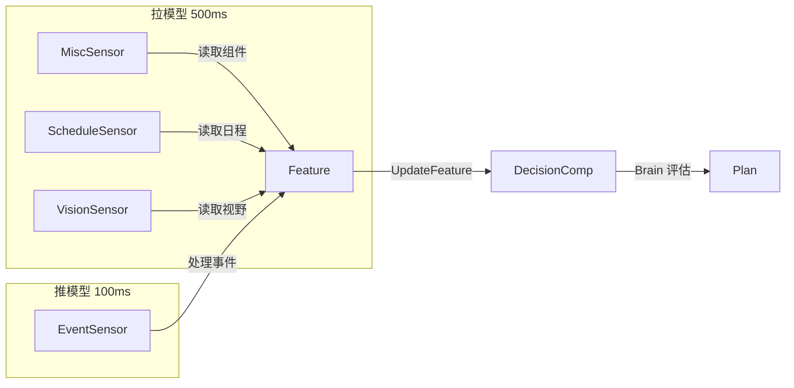

# NPC 生命周期架构

> NPC 从创建到销毁的完整生命周期：实体创建、组件挂载、Sensor/Feature 管线、日程系统、警察系统、视野系统。

## NPC 创建流程

### 三条初始化路径

| 入口函数 | 场景类型 | 配置来源 | 调用时机 |
|---------|---------|---------|---------|
| `InitTownNpcs()` | TownScene | `CfgTownNpc` | 场景初始化 |
| `InitSakuraNPCs()` | SakuraScene | `CfgSakuraNpc` | 场景初始化 |
| `InitMainWorldNpcs()` | 所有场景 | `CfgInitNpc` | 系统初始化后 |

### 两层创建模式

```
第一层：CreateNpcFromConfig() — 通用 NPC 骨架
├─ Transform          位置和朝向
├─ NpcComp            基础信息（名称、性别、外观部件）
├─ MonsterComp        怪物配置（外观ID、行为类型）
├─ BaseStatusComp     基础状态（血量、法力）
├─ PersonStatusComp   人物状态（驾驶等）
├─ PersonInteractionComp  交互逻辑
├─ EquipComp          装备系统
├─ MovementComp       移动组件（旧系统）
├─ MoveControlComp    移动同步
├─ AnimStateComp      动画状态
├─ GasComp            GAS 系统（技能和效果）
├─ NpcMoveComp        NPC 移动控制（寻路、速度）
└─ TradeProxyComp     [仅经销商] 交易代理

第二层：CreateSceneNpc() — 场景特定配置
├─ TownNpcComp / SakuraNpcComp   场景专用组件
├─ NpcScheduleComp    日程组件（节点、会议状态）
├─ DialogComp         对话组件
├─ AIDecisionComp     AI 决策系统（Brain/BT）
├─ VisionComp         视野组件
└─ NpcPoliceComp      [仅警察] 警察组件
```

## NPC 类型差异

| 特性 | Town NPC | Sakura NPC | MainWorld NPC |
|------|----------|-----------|---------------|
| 日程系统 | 有（含会议） | 有（无会议） | 无 |
| 交易系统 | 有（含经销商） | 无 | 无 |
| 警察系统 | 有（职业判断） | 无 | 无 |
| 位置持久化 | 有 | 无 | 无 |
| AI 系统 | BT + GSS Brain | BT + GSS Brain | BT + GSS Brain |
| 场景专用组件 | TownNpcComp | SakuraNpcComp + ControlComp | 无 |

## Sensor → Feature → Decision 数据流

### 架构总览



### SensorFeatureSystem（主协调器，500ms）

```
SensorFeatureSystem.Update()
├─ Step 1: updateFeatures()   [拉模型，500ms]
│  ├─ EventSensorFeature     对话、樱校控制事件
│  ├─ ScheduleSensorFeature  日程状态
│  ├─ DistanceSensor         距离计算
│  ├─ VisionSensor           视野特征
│  ├─ StateSensor            一般状态
│  └─ MiscSensor             警察状态特征
│
└─ Step 2: eventSensor.ProcessEvents()  [推模型，100ms]
    └─ 警察事件、对话完成等
```

### 以警察为例的完整数据流

```
PoliceComp.updatePoliceState()     — 计算状态
    ↓
NpcPoliceSystem.Update()           — 每 3 帧更新
    ├─ updateSuspicionSystem()     — 增加警戒值
    ├─ handleArrestingPlayer()     — 逮捕逻辑
    └─ DecaySuspicion()            — 衰减
    ↓
MiscSensor.GetAndUpdateFeature()   — 每 500ms 读取
    ├─ feature_state_pursuit = (state == Arresting)
    ├─ feature_pursuit_entity_id = 目标玩家 ID
    └─ feature_pursuit_miss = (state == Investigate)
    ↓
DecisionComp.UpdateFeature()       — 同步到 Brain
    ↓
Brain/BT 决策                      — 选择 Plan
```

### Feature 分类

| 特征类型 | 传感器 | 更新方式 | 生命周期 |
|---------|--------|---------|---------|
| 状态特征 | MiscSensor | 拉模型 500ms | 永久，跟随组件状态 |
| 日程特征 | ScheduleSensorFeature | 拉模型 500ms | 永久，日程变化时更新 |
| 事件特征 | EventSensorSystem | 推模型 100ms | 有 TTL，自动清理 |
| 对话特征 | EventSensorFeature | 推模型 | TTL 4500ms |

## NPC 移动机制

### 两种寻路方式

| 方式 | 类型 | 说明 |
|------|------|------|
| `EPathFindType_RoadNetWork` | 路点寻路（旧） | 由 roadnetwork.MapInfo 管理 |
| `EPathFindType_NavMesh` | NavMesh 网格寻路（新） | 更精确的 3D 寻路 |

### NpcMoveComp 核心结构

```go
NpcMoveComp {
    // 路点寻路（旧）
    pointList []*Point     // 目标路点序列
    nowIndex  int          // 当前路点索引

    // NavMesh 移动（新）
    NavMeshData {
        Agent       *navmesh.Agent   // NavMesh 代理
        TargetPos   Vec3             // 目标位置
        TargetType  int32            // Player / WayPoint
        TargetEntity uint64          // 追逐目标 Entity
        IsMoving    bool
        Path        []Vec3           // 计算出的路径
        PathIndex   int              // 当前路径点
    }

    // 速度与状态
    speed     float32               // 同步给客户端
    BaseSpeed float32               // 配置基础速度
    RunSpeed  float32               // 奔跑速度（警察用）
    eState    EMoveState            // Stop / Move / Run
    prevEState EMoveState           // 暂停前状态（用于 Resume）
}
```

### 移动生命周期

```
SetNavAgent() → 初始化 Agent
SetNavMoveTarget(pos) → 设置目标
SetNavPath(path[]) → 设置路径
    ↓
UpdateNavAgent()          [每帧] 推进 Agent
AdvanceNavPathPoint()     完成路点，进入下一个
    ↓
IsNavPathComplete()       检查完成
StopNavMove()            清空路径，停止
DestroyNavAgent()        销毁 Agent
```

### 暂停/恢复机制

- `PauseState()`：Move/Run → Stop，保存 `prevEState`
- `ResumeState()`：Stop → 恢复 `prevEState`
- 用于对话、被逮捕等中断场景

## NPC 日程系统

### 日程配置

```go
NpcSchedule {
    nodeList []*CfgNode   // 节点序列
}

CfgNode {
    Key      string       // 节点唯一 ID
    NodeType int          // 节点类型
    Action   INodeAction  // 具体行为（多态）
}
```

### 节点行为类型

| 类型 | 类名 | 用途 | 关键字段 |
|------|------|------|---------|
| 2 | LocationBasedAction | 在指定位置等待 | Destination, Duration |
| 3 | StayInBuilding | 在建筑内停留 | BuildingId, DoorId |
| 4 | MoveToBPointFormAPoint | 从 A 点移动到 B 点 | APointId, BPointId |

### 会议状态三态

```
MeetingStateNone (0)  — 无会议
    ↓ SetOrderMeeting()
MeetingStateOrder (1) — 已预约未开始
    ↓ 时间到达
MeetingStateOn (2)    — 进行中
    ↓ 超时或完成
MeetingStateNone (0)
```

### 日程与 AI 的协作

日程系统**仅负责状态同步**，不直接控制行为：
- 日程节点位置作为 Feature 传入 AI 决策
- BT 树内部通过 Selector 分支处理具体移动/等待
- `feature_schedule` 变化驱动 BT 重新评估

## 警察系统

### 警察状态四态

```
ESuspicionState_None (0)        — 无目标
    ↓ 警戒值 >= 阈值(700)
ESuspicionState_Arresting (2)   — 正在追捕
    ↓ 丢失视野 > 10秒
ESuspicionState_Investigate (3) — 调查中
    ↓ 调查超时
ESuspicionState_None (0)        — 回归正常
```

### 警戒值系统

```go
PlayerSuspicion {
    PlayerEntityID uint64
    SuspicionLevel int32    // 0-1000
    LastSeenTime   int64    // 上次看到的时间
}
```

**警戒值增长规则**（按距离段）：

| 距离段 | 增量 | 默认值 |
|--------|------|--------|
| [0, ZeroDist] | MaxIncr | 140/tick |
| (ZeroDist, Near] | MidIncr | 35/tick |
| (Near, Mid] | FarIncr | 20/tick |
| > Mid | 无增长 | — |

**衰减**：离开视野 2000ms 后，以 140/100ms 速率衰减。

### 逮捕流程

```
警戒值 >= 700
    ↓
SetArrestingPlayer()
    ├─ estate → Arresting
    └─ feature_state_pursuit = true
    ↓
BT police_enforcement 树
    ├─ ChaseTarget 节点追击
    │   ├─ SetupNavMeshPath → StartMove(RunSpeed)
    │   └─ 距离 < 3m → TriggerArresting()
    │
    └─ 丢失视野 > 10s
        ├─ SetInvestigatePlayer()
        ├─ estate → Investigate
        └─ feature_pursuit_miss = true
            ↓
        InvestigateBehavior 节点
            ↓ 调查超时
        StopInvestigatePlayer()
        └─ EventType_ReleaseWanted
```

## 视野系统

### VisionComp 结构

```go
VisionComp {
    VisionRadius    float32              // 视野半径（米）
    VisionAngle     float32              // 视野角度（360=全向）
    visibleEntities map[uint64]bool      // 视野内实体集合
    visionRecords   map[uint64]*visionRecord  // 视野记录
    AlertEntity     uint64               // 被通缉的实体
}

visionRecord {
    EntityID  uint64
    Distance  float32
    EnterTime int64     // 进入视野时间戳
}
```

### 视野更新流程

```
VisionSystem.UpdateVisionByProto(playerEntity, npcEntities[])
├─ 构建 shouldSeePlayerMap
├─ 遍历所有 NPC
│   ├─ shouldSee && !inVision → addEntityToVision()
│   └─ !shouldSee && inVision → removeEntityFromVision()
└─ 同步到 DecisionComp Feature
```

### 输出 Feature

```
feature_vision_radius
feature_vision_angle
feature_visible_entities_count
feature_visible_players_count
feature_visible_npcs_count
```

## 数据持久化（仅小镇）

```go
TownNpcMgr 维护 4 个存档数据：
├─ savedPositions         Position/Rotation 恢复
├─ savedTradeProxyData    经销商余额、交易状态
├─ savedScheduleData      会议 ID、状态、地点
└─ savedTownNpcData       外出时长、交易订单状态
```

恢复流程：Entity 创建后 → 逐一恢复各项数据（如有存档）。
Sakura NPC 无持久化，每次进入场景重新初始化。

## 系统启动与帧更新时序

```
场景初始化
├─ Resources: GridMgr, NavMeshMgr, TimeMgr, TownNpcMgr ...
├─ Systems: Sensor, NpcMove, Police, Vision, Decision ...
└─ NPC 创建: InitTownNpcs / InitSakuraNPCs / InitMainWorldNpcs

每帧运行
├─ NpcMoveSystem            每帧    — 移动计算
├─ NpcPoliceSystem          3 帧    — 警察逻辑
├─ SensorFeatureSystem      500ms   — Feature 同步
│  ├─ updateFeatures()      拉模型
│  └─ ProcessEvents()       推模型（100ms）
├─ VisionSystem             100 帧  — 视野更新
├─ DecisionSystem           1 秒    — AI 决策
├─ BtTickSystem             每帧    — 行为树 Tick
└─ NetSystem                每帧    — 同步客户端
```

## 关键文件路径

| 文件/目录 | 内容 |
|----------|------|
| `ecs/system/npc/` | NPC 初始化、日程更新、NPC 系统 |
| `ecs/com/cnpc/` | NpcComp、NpcMoveComp、NpcScheduleComp |
| `ecs/com/cpolice/` | NpcPoliceComp（警戒值、逮捕逻辑） |
| `ecs/com/cvision/` | VisionComp（视野检测） |
| `ecs/com/caidecision/` | AIDecisionComp（Feature/Brain） |
| `ecs/system/sensor/` | SensorFeatureSystem（Feature 同步） |
| `ecs/system/police/` | NpcPoliceSystem（警察更新） |
| `ecs/system/vision/` | VisionSystem（视野更新） |
| `ecs/res/town/` | TownNpcMgr（持久化管理） |
