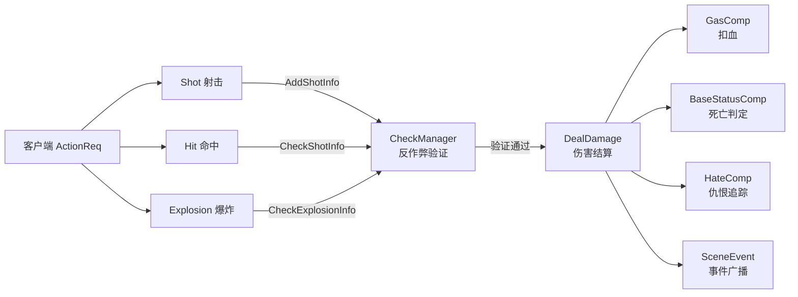

# 伤害管线架构

> Shot → Hit → Explosion → Damage 完整流水线，CheckManager 反作弊验证，GAS 系统集成，仇恨追踪。

## 整体流水线



## Shot — 射击事件

```
HandleShotData()
├─ 验证射击者有武器（EquipComp）
├─ 获取当前激活武器
├─ 玩家处理：
│  ├─ 扣减弹药（BULLETCURRENT 属性 -1）
│  ├─ 同步武器属性回背包
│  └─ CheckManager.AddShotInfo(entityID, weaponID, unique)
│     └─ 计算 scatter_count（从 CfgGunFeature 获取，霰弹枪多弹丸）
└─ 广播 SceneEvent::Shot → SnapshotMgr.Cache
```

## Hit — 命中事件

```
HandleHitData()
├─ 基础验证：
│  ├─ 非自伤检查（attacker != target）
│  └─ 有伤害必须有武器
├─ 反作弊验证：
│  └─ CheckManager.CheckShotInfo(entityID, weaponID, unique)
│     ├─ 验证武器 ID 匹配
│     └─ 递减 shotNum（霰弹枪多弹丸支持）
├─ 伤害判定：
│  └─ canTakeDamage() → hitResult (Invincible / Common)
├─ 伤害结算：
│  └─ DealDamage(attacker, target, damage)
└─ 广播 SceneEvent::Hit → SnapshotMgr.Cache
```

## Explosion — 爆炸事件

```
HandleExplosionData()
├─ 反作弊验证：
│  └─ CheckManager.CheckExplosionInfo(entityID, unique)
│     └─ 验证武器类型为火箭筒
├─ 加载配置：
│  ├─ CfgExplosionEvent（主要配置）
│  └─ CfgDestructEvent（破坏事件）
├─ 计算爆炸中心
├─ 范围伤害：
│  └─ applyAreaDamageFromConfig()
│     ├─ 遍历 PlayerManager.PlayerMap 检查距离
│     └─ 距离衰减：DamageList[(距离阈值, 伤害值)]
└─ 广播 SceneEvent::Explosion → SnapshotMgr.Cache
```

## DealDamage — 伤害结算

```
DealDamage(attacker, target, damage)
├─ 伤害上限：max 100000 (MAX_SINGLE_HIT_DAMAGE)
├─ 读取生命值：GAS_ATTRIBUTE_UNIT_COMBAT_HEALTH_CURRENT
├─ 扣血：actualDamage = min(damage, currentHealth)
│  └─ gasComp.AttributeSet.SetValue(HEALTH_CURRENT, newHealth)
│  └─ gasComp.SetSync()
├─ 死亡判定：
│  └─ if newHealth <= 0:
│     ├─ BaseStatusComp.SetDead()
│     └─ 广播 KillInfo {KillerEntity, DeadEntity}
└─ 红名处理（仅大世界）：
   └─ 被动模式玩家攻击 → 退出被动模式
```

## CheckManager — 反作弊验证

### 数据结构

```
CheckManager (Scene Resource)
└─ userMap: map[entityID] → shotInfoByUser
   └─ uniqueMap: map[unique] → shotInfo
      ├─ weaponID   int32
      ├─ unique     int64
      ├─ createTime int64 (秒级)
      └─ shotNum    int32 (剩余弹丸数)
```

### 验证方法

| 方法 | 功能 | 反作弊策略 |
|------|------|----------|
| `AddShotInfo` | 注册射击 | 从配置获取 scatter_count 初始化 shotNum |
| `CheckShotInfo` | 验证命中 | 匹配 unique + weaponID，递减 shotNum |
| `CheckExplosionInfo` | 验证爆炸 | 匹配 unique，验证武器类型 |
| `cleanupExpired` | 过期清理 | 删除 > 15 秒的记录 |

### 霰弹枪逻辑

- 一次 Shot 产生多弹丸（scatter_count）
- 每次 Hit 验证 shotNum--
- shotNum <= 0 时删除记录
- 验证失败 → Hit 被拒绝（日志 warning，不处理伤害）

## 伤害免疫规则

### 大世界 (MainScene)

```
canTakeDamageInMainWorld(attacker, target):
├─ 玩家 vs 玩家：
│  ├─ 目标被动模式 → Invincible
│  ├─ 攻击者被动模式 & 目标非红名 → Invincible
│  └─ 双方都白名 → Invincible
├─ NPC vs 玩家：
│  ├─ 玩家被动模式 → Invincible
│  └─ 玩家白名 → Invincible
└─ 其他 → Common
```

### 副本 (Dungeon)

```
canTakeDamageInDungeon(attacker, target):
├─ 同阵营 (CampId) → Invincible
└─ 其他 → Common
```

## GAS 系统集成

### GasComp 结构

```go
GasComp {
    AttributeSet     *AttributeSet     // 属性集（血量等）
    FlagContainer    *FlagContainer     // 游戏旗标
    EffectContainer  *EffectContainer   // 效果实例
    AbilityContainer *AbilityContainer  // 能力实例
    BehaviorContainer *BehaviorContainer // 行为实例
}
```

### 关键属性

| 属性 ID | 名称 | 用途 |
|---------|------|------|
| 6050010 | HEALTH_CURRENT | 当前生命值 |
| 6050009 | HEALTH_MAX | 最大生命值 |

### 增量更新

- `AttributeUpdateSet` 记录需要更新的属性
- `ToProtoFull(isFull)` 支持全量/增量同步
- `SetSync()` 标记需同步

## 仇恨系统

### 双向追踪

```
NPC 端: HateComp
├─ HateMap: map[targetEntityID] → HateInfo
│  ├─ HateValue   int32 (0-1000)
│  ├─ DecayRate    1/秒
│  └─ LastUpdate   time
└─ 方法：AddHate / RemoveHate / GetHighestHateTarget / UpdateHateDecay

玩家端: ReverseHateComp
├─ NpcHateList: map[npcEntityID] → bool
└─ 方法：AddNpcHate / RemoveNpcHate / ClearAllNpcHate
```

### 仇恨值规则

| 事件 | 仇恨变化 |
|------|---------|
| NPC 受到伤害 | +10 x damageValue |
| NPC 攻击玩家 | +10 x damageValue |
| 自动衰减 | -DecayRate x 秒数 |
| 衰减到 0 | 自动移除 |

### 伤害 → 仇恨流程

```
DealDamage(player, npc, damage)
    ↓
OnNpcDamaged(npc, player, damage)
├─ npc.HateComp.AddHate(player, damage * 10)
└─ player.ReverseHateComp.AddNpcHate(npc)
    ↓
NPC 选择最高仇恨目标攻击
```

## 事件广播机制

### 广播流程

```
伤害结算后
├─ addSceneEvent(scene, SceneEvent)
└─ SnapshotMgr.Cache.AddEvent(event)
    └─ 帧缓存累积
        ↓
net_update System 每帧发送
└─ 按订阅者距离过滤
    └─ 推送给客户端
```

### 事件类型

| 事件 | 数据 | 触发时机 |
|------|------|---------|
| Shot | ShotData | 射击时 |
| Hit | HitData + hitResult | 命中时 |
| Explosion | ExplosionInfo | 爆炸时 |
| Kill | KillerEntity + DeadEntity | 死亡时 |

## NPC 死亡处理

```
DealDamage() → newHealth <= 0
├─ BaseStatusComp.SetDead()
├─ 广播 KillInfo
├─ 仇恨系统清理
│  └─ 从所有仇恨此 NPC 的玩家中移除
├─ 掉落物品 / 经验奖励
└─ CheckManager.RemoveEntity(npcEntityID)
```

## 关键常量

| 项 | 值 | 说明 |
|----|---|------|
| MAX_SINGLE_HIT_DAMAGE | 100,000 | 单次伤害上限 |
| shotMaxDelaySec | 15 | 射击记录最大存活时间 |
| 仇恨 DecayRate | 1/秒 | 默认衰减速率 |
| 仇恨 MaxHate | 1,000 | 最大仇恨值 |

## 关键文件路径

| 文件 | 内容 |
|------|------|
| `damage/damage.go` | DealDamage 伤害结算 |
| `damage/shot.go` | HandleShotData 射击处理 |
| `damage/hit.go` | HandleHitData 命中处理 |
| `damage/explosion.go` | HandleExplosionData 爆炸处理 |
| `damage/check_manager.go` | CheckManager 反作弊 |
| `damage/event.go` | 事件广播 |
| `ecs/com/cgas/` | GasComp（属性/效果/能力） |
| `ecs/com/chate/` | HateComp + ReverseHateComp |
