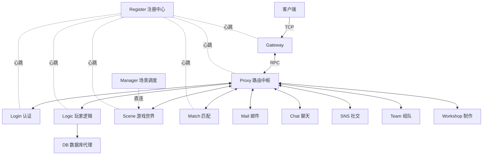
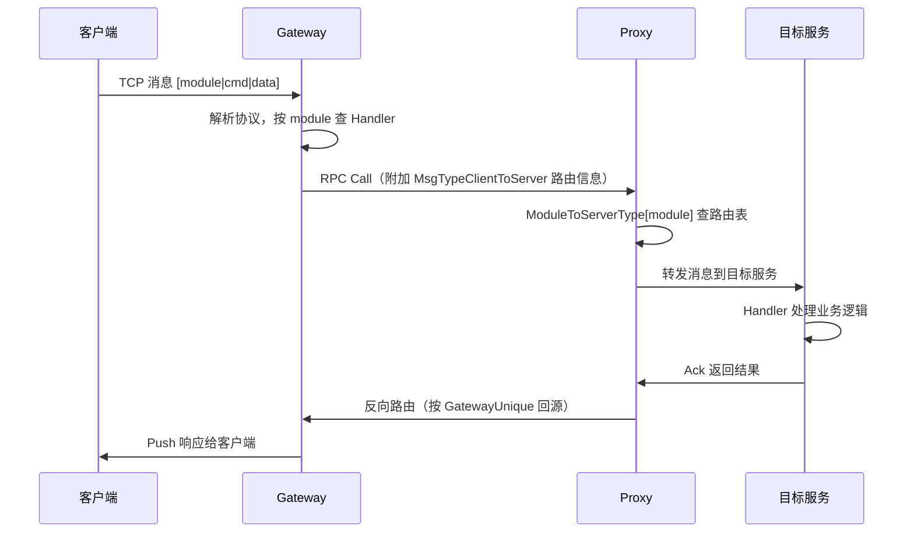
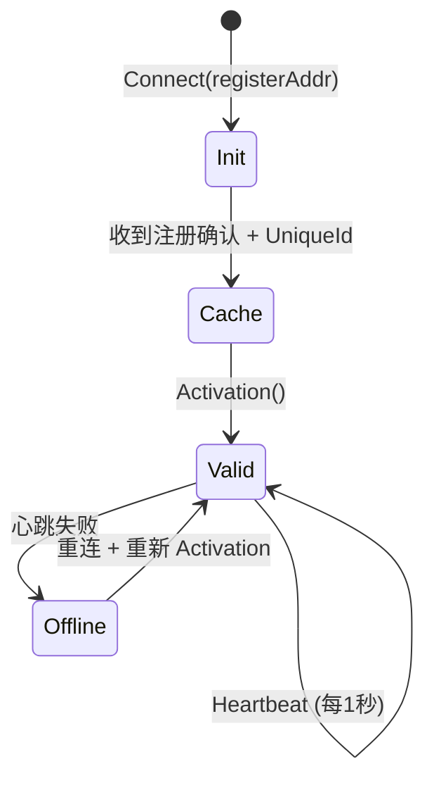
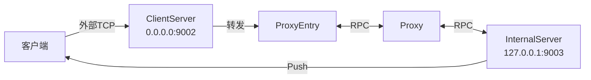

# 微服务通信架构

> 20 个微服务的拓扑、RPC 通信框架、服务注册发现、消息路由全链路。

## 服务器拓扑



## 20 个服务器职责

### 基础设施（3 个）

| 服务 | 职责 | 特点 |
|------|------|------|
| **register_server** | 服务注册/发现、健康检查、状态聚合 | 中央注册中心，所有服务向其注册 |
| **proxy_server** | 星形路由中枢、模块路由、跨服务消息转发 | 单点，故障导致全服崩溃 |
| **manager_server** | 场景调度、副本分配、分线管理、运维接口 | 直连 Scene，不走 Proxy |

### 玩家接入（2 个）

| 服务 | 职责 | 特点 |
|------|------|------|
| **login_server** | 账户创建、登录验证、Token 管理、网关分配 | HTTP + RPC 双接口 |
| **gateway_server** | 客户端连接接收、消息转发、推送下发 | 双网络：外部(客户端) + 内部(Proxy) |

### 核心逻辑（3 个）

| 服务 | 职责 | 特点 |
|------|------|------|
| **logic_server** | 玩家 Agent 会话、业务模块协调、数据持久化 | 玩家逻辑中枢 |
| **scene_server** | ECS 游戏世界实例、实时交互、NPC 行为树 | 构建时保留调试信息 |
| **db_server** | 三级缓存(内存/Redis/MongoDB)、批量写入 | 数据库代理层 |

### 功能服务（12 个）

| 服务 | 职责 |
|------|------|
| **team_server** | 队伍生命周期、成员管理 |
| **match_server** | 副本匹配、Room 状态机 |
| **mail_server** | 玩家邮件、全局邮件、附件领取 |
| **chat_server** | 聊天、频道管理、语音频道 |
| **sns_server** | BBS、一向关系 |
| **relation_server** | 玩家关系存储 |
| **notice_server** | 全局公告 |
| **gm_server** | GM 管理工具 |
| **cache_server** | 缓存服务 |
| **center_server** | 中心服务 |
| **workshop_server** | 制作系统 |

## 消息完整链路

### 客户端请求 → 服务端响应



### 消息协议格式

```
字节偏移    内容
[0-2]     Size（3字节大端，整个消息长度）
[3]       Flags:
          - bit0: MsgFlag_Push  (0x01, 单向推送)
          - bit1: MsgFlag_Ack   (0x02, 确认消息)
          - bit2: MsgFlag_Err   (0x04, 错误标志)
          - bit3: MsgFlag_Extra (0x08, 含路由信息)
[4]       Module（uint8, 0-255, 决定转发目标）
[5-6]     Cmd（uint16 大端, 具体命令号）
[7-10]    Sequence（uint32, Call/Ack 配对用）
[...]     协议体（Protobuf 编码）
[-N]      IMsgType extra（路由附加信息, 如有 MsgFlag_Extra）
[-1]      Extra Tag（uint8）
```

### Proxy 路由表

Proxy 按 module 字段路由消息到对应服务器类型：

```go
moduleToServerType[ModuleCmd_Login]   = ServerType_Login
moduleToServerType[ModuleCmd_Scene]   = ServerType_Scene
moduleToServerType[ModuleCmd_Logic]   = ServerType_Logic
moduleToServerType[ModuleCmd_Gateway] = ServerType_Gateway
moduleToServerType[ModuleCmd_Match]   = ServerType_Match
moduleToServerType[ModuleCmd_Mail]    = ServerType_Mail
moduleToServerType[ModuleCmd_Bbs]     = ServerType_SNS
// ...
```

## RPC 通信框架

### Session — 核心通信单元

```go
type Session struct {
    conn       net.Conn          // TCP 连接
    handle     *RpcHandleMgr     // 消息处理管理器
    pool       *worker.Pool      // 工作线程池（512线程, 8192队列）
    seqId      uint32            // 请求序列号（递增）
    ctxChan    chan *RpcContext   // 异步响应通道（缓冲1000）
    reqHash    sync.Map          // 待处理请求表 seq → SendRequest
}
```

### 三种调用模式

| 模式 | 方法 | 特点 | 场景 |
|------|------|------|------|
| **同步 Call** | `Session.Call()` | 阻塞等待结果，超时 3 秒 | Logic↔DB, Match↔Manager |
| **异步 Call** | `ctx.ReturnMsg()` 延迟 | 消息处理后异步应答 | 场景内玩家消息 |
| **单向 Push** | `Session.Push()` | 不等待，不期望响应 | 服务推送更新给客户端 |

### 消息处理管理

```go
type IHandler interface {
    HandleNetMsg(data []byte, context *RpcContext)
    Module() uint8     // 返回模块号（0-255）
}

type RpcHandleMgr struct {
    handlers [256]IHandler   // module → Handler 映射表（预分配数组）
}
```

### 并发模型

```
Session.readMsg() — 网络读循环
  ├─ 解析协议 header
  ├─ 分类 Call / Push
  └─ Submit 到 worker.Pool
      └─ handler.HandleNetMsg(data, ctx)

Session.tick() — 100ms 定时循环
  ├─ 消费 ctxChan 中的异步响应 → 发送 Ack
  └─ 检查超时请求（>3秒）
```

## 服务注册与发现

### RegisterClient 生命周期



### 注册流程

```
1. Connect(registerAddr, 5次重试)
2. 发送 ServerRegisterReq {ServerType, ServerAddress, ExternalAddr}
3. 获得 UniqueId（集群内唯一标识）
4. Activation() → 注册生效
5. 周期心跳（1秒）保活
```

### 发现 API

```go
// 获取单个服务（负载均衡）
GetServerByType(ServerType) → *SingleServiceInfo

// 获取所有同类服务
GetAllServerByType(ServerType) → []*SingleServiceInfo

type SingleServiceInfo struct {
    UniqueId      uint32
    ServerType    int32
    ServerAddress string
}
```

## ProxyEntry — 服务端维护 Proxy 连接池

```go
type ProxyEntry struct {
    proxyMap       map[uint32]*ProxyServer   // UniqueId → ProxyServer
    registerClient *RegisterClient
    handler        *RpcHandleMgr
}
```

工作流程：
1. Tick 循环中从注册中心查询所有 Proxy 列表
2. 新发现的 Proxy → RPC 连接 → 握手(`ConnectToProxyReq`)
3. 存入 proxyMap，后续通过 `GetProxy()` 获取活跃连接
4. 清理已断开的连接

## 应用生命周期

### Runnable 接口

```go
type Runnable interface {
    Init() error    // 资源初始化
    Name() string   // 服务名称
    Reload() error  // 配置重载
    Start() error   // 启动监听/线程
    Final()         // 优雅关闭
}
```

### App.Run() 流程

```
main()
├─ LoadConfig("config.toml")
├─ log.InitLogfile()
├─ initialize(cfg) → cmd.NewApp(AppType, WithServers(...))
└─ app.Run()
    ├─ signal() → 监听 SIGTERM/SIGINT
    ├─ init()
    │   ├─ 初始化 Redis/MongoDB 全局连接
    │   └─ 遍历 runnables → Init()
    ├─ start()
    │   └─ 遍历 runnables → Start()
    ├─ <-stop  （阻塞等待退出信号）
    └─ final()
        └─ 遍历 runnables → Final()
```

### 初始化顺序约束

```go
cmd.WithServers(
    registerClient,  // 1. 必须先注册，获得 UniqueId
    proxyEntry,      // 2. 依赖注册中心发现 Proxy
    httpServer,      // 3. 业务服务
    ...
)
```

## Gateway 双网络架构



- **ClientServer**：接收客户端连接，按 module 转发到后端
- **InternalServer**：接收 Proxy 推送，下发给客户端

## 全局配置

```toml
# 所有服务共有
register_addr = "127.0.0.1:9000"    # 注册中心
mongo_addr = "127.0.0.1:27017"
redis_addr = "127.0.0.1:6379"
log_dir = "/var/log/game"
threads = 8
enable_pprof = true
pprof_addr = "127.0.0.1:6060"
```

## 关键设计要点

1. **星形拓扑**：所有服务间通信通过中央 Proxy 转发，module 字段决定路由目标
2. **服务发现驱动**：所有服务依赖 RegisterClient 获取其他服务地址
3. **异步混合调用**：同步 Call（阻塞 3 秒）+ 异步 Ack（ctxChan）+ 单向 Push
4. **线程池隔离**：RPC 消息处理独占 worker.Pool（512 线程），避免阻塞网络 IO
5. **双监听网关**：Gateway 同时监听客户端和 Proxy，实现双向通信
6. **Runnable 顺序**：Init/Start 按数组顺序执行，RegisterClient 必须排第一

## 关键文件路径

| 文件/目录 | 内容 |
|----------|------|
| `common/rpc/session.go` | Session 核心（Call/Push/Ack） |
| `common/rpc/handler.go` | RpcHandleMgr、IHandler 接口 |
| `common/rpc/server.go` | RpcServer 监听实现 |
| `common/rpc/client.go` | RPC 客户端连接 |
| `common/register/client.go` | RegisterClient 注册/发现 |
| `common/proxy_entry/entry.go` | ProxyEntry 连接池 |
| `common/net_server/server.go` | RPCServer 包装 |
| `common/cmd/app.go` | App/Runnable 生命周期 |
| `proxy_server/internal/router.go` | Proxy 路由表 |
| `proxy_server/internal/server.go` | Proxy 核心转发逻辑 |
| `gateway_server/cmd/initialize.go` | Gateway 双网络初始化 |
