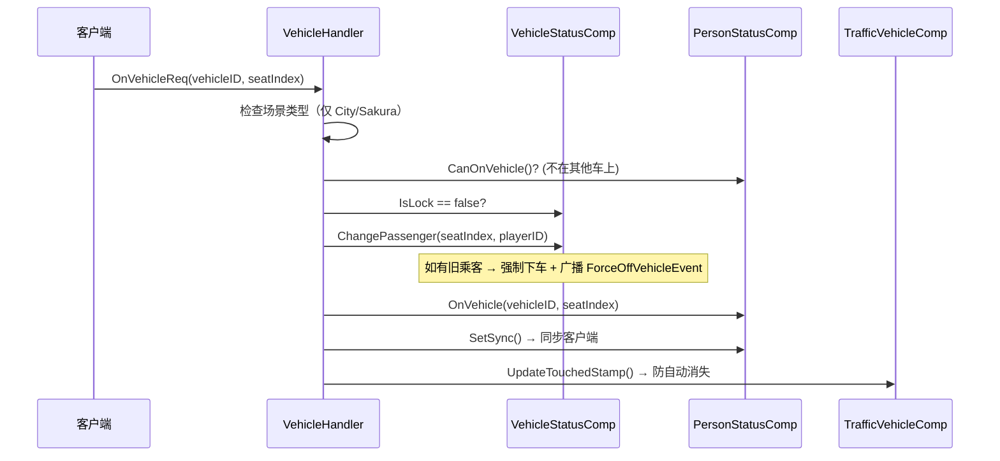

# 载具系统架构

> 载具上下车、座位管理、交通载具自动消失、车门状态、NPC 驾驶。

## 载具 Entity 组件组成

```
Vehicle Entity (EntityType_Vehicle)
├─ Transform              位置和旋转
├─ VehicleStatusComp      座位管理、车门状态、喇叭
└─ TrafficVehicleComp     [交通载具] 自动消失、配置信息
```

## 载具创建流程

### SpawnTrafficVehicle

```
SpawnTrafficVehicle(scene, vehicleCfgId, location, rotation, colorList)
├─ 验证 CfgVehicle 配置存在
├─ scene.NewEntity()
├─ 添加 Transform（位置 + 旋转）
├─ 添加 TrafficVehicleComp
│  ├─ IsTrafficSystem = true
│  ├─ NeedAutoVanish = true
│  ├─ VehicleCfgId / VehicleBaseCfgId
│  ├─ ColorList = RGB
│  └─ TouchedStamp = 当前时间（秒）
├─ entity.SetEntityType(EntityType_Vehicle)
└─ 添加 VehicleStatusComp
   ├─ 座位数从 CfgVehicleBase 获取（默认 4）
   ├─ 驾驶座索引 = 0
   └─ 每座位初始化车门状态 Close
```

## 核心组件

### VehicleStatusComp — 座位与车门

```go
VehicleStatusComp {
    SeatList          []VehicleSeat   // 座位列表
    DoorList          []VehicleDoor   // 车门列表
    ActiveCarHornList []int32         // 正在按喇叭的座位
    IsTrafficSystem   bool            // 是否交通系统载具
    IsLock            bool            // 是否锁定
}

VehicleSeat {
    Index     int32
    Passenger uint64    // Entity ID, 0 = 空座
    IsDriver  bool
}

VehicleDoor {
    Index  int32
    Status VehicleDoorStatus  // Open / Close
}
```

### 座位管理方法

| 方法 | 功能 | 返回值 |
|------|------|--------|
| `ChangePassenger(seat, new)` | 替换座位乘客 | (oldPassenger, ok) |
| `PassengerLeave(entityID)` | 按乘客下车 | (seatIndex, ok) |
| `PassengerLeaveBySeat(seat)` | 按座位清人 | (passengerID, ok) |
| `GetDriver()` | 获取驾驶员 | driverID |
| `IsUsing()` | 有无乘客 | bool |
| `GetAllPassengers()` | 所有乘客 | []uint64 |

### TrafficVehicleComp — 交通载具

```go
TrafficVehicleComp {
    IsTrafficSystem bool
    NeedAutoVanish  bool
    VehicleCfgId    int32
    VehicleBaseCfgId int32
    ColorList       []RGB
    TouchedStamp    int64    // 最后触碰时间（秒）
}
```

### PersonStatusComp — 驾驶状态

```go
PersonStatusComp {
    DriveVehicleId   uint64   // 驾驶的载具 Entity ID（0 = 不在车上）
    DriveVehicleSeat uint32   // 座位索引
}

// 方法
CanOnVehicle()  → DriveVehicleId == 0
OnVehicle(vehicleID, seatIndex)
OffVehicle()    → DriveVehicleId = 0
```

## 上下车流程

### 上车 (OnVehicle)



### 下车 (OffVehicle)

```
OffVehicleReq
├─ 获取 DriveVehicleId（0 = 不在车上 → 直接返回）
├─ 获取载具实体（已删除 → 清除状态返回）
├─ VehicleStatusComp.PassengerLeave(playerID)
├─ PersonStatusComp.OffVehicle()
└─ TrafficVehicleComp.UpdateTouchedStamp()
```

### 拉人下车 (PullFromVehicle)

```
PullFromVehicleReq
├─ 判断操作者身份（同车 = isInner, 不同车 = 错误）
├─ VehicleStatusComp.PassengerLeaveBySeat(seatIndex)
├─ 被拉者 PersonStatusComp.OffVehicle()
├─ 被拉者 Transform 同步到载具位置
└─ 广播 ForceOffVehicleEvent（含 isInner 标记）
```

## 驾驶更新（高频）

```
DriveVehicleReq [客户端每帧发送, Push 无返回值]
├─ 验证驾驶员身份
├─ 更新载具 Transform（Position + Rotation）
├─ 遍历所有乘客 → 同步位置到载具位置
└─ TrafficVehicleComp.UpdateTouchedStamp() ← 每帧刷新防消失
```

## 交通载具自动消失

### 消失条件

```go
ShouldVanish(currentTime, vanishThreshold) bool {
    return NeedAutoVanish &&
           TouchedStamp > 0 &&
           currentTime - TouchedStamp > vanishThreshold  // 默认 10 秒
}
```

### TrafficVehicleSystem 每帧检查

```
TrafficVehicleSystem.Update()
├─ 遍历所有 TrafficVehicleComp
├─ ShouldVanish(now, 10)?
│  ├─ Yes → VehicleStatusComp.IsUsing()?
│  │  ├─ Yes → 跳过（乘客保护）
│  │  └─ No  → scene.RemoveEntity()
│  └─ No  → 跳过
```

### TouchedStamp 更新时机

| 时机 | 目的 |
|------|------|
| 上车 (OnVehicle) | 有人交互，重置倒计时 |
| 下车 (OffVehicle) | 刚使用过，延迟消失 |
| 拉人下车 | 同上 |
| **驾驶每帧** | 最重要：确保使用中不消失 |

## 车门状态管理

### VehicleDoor 状态

| 状态 | 说明 |
|------|------|
| `Close` | 关闭 |
| `Open` | 打开 |

### 操作流程

```
OpenVehicleDoorReq / CloseVehicleDoorReq
├─ 验证操作者身份（玩家或被控制的 NPC）
├─ 验证不在其他载具上
└─ VehicleStatusComp.SetDoorStatus(doorIndex, status)
   └─ SetSync() → 同步客户端
```

### MovableDoorComp（小镇场景门）

```go
MovableDoorComp {
    curState        TownHandleDoorType  // OPEN_IN / OPEN_OUT / CLOSE
    lastOpenAngle   float32             // 上次开门角度
    angularVelocity float32             // 角速度
    permission      int32               // 权限标志位
}
```

## 场景类型支持

| 场景 | 支持载具 | 说明 |
|------|---------|------|
| CityScene | 是 | 大世界 |
| SakuraScene | 是 | 樱花校园 |
| DungeonScene | 否 | 副本禁用 |
| TownScene | 否 | 小镇禁用 |

## RPC 消息映射

| 消息 | 处理方法 | 返回值 | 频率 |
|------|---------|--------|------|
| OnVehicleReq | OnVehicle() | NullRes | 低频 |
| OffVehicleReq | OffVehicle() | NullRes | 低频 |
| PullFromVehicleReq | PullFromVehicle() | NullRes | 低频 |
| OpenVehicleDoorReq | OpenVehicleDoor() | NullRes | 低频 |
| CloseVehicleDoorReq | CloseVehicleDoor() | NullRes | 低频 |
| StartCarHornReq | StartCarHorn() | NullRes | 低频 |
| StopCarHornReq | StopCarHorn() | NullRes | 低频 |
| **DriveVehicleReq** | DriveVehicle() | **无返回** | **每帧** |
| OnTrafficVehicleReq | OnTrafficVehicle() | Res | 低频 |

## 关键设计原则

1. **双向同步**：PersonStatusComp（个人状态）+ VehicleStatusComp（载具状态）必须一致
2. **座位替换保护**：新乘客占已占座位 → 旧乘客强制下车 + 广播事件
3. **乘客保护**：自动消失前检查 `IsUsing()`，有人在车上不消失
4. **高频驾驶更新**：DriveVehicle 是 Push 消息（无返回值），每帧刷新 TouchedStamp

## 关键文件路径

| 文件 | 内容 |
|------|------|
| `ecs/spawn/vehicle_spawn.go` | 交通载具生成 |
| `net_func/vehicle/vehicle_ops.go` | 上下车处理 |
| `net_func/vehicle/vehicle_door.go` | 车门处理 |
| `net_func/vehicle/vehicle_horn.go` | 喇叭处理 |
| `net_func/vehicle/traffic_vehicle.go` | 交通载具生成请求 |
| `ecs/com/cvehicle/vehicle_status.go` | VehicleStatusComp |
| `ecs/com/cvehicle/traffic_vehicle.go` | TrafficVehicleComp |
| `ecs/com/cperson/person_status.go` | PersonStatusComp |
| `ecs/com/cmovabledoor/` | MovableDoorComp |
| `ecs/system/traffic_vehicle/` | TrafficVehicleSystem |
