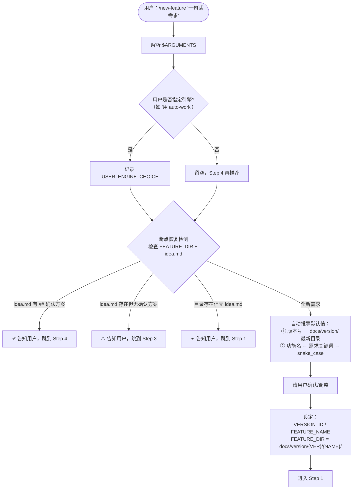
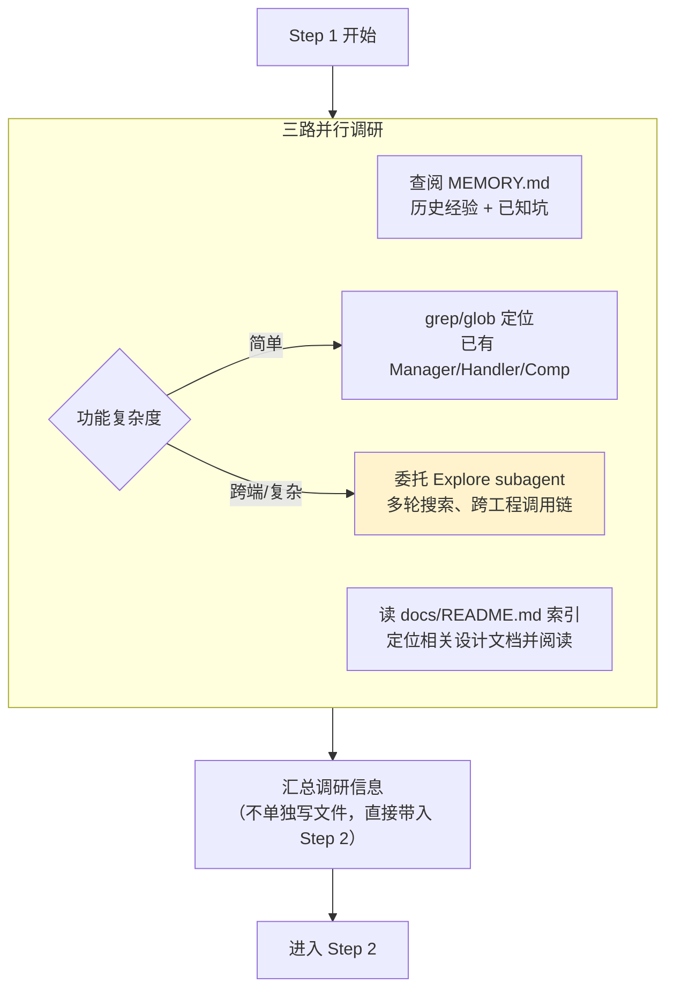
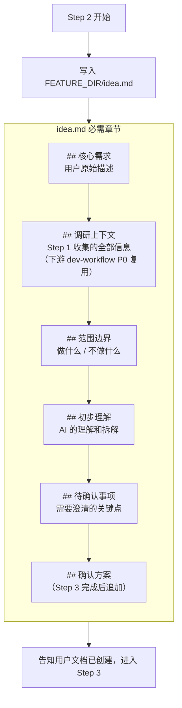
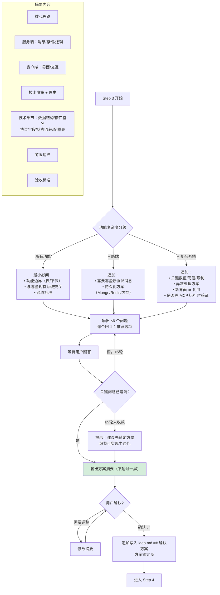
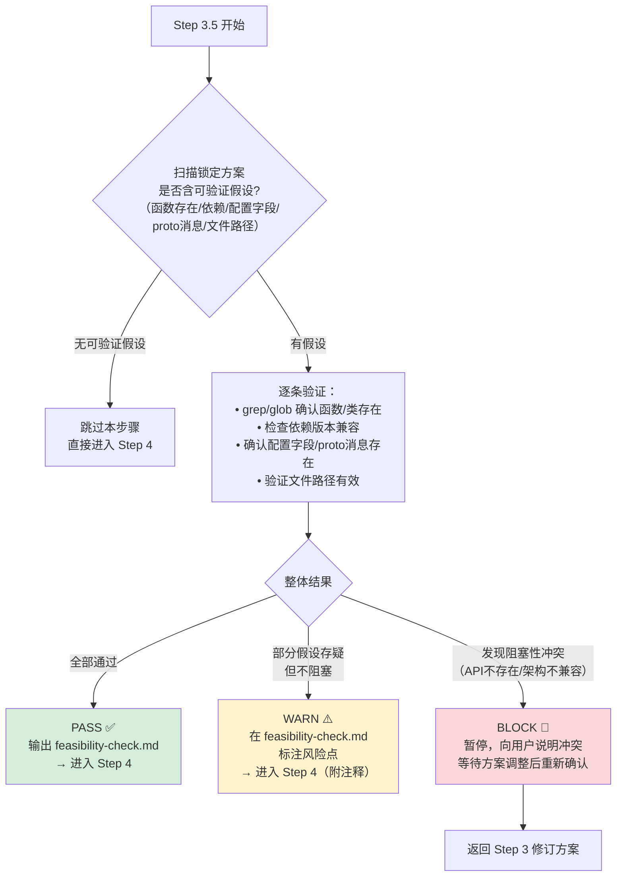
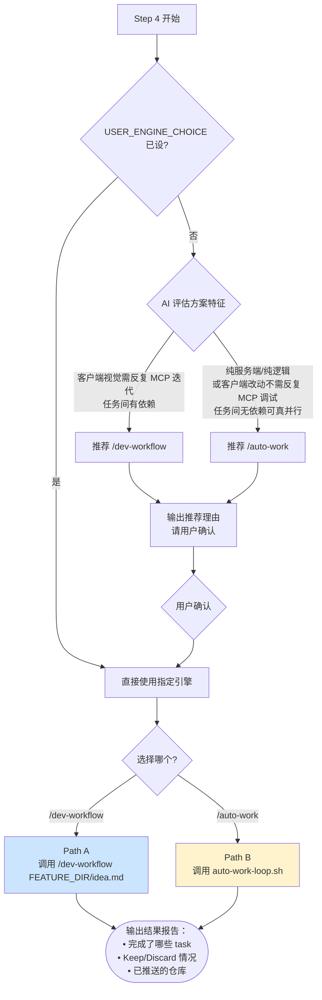

# /new-feature 工作流详细流程图

> 更新日期：2026-03-31

## 一、总览

```
用户一句话需求
    │
    ▼
Step 0  收集基础信息 + 断点恢复
    │
    ▼
Step 1  建立项目上下文（并行调研）
    │
    ▼
Step 2  创建 idea.md 需求文档
    │
    ▼
Step 3  互动确认方案 ⭐ 唯一人工深度参与
    │
    ▼
Step 3.5 技术可行性快检（自动，PASS/WARN/BLOCK）
    │
    ▼
Step 4  全自动实现 → 选择引擎
    ├── Path A: /dev-workflow（P0→P7，MCP 可用）
    └── Path B: /auto-work（6 阶段，CLI 隔离并行）
    │
    ▼
  结果报告
```

---

## 二、Step 0：收集基础信息 & 断点恢复



---

## 三、Step 1：建立项目上下文



> 注意：这是**初步调研**。下游引擎（dev-workflow P2 / auto-work Plan 迭代）会在此基础上做二次强化设计。

---

## 四、Step 2：创建需求文档



> 下游复用契约：
> - dev-workflow P0：检测到 `## 调研上下文` → 跳过重复搜索
> - dev-workflow P1：检测到 `## 确认方案` → 分类为 `direct`，跳过调研
> - auto-work：检测到 `## 确认方案` → 分类为 `direct`，跳过分类和初步调研

---

## 五、Step 3：互动确认方案（核心步骤）



### 方案深度原则

| 层次 | 负责方 | 职责 |
|------|--------|------|
| **主体设计** | new-feature + 用户（Step 1-3） | 尽可能深入的技术方案，含接口级细节 |
| **补充强化** | dev-workflow P2 / auto-work Plan | 基于代码分析补充调用链、边界处理、遗漏依赖 |

---

## 五点五、Step 3.5：技术可行性快检



**输出文件**：`feasibility-check.md`（仅在有假设需验证时生成）

---

## 六、Step 4：引擎选择与启动



---

## 七、Path A：/dev-workflow 全流程（P0→P7）

```
/dev-workflow {FEATURE_DIR}/idea.md
      │
      ▼
┌─────────────────────────────────────────────────────────────┐
│  P0: 记忆查询                                               │
│  ─────────────                                               │
│  • idea.md 有 ## 调研上下文 → 直接复用，跳过搜索             │
│  • 否则：提取关键词 → 查 MEMORY.md + docs/ → 输出摘要       │
│  • 容错：搜索失败不阻塞                                      │
└──────────────────────┬──────────────────────────────────────┘
                       │
                       ▼
┌─────────────────────────────────────────────────────────────┐
│  P1: 需求解析与验证                                          │
│  ──────────────────                                          │
│  1.1 读取 idea.md，Schema 检查（核心需求/确认方案）          │
│  1.2 需求分类：                                              │
│      • 有 ## 确认方案 → direct（跳过调研）                   │
│      • 全新系统/需选型 → research                             │
│  1.3 多轮调研（仅 research）：                                │
│      调研(subagent) ⇄ 审查，≤6轮，连续2轮无问题 → 早退       │
│  1.4 工程定位 + 依赖检查                                     │
│  1.5 输出 requirements.json（REQ-XXX + acceptance_criteria） │
└──────────────────────┬──────────────────────────────────────┘
                       │
                       ▼
┌─────────────────────────────────────────────────────────────┐
│  P2: 技术设计（subagent 执行 + 自审循环）                    │
│  ─────────────────────────────────────────                    │
│  2.0 读取 requirements.json                                  │
│  2.1 架构设计：系统边界 / 接口 / 状态机 / 错误码             │
│  2.2 详细设计：按工程分（业务/协议/配置/DB）                  │
│  2.3 事务性设计：事务范围 / 回滚 / 幂等 / 并发控制            │
│  2.4 接口契约：跨工程消息格式 / 版本兼容 / 错误码映射         │
│  2.5 验收测试方案（涉客户端时）：                             │
│      [TC-XXX] 用例 = 真人操作序列 + MCP 验证手段              │
│  → 自审循环（有问题返回修改）→ 通过后冻结设计文档             │
└──────────────────────┬──────────────────────────────────────┘
                       │
                       ▼
┌─────────────────────────────────────────────────────────────┐
│  P3: 任务拆解                                                │
│  ────────────                                                │
│  • 单一职责 + 工程隔离 + 依赖明确 + 可验证                   │
│  • 拓扑排序 → Wave 分组：                                    │
│    wave 0: 无依赖（Proto/配置）                               │
│    wave 1: 依赖 wave 0（Server + Client 可并行）              │
│    wave 2: 依赖 wave 1（集成/测试）                           │
│  • 同 Wave 内检查无文件交集                                   │
│  • 输出：Wave 汇总表 + 依赖图(Mermaid) + 任务清单             │
└──────────────────────┬──────────────────────────────────────┘
                       │
                       ▼
┌─────────────────────────────────────────────────────────────┐
│  P4: 并行实现                                                │
│  ════════════                                                │
│                                                               │
│  for each Wave:                                               │
│    ① 保存 Git 检查点（wave 级 + task 级）                    │
│    ② 执行模式选择：                                          │
│       • 1 个 task → 主 agent 直接执行                         │
│       • 2-3 个 → subagent 并行（dev-workflow-implementer）   │
│       • 4+ 个 → CLI 进程并行（claude -p，独立上下文）        │
│         可选：worktree 隔离（≥2 不重叠任务跨不同工程时）     │
│    ③ 收集结果（文件列表 + 编译结果，不读代码）                │
│    ④ 超时（600s）→ Discard                                   │
│    ⑤ 记录 results.tsv                                        │
│    ⑥ Meta-Review（条件触发：≥2 task 完成且有 discard）       │
│    ⑦ Post-wave 编译验证（fail-fast）                         │
│                                                               │
│  Keep/Discard 机制：                                          │
│    编译失败3次 → Discard（回滚到 task 检查点）                │
│    同 wave 文件重叠 → 退化为 wave 级回滚                      │
└──────────────────────┬──────────────────────────────────────┘
                       │
                       ▼
┌─────────────────────────────────────────────────────────────┐
│  P5: 构建与测试                                              │
│  ──────────────                                              │
│  • P4 已编译通过 → 跳过编译，直接测试                         │
│  • 测试链：单元测试 → 集成测试 → 回归测试                     │
│  • Unity MCP 验收测试（涉客户端 + 设计文档含 [TC-XXX]）：    │
│    1. 确认 Unity Editor 状态（MCP 不通 → 自动重启）          │
│    2. 进入 Play 模式 + 登录游戏                               │
│    3. 逐用例执行操作 + 截图/日志验证                          │
│    4. 失败 → 分析根因 → 退出 Play → 回 P4 修复 → 重测       │
│       （最多 3 轮，仍有失败 → 标注遗留，继续 P6）            │
└──────────────────────┬──────────────────────────────────────┘
                       │
                       ▼
┌─────────────────────────────────────────────────────────────┐
│  P6: 产出审查（3+1 Agent）                                   │
│  ═════════════════════════                                    │
│                                                               │
│  第一步：3 Agent 并行审查                                     │
│    ┌────────────────┐ ┌──────────────┐ ┌────────────────┐   │
│    │ Code Reviewer   │ │ Security     │ │ Test Designer  │   │
│    │ 质量+规范+事务  │ │ 注入/凭证/   │ │ 测试覆盖充分性 │   │
│    │                │ │ 越权         │ │                │   │
│    └───────┬────────┘ └──────┬───────┘ └───────┬────────┘   │
│            └─────────────────┼─────────────────┘             │
│                              ▼                                │
│  第二步：综合审查                                             │
│    功能完整性 + 协议/配置/DB 一致性 + 跨工程集成              │
│                              │                                │
│  审查循环（质量棘轮，最多 10 轮）：                            │
│    有问题 → 保存 fix checkpoint → 逐项修复 → 重审            │
│    new_total < prev_total → 继续修复                          │
│    new_total >= prev_total → 回滚到 fix checkpoint            │
│    Critical=0 且 High≤2 → 通过 ✅                             │
│    达 10 轮仍有问题 → 标注遗留，继续 P7                       │
└──────────────────────┬──────────────────────────────────────┘
                       │
                       ▼
┌─────────────────────────────────────────────────────────────┐
│  P7: 经验沉淀                                                │
│  ────────────                                                │
│  7.1 Meta-Review（读 results.tsv + progress.json）：         │
│      • 统计：Keep/Discard 率、修复轮次、耗时分布              │
│      • 模式检测（≥2 次同类错误/issue/高 Discard 率）          │
│      • 自动生成 ≤3 条 lesson 规则（去重检查）                 │
│  7.2 经验分类沉淀：                                          │
│      编码规范 → 子工程规范 | 领域知识 → docs/                │
│      架构约定 → 子工程说明 | Agent 优化 → Memory             │
└──────────────────────┬──────────────────────────────────────┘
                       │
                       ▼
                   完成报告
```

---

## 八、Path B：/auto-work 全流程（6 阶段）

```
bash .claude/scripts/auto-work-loop.sh "{VER}" "{NAME}"
      │
      ▼
┌─────────────────────────────────────────────────────────────┐
│  阶段零：需求分类                                            │
│  ─────────────────                                           │
│  • idea.md 含 ## 确认方案 → direct（跳过调研）               │
│  • 全新系统/需选型 → research                                 │
│  • 扩展/修复 → direct                                        │
└──────────────────────┬──────────────────────────────────────┘
                       │ (research)
                       ▼
┌─────────────────────────────────────────────────────────────┐
│  阶段零-B：技术调研（仅 research 类）                         │
│  ───────────────────────────────────                          │
│  复用 research-loop.sh：                                      │
│    research:do（搜索业界方案）⇄ research:review（检查质量）   │
│    收敛 or 10 轮 → 结束                                      │
└──────────────────────┬──────────────────────────────────────┘
                       │
                       ▼
┌─────────────────────────────────────────────────────────────┐
│  阶段一：生成 feature.json                                    │
│  ──────────────────────────                                   │
│  独立 Claude 进程 → 结构化 JSON 需求文档                      │
│  含：requirements / interaction_design / technical_constraints│
└──────────────────────┬──────────────────────────────────────┘
                       │
                       ▼
┌─────────────────────────────────────────────────────────────┐
│  阶段二：Plan 迭代循环                                        │
│  ═════════════════════                                        │
│  feature-plan-loop.sh：                                       │
│    奇数轮：feature:plan-creator（5步设计）                    │
│      ① 解析需求 → ② 架构 → ③ 详设 → ④ 接口契约 → ⑤ 输出   │
│      plan.json + plan/{protocol,flow,server,client,testing}  │
│    偶数轮：feature:plan-review（7维审查）                     │
│      → plan-review-report.md                                  │
│    收敛：Critical=0 AND Important≤2                           │
│    早退：连续两轮问题数不变                                    │
│    硬上限：20 轮                                              │
└──────────────────────┬──────────────────────────────────────┘
                       │
                       ▼
┌─────────────────────────────────────────────────────────────┐
│  阶段三：任务拆分                                             │
│  ─────────────────                                            │
│  plan.json → tasks/task-01.md ... task-NN.md                 │
│  最小可独立验证单元，按依赖拓扑排序                            │
└──────────────────────┬──────────────────────────────────────┘
                       │
                       ▼
┌─────────────────────────────────────────────────────────────┐
│  阶段四：波次并行开发（核心引擎）                              │
│  ═══════════════════════════════                               │
│                                                               │
│  按拓扑排序分 Wave，同 Wave 无依赖的 task 用 git worktree 并行│
│                                                               │
│  每个 Task 原子循环：                                         │
│    ① 保存 git 检查点（HEAD hash）                             │
│    ② feature:develop 循环（feature-develop-loop.sh）：        │
│       奇数轮：feature:developing（9步实现）                   │
│         上下文→范围→计划→编码→测试→编译→宪法自查→文档→摘要  │
│       偶数轮：feature:develop-review（7维审查）               │
│         宪法/方案/事务/边界/质量/安全/测试                     │
│       收敛：C=0 AND H≤2 / 连续两轮不变 / 20轮                │
│    ③ 编译验证                                                 │
│       PASS → ④ | FAIL 3次 → Discard（回滚检查点）            │
│    ④ Review 质量判定                                          │
│       PASS → Keep | FAIL + 质量棘轮恶化 → Discard 本次修复   │
│    ⑤ Keep → 提交 + 记录 results.tsv                          │
│                                                               │
│  波次间 Meta-Review：                                         │
│    ≥2 task 完成 + 有 discard → 分析模式 → 自动生成规则       │
│                                                               │
│  Stage 4-B 验证策略（引擎感知）：                             │
│    编译：PASS则跳过重复编译                                   │
│    MCP 验收：有任何客户端 .cs 改动即触发（不限于[TC-XXX]）    │
│      Basic MCP = 编译检查 + 登录 + 截图确认                   │
│      含 [TC-XXX] → 完整用例操作序列验证                       │
│    单元测试：执行 make test（auto-work 新增）                  │
│    FAIL → 修复 + 重测（≤2轮）                                 │
│                                                               │
│  5.4.0 FAIL 分类（Review 质量判定失败时）：                   │
│    TRIVIAL → 主 agent 内联修复（≤3文件/首次失败/             │
│              代码存在性/数据类型问题）                         │
│    COMPLEX → 独立 claude -p 进程处理（原有流程）              │
└──────────────────────┬──────────────────────────────────────┘
                       │
                       ▼
┌─────────────────────────────────────────────────────────────┐
│  阶段五：生成模块文档                                         │
│  ─────────────────────                                        │
│  归档到 docs/Engine/Business/，追加模式                        │
└──────────────────────┬──────────────────────────────────────┘
                       │
                       ▼
┌─────────────────────────────────────────────────────────────┐
│  阶段六：推送远程仓库                                         │
│  ─────────────────────                                        │
│  P1GoServer / freelifeclient / old_proto 三仓库推送           │
│  禁止 force push                                              │
└──────────────────────┬──────────────────────────────────────┘
                       │
                       ▼
                   完成报告
```

---

## 九、失败恢复策略

```
┌────────────────────┬──────────────────────────────┬──────────┐
│ 失败类型           │ 恢复动作                      │ 回Step3? │
├────────────────────┼──────────────────────────────┼──────────┤
│ 编译错误/缺依赖    │ 直接修复 → 断点续跑           │   否     │
│ 单个 task 失败     │ 修改该 task plan → 重试       │   否     │
│ Plan 不收敛/全丢弃 │ 报告失败的技术决策 → 局部调整 │  仅失败部分│
│ 根本性架构冲突     │ 报告根因 → 重新确认方案       │   是     │
└────────────────────┴──────────────────────────────┴──────────┘

恢复始终从文件重建（idea.md 含完整上下文），不依赖会话记忆。

dev-workflow 失败：读 progress.json + dashboard.txt → 定位断点 → 分级恢复
auto-work 失败：  读 results.tsv + auto-work-log.md → 内置 Keep/Discard 自动回滚
```

---

## 十、取消与中断

```
用户说"停止/取消"
      │
      ├── Step 0-3（方案阶段）→ 直接停止，idea.md 保留供下次断点恢复
      │
      ├── Step 4 dev-workflow → 当前会话中断
      │   progress.json 保留已完成 Phase，下次从断点继续
      │
      └── Step 4 auto-work → kill $(cat FEATURE_DIR/auto-work.pid)
          已完成 task 保留，未完成 task 回滚
```

---

## 十一、关键产出文件

```
{FEATURE_DIR}/
├── idea.md                    ← 需求 + 确认方案（核心交接文件）
│
├── feasibility-check.md       ← Step 3.5 可行性快检结果（有假设时生成）
│
├── requirements.json          ← P1/阶段一 结构化需求
├── feature.json               ← 阶段一 结构化需求（auto-work）
│
├── plan.json                  ← 技术方案
├── plan/                      ← 分模块方案
│   ├── protocol.json
│   ├── flow.json
│   ├── server.json
│   ├── client.json
│   └── testing.json
├── plan-review-report.md      ← 方案审查报告
│
├── tasks/                     ← 原子任务
│   ├── task-01.md
│   ├── task-02.md
│   └── ...
│
├── develop-log.md             ← 实现日志
├── develop-review-report.md   ← 代码审查报告
├── meta-review.md             ← 波次间自学习分析
├── mcp-verify-report.md       ← MCP 验收报告
│
├── results.tsv                ← 全量实验追踪
├── dashboard.txt              ← 实时进度（tail -f）
├── progress.json              ← 阶段状态 + 检查点（断点恢复）
├── heartbeat.json             ← 看门狗心跳
└── auto-work-log.md           ← auto-work 全程日志
```

---

## 十二、两条路径对比

| 维度 | dev-workflow (Path A) | auto-work (Path B) |
|------|----------------------|-------------------|
| **执行环境** | 当前会话（subagent 隔离） | 独立 CLI 进程（零上下文污染） |
| **并行方式** | subagent / CLI 进程 | git worktree 真文件隔离 |
| **MCP 能力** | 全程可用 ✅ | 主进程内可用（阶段四验证）✅ |
| **视觉验收** | P5 Unity MCP 真人模拟 | 有 .cs 改动即触发 Basic MCP（编译+登录+截图）；含[TC-XXX]则完整用例 |
| **设计迭代** | P2 subagent 自审 | feature-plan-loop 多轮收敛 |
| **质量门控** | P6 三Agent + 质量棘轮（10轮） | Keep/Discard + 编译3次上限 |
| **自学习** | P7 经验沉淀 | 波次间 Meta-Review |
| **推荐场景** | 客户端视觉需反复 MCP 迭代调试、任务有依赖 | 纯服务端/逻辑、无依赖可真并行、客户端改动不需反复 MCP 调试 |
| **超时保护** | 单任务 600s | 同 |
| **断点恢复** | progress.json + heartbeat | 阶段完成标记 |
